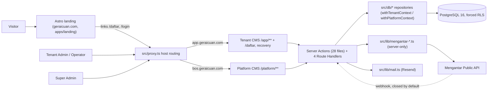

# Architecture — GeraiCUAN

Updated: 2026-10-06 (v3.1, HEAD `30a8eb0`)

GeraiCUAN is a free multi-tenant SaaS for *gerai ekspedisi* (spec 02 §v3.1): create a Mengantar order, print the gerai's own masked label, issue the customer nota. Detailed contracts live in `docs/spec/` (read order in `docs/spec/README.md`); this file is the one-page map. Context, container and trust-boundary diagrams: `docs/spec/04-SYSTEM-ARCHITECTURE.md`.

## Stack (proven by code)

| Layer | Choice | Where |
|---|---|---|
| Landing | Astro static site, its own container | `apps/landing` (`site: https://geraicuan.com`) |
| Web | Next.js 16 App Router, React 19, TypeScript | `src/app`; host routing in `src/proxy.ts` + `src/lib/host-routing.ts` |
| UI | Tailwind v4 + shadcn/ui (Radix) | `src/components/ui` (registry), `src/components/app` (shell, list, badges) |
| Data | PostgreSQL 16, Drizzle ORM + SQL migrations, forced RLS | `src/db/schema.ts`, `drizzle/*.sql` (latest `0072`) |
| Auth | Better Auth (email + password, email verification, host-only cookies) | `src/lib/auth.ts`, `src/lib/auth-config.ts`, `src/app/api/auth/[...all]` |
| Mail | Resend HTTP API via `fetch` (dev/test: recorded, not sent) | `src/lib/mail.ts`, `src/lib/account-mail.ts` |
| Provider | Mengantar Public API, server-only | `src/lib/mengantar-*.ts` |
| Tests | Vitest integration suite on a disposable Postgres | `tests/*.integration.test.ts`, `pnpm test:integration` |
| Deploy target | Coolify containers (not production-proven) | `RELEASE.md`, spec 15 |

## Containers

## Surfaces

- **Public (Astro):** `geraicuan.com` sales page whose Daftar/Masuk links point at `app.geraicuan.com` (`apps/landing/src/pages/index.astro`, `PUBLIC_APP_ORIGIN`).
- **Tenant host** `app.geraicuan.com`: `/login` (rewritten to `/login/tenant`), `/daftar`, `/verifikasi-email`, `/lupa-password`, `/atur-ulang-password`, `/api/webhooks`, and the CMS `/app/**`. Menu (`src/lib/cms-shell-navigation.ts`): Info terbaru, Dasbor; Buat kiriman, Histori kiriman, Retur (RTS), Cetak resi (label + nota/invoice); Pengirim, Penerima; Cek resi, Cek tarif; Laporan pengiriman, Pencairan COD (T-275), Riwayat cetak resi; Pengaturan (outlet, pickup, kurir, label, koneksi) with Anggota under it. Laporan, Pencairan, Riwayat cetak resi, Pengaturan and Anggota are Tenant Admin only.
- **Platform host** `bos.geraicuan.com` (Super Admin): `/login` (rewritten to `/login/super-admin`) and `/platform/**` — Ringkasan, Gerai (`/platform/tenant`), Pendaftaran, Audit, Info terbaru (`/platform/info`).
- `/api/auth/**` is served on both hosts. Without host routing (development) one origin serves everything and `src/app/page.tsx` is the single-origin entry.
- Route-by-route inventory: `docs/spec/18-SYSTEM-MAP.md`.

## Boundaries

- **Tenant isolation:** every tenant table carries `tenant_id`; composite FKs forbid cross-tenant links; the runtime role `geraicuan_app` runs under forced RLS with the tenant set per transaction (`src/db/tenant-context.ts`; platform reads through `src/db/platform-context.ts`). Spec 06.
- **Hosts:** `src/lib/host-routing.ts` routes on the `Host` header only (never `X-Forwarded-Host`) and 404s another surface's paths; session cookies are host-only. Routing is an extra boundary, not authorization.
- **Mutations:** only Server Actions (28 `"use server"` files under `src/app`, e.g. `actions.ts`, `estimate-actions.ts`, `handover-actions.ts`, `status-sync-actions.ts`) and four route handlers (`api/auth/[...all]`, `api/webhooks/mengantar`, `app/brand/logo`, `app/laporan/pengiriman/export.csv`); each re-checks scope and role on the server (`requireCmsScope` in `src/lib/cms-auth.ts`). UI visibility is never access control. Spec 07. *(History: this line used to say `actions.ts` and three route handlers.)*
- **Approval gate (PR-60):** a self-registered tenant is `PROVISIONING`; `requireCmsScope` redirects it to Dasbor unless the caller passes `allowPendingApproval` (store setup only), `withTenantContext` refuses it again, and RLS a third time. A Super Admin approves or rejects on `/platform/pendaftaran` (`src/db/tenant-registration-repository.ts`).
- **Mengantar:** the credential-bearing URL never leaves the server; a gerai may bring its own API key (encrypted in `managed_secret_payloads`) or use the platform default (`src/lib/mengantar-credentials.ts`). Issuance uses the live transport (`src/lib/mengantar-live-transport.ts` over `src/lib/mengantar-http.ts`, T-280, D-42) when `MENGANTAR_LIVE_ORDERS_ENABLED=1` — production also needs `MENGANTAR_LIVE_ORDERS_PRODUCTION_APPROVED=1` (D-5) — else the sanctioned fixture in development; definite provider refusals return the batch to the queue; the field register with evidence levels is spec 05 DATA-13.
- **Webhook:** `POST /api/webhooks/mengantar` answers 404 unless `MENGANTAR_WEBHOOK_ENABLED=1` and `MENGANTAR_WEBHOOK_SECRET` are set (D-30, `src/lib/mengantar-webhook.ts`).
- **Money:** integer rupiah (Mengantar settlement amounts in ten-thousandths, BigInt); provider snapshots are never recomputed; ledger and invoices are insert-only (spec 05 DATA-3, DATA-4, DATA-14).

## Core data flow

1. Buat kiriman saves `shipment_drafts` + `shipment_parties` → one estimate snapshot (`shipment_estimate_snapshots/services`). Destination suggestions come from the local `wilayah_areas` reference (T-245, `src/db/wilayah-repository.ts`); the Mengantar area `_id` stays the authority (D-32).
2. Issuance creates an idempotent `provider_batches` row and `provider_order_snapshots` (`src/db/order-batch-repository.ts`), which also appends `ledger_entries`; the outcome is Resi terbit, Menunggu pembayaran (unpaid recovery) or Perlu rekonsiliasi (unknown submission).
3. Label print writes `print_events` (`src/db/label-print-repository.ts`); the sheet masks the Mengantar pickup identity with the gerai's (PR-71).
4. Handover to the courier ("Tandai sudah diserahkan") appends `shipment_handover_events` (T-267, `src/db/shipment-handover-repository.ts`).
5. Invoice issuance writes one `shipment_invoices` snapshot per shipment (PR-76).
6. The Tenant Admin status pull (`status-sync-actions.ts` → `src/lib/mengantar-settlement.ts`) records `provider_settlement_pulls/items`, appends `provider_order_status_observations` and `provider_order_history_events`, and moves shipments only through allowed transitions. When enabled, the webhook appends a `WEBHOOK` observation through the SECURITY DEFINER `record_mengantar_webhook_event` (migration `0063`).
7. Owner money (Dasbor strip, Pencairan COD) is read from settlement items, ledger and COD totals by `src/db/owner-money-repository.ts` (D-41), Tenant Admin only.
8. Registration: `/daftar` → `registerSelfServiceTenant` (tenant `PROVISIONING`) + verification mail → Super Admin review → `ACTIVE` or `ARCHIVED`, with an approval/rejection mail.
9. Announcements: Super Admin writes on `/platform/info`; members read on `/app/info` with per-user read receipts (`platform_announcements`, `platform_announcement_reads`, `src/db/announcement-repository.ts`, D-31).

## Decisions

`DECISIONS.md` (D-rows) and `docs/adr/` (ADR-0001 UI v3 rebuild).

## Verification

`pnpm lint`, `npx tsc --noEmit`, `pnpm test:integration` (disposable DB; reseed the demo afterwards), `pnpm test:migration-upgrade`, and browser screening per spec 10 §11 for visible changes.
