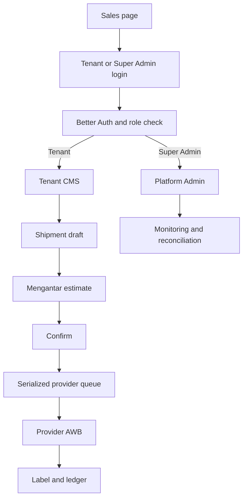

# Execution Plan: GeraiCUAN

## Scope Boundary
Public surface: sales page plus Tenant Login and Super Admin Login. All shipment, Mengantar, analytics, ledger, and management work remains inside CMS Admin.

## Architecture Delivery Order
1. Foundation: Next.js container, PostgreSQL, Better Auth, tenant context/RLS, Coolify secrets.
2. Configuration: tenants/outlets, private-first Mengantar resolver with platform environment fallback, provider-authoritative pickup/origin, then destination-area binding.
3. Operations: contacts, single/bulk drafts, provider estimates, COD calculation, serialized order submission, AWB label.
4. Finance: append-only operational ledger and reconciliation.
5. Administration: Super Admin monitoring, tenant analytics, professional date filters.
6. Proof: cross-tenant tests, auth tests, Mengantar contract fixtures, browser print proof, migration/release checks.

## Delivery Flow

## Visual and UX Contract
- Sales page: Brand/Marketing mode; designed light theme, no operational dashboard widgets, links only to login entry points.
- CMS: data-dense admin mode; persistent active-tenant indicator, server-filtered tables, URL-addressable filters, explicit empty/loading/error states.
- Date filters: Asia/Jakarta default unless tenant changes timezone; every chart/table/report displays the selected timezone and same inclusive-start/exclusive-end range.

## Evidence
- Mengantar non-mutating estimate and performance probes: HTTP 200 on 2026-08-28; no insurance fields returned.
- Official Mengantar documentation review on 2026-09-01 accepted account-pickup and general area-search contracts; endpoint and field details remain owned by TD-16.
- Runtime implementation and verification evidence is owned by root `TASKS.md`, `BUILD-LOG.md`, and `STATUS.md`; this plan does not duplicate or upgrade that evidence.

## Release Gates
| Gate | Required evidence |
|---|---|
| G1 Identity and tenancy | Same-role cross-tenant allowed/denied tests; Super Admin cannot access credentials. |
| G2 Mengantar | Sanitized contract fixtures cover supported/unsupported/COD-blocked/paid/unpaid/unknown batch cases. |
| G3 Money | Deterministic COD fee test and immutable ledger/reconciliation transition tests. |
| G4 UI | Browser proof for sales page boundary, both login routes, admin filters, shipment issuance states, and 100x150mm print preview. |
| G5 Deployment | Coolify secret injection, database migration/rollback, health check, and redacted telemetry proof. |
