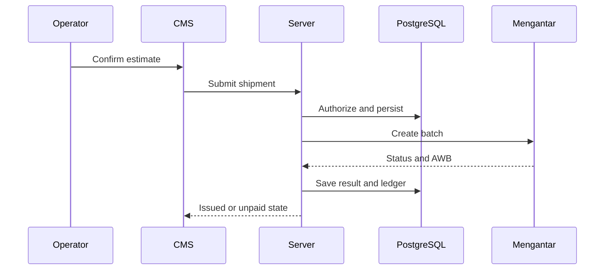

# Technical Design: GeraiCUAN

- Status: Accepted architecture; destination authority and responsive outlet completion remain queued in `TASKS.md`
- Owner: Paduka Ongki
- Source: PR-1..PR-28; Mengantar Public API docs retrieved 2026-08-28 and reviewed for location authority on 2026-09-01.

## Components
1. Next.js App Router UI: authenticated Super Admin and tenant operational surfaces.
2. Server actions/route handlers: authorization, validation, idempotency, persistence, and Mengantar adapter.
3. PostgreSQL via Drizzle: tenant-scoped operational records and immutable provider/print audit records.
4. Mengantar adapter: address lookup, account-specific `/order/estimate`, `POST /order`, and `POST /order/pay-unpaid`.
5. Credential resolver: per-outlet private configuration first; platform environment defaults only if no private configuration is active.
6. Super Admin monitoring queries: aggregate and tenant-filtered operational read models, never secrets.

## TD-1 — Tenant-bound request flow
Every authenticated request resolves principal and active tenant before any tenant-owned query. Super Admin has explicit platform scope; it does not receive an implicit tenant scope.

## TD-2 — Provider estimation and COD amount
The server uses the tenant outlet's configured Mengantar origin/default pickup address and selected recipient address. Default estimate is account-aware `/order/estimate`, not `/order/allEstimatePublic` because the latter is fixed public pricing. The UI displays returned shipping and insurance values only. Services with `unsupported:true` are omitted; `unsupported_cod:true` disables COD. For COD, calculate `service_fee = round_half_up((goods_value + mengantar_shipping_fee) × 3%)`, `vat = round_half_up(service_fee × 11%)`, and `provider_cod = goods_value + mengantar_shipping_fee + service_fee + vat`; all values are whole IDR and persisted separately.

## TD-3 — Automatic provider order creation
Persist a validated draft and immutable submitted estimate snapshot before enqueueing. Explicit operator confirmation automatically pushes the batch to Mengantar; no additional CMS action is required. Group confirmed drafts by tenant outlet, pickup context, and courier into provider batches. Use a per-Mengantar-account serialized worker/key for J&T Premium, Ninja, and SiCepat. An idempotency key bound to tenant, draft IDs, selected service, and estimate snapshot prevents duplicate provider orders on retry. Persist provider batch/order IDs, status, `isPaid`, `cnote_no`, and sanitized errors atomically after each provider response.

## TD-4 — Non-COD payment recovery
Non-COD orders require sufficient Mengantar wallet balance to issue an AWB. An `isPaid:false` order with no `cnote_no` becomes `AWAITING_UPSTREAM_PAYMENT`; label printing remains unavailable. A Tenant Admin funds Mengantar, then invokes `pay-unpaid` for its own provider batch. Returned AWBs update only matching tenant shipment records.

## TD-5 — Credential resolution
For every Mengantar operation, resolve the outlet's active private configuration first. If absent, resolve the platform default from server environment variables `MENGANTAR_API_KEY`, `MENGANTAR_BASE_URL`, `MENGANTAR_ORIGIN_AREA_ID`, and `MENGANTAR_PICKUP_ADDRESS_ID`. Private configuration may override all four values as one validated set; partial overrides are rejected. The resolved source is recorded only as `private` or `platform_default`, never with values.

## TD-6 — Reusable contacts and shipment snapshots
Contact selection creates a copied sender/recipient snapshot on the draft. Editing a directory contact never changes an issued shipment, provider payload history, or printed label. A contact may hold one or more addresses and sender/recipient role tags, but every lookup and mutation remains tenant-scoped.

## TD-7 — Super Admin monitoring
Compute dashboard read models server-side from tenant-scoped records: active/suspended tenants, outlets and configuration state, memberships, shipment status counts, issued/unpaid/failed batches, provider latency/error/queue health, usage, and audit trail. Filters include tenant, outlet, courier, lifecycle, and date range; the selected timezone is displayed. Drill-down results redact secrets and restrict shipment-party data to the minimum operational fields.

## TD-8 — Authentication, host, and route boundaries
Use two public entry routes and distinct production hosts: Tenant Login and
workspace will be served from `https://app.namadomain.com`; Super Admin Login
and platform operations will be served from `https://cuan.namadomain.com`.
Local development retains the route paths `/login/tenant`, `/app`,
`/login/super-admin`, and `/platform` until deployment host routing is
implemented. Both hosts establish identity through one approved authentication
system, but server-side authorization validates the required role and tenant
status on every CMS route/action. A successful Tenant Login routes only to the
selected/sole tenant workspace; a successful Super Admin Login routes only to
platform admin. The sales page is public and contains no operational data path.
Trusted origins and cookie scope must list only the exact deployed hosts; the
subdomains must not share a cookie domain by default.

Tenant navigation authorization is resolved server-side before rendering or reading destination data. Operator requests for Tenant Admin-only destinations such as `/app/analitik`, `/app/keuangan`, `/app/pengaturan`, and `/app/anggota` redirect to `/app`; the resulting shell derives `aria-current` from the authorized destination and never uses Ringkasan as a false fallback for a forbidden URL. Contextual shipment descendants keep `/app/pengiriman` current. Platform routes apply the same deny-before-read rule without acquiring tenant scope.

## TD-9 — Analytics date contract
Every analytics query accepts an explicit IANA timezone and inclusive start/exclusive end timestamps derived server-side. Supported presets are Today, Yesterday, This Week, This Month, Last 7 Days, Last 30 Days, and Custom Range; filters are persisted in URL state. Tenant analytics scope is fixed to its tenant; Super Admin may additionally filter tenant/outlet/courier/status. Aggregates, trend series, tables, and exports use the same range contract.

## TD-10 — Operational ledger and reconciliation
Append `ledger_entries` from authoritative state transitions, never directly from browser totals. Entry types include `COD_PRINCIPAL_COLLECTABLE` (liability, not revenue), `MENGANTAR_SHIPPING_COST`, `MENGANTAR_INSURANCE_COST` only when Mengantar supplies an explicit charge, `GERAICUAN_COD_SERVICE_FEE_REVENUE`, `COD_SERVICE_FEE_VAT_PAYABLE`, `NON_COD_UPSTREAM_PAYMENT`, `COD_REMITTANCE`, `ADJUSTMENT`, and `RECONCILIATION`. Each entry stores tenant, outlet, shipment/provider batch reference, amount, currency, effective time, source event, actor/system, and immutable reversal linkage. This is an operational ledger, not a statutory double-entry accounting system or tax filing engine.

## TD-11 — Settled implementation decisions
- Authentication: Better Auth with PostgreSQL persistence, email/password login, invitation-only tenant membership, durable database-backed rate limiting, CSRF protection, secure HTTP-only cookies, and server-side role checks.
- Deployment: containerized Next.js and PostgreSQL through Coolify; environment secrets are configured in Coolify, not committed. Tenant private Mengantar credentials are encrypted at rest with a dedicated runtime key and resolved only server-side.
- Insurance: 2026-08-28 sanitized provider evidence showed 15 estimate couriers with no insurance field and a performance response without insurance fields. Until Mengantar documents and returns an insurance contract, GeraiCUAN records a declared goods/insurance value only and does not invent, charge, or send an insurance fee.

## TD-12 — Tenant operational-overview read model
Build the tenant home read model server-side from authenticated tenant and permitted outlet scope. It returns independent regions so a slow trend query does not block the action queue:

- **Shared period analytics:** the URL-selected range defaults to Today in WIB and returns shipment input, COD/non-COD input composition, declared-goods values with non-revenue wording, and authoritative issued outcomes. Current and previous equal periods remain separate; a complete labelled COD/non-COD series backs any visual trend.
- **Operator:** actionable draft/estimated/failed/unknown counts, issued-today outcome, recently updated shipments, and safe next-action links. Awaiting-payment records may be visible as blocked work, but recovery controls remain Tenant Admin-only.
- **Tenant Admin:** the Operator operational picture plus outlet/provider readiness, awaiting-payment recovery count, unresolved submission exceptions, and reconciliation variance count. Member governance and financial amounts remain absent unless the server role permits them.
- Summary counts and detail links share one normalized URL-filter contract. A card is never populated from a differently scoped query than its destination table.
- Event metrics use authoritative event time: `created` uses shipment creation time; `issued` uses the first transition that persists provider `cnote_no`; `failed` and `unknown` use their transition time. Backlog and readiness are current snapshots and are labelled `as of` with the read timestamp rather than compared as period events.
- `Today` defaults to `Asia/Jakarta` (WIB) until the outlet has an accepted IANA timezone. Server code derives inclusive start and exclusive end instants; client code never manufactures boundaries.
- The issued-today summary and its queue destination reuse one server predicate over tenant-scoped `provider_order_snapshots`: `status = ISSUED`, authoritative `resolved_at`, and database-derived inclusive-start/exclusive-end WIB day boundaries. Neither shipment `updated_at` nor browser time is an issuance authority.

## TD-13 — Tenant analytics read model and delivery
One validated query object owns `range`, `timezone`, `outlet`, `courier`, `lifecycle`, detail/export supporting-row basis, and pagination/sort state. It is parsed server-side from URL parameters and rejects unauthorized scope. Period event regions and their supporting rows/export use the same applicable dimension predicates; deliberately current tenant-wide exceptions are separate query products and must state which filters do not apply.

- Priority KPIs are created shipments, issued shipments, issuance success rate, and unresolved operational exceptions. The implemented rate is `ISSUED provider outcomes / provider-order outcomes that left SUBMISSION_QUEUED`, both selected by authoritative `resolved_at` within the same inclusive-start/exclusive-end range; the denominator is always shown. Unknown, awaiting-payment, and failed outcomes therefore remain visible in the denominator rather than disappearing from the rate. Deltas compare the immediately preceding equal-duration range and include both direction and text.
- The primary trend is daily created versus issued event counts. Courier performance uses a sorted bar or table with issued volume and success rate only when the denominator is available. Lifecycle composition is a current snapshot, not retroactively presented as a historical period result.
- Financial analytics derive only from immutable ledger entry types. `COD_PRINCIPAL_COLLECTABLE` and outstanding/remitted COD principal are liabilities/settlement movement, never revenue. GeraiCUAN COD service-fee revenue, VAT payable, provider shipping cost, and reconciliation variance remain separately named series/totals; mixed-sign or mixed-meaning values are not collapsed into “Revenue”.
- The latest signed reconciliation variance is a fifth, separately labelled current exception sourced from the newest tenant reconciliation record. It ignores analytics period, courier, and lifecycle filters by design, retains tenant scope, and links to `/app/keuangan?status=VARIANCE#reconciliation-history-title`, where the ledger and reconciliation history remain authoritative.
- Each chart response includes the complete labelled tabular series and a generated-at timestamp. No-data is distinct from a failed query; a partial region failure preserves already loaded regions and offers a local retry.
- Use Server Components for initial summaries/tables and stream independent slow regions. A client chart leaf receives already-authorized aggregate data only; no shipment-party PII is required. Server pagination applies to drill-down rows. KPI drill-down, detail rows, and export use a canonical `basis=created|issued|outcome|exceptions` URL value. Event bases select records by their authoritative timestamp; `exceptions` selects the exact current unresolved operational snapshot while preserving authorized outlet, courier, and lifecycle dimensions. Unknown basis values fail closed.
- A synchronous CSV export represents the entire filtered set rather than the visible page, re-authorizes Tenant Admin and tenant scope inside the Route Handler, neutralizes spreadsheet formulas/control characters, and is never silently truncated. The current synchronous ceiling is 10,000 rows; larger filtered sets return an explicit `413` response requiring narrower filters until a queued export is accepted.

## TD-14 — Provider mutation release gate
- Accountable owner: Paduka Ongki

The implemented issuance and unpaid-recovery paths are validated only through sanctioned sanitized local fixtures. Production builds and production UI must fail closed for provider-mutating order creation and recovery until a separate explicit release decision supplies approved live-provider contract evidence, credential and tenant-boundary review, unknown-submission reconciliation, operational rollback/runbook evidence, and an authorized smoke-test plan. IAM permission alone never opens this gate. The blocked state must be truthful and actionable without exposing a control that can issue a real provider order.

## TD-15 — Tenant-managed Mengantar credential lifecycle
`mengantar_connections` remains the tenant/outlet-scoped source selector and stores only the canonical managed-secret reference plus non-secret status metadata. A separate server-only secret store persists an authenticated-encryption envelope for the private API key using Node.js `crypto`, a fresh nonce per write, and the dedicated runtime key `MENGANTAR_CREDENTIAL_ENCRYPTION_KEY`; plaintext is never written to PostgreSQL. Tenant-controlled input cannot change the provider base URL. The resolver combines a decrypted private API key with the platform-controlled base URL and the outlet's non-secret origin/pickup IDs, or uses the complete platform default when no private connection is active. Create and replacement writes are atomic, a failed replacement retains the working secret, switching to the platform default first proves that default complete, and every governed outcome emits a redacted audit event. A missing, malformed, or unavailable encryption key/secret fails closed.

## TD-16 — Mengantar location authority
The official [Mengantar Public API documentation](https://api-public.mengantar.com/docs/) was retrieved and reviewed on 2026-09-01. The accepted pickup contract is account-scoped `GET /api/public/{API_KEY}/address`, whose successful response contains pickup `_id`, area `_id` in `PICKUP_AUTOFILL`, and readable `PICKUP_*` address hierarchy. The accepted general area-search contract is `GET /api/public/{API_KEY}/address/search?keyword={query}`, whose successful response contains area `_id` plus province, city, district, subdistrict, ZIP, and provider routing codes. The legacy search route documents that its path key is not validated; GeraiCUAN nevertheless keeps both routes server-only so credential-bearing URLs never reach browser code or logs.

Outlet configuration reads pickup options on demand from the resolved Mengantar account. Selecting one pickup atomically derives its origin area from `PICKUP_AUTOFILL`; the browser cannot submit an independent area ID, and the server re-fetches the current account list before persistence. Private lookup carries the connection `updated_at` authority version into the final outlet-locked transaction; a credential replacement or source switch between provider validation and persistence rejects the stale write instead of binding account-A location data to account B. The browser DTO contains only pickup/area IDs and readable labels and excludes provider user, PIC, and phone fields. Requests use strict response validation, a 10-second timeout, a 512 KB response limit, HTTPS-only platform-controlled base URL, rejected redirects, sanitized failures, and no retry. Platform-default tenants receive only the already configured platform pickup, preventing a shared-account pickup list from leaking across tenants; private-account tenants receive their own account list. No local location cache/table is justified yet because no measured latency, quota, or availability evidence requires it. Provider `POST /address` mutation remains outside this decision and is not called.

Origin, pickup, contact address, shipment draft, estimate, and provider-order payloads must preserve one validated ID-to-label binding. General destination-area integration remains a separate implementation slice using the accepted search contract; no canonical kecamatan dataset is introduced.

## UML Sequence — authenticated shipment issuance

## Failure behavior
- Never fabricate a resi. A label requires Mengantar `cnote_no`.
- Validation/upstream error retains a draft plus safe error code; it does not create a duplicate order.
- Network uncertainty leaves the batch `SUBMISSION_UNKNOWN`; reconcile by provider batch/order identifiers before retrying.
- Provider credential failures and unknown response schemas fail closed and alert operators without values/PII.

## Verification Design
Use sanitized contract fixtures for estimates, paid orders, unpaid orders, COD-blocked routes, and concurrent dynamic-AWB orders. Non-mutating estimates may run only under the separately approved probe procedure. Do not create sandbox or production orders as a smoke test, and do not remove the TD-14 release gate based on fixture evidence.
