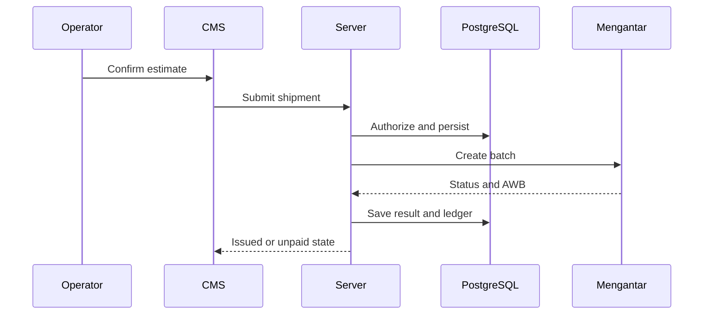

# Technical Design: GeraiCUAN

- Status: Draft
- Owner: Engineering owner [TBD owner=Paduka Ongki; due=before implementation]
- Source: PR-1..PR-8; Mengantar Public API docs retrieved 2026-08-28.

## Components
1. Next.js App Router UI: authenticated Super Admin and tenant operational surfaces.
2. Server actions/route handlers: authorization, validation, idempotency, persistence, and Mengantar adapter.
3. PostgreSQL via Drizzle: tenant-scoped operational records and immutable provider/print audit records.
4. Mengantar adapter: address lookup, account-specific `/order/estimate`, `POST /order`, and `POST /order/pay-unpaid`.
5. Credential resolver: per-outlet private configuration first; platform environment defaults only if no private configuration is active.
6. Super Admin monitoring queries: aggregate and tenant-filtered operational read models, never secrets.

## TD-1 — Tenant-bound request flow
Every authenticated request resolves principal and active tenant before any tenant-owned query. Super Admin has explicit platform scope; it does not receive an implicit tenant scope.

## TD-2 — Provider estimation and COD amount
The server uses the tenant outlet's configured Mengantar origin/default pickup address and selected recipient address. Default estimate is account-aware `/order/estimate`, not `/order/allEstimatePublic` because the latter is fixed public pricing. The UI displays returned shipping and insurance values only. Services with `unsupported:true` are omitted; `unsupported_cod:true` disables COD. For COD, calculate `service_fee = round_half_up((goods_value + mengantar_shipping_fee) × 3%)`, `vat = round_half_up(service_fee × 11%)`, and `provider_cod = goods_value + mengantar_shipping_fee + service_fee + vat`; all values are whole IDR and persisted separately.

## TD-3 — Automatic provider order creation
Persist a validated draft and immutable submitted estimate snapshot before enqueueing. Explicit operator confirmation automatically pushes the batch to Mengantar; no additional CMS action is required. Group confirmed drafts by tenant outlet, pickup context, and courier into provider batches. Use a per-Mengantar-account serialized worker/key for J&T Premium, Ninja, and SiCepat. An idempotency key bound to tenant, draft IDs, selected service, and estimate snapshot prevents duplicate provider orders on retry. Persist provider batch/order IDs, status, `isPaid`, `cnote_no`, and sanitized errors atomically after each provider response.

## TD-4 — Non-COD payment recovery
Non-COD orders require sufficient Mengantar wallet balance to issue an AWB. An `isPaid:false` order with no `cnote_no` becomes `AWAITING_UPSTREAM_PAYMENT`; label printing remains unavailable. A Tenant Admin funds Mengantar, then invokes `pay-unpaid` for its own provider batch. Returned AWBs update only matching tenant shipment records.

## TD-5 — Credential resolution
For every Mengantar operation, resolve the outlet's active private configuration first. If absent, resolve the platform default from server environment variables `MENGANTAR_API_KEY`, `MENGANTAR_BASE_URL`, `MENGANTAR_ORIGIN_AREA_ID`, and `MENGANTAR_PICKUP_ADDRESS_ID`. Private configuration may override all four values as one validated set; partial overrides are rejected. The resolved source is recorded only as `private` or `platform_default`, never with values.

## TD-6 — Reusable contacts and shipment snapshots
Contact selection creates a copied sender/recipient snapshot on the draft. Editing a directory contact never changes an issued shipment, provider payload history, or printed label. A contact may hold one or more addresses and sender/recipient role tags, but every lookup and mutation remains tenant-scoped.

## TD-7 — Super Admin monitoring
Compute dashboard read models server-side from tenant-scoped records: active/suspended tenants, outlets and configuration state, memberships, shipment status counts, issued/unpaid/failed batches, provider latency/error/queue health, usage, and audit trail. Filters include tenant, outlet, courier, lifecycle, and date range; the selected timezone is displayed. Drill-down results redact secrets and restrict shipment-party data to the minimum operational fields.

## TD-8 — Authentication and route boundaries
Use two public entry routes: Tenant Login and Super Admin Login. Both establish identity through one approved authentication system, but server-side authorization validates the required role and tenant status on every CMS route/action. A successful Tenant Login routes to the selected/sole tenant workspace; a successful Super Admin Login routes to platform admin. The sales page is public and contains no operational data path.

## TD-9 — Analytics date contract
Every analytics query accepts an explicit IANA timezone and inclusive start/exclusive end timestamps derived server-side. Supported presets are Today, Yesterday, This Week, This Month, Last 7 Days, Last 30 Days, and Custom Range; filters are persisted in URL state. Tenant analytics scope is fixed to its tenant; Super Admin may additionally filter tenant/outlet/courier/status. Aggregates, trend series, tables, and exports use the same range contract.

## TD-10 — Operational ledger and reconciliation
Append `ledger_entries` from authoritative state transitions, never directly from browser totals. Entry types include `COD_PRINCIPAL_COLLECTABLE` (liability, not revenue), `MENGANTAR_SHIPPING_COST`, `MENGANTAR_INSURANCE_COST` only when Mengantar supplies an explicit charge, `GERAICUAN_COD_SERVICE_FEE_REVENUE`, `COD_SERVICE_FEE_VAT_PAYABLE`, `NON_COD_UPSTREAM_PAYMENT`, `COD_REMITTANCE`, `ADJUSTMENT`, and `RECONCILIATION`. Each entry stores tenant, outlet, shipment/provider batch reference, amount, currency, effective time, source event, actor/system, and immutable reversal linkage. This is an operational ledger, not a statutory double-entry accounting system or tax filing engine.

## TD-11 — Settled implementation decisions
- Authentication: Better Auth with PostgreSQL persistence, email/password login, invitation-only tenant membership, durable database-backed rate limiting, CSRF protection, secure HTTP-only cookies, and server-side role checks.
- Deployment: containerized Next.js and PostgreSQL through Coolify; environment secrets are configured in Coolify, not committed. Tenant private Mengantar credentials are encrypted at rest with a dedicated runtime key and resolved only server-side.
- Insurance: 2026-08-28 sanitized provider evidence showed 15 estimate couriers with no insurance field and a performance response without insurance fields. Until Mengantar documents and returns an insurance contract, GeraiCUAN records a declared goods/insurance value only and does not invent, charge, or send an insurance fee.

## UML Sequence — authenticated shipment issuance

## Failure behavior
- Never fabricate a resi. A label requires Mengantar `cnote_no`.
- Validation/upstream error retains a draft plus safe error code; it does not create a duplicate order.
- Network uncertainty leaves the batch `SUBMISSION_UNKNOWN`; reconcile by provider batch/order identifiers before retrying.
- Provider credential failures and unknown response schemas fail closed and alert operators without values/PII.

## Verification Design
Use sanitized contract fixtures for estimates, paid orders, unpaid orders, COD-blocked routes, and concurrent dynamic-AWB orders. Execute one approved sandbox non-COD estimate before implementation; do not create sandbox/production orders as a smoke test.
