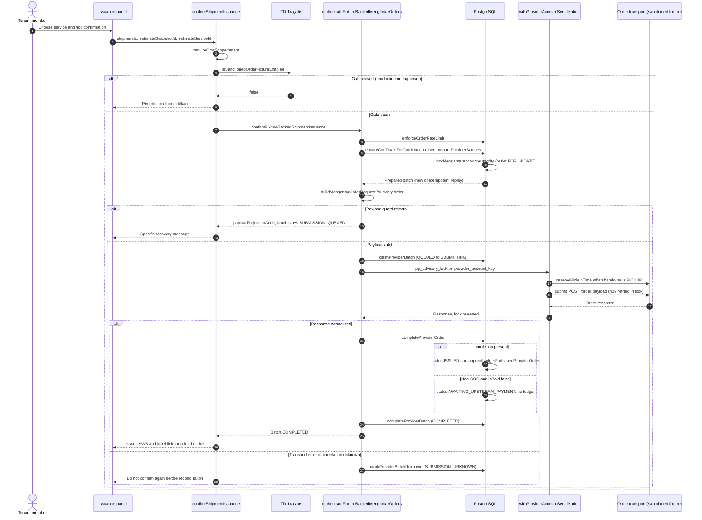
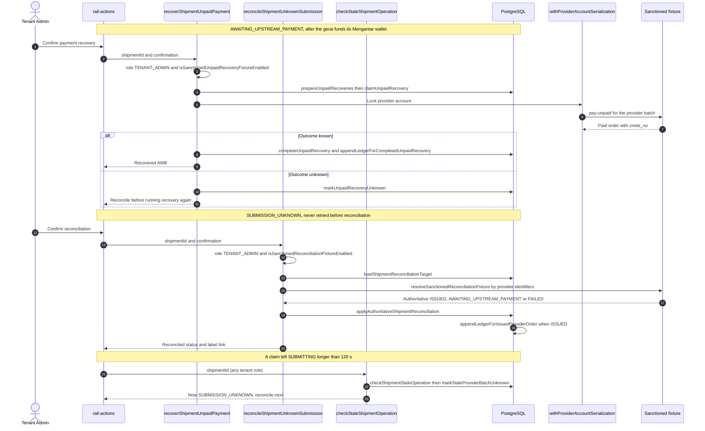
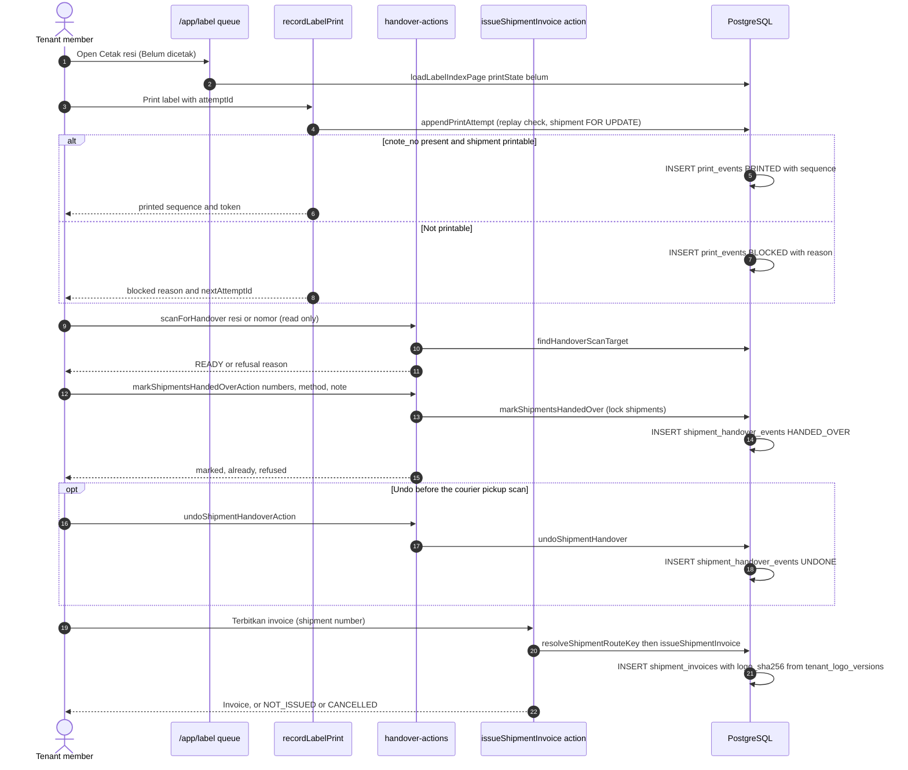
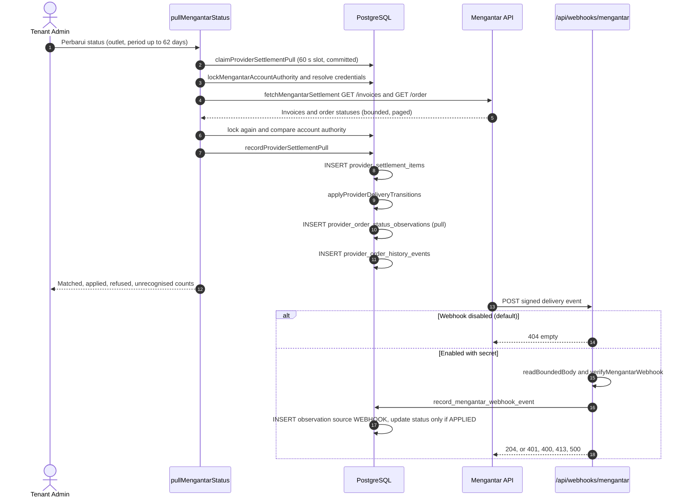
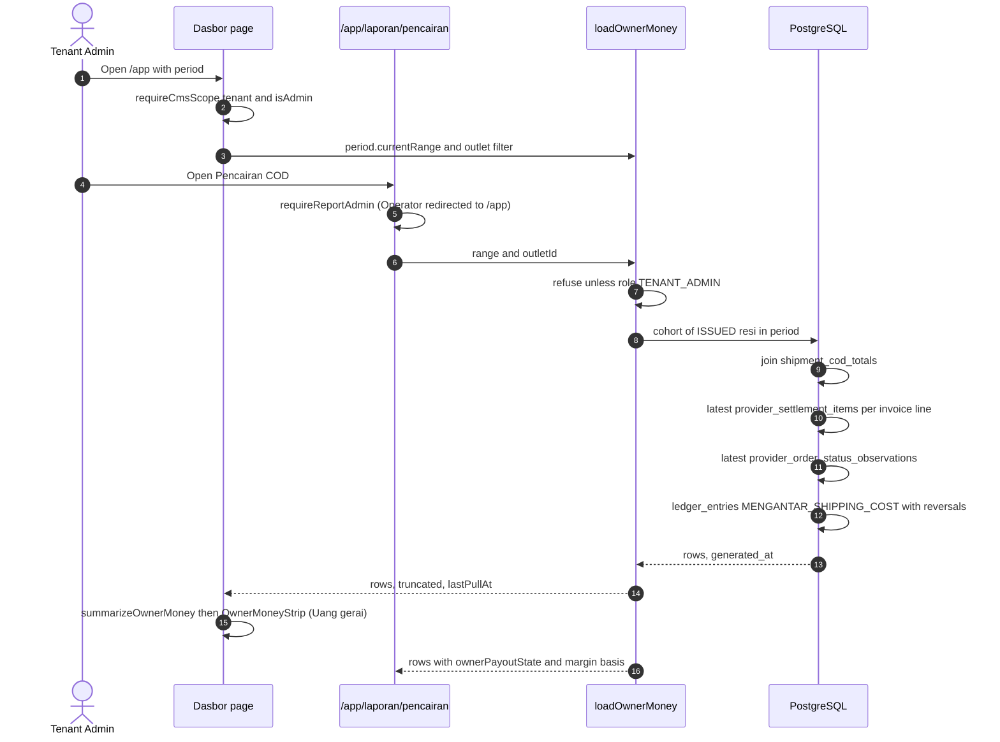
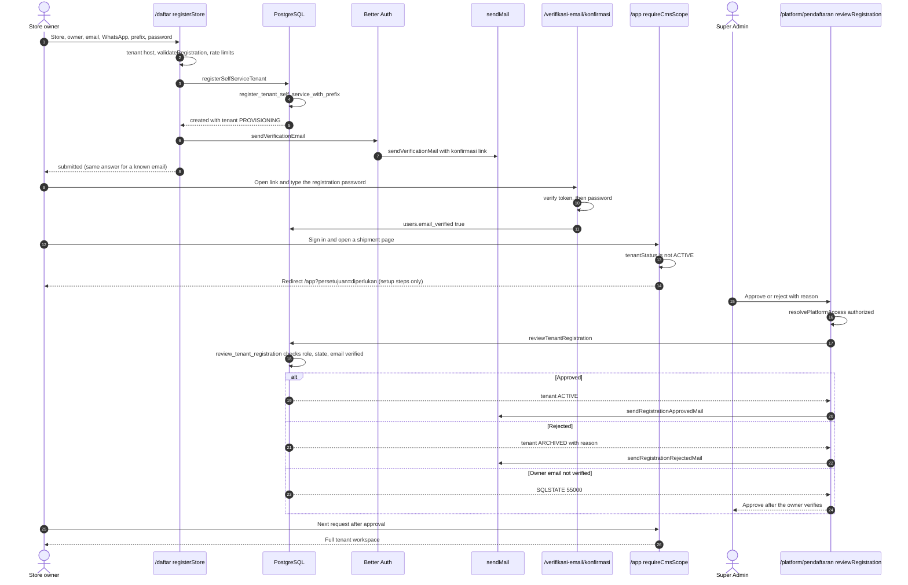

# Technical Design: GeraiCUAN

- Status: Accepted architecture, reconciled with code at `30a8eb0` (2026-10-06). Provider order creation, unpaid recovery and unknown-submission reconciliation stay fixture-gated (TD-14).
- Owner: Paduka Ongki
- Source: PR-1..PR-93; Mengantar Public API docs retrieved 2026-08-28, reviewed for location authority on 2026-09-01 and for settlement on 2026-09-15; `docs/adr/ADR-0001-ui-v3-rebuild.md` (UI v3); T-204 (Impor CSV, Keuangan and Analitik removed).
- Conventions: every function named here exists at `30a8eb0`; file paths are relative to the repository root. Superseded decisions stay under a "History" note with a pointer to what replaced them, and keep their TD number.

## Components
1. **Public landing**: a separate Astro site (`apps/landing`, served at `geraicuan.com`) that links to `app.geraicuan.com/daftar` and `/login`. The Next.js `/` (`src/app/page.tsx`) is only the single-origin development entry; with host routing it redirects (TD-8).
2. **Host router**: `proxy()` in `src/proxy.ts` calls `routeByHost()` (`src/lib/host-routing.ts`) for the tenant host (`app.`) and the platform host (`bos.`); origins come from `resolveHostRouting()` (`src/lib/auth-config.ts`).
3. **Next.js App Router CMS**: tenant workspace under `src/app/app/**` and platform operations under `src/app/platform/**`, rebuilt on shadcn/ui per ADR-0001 (`src/components/ui`, `src/components/app`). Navigation and role filtering live in `src/lib/cms-shell-navigation.ts`.
4. **Authentication and scope**: Better Auth (`src/lib/auth.ts`, `/api/auth/[...all]`); every CMS page, Server Action and Route Handler resolves a principal with `requireCmsScope()` (`src/lib/cms-auth.ts`) or `resolvePlatformAccess()` (`src/app/platform/platform-access.ts`), then opens `withTenantContext()` (`src/db/tenant-context.ts`).
5. **Self-registration and approval**: `/daftar` (`registerStore`), `/verifikasi-email` (`confirmEmailVerification`, `resendVerificationEmail`), password recovery (`/lupa-password`, `/atur-ulang-password`), and the Super Admin queue `/platform/pendaftaran` (`reviewRegistration`). See TD-25.
6. **Mail**: `sendMail()` in `src/lib/mail.ts` posts to Resend (`https://api.resend.com/emails`) or records in memory, per `resolveMailConfiguration()`; message bodies are composed in `src/lib/account-mail.ts`.
7. **PostgreSQL via Drizzle** (`src/db/schema.ts`, `drizzle/*.sql`): tenant-scoped operational records with FORCE RLS, immutable provider, print, handover and ledger records, and SECURITY DEFINER functions for shipment numbering (TD-20), registration review and webhook ingestion.
8. **Mengantar adapter** (`src/lib/mengantar-*.ts`): live read-only calls for address lookup (`mengantar-locations.ts`), account-aware `/order/estimate` (`mengantar-estimate.ts`), and the settlement/status pull (`mengantar-settlement.ts`). Order creation (`mengantar-order.ts`) and `pay-unpaid` (`mengantar-unpaid-recovery.ts`) run only through transport lookups whose sole implementations are sanctioned fixtures (TD-14).
9. **Credential resolver** (`src/lib/mengantar-credentials.ts`): per-outlet private configuration first, platform environment defaults otherwise; `lockMengantarAccountAuthority()` row-locks the outlet and returns its account authority (TD-5, TD-15).
10. **Wilayah reference**: local Kemendagri table `wilayah_areas` (`src/db/wilayah-repository.ts`, `src/lib/wilayah.ts`) behind `searchWilayahDestinationAreas` and `resolveWilayahDestinationArea` (`src/app/app/location-actions.ts`) (TD-16).
11. **Label printing, handover and invoice**: `/app/label` queue, `print_events`, `shipment_handover_events`, `shipment_invoices` with `tenant_logo_versions` (TD-22).
12. **Status ingestion**: the Tenant Admin pull `pullMengantarStatus` and the closed-by-default webhook `/api/webhooks/mengantar` (TD-23).
13. **Owner money**: `loadOwnerMoney()` for the Dasbor "Uang gerai" strip and `/app/laporan/pencairan` (TD-24).
14. **Reports**: `/app/laporan/pengiriman` (with `export.csv`), `/app/laporan/pencairan`, `/app/laporan/cetak-resi`, Tenant Admin only (TD-9, TD-13).
15. **Announcements**: `platform_announcements` and `platform_announcement_reads`; Super Admin edits at `/platform/info` (`saveAnnouncement`, `unpublishAnnouncement`), members read at `/app/info` (`markAnnouncementsReadAction`, `countUnreadAnnouncements`).
16. **Super Admin monitoring**: `/platform`, `/platform/tenant`, `/platform/tenant/[tenantId]`, `/platform/audit` read models; never secrets (TD-7).

## TD-1 — Tenant-bound request flow
- Owner: Engineering owner

Every authenticated request resolves principal and active tenant before any tenant-owned query. Super Admin has explicit platform scope; it does not receive an implicit tenant scope. In code: `requireCmsScope(scope)` checks the Better Auth session, `requestHostAllowsScope()` (the host boundary, TD-8), the principal's scope from `resolveCmsPrincipal()`, and, unless `allowPendingApproval` is passed, that the tenant is `ACTIVE` (otherwise it redirects to `TENANT_APPROVAL_REQUIRED_HREF`, TD-25). `withTenantContext()` re-reads the membership (tenant `ACTIVE` or `PROVISIONING`, membership and user `ACTIVE`), refuses a non-`ACTIVE` tenant again unless `allowPendingApproval`, and sets the RLS settings for the transaction.

## TD-2 — Provider estimation and COD amount
- Owner: Engineering owner

The server uses the tenant outlet's configured Mengantar origin/default pickup address and selected recipient address. Default estimate is account-aware `/order/estimate`, not `/order/allEstimatePublic` because the latter is fixed public pricing. The UI displays returned shipping and insurance values only. Services with `unsupported:true` are omitted; `unsupported_cod:true` disables COD. For COD (formula version 2, T-175), calculate `provider_cod = ceil((goods_value + mengantar_shipping_fee) × 10000 / 9667)` so Mengantar's 3.33% COD fee on the COD amount is carried by the buyer, then `service_fee = round_half_up((provider_cod − goods_value − mengantar_shipping_fee) × 100 / 111)` and `vat = provider_cod − goods_value − mengantar_shipping_fee − service_fee`; all values are whole IDR, persisted separately with `cod_formula_version`, and checked per version in the database (`docs/spec/19` PR-9).

## TD-3 — Automatic provider order creation
- Owner: Engineering owner

Persist a validated draft and immutable submitted estimate snapshot before enqueueing. Explicit operator confirmation automatically pushes the batch to Mengantar; no additional CMS action is required. Group confirmed drafts by tenant outlet, pickup context, and courier into provider batches (`prepareProviderBatches`). Every submission, for every courier, is serialized per Mengantar account by `withProviderAccountSerialization()` (a PostgreSQL advisory lock on `provider_account_key`), because Mengantar answers 409 to concurrent creation on one account (DATA-13); a 409 is retried inside the lock. An idempotency key bound to tenant, draft IDs, selected service, and estimate snapshot prevents duplicate provider orders on retry: a replay returns the existing batch instead of claiming again. Persist provider batch/order IDs, status, `isPaid`, `cnote_no`, and sanitized errors atomically after each provider response (`completeProviderOrder`). The current Server Action confirms one shipment per call. Sequence: TD-21.

History (superseded by the line above): the per-account serialized key was originally scoped to dynamic-AWB couriers (J&T Premium, Ninja, SiCepat) only.

## TD-4 — Non-COD payment recovery
- Owner: Engineering owner

Non-COD orders require sufficient Mengantar wallet balance to issue an AWB. An `isPaid:false` order with no `cnote_no` becomes `AWAITING_UPSTREAM_PAYMENT` (`completeProviderOrder`); label printing remains unavailable. A Tenant Admin funds Mengantar, then invokes `pay-unpaid` for its own provider batch through `recoverShipmentUnpaidPayment` (`src/app/app/pengiriman/[shipmentId]/unpaid-recovery-actions.ts`) → `recoverFixtureBackedShipmentPayment` → `orchestrateFixtureBackedMengantarUnpaidRecovery`, serialized by the same per-account lock. Returned AWBs update only matching tenant shipment records, and `completeUnpaidRecovery` appends the ledger through `appendLedgerForCompletedUnpaidRecovery`. An unknown outcome is marked `markUnpaidRecoveryUnknown` and must be reconciled before another attempt. Release-gated by TD-14.

## TD-5 — Credential resolution
- Owner: Engineering owner

For every Mengantar operation, resolve the outlet's active private configuration first. If absent, resolve the platform default from server environment variables `MENGANTAR_API_KEY`, `MENGANTAR_BASE_URL`, `MENGANTAR_ORIGIN_AREA_ID`, and `MENGANTAR_PICKUP_ADDRESS_ID`. Private configuration may override all four values as one validated set; partial overrides are rejected. The resolved source is recorded only as `private` or `platform_default`, never with values.

## TD-6 — Reusable contacts and shipment snapshots
- Owner: Engineering owner

Contact selection creates a copied sender/recipient snapshot on the draft. Editing a directory contact never changes an issued shipment, provider payload history, or printed label. A contact may hold one or more addresses and sender/recipient role tags, but every lookup and mutation remains tenant-scoped. Since T-188 the directory is two menus over one `contacts` table: `/app/kontak/pengirim` and `/app/kontak/penerima` (old `/app/kontak` links redirect in `next.config.ts`).

## TD-7 — Super Admin monitoring
- Owner: Engineering owner

Compute dashboard read models server-side from tenant-scoped records: active/suspended tenants, outlets and configuration state, memberships, shipment status counts, issued/unpaid/failed batches, provider latency/error/queue health, usage, and audit trail. Filters include tenant, outlet, courier, lifecycle, and date range; the selected timezone is displayed. Drill-down results redact secrets and restrict shipment-party data to the minimum operational fields. Platform destinations at `30a8eb0` (`platformCmsNavigation`): Ringkasan `/platform`, Gerai `/platform/tenant`, Pendaftaran `/platform/pendaftaran`, Audit `/platform/audit`, Info terbaru `/platform/info`.

## TD-8 — Authentication, host, and route boundaries
- Owner: Engineering owner

One Next.js deployment serves two hosts, and a separate Astro site serves the public landing (D-7, PR-58; `RELEASE.md` DEP-2):

| Host | Served by | Owns |
|---|---|---|
| `geraicuan.com` (`www.` redirects to apex) | `apps/landing` (Astro) | Sales page; links only to `app.geraicuan.com/daftar` and `/login` |
| `app.geraicuan.com` (`GERAICUAN_TENANT_ORIGIN`) | Next.js | `/login` (rewritten to `/login/tenant`), `/app`, `/daftar`, `/verifikasi-email`, `/lupa-password`, `/atur-ulang-password`, `/api/webhooks` |
| `bos.geraicuan.com` (`GERAICUAN_PLATFORM_ORIGIN`) | Next.js | `/login` (rewritten to `/login/super-admin`), `/platform` |

`resolveHostRouting()` requires all three origins (`GERAICUAN_PUBLIC_ORIGIN` included) in production as exact HTTPS origins on distinct hosts and refuses a half-configured pair elsewhere. `routeByHost()` decides from the `Host` header only (`X-Forwarded-Host` is never read): shared paths are `/api/auth`, `/couriers`, `/favicon.ico`, `/icon.svg`; `/` redirects (307) to the surface's home with a session cookie or to `/login` without one; an old `/login/tenant` or `/login/super-admin` path redirects (308) to the owning host's `/login`; any path outside the surface's prefixes is a plain 404, and so is an unmatched host in production. Without configured origins outside production, routing is a no-op (single-origin development mode, where `/login/tenant`, `/app`, `/login/super-admin` and `/platform` are reached directly). Host routing is an additional boundary: `requireCmsScope()`, `resolvePlatformAccess()` and the session-create hook still decide, and consult `hostAllowsScope()` themselves. Session cookies stay host-only (no `crossSubDomainCookies`, no cookie `domain`, `src/lib/auth.ts`), and trusted origins must contain exactly the tenant and platform CMS origins, no others (`src/lib/auth-config.ts`).

A successful Tenant Login lands at `tenantLandingPath(role, tenantStatus)`: an `ACTIVE` gerai's Operator at `/app/label` (Cetak resi, T-263), a Tenant Admin, and any member of a gerai still awaiting approval, at `/app`. A successful Super Admin Login routes only to `/platform`.

Tenant navigation authorization is resolved server-side before rendering or reading destination data. The Tenant Admin-only destinations are the Laporan group (`/app/laporan/pengiriman`, `/app/laporan/pencairan`, `/app/laporan/cetak-resi`), `/app/pengaturan/*` and `/app/anggota` (`roles: ["TENANT_ADMIN"]` in `src/lib/cms-shell-navigation.ts`; `/app/anggota` has no menu row of its own and marks Pengaturan current). Their layouts guard above `loading.tsx` (T-236): `requireReportAdmin()` in `src/app/app/laporan/layout.tsx` and `requireTenantAdmin()` in `src/app/app/pengaturan/layout.tsx` and `src/app/app/anggota/layout.tsx` redirect an Operator to `/app` and an anonymous request to `/login/tenant`; each page, Server Action and the CSV Route Handler checks again. `tenantCmsNavigation()` derives `aria-current` from the matched destination with no fallback, so a forbidden or unmapped URL marks nothing current; contextual descendants keep their parent current (`/app/invoice/*` → Cetak resi, contact create/detail → the menu they were opened from). Removed destinations redirect in `next.config.ts` (T-204): `/app/impor/*` → `/app/pengiriman/baru`, `/app/keuangan/*` and `/app/analitik/*` → `/app/laporan/pengiriman` (temporary redirects). Platform routes apply the same deny-before-read rule without acquiring tenant scope.

History (superseded by the table above, D-7/PR-58): the hosts were placeholders `app.namadomain.com` and `cuan.namadomain.com`, and local route paths were to be used "until deployment host routing is implemented". The Operator-forbidden list named `/app/analitik` and `/app/keuangan` (removed by T-204) and referred to a tenant "Ringkasan" fallback; the tenant home is Dasbor, and "Ringkasan" now names only the platform overview.

## TD-9 — Report date contract
- Owner: Engineering owner

Every period query accepts an explicit IANA timezone and inclusive start/exclusive end timestamps derived server-side by `parseAnalyticsRange()` (`src/lib/analytics-range.ts`, default `Asia/Jakarta`). Presets are `ANALYTICS_PRESETS` (including `hari-ini`, `7-hari` and `kustom`); filters are persisted in URL state. Consumers at `30a8eb0`: Dasbor (`src/app/app/page.tsx`), `/app/laporan/pengiriman` and its `export.csv` through `parseTenantAnalyticsQuery()` (`src/lib/analytics-filters.ts`), `/app/laporan/cetak-resi`, `/app/laporan/pencairan`, and the status pull (TD-23). Tenant scope is fixed to its tenant; Super Admin may additionally filter tenant/outlet/courier/status. Aggregates, trend series, tables, and exports use the same range contract.

History (superseded by T-204 and ADR-0001): this section was titled "Analytics date contract" and served `/app/analitik`, which no longer exists.

## TD-10 — Operational ledger and reconciliation
- Owner: Engineering owner

Append `ledger_entries` from authoritative state transitions, never directly from browser totals. Entry types (`ledgerEntryTypes`, `src/db/schema.ts`) are `COD_PRINCIPAL_COLLECTABLE` (liability, not revenue), `MENGANTAR_SHIPPING_COST`, `MENGANTAR_INSURANCE_COST` only when Mengantar supplies an explicit charge, `MENGANTAR_COD_FEE_COST` (the COD fee Mengantar deducts at settlement, an expense; T-178), `GERAICUAN_COD_SERVICE_FEE_REVENUE` (retired for new entries by T-178 — history keeps it), `COD_SERVICE_FEE_VAT_PAYABLE`, `NON_COD_UPSTREAM_PAYMENT`, `COD_REMITTANCE`, `ADJUSTMENT`, and `RECONCILIATION`. Each entry stores tenant, outlet, shipment/provider batch reference, amount, currency, effective time, source event, actor/system, and immutable reversal linkage. This is an operational ledger, not a statutory double-entry accounting system or tax filing engine.

Writers at `30a8eb0`: `appendLedgerForIssuedProviderOrder()` (called by `completeProviderOrder` and by `applyAuthoritativeShipmentReconciliation` when a reconciliation resolves to `ISSUED`) and `appendLedgerForCompletedUnpaidRecovery()` (called by `completeUnpaidRecovery`). Readers: `loadOwnerMoney()` (provider shipping cost, TD-24) and `loadTenantDashboardMetrics()` (a Tenant Admin `reconciliationVarianceCount` from `summarizeLatestReconciliationVariances`, computed but not rendered by the v3 Dasbor). `appendLedgerAdjustment`, `recordLedgerReconciliation` and `reconcileLedgerPeriod` remain in `src/db/ledger-repository.ts` with no CMS caller since the Keuangan page was removed (T-204).

## TD-11 — Settled implementation decisions
- Owner: Engineering owner

- Authentication: Better Auth with PostgreSQL persistence, email/password login, durable database-backed rate limiting, CSRF and origin checks enabled, secure HTTP-only host-only cookies, `requireEmailVerification`, and server-side role checks. Tenant membership comes from self-registration with Super Admin approval (TD-25), from Super Admin tenant creation (`submitPlatformTenantLifecycle` with action `create`, `/platform/tenant`), or from a Tenant Admin invitation (`/app/anggota`). Better Auth's public `/sign-up/email` and `/request-password-reset` endpoints are disabled; only the rate-limited server paths reach them.
- Deployment: containerized Next.js (`output: "standalone"`, `Dockerfile`) and PostgreSQL through Coolify; the Astro landing is a separate image (`apps/landing/Dockerfile`). Environment secrets are configured in Coolify, not committed. Tenant private Mengantar credentials are encrypted at rest with a dedicated runtime key and resolved only server-side.
- Insurance: 2026-08-28 sanitized provider evidence showed 15 estimate couriers with no insurance field and a performance response without insurance fields. Until Mengantar documents and returns an insurance contract, GeraiCUAN records a declared goods/insurance value only and does not invent, charge, or send an insurance fee.

History (superseded by PR-59/D-8, TD-25): tenant membership was invitation-only.

## TD-12 — Tenant Dasbor read model
- Owner: Engineering owner

The tenant home (`/app`, `src/app/app/page.tsx`) is built server-side from the authenticated tenant and permitted outlet scope, as independent regions loaded in parallel and settled one by one, so a failed region shows its own `RegionError` while the others render:

- **Ringkasan periode** (`loadTenantDashboardPeriodSummary`): created, issued, COD and non-COD counts for the URL-selected range (default the last 7 days in WIB, `DASHBOARD_DEFAULT_PRESET = "7-hari"` in `src/app/app/_dashboard/dashboard-logic.ts`; PR-25, TD-9) and the previous equal period.
- **Uang gerai** (Tenant Admin only, `loadOwnerMoney` + `summarizeOwnerMoney`, TD-24).
- **Hasil pengiriman** (`loadTenantDashboardOutcomeSummary`) and **Grafik kiriman** (`loadTenantDashboardPeriodTrend`, current and optional comparison series).
- **Kiriman terbaru** (`loadTenantDashboardShipments`, `actionable` then `recent` mode).
- **Rekap per kurir** (`loadTenantDashboardCourierRecap`).
- Current snapshot counts (`loadTenantDashboardMetrics`): draft/estimated/awaiting-payment/unknown/failed and issued-today.

Rules kept from the original design: event metrics use authoritative event time (`created` = shipment creation; `issued` = the first transition that persists provider `cnote_no`, i.e. `provider_order_snapshots.resolved_at` with `status = ISSUED`; neither shipment `updated_at` nor browser time is an issuance authority); backlog is a current snapshot; server code derives day boundaries; summary and destination list share one predicate (`issuedTodayPredicate`, `src/db/shipment-event-predicates.ts`). A gerai awaiting approval (`PROVISIONING`) sees only its setup steps (`SetupSteps`). Formulas and metric IDs are owned by `docs/spec/19-METRICS-ANALYTICS-CONTRACT.md`.

History (superseded by ADR-0001 and T-275): this section was the "Tenant operational-overview read model" with "Shared period analytics / Operator / Tenant Admin" regions, outlet/provider readiness and a displayed reconciliation variance count. The v3 Dasbor composition above replaced it.

## TD-13 — Tenant report read model and delivery
- Owner: Engineering owner

`/app/laporan/pengiriman` parses one validated query object server-side with `parseTenantAnalyticsQuery()` (range, timezone, outlet, courier, lifecycle, pagination/sort) and rejects unauthorized scope (`AnalyticsFilterDeniedError`). Its regions come from `loadShipmentReportAnalytics`, `loadShipmentReportPage` (`src/db/shipment-report-repository.ts`) and `loadCourierPerformance` (`src/db/analytics-repository.ts`). The synchronous CSV export (`src/app/app/laporan/pengiriman/export.csv/route.ts`, `GET`) re-authorizes Tenant Admin inside the Route Handler (401 anonymous, 403 Operator), re-parses the same filters (400 on invalid), serializes with `serializeShipmentReportCsv()` (spreadsheet formula/control characters neutralized), represents the entire filtered set, and refuses more than `SHIPMENT_REPORT_EXPORT_MAX_ROWS` (10,000) with `413` instead of truncating. Financial figures derive only from immutable ledger entry types and provider settlement evidence; `COD_PRINCIPAL_COLLECTABLE` is never revenue.

History (superseded by T-204): the Analitik page owned this read model, with a `basis=created|issued|outcome|exceptions` drill-down URL value, issuance-success-rate KPIs, and a reconciliation-variance exception linking to `/app/keuangan?status=VARIANCE`. Those surfaces were removed; `serializeTenantAnalyticsQuery` in `src/lib/analytics-filters.ts` still writes `basis` when it is not `created`, with no page reading it.

## TD-14 — Provider mutation release gate
- Accountable owner: Paduka Ongki

The implemented issuance and unpaid-recovery paths are validated only through sanctioned sanitized local fixtures. Production builds and production UI must fail closed for provider-mutating order creation and recovery until a separate explicit release decision supplies approved live-provider contract evidence, credential and tenant-boundary review, unknown-submission reconciliation, operational rollback/runbook evidence, and an authorized smoke-test plan. IAM permission alone never opens this gate. The blocked state must be truthful and actionable without exposing a control that can issue a real provider order.

Implementation at `30a8eb0`: no live `POST /order`, `POST /order/pay-unpaid` or reconciliation lookup transport exists. The only implementations are `resolveSanctionedOrderFixtureTransport` (`src/lib/sanctioned-order-fixture.ts`, reading `tests/fixtures/mengantar-order.sanitized.json`), `resolveSanctionedUnpaidRecoveryFixtureTransport` and `resolveSanctionedReconciliationFixture`. Each is enabled only when `NODE_ENV !== "production"` and its flag is `1` (`isSanctionedOrderFixtureEnabled()` reads `GERAICUAN_ENABLE_SANCTIONED_ORDER_FIXTURE`; the recovery and reconciliation modules have their own `isSanctioned*FixtureEnabled()`). `confirmShipmentIssuance`, `recoverShipmentUnpaidPayment` and `reconcileShipmentUnknownSubmission` check the gate after authorization and before any provider-facing work, and return an Indonesian "dinonaktifkan" message when it is closed. `readMengantarOrderHttpResponse()` exists for a future HTTP transport and is exercised only by tests.

## TD-15 — Tenant-managed Mengantar credential lifecycle
- Owner: Engineering owner

`mengantar_connections` remains the tenant/outlet-scoped source selector and stores only the canonical managed-secret reference plus non-secret status metadata. A separate server-only secret store persists an authenticated-encryption envelope for the private API key using Node.js `crypto`, a fresh nonce per write, and the dedicated runtime key `MENGANTAR_CREDENTIAL_ENCRYPTION_KEY`; plaintext is never written to PostgreSQL. Tenant-controlled input cannot change the provider base URL. The resolver combines a decrypted private API key with the platform-controlled base URL and the outlet's non-secret origin/pickup IDs, or uses the complete platform default when no private connection is active. Create and replacement writes are atomic, a failed replacement retains the working secret, switching to the platform default first proves that default complete, and every governed outcome emits a redacted audit event. A missing, malformed, or unavailable encryption key/secret fails closed. The tenant surface is `/app/pengaturan/koneksi`.

## TD-16 — Mengantar location authority
- Owner: Engineering owner

The official [Mengantar Public API documentation](https://api-public.mengantar.com/docs/) was retrieved and reviewed on 2026-09-01. The accepted pickup contract is account-scoped `GET /api/public/{API_KEY}/address`, whose successful response contains pickup `_id`, area `_id` in `PICKUP_AUTOFILL`, and readable `PICKUP_*` address hierarchy. The accepted general area-search contract is `GET /api/public/{API_KEY}/address/search?keyword={query}`, whose successful response contains area `_id` plus province, city, district, subdistrict, ZIP, and provider routing codes. The legacy search route documents that its path key is not validated; GeraiCUAN nevertheless keeps both routes server-only so credential-bearing URLs never reach browser code or logs.

Outlet configuration reads pickup options on demand from the resolved Mengantar account. Selecting one pickup atomically derives its origin area from `PICKUP_AUTOFILL`; the browser cannot submit an independent area ID, and the server re-fetches the current account list before persistence. Private lookup carries the connection `updated_at` authority version into the final outlet-locked transaction; a credential replacement or source switch between provider validation and persistence rejects the stale write instead of binding account-A location data to account B. The browser DTO contains only pickup/area IDs and readable labels and excludes provider user, PIC, and phone fields. Requests use strict response validation, a 10-second timeout, a 512 KB response limit, HTTPS-only platform-controlled base URL, rejected redirects, sanitized failures, and no retry. Platform-default tenants receive only the already configured platform pickup, preventing a shared-account pickup list from leaking across tenants; private-account tenants receive their own account list. No provider location cache exists. D-32 (T-245) adds a local, read-only Kemendagri reference (`wilayah_areas`, DATA-22) that only suggests areas while typing; see "Destination-area suggestions" below. Provider `POST /address` mutation remains outside this decision and is not called.

Origin, pickup, contact address, shipment draft, estimate, and provider-order payloads must preserve one validated ID-to-label binding. Destination-area suggestions (D-32, T-245): typing is answered by `searchWilayahDestinationAreas` from the local reference (no provider call, no durable rate-limit write). Picking a suggestion calls `resolveWilayahDestinationArea`, which reads the row server-side and runs at most three provider keywords (`"<kelurahan> <kecamatan>"`, `"<kecamatan> <kota>"`, `"<kecamatan>"`) through the same guarded search path as a typed search (rate limit, per-actor advisory lock, authority recheck). Options are kept only when the kecamatan and the city match strictly (Kemendagri/Mengantar spelling aliases applied; a stated Kab./Kota must agree); exactly one matching kelurahan is auto-selected, anything else is listed for the person to choose, and no match falls back to the free-text provider search. The keyword that produced the options is posted as `areaQuery`, so the save-time re-validation re-runs exactly that search. The provider contract above is unchanged, and the wilayah code never reaches persistence.

## TD-17 — Admin presentation adaptation boundary

History (superseded by `docs/adr/ADR-0001-ui-v3-rebuild.md`): the 2026-09-13 design adopted the Tokophi composition through existing modules for PR-17, PR-25 and PR-26 (T-94/T-98..T-101). ADR-0001 replaced the presentation layer with a shadcn/ui rebuild; spec 10 v3.0 owns tokens and anatomy, spec 17 §UX-v3 owns behaviour, and `docs/spec/18-SYSTEM-MAP.md` owns route locations.

The boundary rules that survive the rebuild, because ADR-0001 kept every `actions.ts`, Route Handler, repository and provider module:

| Boundary | Responsibility | Must not cross |
|---|---|---|
| Authenticated page and URL parser | Resolve server role, tenant/outlet scope, canonical filters, and permitted destinations | Browser-selected identifiers cannot grant scope |
| Repository read models (`src/db/*`) | Compute spec 19 metrics and supporting rows with the same applicable predicates and authoritative time basis | No presentation-owned financial formula or mixed snapshot/event basis |
| Server-rendered regions | Compose header, summaries, tables, and independent loading/error recovery | One slow region must not make all operational work unavailable |
| Interactive leaves (`src/components/app`, chart leaves) | Render authorised series, disclosures, and existing controls through semantic tokens | No raw database/credential access, fabricated sparklines, or client-only source of report scope |
| Server Actions and CSV handler | Re-authorize mutations/export and apply their validation, audit, and output contracts | Presentation code cannot bypass issuance/recovery gates or alter the ledger |

## Failure behavior
- Never fabricate a resi. A label requires Mengantar `cnote_no` (`appendPrintAttempt` and `issueShipmentInvoice` both read it from `provider_order_snapshots`).
- A payload guard rejection (`MengantarOrderPayloadError`) is raised before the batch is claimed, so the batch stays `SUBMISSION_QUEUED` and resumable and nothing is sent; validation/upstream errors retain the draft plus a safe error code and never create a duplicate order.
- Network or response uncertainty after the claim leaves the batch `SUBMISSION_UNKNOWN` (`markProviderBatchUnknown`); a `SUBMITTING` claim older than `PROVIDER_BATCH_CLAIM_STALE_AFTER_SECONDS` (120) is moved there by `checkStaleShipmentOperation` → `markStaleProviderBatchUnknown`. Reconcile by provider batch/order identifiers (`reconcileShipmentUnknownSubmission`) before any retry; the UI tells the operator not to confirm again.
- Provider credential failures and unknown response schemas fail closed and alert operators without values/PII.

## Verification Design
Use sanitized contract fixtures for estimates, paid orders, unpaid orders, COD-blocked routes, and concurrent dynamic-AWB orders. Non-mutating estimates may run only under the separately approved probe procedure. Do not create sandbox or production orders as a smoke test, and do not remove the TD-14 release gate based on fixture evidence.

## TD-18 — Scoped quick rate checks (PR-40)

Reuse `fetchMengantarEstimate`, current credential resolution, `validateMengantarDestinationAreaSelection`, and estimate/location rate limits. A new tenant Server Action (`src/app/app/cek-tarif/actions.ts`) validates ready outlet, selected area binding and integer gram weight, resolves origin/pickup server-side, requests provider estimates outside the DB transaction, then verifies the account authority/pickup/origin is unchanged (`lockMengantarAccountAuthority`) before returning a minimal quote DTO. Raw provider payloads, URLs and credentials never reach the browser or generic errors.

This action creates no draft, immutable shipment estimate snapshot, issuance batch, payment or ledger entry. Rate-limit storage is its only DB write. Published services contain only already-normalized supported services; missing insurance remains absent. Provider issuance remains release-gated. Unit/action tests cover scope denial, forged/mismatched area, changed authority, invalid weights, provider error and supported results without writes; real-browser evidence covers the form and header entry.

### PR-41 — Persisted operational shipment references (superseded by PR-44 / TD-20)

Shipments retain their UUID primary key, composite tenant/outlet foreign keys, URLs and idempotency semantics. New human `public_reference` is immutable and unique, with `created_by_user_id`, numeric `reference_user_number`, full WIB calendar `reference_date`, and `daily_sequence`. Users receive a stable numeric `public_number` starting10000; display widths are minimums, never truncation limits. The reference is e.g.95758-260914-001; counter keys use the full date and concurrent allocation uses one atomic counter-row upsert. YYMMDD is the accepted display; the unique constraint fails closed on century reuse and must be replaced by YYYYMMDD before that horizon.

A private counter table and a narrowly scoped, pinned-search-path PostgreSQL trigger allocate the reference. Runtime actors are checked against server-derived app.user_id and tenant membership; clients cannot set or change reference components or use the counter table. Existing shipments have no reliable creator record: backfill deterministic00000 legacy references ordered by created_at/id within each WIB date, without attributing them to an administrator. Existing UUIDs, snapshots, ledger records, parties, orders and AWBs remain unchanged. Local migration is explicitly authorized; test fresh/upgrade/concurrency and preserve local account data before applying it. No reset/reseed.

## TD-19 — Provider settlement pull (PR-43, T-146)

- Contract source: official Mengantar Public API docs retrieved 2026-09-15 plus a read-only production capture recorded only as shapes, enums and aggregate identities. Sanitized fixtures `tests/fixtures/mengantar-invoices.sanitized.json` and `mengantar-orders.sanitized.json` pin every field the code reads.
- `src/lib/mengantar-settlement.ts` (`fetchMengantarSettlement`) issues GET `/invoices` (`typeReconciliation` → SETTLEMENT, `typePayment` → CHARGE, `typeRefund` → REFUND) and GET `/order` with the workspace `dateRange`, page size 50 and at most 40 pages per stream. Paging continues until the provider `count` is reached; a short page before that raises `MengantarSettlementError`, and exceeding the cap raises `MengantarSettlementTooLargeError`, so partial data is never reported as complete. Responses are bounded to 2 MB, `redirect: "error"`, 20 s timeout. Every failure becomes one credential-free `MengantarSettlementError`.
- Normalization fails closed when a reconciliation invoice's `amount` differs from the sum of its subItems, when the invoice type drifts, or when an identifier or amount is unsafe. Only whitelisted fields are read. Receiver, goods, pickup and account-holder fields never leave the loop. Refund invoices carry no subItems; AWB-shaped description tokens are held in memory only and match a refund only when exactly one tenant AWB is named.
- `pullMengantarStatus` (Tenant Admin, `src/app/app/pengiriman/status-sync-actions.ts`): a first committed transaction claims the actor's `settlement-pull` slot in `shipment_rate_limits` via `claimProviderSettlementPull` (one per 60 s, claimed before provider I/O so failed, slow or parallel pulls still consume it); tx1 locks and resolves the outlet's private-then-platform credentials; provider I/O runs outside any transaction; tx2 re-locks, rejects a changed account authority (`sameMengantarAccountAuthority`) and records the pull (`recordProviderSettlementPull`). Matching uses `provider_batches.provider_account_key`, the same SHA-256 account identity order batches derive, so a shared platform key never attributes another tenant's AWB. For the shared platform account, account-wide invoice/order totals and unmatched AWB counts are stored as NULL and never shown. Periods are limited to 62 days (`MAX_STATUS_PULL_DAYS`). The same pull also ingests delivery status (TD-23).
- Nothing here writes the ledger. A provider amount becomes ledger truth only through a future append-only reconciliation entry, per PR-43. `provider_settlement_items` is read by `loadOwnerMoney` (TD-24).
- Open: whether `estimatedSpecialPrice` already includes the COD fee/VAT. Payout per AWB (`amount = COD_AMOUNT − estimatedSpecialPrice`) is authoritative either way.

History (renamed): this section named the action `pullMengantarSettlement`; at `30a8eb0` it is `pullMengantarStatus`, hosted on Histori kiriman, Retur and Pencairan COD.

## TD-20 — Per-tenant shipment numbers and one-time prefix (PR-44, T-147)

- Allocation stays in the database: `allocate_shipment_reference()` (BEFORE INSERT, SECURITY DEFINER, pinned `search_path`) keeps PR-41's creator/membership checks, then one `INSERT … ON CONFLICT` on `tenant_shipment_counters` allocates the number and, only when the tenant had no number yet, locks an unsaved prefix. The counter row lock serializes allocation with a concurrent prefix save; client-supplied number/reference values are overwritten.
- `protect_public_reference_identity()` makes `tenant_number` and `created_by_user_id` immutable and allows a `public_reference` change only when `coalesce(app.shipment_prefix_rewrite,'') = 'on'` and `current_user` owns `set_tenant_shipment_prefix`, i.e. inside that function.
- `set_tenant_shipment_prefix(prefix, attempt_id)`: validates the pattern, requires an active Tenant Admin of `app.tenant_id`, sets and locks the prefix only while unlocked (SQLSTATE 55000 otherwise), rewrites that tenant's references and audits. `unlock_tenant_shipment_prefix(tenant, attempt_id)`: active Super Admin, locked prefix, audited. `tenant_shipment_prefix_state(tenant?)`: read state for an active member (own tenant) or active Super Admin. The runtime role may execute these three; the application also rejects non-admin saves before calling. A RESTRICTIVE policy lets only the functions' owner insert prefix audit actions.
- No function writes a FORCE RLS table except `shipments` (tenant policy satisfied by the caller's context) and `audit_events` (owner guard). A repository test re-owns all five functions to a NOSUPERUSER NOBYPASSRLS role and exercises allocation, save, state and unlock.
- Accepted limit: tenant suspension is checked when allocation starts, without locking `tenants` (a share lock would itself be subject to the platform-only UPDATE policy under a non-superuser owner); an insert already past that check when a suspension commits still completes, like any request authorized just before suspension.
- Routes: `src/app/app/shipment-route.ts` parses `10013`, `GC-10013` (any prefix/case) or a legacy UUID, resolves inside the tenant (application predicate plus RLS), redirects non-canonical keys to `/app/pengiriman/<n>` or `/app/label/<n>`, and 404s unknown keys and other tenants' numbers. Pages keep the UUID internally; Server Actions still receive UUIDs and revalidate the dynamic route page. The invoice route `/app/invoice/[shipmentNumber]` and its actions resolve the same keys through `parseShipmentRouteKey` and `resolveShipmentRouteKey`.
- Links on queue, dashboard, RTS, label list, reports, new draft, detail/label cross-links, issuance and unpaid-recovery results use `shipmentDetailHref/shipmentLabelHref(publicReference)`. Two UUID-only paths (sanctioned reconciliation fixture result, an out-of-list recovered target) reach the same page through the redirect. (History: the list once named "analytics, finance" link sources, removed by T-204.)

## TD-21 — Shipment issuance sequence (replaces the former coarse "UML Sequence — authenticated shipment issuance")
- Owner: Engineering owner

The issuance panel (`src/app/app/pengiriman/_components/issuance-panel.tsx`, used by `/app/pengiriman/[shipmentId]` and by `issuance-stage.tsx` on `/app/pengiriman/baru`) posts one shipment, estimate snapshot and service to `confirmShipmentIssuance` (`src/app/app/pengiriman/[shipmentId]/actions.ts:103`). The action validates UUIDs and the confirmation checkbox, parses an optional COD Ongkir charge, resolves the tenant principal (both roles may issue), checks the TD-14 gate, and calls `confirmFixtureBackedShipmentIssuance` (`src/lib/shipment-issuance.ts:45`) → `orchestrateFixtureBackedMengantarOrders` (`src/lib/mengantar-order.ts:749`). Orchestration runs in short tenant transactions: rate limit (`enforceOrderRateLimit`); COD totals (`ensureCodTotalsForConfirmation`) and batch preparation (`prepareProviderBatches`, which re-locks the outlet's account authority through `requireCurrentMengantarSource` → `lockMengantarAccountAuthority`, refuses switched-off couriers, and replays an existing batch for the same idempotent confirmation); every payload is built before the claim; `claimProviderBatch` moves `SUBMISSION_QUEUED` to `SUBMITTING` atomically (a lost claim submits nothing); provider calls run inside `withProviderAccountSerialization` (advisory lock per `provider_account_key`) with an optional pickup-time reservation and a bounded 409 retry; each response is normalized and persisted by `completeProviderOrder`, which sets `ISSUED` (with `cnote_no`) or `AWAITING_UPSTREAM_PAYMENT` (non-COD, `isPaid:false`, no `cnote_no`) and appends the ledger for `ISSUED` only; `completeProviderBatch` closes the batch.

```mermaid
sequenceDiagram
    autonumber
    actor U as Tenant member
    participant P as issuance-panel
    participant A as confirmShipmentIssuance
    participant G as TD-14 gate
    participant O as orchestrateFixtureBackedMengantarOrders
    participant DB as PostgreSQL
    participant L as withProviderAccountSerialization
    participant T as Order transport (sanctioned fixture)
    U->>P: Choose service and tick confirmation
    P->>A: shipmentId, estimateSnapshotId, estimateServiceId
    A->>A: requireCmsScope tenant
    A->>G: isSanctionedOrderFixtureEnabled
    alt Gate closed (production or flag unset)
        G-->>A: false
        A-->>P: Penerbitan dinonaktifkan
    else Gate open
        A->>O: confirmFixtureBackedShipmentIssuance
        O->>DB: enforceOrderRateLimit
        O->>DB: ensureCodTotalsForConfirmation then prepareProviderBatches
        DB->>DB: lockMengantarAccountAuthority (outlet FOR UPDATE)
        DB-->>O: Prepared batch (new or idempotent replay)
        O->>O: buildMengantarOrderRequest for every order
        alt Payload guard rejects
            O-->>A: payloadRejectionCode, batch stays SUBMISSION_QUEUED
            A-->>P: Specific recovery message
        else Payload valid
            O->>DB: claimProviderBatch (QUEUED to SUBMITTING)
            O->>L: pg_advisory_lock on provider_account_key
            L->>T: reservePickupTime when handover is PICKUP
            L->>T: submit POST /order payload (409 retried in lock)
            T-->>L: Order response
            L-->>O: Response, lock released
            alt Response normalized
                O->>DB: completeProviderOrder
                alt cnote_no present
                    DB->>DB: status ISSUED and appendLedgerForIssuedProviderOrder
                else Non-COD and isPaid false
                    DB->>DB: status AWAITING_UPSTREAM_PAYMENT, no ledger
                end
                O->>DB: completeProviderBatch (COMPLETED)
                O-->>A: Batch COMPLETED
                A-->>P: Issued AWB and label link, or reload notice
            else Transport error or correlation unknown
                O->>DB: markProviderBatchUnknown (SUBMISSION_UNKNOWN)
                A-->>P: Do not confirm again before reconciliation
            end
        end
    end
```

Recovery branches, all Tenant Admin only except the stale check, all on the detail rail (`src/app/app/pengiriman/[shipmentId]/rail-actions.tsx`):

```mermaid
sequenceDiagram
    autonumber
    actor TA as Tenant Admin
    participant R as rail-actions
    participant UR as recoverShipmentUnpaidPayment
    participant RC as reconcileShipmentUnknownSubmission
    participant SC as checkStaleShipmentOperation
    participant DB as PostgreSQL
    participant L as withProviderAccountSerialization
    participant F as Sanctioned fixture
    Note over R,DB: AWAITING_UPSTREAM_PAYMENT, after the gerai funds its Mengantar wallet
    TA->>R: Confirm payment recovery
    R->>UR: shipmentId and confirmation
    UR->>UR: role TENANT_ADMIN and isSanctionedUnpaidRecoveryFixtureEnabled
    UR->>DB: prepareUnpaidRecoveries then claimUnpaidRecovery
    UR->>L: Lock provider account
    L->>F: pay-unpaid for the provider batch
    F-->>L: Paid order with cnote_no
    alt Outcome known
        UR->>DB: completeUnpaidRecovery and appendLedgerForCompletedUnpaidRecovery
        UR-->>R: Recovered AWB
    else Outcome unknown
        UR->>DB: markUnpaidRecoveryUnknown
        UR-->>R: Reconcile before running recovery again
    end
    Note over R,DB: SUBMISSION_UNKNOWN, never retried before reconciliation
    TA->>R: Confirm reconciliation
    R->>RC: shipmentId and confirmation
    RC->>RC: role TENANT_ADMIN and isSanctionedReconciliationFixtureEnabled
    RC->>DB: loadShipmentReconciliationTarget
    RC->>F: resolveSanctionedReconciliationFixture by provider identifiers
    F-->>RC: Authoritative ISSUED, AWAITING_UPSTREAM_PAYMENT or FAILED
    RC->>DB: applyAuthoritativeShipmentReconciliation
    DB->>DB: appendLedgerForIssuedProviderOrder when ISSUED
    RC-->>R: Reconciled status and label link
    Note over R,DB: A claim left SUBMITTING longer than 120 s
    R->>SC: shipmentId (any tenant role)
    SC->>DB: checkShipmentStaleOperation then markStaleProviderBatchUnknown
    SC-->>R: Now SUBMISSION_UNKNOWN, reconcile next
```

## TD-22 — Print, handover and invoice
- Owner: Engineering owner

`/app/label` (Cetak resi) is the counter's queue, read by `loadLabelIndexPage` (`src/db/label-print-repository.ts:1012`) with `printState` belum/sudah and an optional AWB-suffix filter (`parseLabelQuery`); the work queues ignore the period (`printStateIgnoresPeriod`). Printing records one append-only `print_events` row per attempt: `recordLabelPrint` (`src/app/app/label/[shipmentId]/actions.ts:39`) validates `shipmentId` and a client `attemptId`, then `appendPrintAttempt` (`:707`) replays an already-recorded attempt, row-locks the shipment, and records `PRINTED` with a per-shipment sequence and the AWB snapshot, or `BLOCKED` with a `LabelUnavailableReason` (`NOT_ISSUED`, `AWAITING_UPSTREAM_PAYMENT`, `CANCELLED`; `NOT_FOUND` throws instead). The batch step `/app/label/cetak` calls `recordBatchLabelPrints`, which runs `recordLabelPrint` per shipment (at most `MAX_BATCH_SHIPMENTS`).

Handover (T-267, T-270) is an append-only `shipment_handover_events` log with kinds `HANDED_OVER` and `UNDONE`, method `PICKUP` or `DROP_OFF`, an optional note of at most 160 characters, and the actor and role; both tenant roles may record it. `selectReadyForHandover` and `scanForHandover` (read only, process-local limit 240 per minute, the scanned value never logged) build the selection; `markShipmentsHandedOverAction` → `markShipmentsHandedOver` (`src/db/shipment-handover-repository.ts:242`) locks the shipments and returns `MARKED`, `ALREADY` or `REFUSED` with a reason per number; `undoShipmentHandoverAction` → `undoShipmentHandover` (`:359`) appends `UNDONE` only while the shipment is still `ISSUED` and Mengantar has not reported the pickup scan.

The invoice (nota, PR-76) is one row per shipment in `shipment_invoices`, issued explicitly (a POST, never a page load) by `issueShipmentInvoice` (`src/app/app/invoice/actions.ts:35`, both roles) or by `issueBatchInvoices` → `issueMissingBatchInvoices` for a print batch; `previewShipmentInvoice` is a dry run. The repository `issueShipmentInvoice` (`src/db/shipment-invoice-repository.ts:164`) returns an existing invoice unchanged, refuses `NOT_ISSUED` without a `cnote_no` and the package facts, and inserts with one `INSERT … SELECT … ON CONFLICT (shipment_id) DO NOTHING` that re-reads the resi from the snapshot, excludes `CANCELLED`, and binds `logo_sha256` to the gerai's current logo through `tenant_brand_settings` joined to `tenant_logo_versions` (written by `saveTenantLogo`, `src/db/tenant-settings-repository.ts:259`), so a later logo change never alters an issued invoice.

```mermaid
sequenceDiagram
    autonumber
    actor U as Tenant member
    participant Q as /app/label queue
    participant PR as recordLabelPrint
    participant H as handover-actions
    participant I as issueShipmentInvoice action
    participant DB as PostgreSQL
    U->>Q: Open Cetak resi (Belum dicetak)
    Q->>DB: loadLabelIndexPage printState belum
    U->>PR: Print label with attemptId
    PR->>DB: appendPrintAttempt (replay check, shipment FOR UPDATE)
    alt cnote_no present and shipment printable
        DB->>DB: INSERT print_events PRINTED with sequence
        PR-->>U: printed sequence and token
    else Not printable
        DB->>DB: INSERT print_events BLOCKED with reason
        PR-->>U: blocked reason and nextAttemptId
    end
    U->>H: scanForHandover resi or nomor (read only)
    H->>DB: findHandoverScanTarget
    H-->>U: READY or refusal reason
    U->>H: markShipmentsHandedOverAction numbers, method, note
    H->>DB: markShipmentsHandedOver (lock shipments)
    DB->>DB: INSERT shipment_handover_events HANDED_OVER
    H-->>U: marked, already, refused
    opt Undo before the courier pickup scan
        U->>H: undoShipmentHandoverAction
        H->>DB: undoShipmentHandover
        DB->>DB: INSERT shipment_handover_events UNDONE
    end
    U->>I: Terbitkan invoice (shipment number)
    I->>DB: resolveShipmentRouteKey then issueShipmentInvoice
    DB->>DB: INSERT shipment_invoices with logo_sha256 from tenant_logo_versions
    I-->>U: Invoice, or NOT_ISSUED or CANCELLED
```

## TD-23 — Status ingestion
- Owner: Engineering owner

Delivery status reaches GeraiCUAN by two paths, both appending evidence to `provider_order_status_observations` and moving `shipments.status` only through the shared transition rules.

1. **Pull (live, read-only)**: `pullMengantarStatus` (TD-19 for the transaction pattern). Inside `recordProviderSettlementPull` (`src/db/provider-settlement-repository.ts:238`), matched orders go through `applyProviderDeliveryTransitions` before the evidence is stored, so each observation row records `from_status`, `mapped_status` and `transition_outcome`; courier tracking events are appended once each to `provider_order_history_events` (`recordProviderHistoryEvents`, unique key makes a repeated pull a no-op); a reported return resi is written to `provider_order_snapshots.return_cnote_no` (`recordReturnConsignments`). Unrecognised provider statuses are named, not mapped; refused transitions are counted and reported.
2. **Webhook (closed by default, D-30)**: `POST /api/webhooks/mengantar` calls `handleMengantarWebhook` (`src/lib/mengantar-webhook.ts:137`). `mengantarWebhookConfig()` returns null, and the route answers an empty 404 without reading the body, unless `MENGANTAR_WEBHOOK_ENABLED=1` and `MENGANTAR_WEBHOOK_SECRET` is non-blank. When open: 16 KB body bound (413), `x-timestamp` within 5 minutes and `x-signature` HMAC-SHA256 of `timestamp.body` compared with `timingSafeEqual` (401), parse (400), then `recordMengantarWebhookEvent` → SECURITY DEFINER `record_mengantar_webhook_event` (`drizzle/0063_mengantar_tracking_history.sql`), which resolves the AWB to exactly one shipment of the platform-default account (`PLATFORM_WEBHOOK_ACCOUNT_KEY`) in an `ACTIVE` tenant, scopes `app.tenant_id`, inserts one `WEBHOOK` observation (`DUPLICATE` on replay, `SUPERSEDED` when older than a recorded delivery), and updates `shipments.status` only on `APPLIED`. Not ours or ambiguous returns `NOT_FOUND` and is still acknowledged 204; a write failure returns 500 so Mengantar retries. The webhook writes no history events. Open gap: no real delivery has been captured, and the one secret covers the platform-default account only.

```mermaid
sequenceDiagram
    autonumber
    actor TA as Tenant Admin
    participant S as pullMengantarStatus
    participant DB as PostgreSQL
    participant M as Mengantar API
    participant W as /api/webhooks/mengantar
    TA->>S: Perbarui status (outlet, period up to 62 days)
    S->>DB: claimProviderSettlementPull (60 s slot, committed)
    S->>DB: lockMengantarAccountAuthority and resolve credentials
    S->>M: fetchMengantarSettlement GET /invoices and GET /order
    M-->>S: Invoices and order statuses (bounded, paged)
    S->>DB: lock again and compare account authority
    S->>DB: recordProviderSettlementPull
    DB->>DB: INSERT provider_settlement_items
    DB->>DB: applyProviderDeliveryTransitions
    DB->>DB: INSERT provider_order_status_observations (pull)
    DB->>DB: INSERT provider_order_history_events
    S-->>TA: Matched, applied, refused, unrecognised counts
    M->>W: POST signed delivery event
    alt Webhook disabled (default)
        W-->>M: 404 empty
    else Enabled with secret
        W->>W: readBoundedBody and verifyMengantarWebhook
        W->>DB: record_mengantar_webhook_event
        DB->>DB: INSERT observation source WEBHOOK, update status only if APPLIED
        W-->>M: 204, or 401, 400, 413, 500
    end
```

## TD-24 — Owner money (T-275, D-41)
- Owner: Engineering owner

The gerai owner's money — COD still outside, what Mengantar has paid out, and the ongkir margin — is computed server-side by `loadOwnerMoney()` (`src/db/owner-money-repository.ts:217`) and never shown to an Operator or on a customer document (D-37/D-38). It throws `OwnerMoneyDeniedError` unless `context.role === "TENANT_ADMIN"`; Dasbor does not call it for an Operator (`isAdmin` in `src/app/app/page.tsx`), and `/app/laporan/pencairan` is behind `requireReportAdmin()`. The cohort is shipments whose resi was issued in the period (`provider_order_snapshots.status = 'ISSUED'`, `resolved_at` in range, `CANCELLED` excluded, optional outlet), capped at `OWNER_MONEY_ROW_LIMIT` (5,000) with a `truncated` flag. One SQL statement joins `shipment_cod_totals` (goods value and provider COD amount), the latest observation of each `provider_settlement_items` line with a settled invoice status (SETTLEMENT, CHARGE, REFUND sums), the latest `provider_order_status_observations` row, and `ledger_entries` `MENGANTAR_SHIPPING_COST` with its reversing `ADJUSTMENT`s (the expected settlement basis). Mengantar amounts are added in BigInt ten-thousandth units and rounded once. Per row, `ownerPayoutState` and `ownerMarginUnits` (basis `PROVEN` from a cleared invoice, otherwise `ESTIMATE`) feed `summarizeOwnerMoney()`; `payoutVarianceUnits` (SETTLE-VARIANCE-IDR) is per row only. The only provider call involved is the existing read-only pull (TD-19/TD-23), which revalidates both pages. Formulas and metric IDs: spec 19 §OWN-*.

```mermaid
sequenceDiagram
    autonumber
    actor TA as Tenant Admin
    participant D as Dasbor page
    participant PC as /app/laporan/pencairan
    participant OM as loadOwnerMoney
    participant DB as PostgreSQL
    TA->>D: Open /app with period
    D->>D: requireCmsScope tenant and isAdmin
    D->>OM: period.currentRange and outlet filter
    TA->>PC: Open Pencairan COD
    PC->>PC: requireReportAdmin (Operator redirected to /app)
    PC->>OM: range and outletId
    OM->>OM: refuse unless role TENANT_ADMIN
    OM->>DB: cohort of ISSUED resi in period
    DB->>DB: join shipment_cod_totals
    DB->>DB: latest provider_settlement_items per invoice line
    DB->>DB: latest provider_order_status_observations
    DB->>DB: ledger_entries MENGANTAR_SHIPPING_COST with reversals
    DB-->>OM: rows, generated_at
    OM-->>D: rows, truncated, lastPullAt
    D->>D: summarizeOwnerMoney then OwnerMoneyStrip (Uang gerai)
    OM-->>PC: rows with ownerPayoutState and margin basis
```

## TD-25 — Self-registration and approval (PR-59..PR-61, D-8, D-10)
- Owner: Engineering owner

`registerStore` (`src/app/daftar/actions.ts:87`) runs only on the tenant host (`requestHostAllowsScope`), validates with `validateRegistration()`, consumes two public rate limits (`register-client` visible, `register-email` silent), hashes the password, and calls `registerSelfServiceTenant()` (`src/db/tenant-registration-repository.ts:56`). That transaction asserts the restricted runtime role and calls `register_tenant_self_service_with_prefix` (migrations 0051 and 0060), which creates the user, credential account, a `PROVISIONING` + `PRIVATE_ONLY` tenant, its first outlet, the `TENANT_ADMIN` membership, the shipment prefix and the audit event. A new account gets Better Auth's verification mail (link to `/verifikasi-email/konfirmasi`, 24 h); an existing address gets `sendAccountExistsMail` or a set-password link instead. Every valid submission answers identically after at least 1.8 s. `confirmEmailVerification` (`src/app/verifikasi-email/actions.ts:130`) checks the token's signature and expiry first, then verifies the email only when the password typed matches the one registered (T-198).

Until approval, `requireCmsScope()` redirects every tenant page, Server Action and Route Handler to `TENANT_APPROVAL_REQUIRED_HREF` (`/app?persetujuan=diperlukan`) unless the caller passes `allowPendingApproval` (the `/app` layout and Dasbor, and Pengaturan via `STORE_SETUP`); `withTenantContext()` refuses again, and RLS refuses a third time. Dasbor shows only `SetupSteps` for a `PROVISIONING` gerai. A Super Admin reviews at `/platform/pendaftaran`: `reviewRegistration` (`src/app/platform/pendaftaran/actions.ts:33`) requires `resolvePlatformAccess()` authorized, validates the decision and a 5..500 character rejection reason, and calls `reviewTenantRegistration()` (`src/db/tenant-registration-repository.ts:132`), which re-checks an active `SUPER_ADMIN` row, sets `app.platform_admin`, and calls `review_tenant_registration` (PROVISIONING → ACTIVE, or → ARCHIVED with the reason; it refuses an owner whose email is not verified, SQLSTATE 55000). The decision mail (`sendRegistrationApprovedMail` or `sendRegistrationRejectedMail`) is sent after commit; a mail failure does not undo the decision.

```mermaid
sequenceDiagram
    autonumber
    actor O as Store owner
    participant DF as /daftar registerStore
    participant DB as PostgreSQL
    participant BA as Better Auth
    participant MAIL as sendMail
    participant VE as /verifikasi-email/konfirmasi
    participant APP as /app requireCmsScope
    actor SA as Super Admin
    participant RV as /platform/pendaftaran reviewRegistration
    O->>DF: Store, owner, email, WhatsApp, prefix, password
    DF->>DF: tenant host, validateRegistration, rate limits
    DF->>DB: registerSelfServiceTenant
    DB->>DB: register_tenant_self_service_with_prefix
    DB-->>DF: created with tenant PROVISIONING
    DF->>BA: sendVerificationEmail
    BA->>MAIL: sendVerificationMail with konfirmasi link
    DF-->>O: submitted (same answer for a known email)
    O->>VE: Open link and type the registration password
    VE->>VE: verify token, then password
    VE->>DB: users.email_verified true
    O->>APP: Sign in and open a shipment page
    APP->>APP: tenantStatus is not ACTIVE
    APP-->>O: Redirect /app?persetujuan=diperlukan (setup steps only)
    SA->>RV: Approve or reject with reason
    RV->>RV: resolvePlatformAccess authorized
    RV->>DB: reviewTenantRegistration
    DB->>DB: review_tenant_registration checks role, state, email verified
    alt Approved
        DB-->>RV: tenant ACTIVE
        RV->>MAIL: sendRegistrationApprovedMail
    else Rejected
        DB-->>RV: tenant ARCHIVED with reason
        RV->>MAIL: sendRegistrationRejectedMail
    else Owner email not verified
        DB-->>RV: SQLSTATE 55000
        RV-->>SA: Approve after the owner verifies
    end
    O->>APP: Next request after approval
    APP-->>O: Full tenant workspace
```

## UML Sequence — authenticated shipment issuance

History (superseded by TD-21): the original seven-step diagram (Operator → CMS → Server → PostgreSQL → Mengantar → "Save result and ledger") showed a live provider call and no gate, claim, lock, or unknown-outcome branch.
