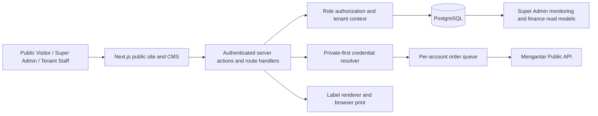
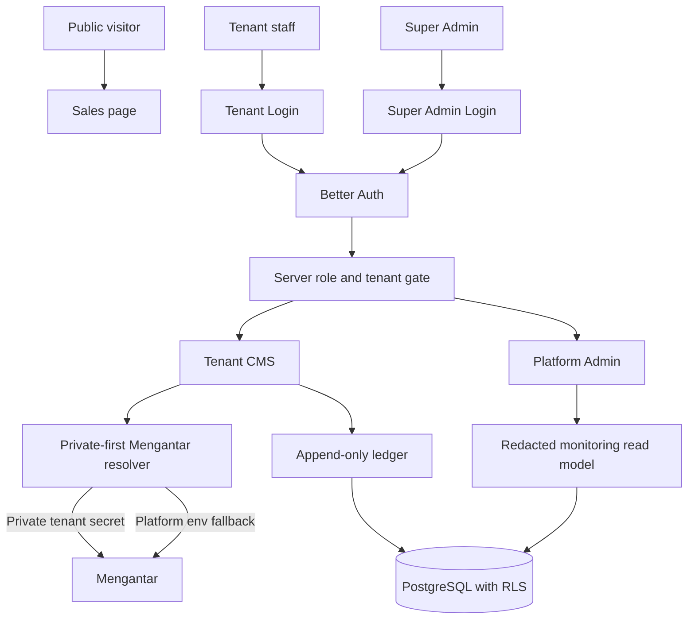

# System Architecture: GeraiCUAN

- Status: Draft
- Decision: Next.js App Router, PostgreSQL, Drizzle, and server-only Mengantar integration.

## Boundaries
- Browser: the public sales page, tenant CMS at `app.namadomain.com`, and
  Super Admin CMS at `cuan.namadomain.com` are separate browser entry points.
  Host routing is a usability boundary; it never replaces server-side role
  authorization. Browser code never receives Mengantar credentials,
  credential-bearing URLs, or ledger mutation authority.
- Application server: authenticates role-specific login entry points, validates
  tenant context, resolves private Mengantar configuration before platform
  environment fallback, invokes Mengantar, serializes dynamic-AWB batches,
  appends operational ledger entries from trusted transitions, computes
  monitoring read models, and redacts logs. Better Auth trusted origins and
  cookies are configured for the two exact CMS hosts without cross-subdomain
  cookie sharing by default.
- PostgreSQL: stores identities/memberships, tenants, outlet configuration references, reusable tenant contacts, immutable shipment party snapshots, shipment lifecycle, provider snapshots, append-only ledger/reconciliation records, and print/audit records.
- Mengantar: external source of carrier eligibility, shipping/insurance values, payment state, and AWB. It is not an authorization source for GeraiCUAN users.

## Trust and Data Flow

## Boundary Invariants
- Only server code resolves credentials or invokes Mengantar.
- Browser values cannot select the tenant, provider secret source, monetary totals, role, ledger type, or state transition.
- Platform monitoring aggregates tenant records; it does not expose credentials or create an implicit tenant membership.
- Every provider submission, ledger entry, audit event, print event, and asynchronous queue item carries tenant and outlet identity.

## Architecture Decisions

### ARCH-1 — Shared database with tenant key and PostgreSQL RLS defense in depth
- Status: Accepted
- Owner: Engineering owner
- Source: TD-1, TEN-1, TEN-2, DATA-1
- Decision: Application authorization is mandatory; RLS limits blast radius for tenant-owned tables.

### ARCH-2 — Per-outlet private Mengantar configuration with platform environment fallback
- Status: Accepted
- Owner: Engineering owner
- Source: TD-5, TD-15, DATA-6
- Decision: A complete private configuration wins; otherwise the server resolves platform defaults. The secret is injected server-side from managed configuration; only masked metadata and source classification are persisted.

### ARCH-3 — Provider AWB is authoritative
- Status: Accepted
- Owner: Engineering owner
- Source: PR-7, TD-3, DATA-2
- Decision: GeraiCUAN stores but never manufactures tracking numbers.

### ARCH-4 — Dynamic-AWB provider order requests serialize per Mengantar account
- Status: Accepted
- Owner: Engineering owner
- Source: PR-6, TD-3
- Decision: Bulk is a provider order array, not parallel POST requests.

### ARCH-5 — Super Admin monitoring is a dedicated read model
- Status: Accepted
- Owner: Engineering owner
- Source: PR-11, TD-7, IAM-1
- Decision: It aggregates platform/tenant operational health with explicit filters, but does not turn Super Admin into an implicit tenant member or expose secrets.

### ARCH-6 — CMS deployment hosts are role-specific
- Status: Accepted
- Owner: Engineering owner
- Source: TD-8
- Decision: Tenant operations use
  `app.namadomain.com`; Super Admin operations use `cuan.namadomain.com`.
  Reverse-proxy host routing presents the appropriate entry point while
  application authorization remains the enforcement boundary.

## Omitted Boundaries
No billing/subscription service, public developer API, or inventory service is
included in this MVP. The accepted CMS host routing boundary does not include
tenant-specific custom domains.
