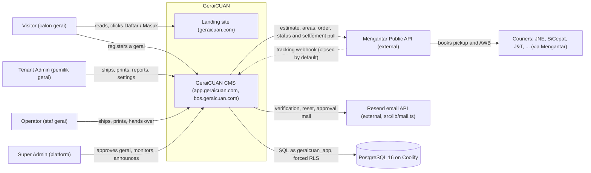
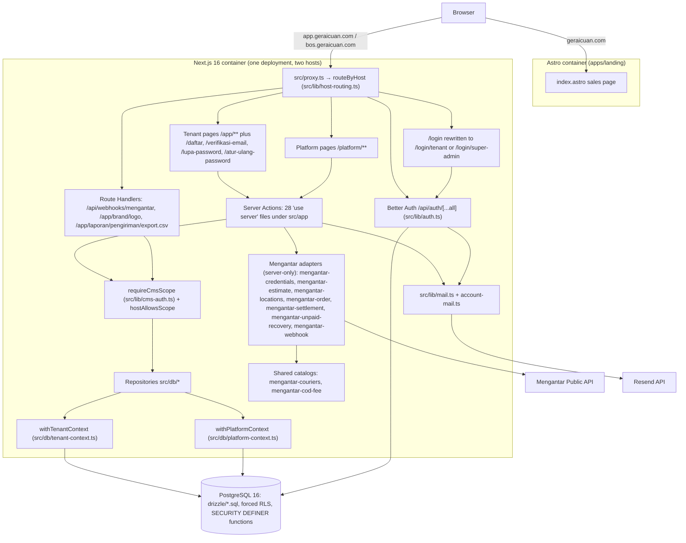
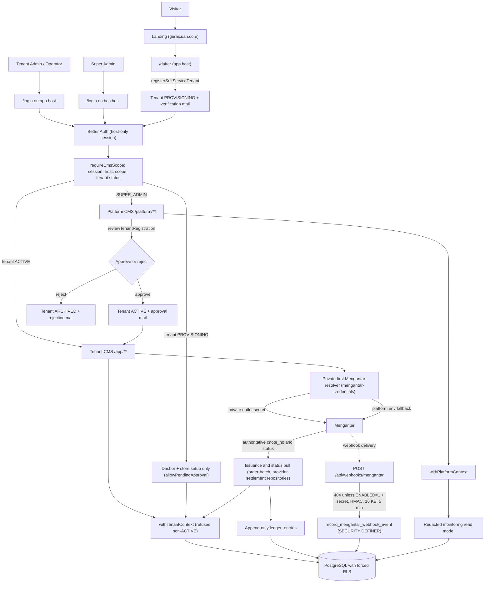

# System Architecture: GeraiCUAN

- Status: Draft
- Updated: 2026-10-06 (verified against HEAD `30a8eb0`)
- Decision: Next.js App Router, PostgreSQL, Drizzle, Better Auth, and server-only Mengantar integration, deployed as Coolify containers beside an Astro landing site.

## System Context

```mermaid
flowchart LR
  Visitor["Visitor (calon gerai)"]
  Owner["Tenant Admin (pemilik gerai)"]
  Operator["Operator (staf gerai)"]
  SuperAdmin["Super Admin (platform)"]

  subgraph GC["GeraiCUAN"]
    Landing["Landing site (geraicuan.com)"]
    App["GeraiCUAN CMS (app.geraicuan.com, bos.geraicuan.com)"]
  end

  Mengantar["Mengantar Public API (external)"]
  Courier["Couriers: JNE, SiCepat, J&T, ... (via Mengantar)"]
  Resend["Resend email API (external, src/lib/mail.ts)"]
  PG[("PostgreSQL 16 on Coolify")]

  Visitor -->|"reads, clicks Daftar / Masuk"| Landing
  Visitor -->|"registers a gerai"| App
  Owner -->|"ships, prints, reports, settings"| App
  Operator -->|"ships, prints, hands over"| App
  SuperAdmin -->|"approves gerai, monitors, announces"| App
  App -->|"estimate, areas, order, status and settlement pull"| Mengantar
  Mengantar -.->|"tracking webhook (closed by default)"| App
  Mengantar -->|"books pickup and AWB"| Courier
  App -->|"verification, reset, approval mail"| Resend
  App -->|"SQL as geraicuan_app, forced RLS"| PG
```

The landing site is static and has no server or database access; its Daftar and Masuk links point at `PUBLIC_APP_ORIGIN` (`apps/landing/src/lib/site.mjs`, default `https://app.geraicuan.com`).

## Containers

```mermaid
flowchart TB
  Browser["Browser"]

  subgraph Landing["Astro container (apps/landing)"]
    LandingPage["index.astro sales page"]
  end

  subgraph Next["Next.js 16 container (one deployment, two hosts)"]
    Proxy["src/proxy.ts → routeByHost (src/lib/host-routing.ts)"]
    TenantPages["Tenant pages /app/** plus /daftar, /verifikasi-email, /lupa-password, /atur-ulang-password"]
    PlatformPages["Platform pages /platform/**"]
    LoginPages["/login rewritten to /login/tenant or /login/super-admin"]
    AuthRoute["Better Auth /api/auth/[...all] (src/lib/auth.ts)"]
    Actions["Server Actions: 28 'use server' files under src/app"]
    Routes["Route Handlers: /api/webhooks/mengantar, /app/brand/logo, /app/laporan/pengiriman/export.csv"]
    Gate["requireCmsScope (src/lib/cms-auth.ts) + hostAllowsScope"]
    Repos["Repositories src/db/*"]
    TenantCtx["withTenantContext (src/db/tenant-context.ts)"]
    PlatformCtx["withPlatformContext (src/db/platform-context.ts)"]
    Adapters["Mengantar adapters (server-only): mengantar-credentials, mengantar-estimate, mengantar-locations, mengantar-order, mengantar-settlement, mengantar-unpaid-recovery, mengantar-webhook"]
    Catalog["Shared catalogs: mengantar-couriers, mengantar-cod-fee"]
    Mail["src/lib/mail.ts + account-mail.ts"]
  end

  PG[("PostgreSQL 16: drizzle/*.sql, forced RLS, SECURITY DEFINER functions")]
  Mengantar["Mengantar Public API"]
  Resend["Resend API"]

  Browser -->|"geraicuan.com"| LandingPage
  Browser -->|"app.geraicuan.com / bos.geraicuan.com"| Proxy
  Proxy --> TenantPages
  Proxy --> PlatformPages
  Proxy --> LoginPages
  Proxy --> AuthRoute
  Proxy --> Routes
  TenantPages --> Actions
  PlatformPages --> Actions
  LoginPages --> AuthRoute
  Actions --> Gate
  Routes --> Gate
  Gate --> Repos
  Repos --> TenantCtx
  Repos --> PlatformCtx
  TenantCtx --> PG
  PlatformCtx --> PG
  AuthRoute --> PG
  Actions --> Adapters
  Adapters --> Catalog
  Adapters --> Mengantar
  Actions --> Mail
  AuthRoute --> Mail
  Mail --> Resend
```

Notes, from code:
- `routeByHost` serves `/api/auth/**`, `/couriers/**`, `/favicon.ico` and `/icon.svg` on both hosts; any other path outside the host's own prefixes answers 404. `/` redirects to `/app` or `/platform` with a session cookie, else to `/login`. An old `/login/tenant` or `/login/super-admin` path is 308-redirected to its owning host.
- The webhook route does not call `requireCmsScope`: it has no user principal. It verifies the HMAC and writes through `record_mengantar_webhook_event` (SECURITY DEFINER, migration `0063`), which resolves the tenant from the provider record. `/api/auth/[...all]` is Better Auth's own handler.
- Self-service registration (`registerSelfServiceTenant`) and registration review (`reviewTenantRegistration`) call SECURITY DEFINER functions from migration `0051` (`src/db/tenant-registration-repository.ts`); announcements write through `save_platform_announcement` / `unpublish_platform_announcement` (`src/db/announcement-repository.ts`).
- Without `GERAICUAN_TENANT_ORIGIN` / `GERAICUAN_PLATFORM_ORIGIN` (development) one origin serves every path and `src/app/page.tsx` is the single-origin entry; production refuses to start without them (`src/lib/startup-validation.ts`).

## Boundaries
- Browser: three hosts (D-7, PR-58; README "Deployment host boundary", RELEASE.md DNS step): `geraicuan.com` (Astro landing, `apps/landing`), `app.geraicuan.com` (tenant CMS, sign-up and recovery) and `bos.geraicuan.com` (Super Admin CMS). The last two are one Next.js deployment routed by the `Host` header in `src/proxy.ts` / `src/lib/host-routing.ts`; `X-Forwarded-Host` is never read. Host routing is an additional boundary; it never replaces server-side role authorization (`requireCmsScope`, `resolvePlatformAccess` and the session-create hook consult `hostAllowsScope` themselves). Browser code never receives Mengantar credentials, credential-bearing URLs, or ledger mutation authority. *(History: earlier drafts named the hosts `app.namadomain.com` and `cuan.namadomain.com`.)*
- Application server: authenticates role-specific login entry points, gates a `PROVISIONING` tenant to store setup (PR-60), validates tenant context, resolves private Mengantar configuration before platform environment fallback, invokes Mengantar, serializes dynamic-AWB batches per provider account (`withProviderAccountSerialization`, `src/lib/mengantar-order.ts`), appends ledger entries only from trusted provider transitions (`src/db/order-batch-repository.ts`, `src/db/unpaid-recovery-repository.ts` → `src/db/ledger-repository.ts`), computes the platform monitoring read model, sends account mail, and redacts logs. Better Auth trusted origins come from `BETTER_AUTH_TRUSTED_ORIGINS` and the two CMS origins (`src/lib/auth-config.ts`); session cookies are host-only, never `crossSubDomainCookies` (`src/lib/auth.ts`). A tenant session is never minted on the platform host, nor a Super Admin session on the tenant host.
- PostgreSQL: stores identities/memberships, tenants and their lifecycle status, outlet configuration and pickup points, encrypted private credentials (`managed_secret_payloads`), reusable tenant contacts, immutable shipment party snapshots, shipment lifecycle, provider snapshots and status observations, settlement pulls, handover and print events, invoices, append-only ledger/reconciliation records, platform announcements, the `wilayah_areas` reference, and audit records (`src/db/schema.ts`).
- Mengantar: external source of carrier eligibility, shipping/insurance values, payment state, settlement, tracking history, and AWB. It is not an authorization source for GeraiCUAN users. Issuance and unpaid recovery are wired only to the sanctioned fixture transports (`src/lib/sanctioned-order-fixture.ts`, enabled only outside production with `GERAICUAN_ENABLE_SANCTIONED_ORDER_FIXTURE=1`), so the app sends no live `POST /order` until T-153.
- Mail: Resend over HTTP `fetch` (D-10); production requires `RESEND_API_KEY` and `RESEND_FROM_EMAIL`; development and test record messages instead of sending them (`src/lib/mail.ts`).

## Trust and Data Flow

```mermaid
flowchart TD
    Visitor["Visitor"] --> Landing["Landing (geraicuan.com)"]
    Landing --> Daftar["/daftar (app host)"]
    Daftar -->|"registerSelfServiceTenant"| Provisioning["Tenant PROVISIONING + verification mail"]
    Staff["Tenant Admin / Operator"] --> TenantLogin["/login on app host"]
    Platform["Super Admin"] --> AdminLogin["/login on bos host"]
    TenantLogin --> Auth["Better Auth (host-only session)"]
    AdminLogin --> Auth
    Provisioning --> Auth
    Auth --> Gate["requireCmsScope: session, host, scope, tenant status"]
    Gate -->|"tenant ACTIVE"| TenantCMS["Tenant CMS /app/**"]
    Gate -->|"tenant PROVISIONING"| Setup["Dasbor + store setup only (allowPendingApproval)"]
    Gate -->|"SUPER_ADMIN"| PlatformCMS["Platform CMS /platform/**"]
    PlatformCMS -->|"reviewTenantRegistration"| Review{"Approve or reject"}
    Review -->|"approve"| Active["Tenant ACTIVE + approval mail"]
    Review -->|"reject"| Archived["Tenant ARCHIVED + rejection mail"]
    Active --> TenantCMS
    TenantCMS --> TenantCtx["withTenantContext (refuses non-ACTIVE)"]
    Setup --> TenantCtx
    TenantCMS --> Resolver["Private-first Mengantar resolver (mengantar-credentials)"]
    Resolver -->|"private outlet secret"| Provider["Mengantar"]
    Resolver -->|"platform env fallback"| Provider
    Provider -->|"authoritative cnote_no and status"| Issuance["Issuance and status pull (order-batch, provider-settlement repositories)"]
    Issuance --> TenantCtx
    Issuance --> Ledger["Append-only ledger_entries"]
    Webhook["POST /api/webhooks/mengantar"] -->|"404 unless ENABLED=1 + secret, HMAC, 16 KB, 5 min"| Definer["record_mengantar_webhook_event (SECURITY DEFINER)"]
    Provider -.->|"webhook delivery"| Webhook
    PlatformCMS --> PlatformCtx["withPlatformContext"]
    PlatformCtx --> Metrics["Redacted monitoring read model"]
    TenantCtx --> Postgres[("PostgreSQL with forced RLS")]
    Ledger --> Postgres
    Definer --> Postgres
    Metrics --> Postgres
```

*(History: the previous diagram drew `TenantCMS --> Ledger`, which read as if any CMS action could write the ledger. Ledger rows are appended only after the provider returns an authoritative result: by the issuance and unpaid-recovery completions, and by `applyAuthoritativeShipmentReconciliation` when an unknown submission resolves to `ISSUED` — the same rule as spec 03 TD-10.)*

## Boundary Invariants
- Only server code resolves credentials or invokes Mengantar.
- Browser values cannot select the tenant, provider secret source, monetary totals, role, ledger type, tenant status, or state transition.
- Platform monitoring aggregates tenant records; it does not expose credentials or create an implicit tenant membership.
- Every provider submission, ledger entry and asynchronous queue item carries tenant and outlet identity. Audit events (`audit_events`), print events (`print_events`) and handover events (`shipment_handover_events`) carry `tenant_id`; the latter two reach their outlet through the shipment foreign key.
- A tenant that is not `ACTIVE` cannot reach a shipment path: `requireCmsScope` redirects it, `withTenantContext` refuses it, and RLS on shipping tables requires an `ACTIVE` tenant.
- Inbound provider traffic without a user principal enters only through a SECURITY DEFINER function that derives the tenant from the provider record.

## Architecture Decisions

### ARCH-1 — Shared database with tenant key and PostgreSQL RLS defense in depth
- Status: Accepted
- Owner: Engineering owner
- Source: TD-1, TEN-1, TEN-2, DATA-1
- Decision: Application authorization is mandatory; RLS limits blast radius for tenant-owned tables.

### ARCH-2 — Per-outlet private Mengantar configuration with platform environment fallback
- Status: Accepted
- Owner: Engineering owner
- Source: TD-5, TD-15, DATA-6
- Decision: A complete private configuration wins; otherwise the server resolves platform defaults. The secret is injected server-side from managed configuration; only masked metadata and source classification are persisted.

### ARCH-3 — Provider AWB is authoritative
- Status: Accepted
- Owner: Engineering owner
- Source: PR-7, TD-3, DATA-2
- Decision: GeraiCUAN stores but never manufactures tracking numbers.

### ARCH-4 — Dynamic-AWB provider order requests serialize per Mengantar account
- Status: Accepted
- Owner: Engineering owner
- Source: PR-6, TD-3
- Decision: Bulk is a provider order array, not parallel POST requests.

### ARCH-5 — Super Admin monitoring is a dedicated read model
- Status: Accepted
- Owner: Engineering owner
- Source: PR-11, TD-7, IAM-1
- Decision: It aggregates platform/tenant operational health with explicit filters (`src/db/platform-monitoring-repository.ts`, `src/db/platform-views.ts`, read under `withPlatformContext`), but does not turn Super Admin into an implicit tenant member or expose secrets. *(History: this record and the old context diagram also named a Super Admin finance read model; Keuangan was removed by T-204 and no platform finance view exists in code.)*

### ARCH-6 — CMS deployment hosts are role-specific
- Status: Accepted
- Owner: Engineering owner
- Source: TD-8, D-7, PR-58
- Decision: Tenant operations use `app.geraicuan.com`; Super Admin operations use `bos.geraicuan.com`; the public sales page is the separate Astro site at `geraicuan.com`. In-app host routing (`src/proxy.ts`, `src/lib/host-routing.ts`) presents the appropriate entry point while application authorization remains the enforcement boundary. *(History: originally `app.namadomain.com` and `cuan.namadomain.com`, with reverse-proxy host routing and the sales page inside the Next.js app.)*

## Omitted Boundaries
No billing/subscription service, public developer API, inventory service, or background job runner is included in this MVP: provider pulls run from Tenant Admin Server Actions. The accepted CMS host routing boundary does not include tenant-specific custom domains.
