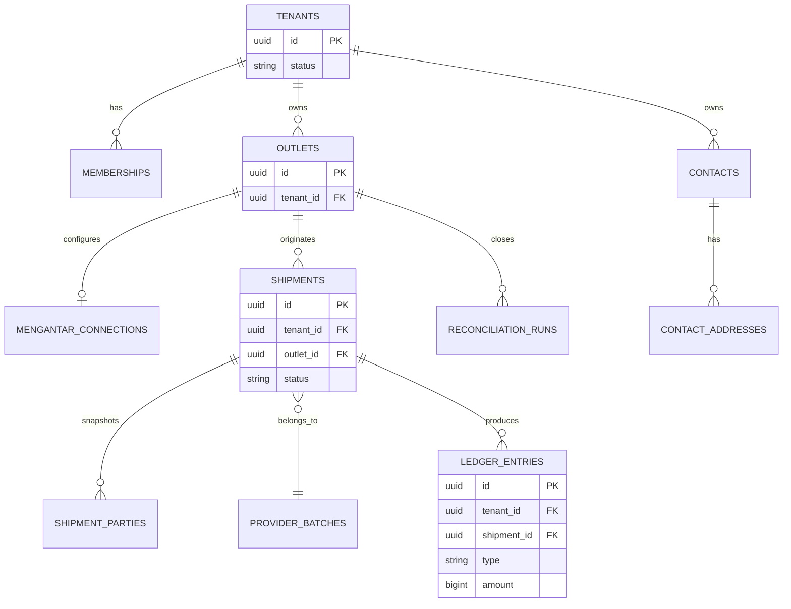

# Data Model: GeraiCUAN

- Status: Draft
- Owner: Engineering owner [TBD owner=Paduka Ongki; due=before first migration]

## Entities
| Entity | Tenant-scoped | Purpose |
|---|---:|---|
| `tenants` | No | Platform customer lifecycle and status. |
| `users` | No | Authenticated principal identity. |
| `memberships` | Yes | User role in one tenant: `TENANT_ADMIN` or `OPERATOR`. |
| `outlets` | Yes | Tenant shipment origin and operational pickup identity, including provider pickup/origin IDs and their readable labels. |
| `mengantar_connections` | Yes | Outlet private credential reference and non-secret connection metadata; row presence selects `private`, absence selects `platform_default`; never plaintext secrets. |
| `managed_secret_payloads` | Yes | Server-only authenticated-encryption envelope for an outlet's private Mengantar API key, keyed by canonical purpose/reference and encryption-key version; never plaintext or browser-readable metadata. |
| `mengantar_location_cache` | No | Optional bounded cache of provider-authoritative area/pickup identifiers and Indonesian display hierarchy, created only after an accepted address-search contract proves caching is needed. |
| `contacts` | Yes | Reusable sender/recipient directory entry with role tags and normalized contact details. |
| `contact_addresses` | Yes | One or more reusable addresses for a contact, including selected Mengantar address metadata. |
| `shipment_parties` | Yes | Immutable sender/recipient contact snapshots used for provider payload and label history. |
| `provider_batches` | Yes | Idempotency key, courier, upstream batch ID, queue/status. |
| `provider_order_snapshots` | Yes | Sanitized request/response fields, provider order ID, AWB, fees, `is_paid`. |
| `print_events` | Yes | Shipment label print/reprint event and actor/time. |
| `ledger_entries` | Yes | Immutable operational money entry, source transition, effective time, and reversal reference. |
| `reconciliation_runs` | Yes | Daily/monthly tenant reconciliation period, source totals, variance, status, and actor. |
| `audit_events` | Scope-tagged | Security-sensitive Super Admin/tenant-admin changes. |

## DATA-1 — Isolation invariant
- Owner: Engineering owner

Every tenant-owned table has non-null `tenant_id`; foreign keys and composite uniqueness prevent associations across tenant IDs. Application queries use tenant context; RLS policies use the same tenant identity defense-in-depth.

## DATA-2 — Shipment lifecycle
- Owner: Engineering owner

`DRAFT → ESTIMATED → SUBMISSION_QUEUED → SUBMISSION_UNKNOWN|ISSUED|AWAITING_UPSTREAM_PAYMENT|FAILED`. `ISSUED` requires a provider `cnote_no`. Print events reference issued shipments only.

## DATA-3 — Money and provider snapshots
- Owner: Engineering owner

Store currency as `IDR` and all amounts as whole integer rupiah. Persist user-declared goods value, provider-returned shipping and insurance values, GeraiCUAN COD service fee, VAT, and final provider COD amount separately. For COD, `service_fee = round_half_up((goods_value + shipping_fee) × 3%)`, `vat = round_half_up(service_fee × 11%)`, and final COD equals the sum of goods, shipping, service fee, and VAT. Preserve a sanitized estimate/order snapshot tied to the selected service; do not recompute provider shipping or insurance totals.

## DATA-4 — Operational ledger
- Owner: Engineering owner

`ledger_entries` is append-only. Amounts are IDR integers; source event and shipment/provider batch references are mandatory. Corrections create an `ADJUSTMENT` or reversal entry, never modify an existing entry. `COD_PRINCIPAL_COLLECTABLE` is a liability and is never reported as GeraiCUAN revenue. Reconciliation compares ledger/source totals by tenant, outlet, and professional date-range contract.

## DATA-5 — Source-of-truth transitions
- Owner: Engineering owner

| Trigger | Required outcome |
|---|---|
| Confirmed COD shipment | Persist selected estimate and calculated COD components; no ledger revenue is recognized yet. |
| Provider AWB issued | Append provider shipping/insurance cost where returned; append COD fee revenue and VAT payable only for COD. |
| Non-COD unpaid | Mark awaiting upstream payment; no AWB/print and no paid-cost entry until provider confirms recovery. |
| Pay-unpaid success | Persist AWB, append non-COD upstream-payment cost, then allow print. |
| Reconciliation variance | Preserve source totals and append an adjustment/reconciliation entry; never mutate prior ledger entries. |

## DATA-6 — Managed credential invariant
- Owner: Engineering owner

`mengantar_connections` stores no ciphertext or secret fragment. Each active private connection resolves exactly one purpose-bound encrypted payload for the same tenant and outlet. The envelope stores ciphertext, nonce, authentication tag, key version, and timestamps; authenticated additional data binds purpose, tenant, outlet, and canonical reference so rows cannot be replayed across scope. Replacement is transactional and never exposes the prior value. Removing a private connection is allowed only after the platform default is complete and records a redacted audit outcome.

## DATA-7 — Provider location invariant
- Owner: Engineering owner

Persist provider IDs together with their last accepted human-readable label at operational snapshot boundaries. Outlet pickup configuration stores `default_pickup_address_id` with `default_pickup_address_label` and `default_origin_area_id` with `default_origin_area_label`; both labels are null for legacy rows or non-null as one pair. New writes accept only a pickup from the current account-scoped provider response and derive the area ID and both labels from that same response. A cached area row is never sufficient evidence that an ID remains supported; estimate/order behavior remains authoritative. No location cache or canonical kecamatan dataset exists because current evidence does not justify one.

## ERD

## Migration rule
Add `tenant_id` and tenant indexes before any tenant data. Expand-contract migrations only; backfill and constraint enforcement are separate deploy steps. Retention periods are pending privacy review.

## DATA-8 — Market Expansion (Phase 2 Roadmap)
- Owner: Engineering owner

To support market standards (Return to Sender and Net Margin), new schema expansions are planned:
1. **RTS Tracking:** `shipments` table will receive an expanded status enum covering `RTS_QUEUED`, `RTS_IN_TRANSIT`, and `RTS_RECEIVED`. A new `shipment_rts_events` table will record the return timeline.
2. **COGS Tracking:** `shipments` table will optionally persist `cogs_amount` as IDR integer to represent Cost of Goods Sold. The analytics queries will compute Net Margin dynamically based on this field without altering the authoritative ledger.
