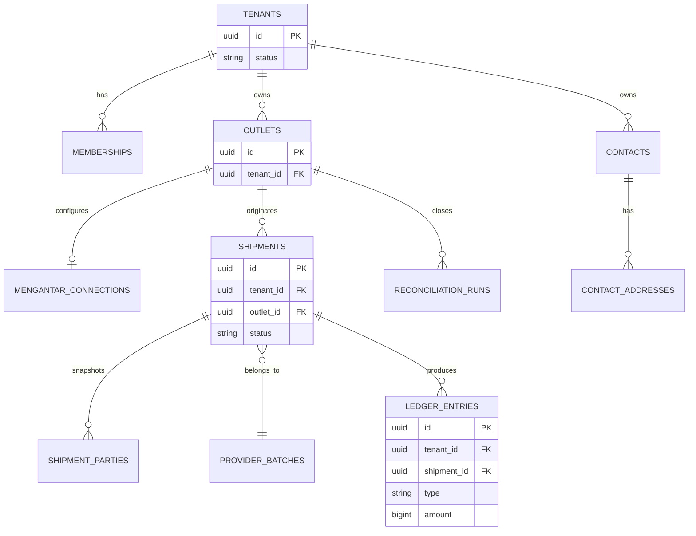

# Data Model: GeraiCUAN

- Status: Draft
- Owner: Engineering owner [TBD owner=Paduka Ongki; due=before first migration]

## Entities
| Entity | Tenant-scoped | Purpose |
|---|---:|---|
| `tenants` | No | Platform customer lifecycle and status. |
| `users` | No | Authenticated principal identity. |
| `memberships` | Yes | User role in one tenant: `TENANT_ADMIN` or `OPERATOR`. |
| `outlets` | Yes | Tenant shipment origin and operational pickup identity. |
| `mengantar_connections` | Yes | Outlet private credential reference, masked metadata, default pickup/origin IDs, and `private`/`platform_default` resolution state; never plaintext secrets. |
| `contacts` | Yes | Reusable sender/recipient directory entry with role tags and normalized contact details. |
| `contact_addresses` | Yes | One or more reusable addresses for a contact, including selected Mengantar address metadata. |
| `shipment_parties` | Yes | Immutable sender/recipient contact snapshots used for provider payload and label history. |
| `provider_batches` | Yes | Idempotency key, courier, upstream batch ID, queue/status. |
| `provider_order_snapshots` | Yes | Sanitized request/response fields, provider order ID, AWB, fees, `is_paid`. |
| `print_events` | Yes | Shipment label print/reprint event and actor/time. |
| `ledger_entries` | Yes | Immutable operational money entry, source transition, effective time, and reversal reference. |
| `reconciliation_runs` | Yes | Daily/monthly tenant reconciliation period, source totals, variance, status, and actor. |
| `audit_events` | Scope-tagged | Security-sensitive Super Admin/tenant-admin changes. |

## DATA-1 — Isolation invariant
Every tenant-owned table has non-null `tenant_id`; foreign keys and composite uniqueness prevent associations across tenant IDs. Application queries use tenant context; RLS policies use the same tenant identity defense-in-depth.

## DATA-2 — Shipment lifecycle
`DRAFT → ESTIMATED → SUBMISSION_QUEUED → SUBMISSION_UNKNOWN|ISSUED|AWAITING_UPSTREAM_PAYMENT|FAILED`. `ISSUED` requires a provider `cnote_no`. Print events reference issued shipments only.

## DATA-3 — Money and provider snapshots
Store currency as `IDR` and all amounts as whole integer rupiah. Persist user-declared goods value, provider-returned shipping and insurance values, GeraiCUAN COD service fee, VAT, and final provider COD amount separately. For COD, `service_fee = round_half_up((goods_value + shipping_fee) × 3%)`, `vat = round_half_up(service_fee × 11%)`, and final COD equals the sum of goods, shipping, service fee, and VAT. Preserve a sanitized estimate/order snapshot tied to the selected service; do not recompute provider shipping or insurance totals.

## DATA-4 — Operational ledger
`ledger_entries` is append-only. Amounts are IDR integers; source event and shipment/provider batch references are mandatory. Corrections create an `ADJUSTMENT` or reversal entry, never modify an existing entry. `COD_PRINCIPAL_COLLECTABLE` is a liability and is never reported as GeraiCUAN revenue. Reconciliation compares ledger/source totals by tenant, outlet, and professional date-range contract.

## DATA-5 — Source-of-truth transitions
| Trigger | Required outcome |
|---|---|
| Confirmed COD shipment | Persist selected estimate and calculated COD components; no ledger revenue is recognized yet. |
| Provider AWB issued | Append provider shipping/insurance cost where returned; append COD fee revenue and VAT payable only for COD. |
| Non-COD unpaid | Mark awaiting upstream payment; no AWB/print and no paid-cost entry until provider confirms recovery. |
| Pay-unpaid success | Persist AWB, append non-COD upstream-payment cost, then allow print. |
| Reconciliation variance | Preserve source totals and append an adjustment/reconciliation entry; never mutate prior ledger entries. |

## ERD

## Migration rule
Add `tenant_id` and tenant indexes before any tenant data. Expand-contract migrations only; backfill and constraint enforcement are separate deploy steps. Retention periods are pending privacy review.
