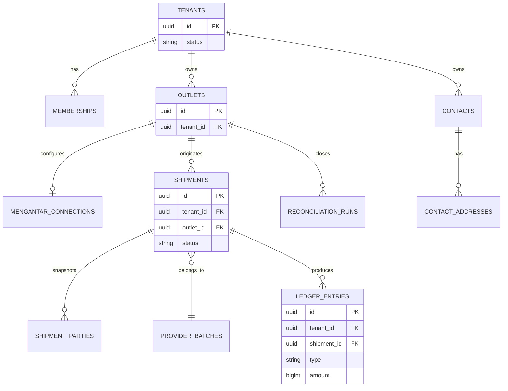

# Data Model: GeraiCUAN

- Status: Draft
- Owner: Engineering owner [TBD owner=Paduka Ongki; due=before first migration]

## Entities
| Entity | Tenant-scoped | Purpose |
|---|---:|---|
| `tenants` | No | Platform customer lifecycle and status. |
| `users` | No | Authenticated principal identity. |
| `memberships` | Yes | User role in one tenant: `TENANT_ADMIN` or `OPERATOR`. |
| `outlets` | Yes | Tenant shipment origin and operational pickup identity. Its `default_pickup_address_id`/`default_origin_area_id` pair and labels are the denormalized mirror of the outlet's default `outlet_pickup_points` row. |
| `outlet_pickup_points` | Yes | The outlet's Mengantar pickup addresses as a list: provider `pickup_address_id`, its derived origin area, their labels, and which entry is the outlet default. |
| `mengantar_connections` | Yes | Outlet private credential reference and non-secret connection metadata; row presence selects `private`, absence selects `platform_default`; never plaintext secrets. |
| `managed_secret_payloads` | Yes | Server-only authenticated-encryption envelope for an outlet's private Mengantar API key, keyed by canonical purpose/reference and encryption-key version; never plaintext or browser-readable metadata. |
| `mengantar_location_cache` | No | Optional bounded cache of provider-authoritative area/pickup identifiers and Indonesian display hierarchy, created only after an accepted address-search contract proves caching is needed. |
| `contacts` | Yes | Reusable sender/recipient directory entry with role tags and normalized contact details. |
| `contact_addresses` | Yes | One or more reusable addresses for a contact, including selected Mengantar address metadata. |
| `shipment_parties` | Yes | Immutable sender/recipient contact snapshots used for provider payload and label history. |
| `provider_batches` | Yes | Idempotency key, courier, upstream batch ID, queue/status. |
| `provider_order_snapshots` | Yes | Sanitized request/response fields, provider order ID, AWB, fees, `is_paid`. |
| `print_events` | Yes | Shipment label print/reprint event and actor/time. |
| `ledger_entries` | Yes | Immutable operational money entry, source transition, effective time, and reversal reference. |
| `reconciliation_runs` | Yes | Daily/monthly tenant reconciliation period, source totals, variance, status, and actor. |
| `audit_events` | Scope-tagged | Security-sensitive Super Admin/tenant-admin changes. |

## DATA-1 — Isolation invariant
- Owner: Engineering owner

Every tenant-owned table has non-null `tenant_id`; foreign keys and composite uniqueness prevent associations across tenant IDs. Application queries use tenant context; RLS policies use the same tenant identity defense-in-depth.

## DATA-2 — Shipment lifecycle
- Owner: Engineering owner

`DRAFT → ESTIMATED → SUBMISSION_QUEUED → SUBMISSION_UNKNOWN|ISSUED|AWAITING_UPSTREAM_PAYMENT|FAILED`. `ISSUED` requires a provider `cnote_no`. Print events reference issued shipments only.

## DATA-3 — Money and provider snapshots
- Owner: Engineering owner

Store currency as `IDR` and all amounts as whole integer rupiah, except provider settlement evidence (`provider_settlement_items`, T-178), which stores Mengantar's own fractional figures exactly as `numeric(18,4)`. Persist user-declared goods value, provider-returned shipping and insurance values, the COD fee, VAT, and final provider COD amount separately. Final COD always equals the sum of goods, shipping, fee, and VAT. `shipment_cod_totals.cod_formula_version` names the rule a row was written with, and the database checks each version's own arithmetic; a row is never recomputed under a newer version because it records what was submitted to the provider. Version 1 (rows before migration 0048): `service_fee = round_half_up((goods_value + shipping_fee) × 3%)`, `vat = round_half_up(service_fee × 11%)`. Version 2 (T-175, migration 0048): `cod = ceil((goods_value + shipping_fee) × 10000 / 9667)`, `service_fee = round_half_up((cod − goods_value − shipping_fee) × 100 / 111)`, `vat` the remainder. Version 3 (T-186, migration 0050, COD Ongkir): `provider_cod_amount_idr` is the shipping charge alone, `cod_shipping_basis_idr` (NULL on versions 1 and 2, required on 3) is the shipping Mengantar deducts, `provider_cod_amount_idr × 9667 ≥ cod_shipping_basis_idr × 10000`, and `service_fee + vat = round_half_up(provider_cod_amount_idr × 333 / 10000)` split 100/111; the goods + shipping + fee + VAT identity is scoped to versions 1 and 2, so the goods are never part of a version 3 amount. The INSERT policy requires version 3 exactly for a `cod_shipping_only` draft and binds the basis to the selected service's `coalesce(special_price_idr, normal_price_idr, shipping_amount_idr)`. The column defaults to 1 so a writer that names no version is held to the additive rule; the application names 2 (or 3). `scripts/verify-migration-upgrade.mjs` writes a version 1 row before 0048 and proves it survives unchanged. As DATA-11 records for origins, a change to the formula the application computes is incomplete until these checks move with it. Preserve a sanitized estimate/order snapshot tied to the selected service; do not recompute provider shipping or insurance totals.

## DATA-4 — Operational ledger
- Owner: Engineering owner

`ledger_entries` is append-only. Amounts are IDR integers; source event and shipment/provider batch references are mandatory. Corrections create an `ADJUSTMENT` or reversal entry, never modify an existing entry. `COD_PRINCIPAL_COLLECTABLE` is a liability and is never reported as GeraiCUAN revenue. Reconciliation compares ledger/source totals by tenant, outlet, and professional date-range contract.

**COD fee reclassification (T-178, migration 0049, 2026-09-17).** `shipment_cod_totals.service_fee_idr` is Mengantar's COD fee carried to the buyer: Mengantar deducts it at settlement and GeraiCUAN never receives it (evidence: `tests/fixtures/mengantar-cod-identities.json` → `settlement`). Until this change the issuance appended it as `GERAICUAN_COD_SERVICE_FEE_REVENUE` (`REVENUE`). **Effective point:** every issuance ledgered by the release carrying migration 0049 appends it as `MENGANTAR_COD_FEE_COST` (`EXPENSE`), same amount, same source event; the point is per issuance, not a timestamp — an issuance whose `PROVIDER_ORDER_ISSUED` entries already include the revenue type was posted before the change. No historical entry is updated or deleted: `ledger_entries_immutable` (0015) still refuses UPDATE and DELETE, `geraicuan_app` still holds SELECT and INSERT only, and the revenue type stays valid in `ledger_entries_type_valid`, `_type_class_valid`, `_source_event_valid` and `reconciliation_runs_entry_type_valid` so history, its `ADJUSTMENT` reversals and an instance on the previous release during a deploy (which appends it inside the AWB-recording transaction) keep working. Reconciliation classifies each COD issuance's stored fee by that same per-issuance rule, so both types reconcile exactly in a period that straddles the change. `COD_SERVICE_FEE_VAT_PAYABLE` is not reclassified by this change.

**One COD fee, VAT inside it (T-193, D-13, 2026-09-17; no migration).** Mengantar keeps `COD × 0.0333` and the 11% VAT is inside that 3.33%, so VAT was never GeraiCUAN's liability. **Effective point, per issuance:** every issuance ledgered by the release carrying T-193 appends `MENGANTAR_COD_FEE_COST` at `round_half_up(provider_cod_amount_idr × 333 / 10000)` (`mengantarCodFeeIdr`, whatever formula version the totals row has) and **no** `COD_SERVICE_FEE_VAT_PAYABLE`. No historical entry is updated or deleted, and no CHECK moves: the VAT type stays valid in all four constraints so history, its reversals and an instance on the previous release during a deploy keep working. Readers present historical VAT rows (and `ADJUSTMENT`s reversing them) as "PPN dalam biaya COD (dipotong Mengantar)", part of the fee, outside any payable total (`summarizeLedger(...).legacyCodFeeVatIdr`, platform `legacyCodFeeVatIdr`, Keuangan's class column). **Reconciliation** classifies each COD issuance by the entries it already carries: a `GERAICUAN_COD_SERVICE_FEE_REVENUE` entry → the stored `service_fee_idr` as revenue and `vat_amount_idr` as VAT (before T-178); a VAT entry but no revenue entry → the stored service fee as `MENGANTAR_COD_FEE_COST` and the stored VAT (T-178 until T-193); neither → Mengantar's fee as `MENGANTAR_COD_FEE_COST` and no VAT (T-193 on), so a missing fee entry still surfaces on the current type. Known ceiling: a T-178-era issuance that lost only its VAT entry is read as T-193-era and can surface as at most a small fee variance rather than a missing VAT row. `shipment_cod_totals.service_fee_idr`/`vat_amount_idr` keep their per-version CHECK arithmetic and are no longer a displayed fee. **In flight:** a version 1 totals row is immutable and one per shipment (INSERT/SELECT grants, `shipment_cod_totals_shipment_tenant_key`), so it cannot be recomputed as version 2; `ensureCodTotalsForConfirmation` refuses it (`CodTotalsFormulaRetiredError`) unless its order was already attempted at Mengantar, in which case a retry reads the recorded result back and submits nothing.

**COD principal for COD Ongkir (T-186, 2026-09-17).** `COD_PRINCIPAL_COLLECTABLE` is the goods money a courier collects on the seller's behalf. A COD Ongkir issuance (formula version 3) collects a shipping charge only — the goods were paid outside GeraiCUAN — so it appends `COD_PRINCIPAL_COLLECTABLE` at **0**, not the declared goods value and not the charge. The entry is still appended so every COD issuance carries the same entry set and "no goods principal" is a recorded fact. The charge is not principal: Mengantar keeps the shipping (`MENGANTAR_SHIPPING_COST`) and its fee (`MENGANTAR_COD_FEE_COST` + `COD_SERVICE_FEE_VAT_PAYABLE`, together 3.33% of the charge; from T-193 `MENGANTAR_COD_FEE_COST` alone, VAT inside) and remits the seller's difference, which RPT-SHP-COD-DISBURSEMENT-EST-IDR estimates and settlement records. No new entry type was added and no CHECK moved. Reconciliation's source principal counts `goods_value_idr` only for rows whose `cod_formula_version <> 3`, the same rule. Append-only is unchanged. As DATA-11 records, the database checks moved in the same change as the application rule. `scripts/verify-migration-upgrade.mjs` writes a revenue-typed entry and whole-rupiah settlement evidence before 0049 and proves them unchanged after it.

## DATA-5 — Source-of-truth transitions
- Owner: Engineering owner

| Trigger | Required outcome |
|---|---|
| Confirmed COD shipment | Persist selected estimate and calculated COD components; no ledger revenue is recognized yet. |
| Provider AWB issued | Append provider shipping/insurance cost where returned; append the COD fee as `MENGANTAR_COD_FEE_COST` (expense) at `round_half_up(COD × 333 / 10000)`, VAT inside it, only for COD (T-193; before it the stored service fee plus a `COD_SERVICE_FEE_VAT_PAYABLE` row, and before T-178 `GERAICUAN_COD_SERVICE_FEE_REVENUE`). |
| Non-COD unpaid | Mark awaiting upstream payment; no AWB/print and no paid-cost entry until provider confirms recovery. |
| Pay-unpaid success | Persist AWB, append non-COD upstream-payment cost, then allow print. |
| Reconciliation variance | Preserve source totals and append an adjustment/reconciliation entry; never mutate prior ledger entries. |

## DATA-6 — Managed credential invariant
- Owner: Engineering owner

`mengantar_connections` stores no ciphertext or secret fragment. Each active private connection resolves exactly one purpose-bound encrypted payload for the same tenant and outlet. The envelope stores ciphertext, nonce, authentication tag, key version, and timestamps; authenticated additional data binds purpose, tenant, outlet, and canonical reference so rows cannot be replayed across scope. Replacement is transactional and never exposes the prior value. Removing a private connection is allowed only after the platform default is complete and records a redacted audit outcome.

## DATA-7 — Provider location invariant
- Owner: Engineering owner

Persist provider IDs together with their last accepted human-readable label at operational snapshot boundaries. Outlet pickup configuration stores `default_pickup_address_id` with `default_pickup_address_label` and `default_origin_area_id` with `default_origin_area_label`; both labels are null for legacy rows or non-null as one pair. New writes accept only a pickup from the current account-scoped provider response and derive the area ID and both labels from that same response. A cached area row is never sufficient evidence that an ID remains supported; estimate/order behavior remains authoritative. No location cache or canonical kecamatan dataset exists because current evidence does not justify one.

## ERD

## Migration rule
Add `tenant_id` and tenant indexes before any tenant data. Expand-contract migrations only; backfill and constraint enforcement are separate deploy steps. Retention periods are pending privacy review.

## DATA-8 — Market Expansion (Phase 2 Roadmap)
- Owner: Engineering owner

To support market standards (Return to Sender, and originally Net Margin — withdrawn 2026-09-17 by T-177), these schema expansions were planned:
1. **RTS Tracking:** `shipments` table will receive an expanded status enum covering `RTS_QUEUED`, `RTS_IN_TRANSIT`, and `RTS_RECEIVED`. A new `shipment_rts_events` table will record the return timeline.
2. **COGS Tracking — withdrawn 2026-09-17 (T-177).** `shipments.cogs_amount_idr` and `shipment_drafts.cogs_amount_idr` were added for a net-margin KPI. The owner withdrew margin reporting ("Laporan saja"): no application path writes or reads either column any more, existing values are left untouched, and dropping the columns is a separate migration for the migration owner.

### PR-41 — Persisted operational shipment references (superseded by PR-44, migration 0040)

Shipments retain their UUID primary key, composite tenant/outlet foreign keys, URLs and idempotency semantics. New human `public_reference` is immutable and unique, with `created_by_user_id`, numeric `reference_user_number`, full WIB calendar `reference_date`, and `daily_sequence`. Users receive a stable numeric `public_number` starting10000; display widths are minimums, never truncation limits. The reference is e.g.95758-260914-001; counter keys use the full date and concurrent allocation uses one atomic counter-row upsert. YYMMDD is the accepted display; the unique constraint fails closed on century reuse and must be replaced by YYYYMMDD before that horizon.

A private counter table and a narrowly scoped, pinned-search-path PostgreSQL trigger allocate the reference. Runtime actors are checked against server-derived app.user_id and tenant membership; clients cannot set or change reference components or use the counter table. Existing shipments have no reliable creator record: backfill deterministic00000 legacy references ordered by created_at/id within each WIB date, without attributing them to an administrator. Existing UUIDs, snapshots, ledger records, parties, orders and AWBs remain unchanged. Local migration is explicitly authorized; test fresh/upgrade/concurrency and preserve local account data before applying it. No reset/reseed.

## DATA-9 — Provider settlement evidence (PR-43, T-146)

Append-only, tenant-scoped, Tenant Admin RLS (SELECT/INSERT only). No receiver, recipient, phone, address, goods, pickup, name or email column exists on any of these tables; a repository test asserts it.

| Table | Purpose | Key constraints |
|---|---|---|
| `provider_settlement_pulls` | One row per pull: outlet, actor, credential source, provider account key, period, account-wide invoice/order counts, matched counts | `(outlet_id, tenant_id)` → outlets; account key `^[0-9a-f]{64}$`; `period_end > period_start`; `invoice_count`, `order_count` and `unmatched_awb_count` must be NULL unless `credential_source = 'private'` |
| `provider_settlement_items` | Matched per-AWB SETTLEMENT/CHARGE/REFUND evidence: invoice id/number/status/created time, `amount_idr numeric(18,4)`, `cod_amount_idr bigint`, `cod_fee_idr numeric(18,4)`, `shipping_amount_idr numeric(18,4)` (the invoice's `estimatedSpecialPrice`: discounted shipping plus the unrounded COD fee). Migration 0049 (T-178) widened them from bigint / numeric(16,2); every stored value is kept (verified by the upgrade script) and the observation key compares by value | `(shipment_id, outlet_id, tenant_id)` → shipments; `(pull_id, tenant_id)` → pulls; unique `(tenant_id, provider_invoice_id, item_type, cnote_no, invoice_status, amount_idr)`: an identical re-pull adds nothing, while a changed status or corrected amount is a new observation and the review reads the latest per invoice line |
| `provider_order_status_observations` | Latest provider status seen per matched shipment per pull, **and what that report did to the shipment** (T-169) | unique `(pull_id, shipment_id)`; same composite shipment and pull foreign keys; `provider_order_status_observations_transition_valid` |

Migration `0039_provider_settlement.sql` is additive; it also admits `settlement-pull` in `shipment_rate_limits_operation_valid`.

### Delivery-transition decision on the observation (0047 — T-169, 2026-09-16)

`provider_order_status_observations` gains `from_status`, `mapped_status` and `transition_outcome`, all nullable and all written with the observation itself — the table keeps SELECT + INSERT and is never updated, so a decision is stored beside the evidence that caused it rather than in a second table. All three are NULL on rows recorded before 0047, when a pull stored provider evidence and transitioned nothing.

`transition_outcome` is one of `APPLIED`, `UNCHANGED`, `REFUSED`, `NO_LIFECYCLE_STATE` or `UNRECOGNISED`. The check constraint refuses a row that claims a transition it cannot evidence: every non-NULL decision names the state the shipment stood in, and only the two "nothing to write" outcomes may carry no `mapped_status`. `UNRECOGNISED` is how a provider status outside the observed vocabulary is kept — recorded and surfaced, never mapped to the nearest lifecycle state.

**No transition rule is encoded in row-level security, deliberately.** The mapping changes whenever a new provider status is captured, and DATA-11 records what happened the last time a policy hardcoded a value the application computes: T-157 moved the estimate origin to the draft's own pickup point and three INSERT policies did not move with it, so the database refused every COD estimate from a non-default point. The policies here check tenancy; the application owns which state may follow which, bound by `tests/provider-delivery-transitions.integration.test.ts`.

## DATA-10 — Per-tenant shipment numbers (PR-44, T-147)

- `shipments.tenant_number integer NOT NULL`, unique `(tenant_id, tenant_number)`, `>= 10000`, immutable. `shipments.public_reference` is the displayed `PREFIX-number`; CHECK `^[A-Z0-9]{2,5}-[0-9]{5,}$` with its number part equal to `tenant_number`, which together with the number key makes it unique per tenant. UUID primary/foreign keys are unchanged.
- `tenant_shipment_counters (tenant_id PK → tenants ON DELETE CASCADE, last_number NULL|>=10000, shipment_prefix DEFAULT 'GC' CHECK ^[A-Z0-9]{2,5}$, shipment_prefix_locked_at)` holds all numbering state. It is deliberately not on `tenants` (FORCE RLS) and grants the runtime role nothing; only SECURITY DEFINER functions touch it. `last_number` is NULL when a prefix was saved before any shipment.
- Lock semantics: saving a prefix locks it; a tenant's very first allocation locks an unsaved `GC` (audited as implicit, with the tenant as `target_id` and `tenant_id` NULL so the automatic row does not pin tenant retention). Later allocations never lock, so migrated tenants and tenants unlocked by a Super Admin keep their one choice until they save.
- Migration `0040_tenant_shipment_numbers.sql` drops PR-41's global `public_reference` uniqueness before backfilling, numbers existing shipments per tenant by `(created_at, id)` from 10000, writes `GC-n`, seeds counters with unlocked prefixes, drops `reference_user_number`, `reference_date`, `daily_sequence`, their constraints and `shipment_reference_counters`, and adds `SHIPMENT_PREFIX_LOCKED` / `SHIPMENT_PREFIX_UNLOCKED` audit actions with a RESTRICTIVE insert guard. `users.public_number` is retained but no longer used for references.

### Draft destination verification and provider field parity (0041, 0042 — 2026-09-16)

`shipment_drafts` gains `shipping_instruction text NULL` (≤500), `dropshipper_name text NULL` (≤120), `dropshipper_phone text NULL` (canonical `0` + Indonesian NSN), `is_hazardous boolean NOT NULL DEFAULT false`, `recipient_address_landmark text NULL` (≤160) and `destination_area_verified_at timestamptz NULL`. Invariants: the dropshipper pair is all-or-nothing under a NULL-safe CHECK, and `destination_area_verified_at IS NULL` means **explicitly unverified** — it blocks provider submission rather than being treated as "probably fine". Rows created before 0041 are therefore unverified by definition; 0042 grants the column-scoped UPDATE (`destination_area_verified_at`, `updated_at`) so the re-verification action can stamp them after the provider re-confirms the stored area id and label. No backfill marks old rows verified.

`shipment_estimate_services` gains `normal_price_idr`, `special_price_idr`, `cod_fee_idr` and `discount_idr` (all `integer NULL`; NULL means the provider omitted the key, never zero), with a non-negative constraint and `special_price_idr <= normal_price_idr`.

Party phones are stored in one canonical Indonesian form (`0` + NSN), so `+62…` and `08…` converge to the same value. Rows written before this rule keep their original spelling; duplicate detection and contact search compare exact strings, so a pre-existing row in the old form will not match the canonical one until it is rewritten.

### Dropshipper fields removed (0044 — 2026-09-16)

`shipment_drafts.dropshipper_name`, `dropshipper_phone` and `shipment_drafts_dropshipper_pair_valid` are **dropped** by owner decision: the product no longer offers "kirim sebagai dropshipper", so the columns leave with the feature rather than lingering as unused state. This is a deliberate destructive migration, approved as such; the fields shipped on 2026-09-16 and no provider order had ever been created through a real transport, so no operational data depended on them. The provider payload keys `is_dropshipper`, `dropshipper_name` and `dropshipper_phone` are removed in the same change.

### Payment method on the draft (0050 — 2026-09-17, T-186)

`shipment_drafts.cod_shipping_only boolean NOT NULL DEFAULT false`, CHECK `shipment_drafts_cod_shipping_only_requires_cod` (`NOT cod_shipping_only OR is_cod`). The method is `NON_COD` when `is_cod` is false, `COD_ONGKIR` when `cod_shipping_only`, else `COD` (`paymentMethodOf`, `src/lib/payment-method.ts`). The default keeps every earlier draft and any previous-release writer exactly what `is_cod` says; no row was updated. `is_cod` stays true for COD Ongkir, so the estimate and order-snapshot policies (which compare `is_cod`) did not need to move; the COD totals INSERT policy did (DATA-3 version 3). The app role holds no UPDATE on the column. `scripts/verify-migration-upgrade.mjs` writes a version 1 and a version 2 COD total and a COD and a non-COD draft before 0050 and proves them unchanged after it.

## DATA-11 — Outlet pickup points (PR-46/PR-47, T-157, migration 0045)

| Table | Contents | Constraints |
|---|---|---|
| `outlet_pickup_points` | One row per provider `pickup_address_id` an outlet may ship from, with `origin_area_id` and both readable labels, and `is_default` | `(outlet_id, tenant_id)` → outlets; `UNIQUE (tenant_id, outlet_id, pickup_address_id)`; partial `UNIQUE (tenant_id, outlet_id) WHERE is_default` so at most one default exists per outlet; opaque ids 1–160 chars, labels 1–320; FORCE RLS with select/insert/update/delete policies; `geraicuan_app` holds SELECT/INSERT/DELETE and UPDATE only on `pickup_address_label`, `origin_area_id`, `origin_area_label`, `is_default`, `updated_at` |

- **Conversion.** Every outlet that already had a complete pickup pair becomes exactly one default pickup point; an incomplete pair converts to zero rows and the outlet stays "needs attention", which is what it already was.
- **Mirror invariant.** `outlets.default_pickup_address_id`, `default_pickup_address_label`, `default_origin_area_id` and `default_origin_area_label` always equal the outlet's `is_default` row, or are all NULL when it has none. Readiness, the estimate origin and the order payload keep reading that one pair.
- **Row-level security follows the same rule (migration 0046).** The INSERT policies on `shipment_estimate_snapshots`, `shipment_cod_totals` and `provider_order_snapshots` check that the snapshot's origin matches `coalesce(shipment_drafts.origin_area_id, outlets.default_origin_area_id)`. They previously required the *outlet* default alone, which — after the application moved to the draft's own point — made the database refuse every COD estimate and order from a non-default pickup point. An application change to which origin a shipment uses is incomplete until these three policies move with it.
- **A pickup point in use cannot be removed.** `removeOutletPickupPoint` refuses while a DRAFT or ESTIMATED shipment still holds that address, because the order payload reads the draft's pickup address at submission: deleting the row would send the provider an address it no longer has, and falling back to the outlet default would ship from a point nobody chose.
- **Per-shipment choice.** `shipment_drafts.pickup_address_id` and `origin_area_id` snapshot the point a shipment leaves from, the same way the destination area is snapshotted. NULL is a pre-0045 draft and falls back to the outlet mirror through `coalesce(...)` in the estimate and order-batch reads. The application resolves the pair against the outlet's own pickup points before writing, so a forged id fails the submission rather than reaching the provider.

## DATA-12 — Self-service sign-up and the approval gate (PR-59–PR-61, D-8, D-9, D-10, T-181–T-183, migration 0051)

| Change | Contents | Constraints and grants |
|---|---|---|
| `tenants.mengantar_credential_policy` | `PLATFORM_DEFAULT_ALLOWED` (default) or `PRIVATE_ONLY` | CHECK `tenants_mengantar_credential_policy_valid`; immutable (trigger `tenants_registration_transition_guard`); the runtime role holds no UPDATE on it |
| `tenants.contact_whatsapp` | The store's WhatsApp from sign-up, `0` + Indonesian NSN (`normalizePartyPhone`) | NULL or `^0[2-9][0-9]{7,11}$` |
| `public_auth_rate_limits` | `key` (`scope:hmac-hex`), `count`, `window_started_at` | CHECKs on key shape and count > 0; runtime SELECT/INSERT/UPDATE/DELETE; no RLS (anonymous boundary, no identifier stored) |
| `audit_events_action_valid` | adds `TENANT_SELF_REGISTERED`, `TENANT_REGISTRATION_APPROVED`, `TENANT_REGISTRATION_REJECTED` | RESTRICTIVE `audit_events_tenant_registration_guard`: each only from its owning function |
| `users` | `GRANT UPDATE (email_verified, updated_at)` for Better Auth's verification | nothing else on `users` writable |
| Functions | `register_tenant_self_service`, `review_tenant_registration` (SECURITY DEFINER), `guard_tenant_registration_transition` (trigger) | EXECUTE revoked from PUBLIC; the two definer functions granted to `geraicuan_app` |
| View | `platform_registration_queue` (security_barrier, platform-admin setting): PROVISIONING tenants with the first Tenant Admin's name, email and verification | SELECT to `geraicuan_app` |

- **Existing rows are not updated.** Every existing tenant gets `PLATFORM_DEFAULT_ALLOWED` and NULL WhatsApp through the column defaults; no user, membership, platform role or audit row changes. In particular 0051 does **not** mark existing users verified: an account created before 0051 with `email_verified = false` must verify through the tenant login's resend (or be set by the operator) before it can sign in. The local seed already writes `true`.
- **One registration** writes, in one transaction: `users` (unverified), `accounts` (`credential`, `local:credential`), `tenants` (`PROVISIONING`, `PRIVATE_ONLY`), `memberships` (`TENANT_ADMIN`, `ACTIVE`), one `outlets` row named after the store (the application has no outlet-creation path), and the audit row.
- **Review** moves `PROVISIONING` → `ACTIVE` (approval, owner verified) or → `ARCHIVED` (rejection, reason in audit `metadata.reason`). Nothing else may move a tenant out of `PROVISIONING`.
- **Policies moved for setup** and the shipping policies left ACTIVE-only are listed in `06-TENANT-ISOLATION.md` TEN-5. As DATA-11 records, the application rule and the database rule move together: the approval gate in `withTenantContext` is backed by the unchanged ACTIVE-only shipping policies, and the D-9 resolver refusal by RESTRICTIVE `*_credential_policy` INSERT policies on `shipment_estimate_snapshots`, `provider_batches` and `provider_settlement_pulls`.
- **Upgrade proof.** `scripts/verify-migration-upgrade.mjs` writes ACTIVE, SUSPENDED and legacy PROVISIONING tenants, verified/unverified/suspended users, memberships, a platform role and four audit rows before 0051, refuses to compare fewer than the expected rows, proves them unchanged after, checks the constraints validated, the exact set of `PROVISIONING` policies, ≥30 ACTIVE-only shipping policies and the allocation function, and exercises the runtime role (no self-transition, no forged audit action, verification column writable, name not, registration shape).
