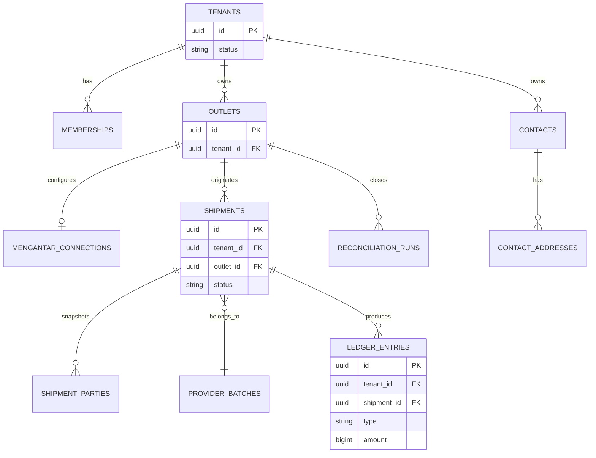

# Data Model: GeraiCUAN

- Status: Draft
- Owner: Engineering owner [TBD owner=Paduka Ongki; due=before first migration]

## Entities
| Entity | Tenant-scoped | Purpose |
|---|---:|---|
| `tenants` | No | Platform customer lifecycle and status. |
| `users` | No | Authenticated principal identity. |
| `memberships` | Yes | User role in one tenant: `TENANT_ADMIN` or `OPERATOR`. |
| `outlets` | Yes | Tenant shipment origin and operational pickup identity. Its `default_pickup_address_id`/`default_origin_area_id` pair and labels are the denormalized mirror of the outlet's default `outlet_pickup_points` row. |
| `outlet_pickup_points` | Yes | The outlet's Mengantar pickup addresses as a list: provider `pickup_address_id`, its derived origin area, their labels, and which entry is the outlet default. |
| `mengantar_connections` | Yes | Outlet private credential reference and non-secret connection metadata; row presence selects `private`, absence selects `platform_default`; never plaintext secrets. |
| `managed_secret_payloads` | Yes | Server-only authenticated-encryption envelope for an outlet's private Mengantar API key, keyed by canonical purpose/reference and encryption-key version; never plaintext or browser-readable metadata. |
| `mengantar_location_cache` | No | Optional bounded cache of provider-authoritative area/pickup identifiers and Indonesian display hierarchy, created only after an accepted address-search contract proves caching is needed. |
| `contacts` | Yes | Reusable sender/recipient directory entry with role tags, normalized contact details, an optional kategori and a per-tenant `contact_number` that addresses its detail page (DATA-19). |
| `tenant_contact_counters` | Yes (no RLS, no runtime privilege) | Contact numbering state per tenant; written only by the before-insert allocator (DATA-19). |
| `contact_addresses` | Yes | One or more reusable addresses for a contact, including selected Mengantar address metadata. |
| `shipment_parties` | Yes | Immutable sender/recipient contact snapshots used for provider payload and label history. |
| `provider_batches` | Yes | Idempotency key, courier, upstream batch ID, queue/status. |
| `provider_order_snapshots` | Yes | Sanitized request/response fields, provider order ID, AWB, fees, `is_paid`. |
| `print_events` | Yes | Shipment label print/reprint event and actor/time. |
| `shipment_invoices` | Yes | Immutable nota for one issued shipment: number, issuer, snapshot document and charge (DATA-14). |
| `provider_order_history_events` | Yes | Courier tracking events per shipment, append-only, both roles read (DATA-18). |
| `tenant_label_settings` | Yes | Per-size choice of which fields the thermal label prints (Informasi label, DATA-17). |
| `tenant_brand_settings` | Yes | Gerai logo (validated bytes), catatan resi, kategori usaha, email CS, website, default label size and switched-off couriers (DATA-20). |
| `tenant_logo_versions` | Yes | Every gerai logo ever saved, content-addressed by SHA-256, append-only; an issued invoice names the version it printed (DATA-20, T-247). |
| `ledger_entries` | Yes | Immutable operational money entry, source transition, effective time, and reversal reference. |
| `reconciliation_runs` | Yes | Daily/monthly tenant reconciliation period, source totals, variance, status, and actor. |
| `platform_announcements` | No (platform-wide) | Info terbaru written by the Admin platform: title, plain-text body, category, pinned, `published_at` (NULL = draft) (DATA-21). |
| `platform_announcement_reads` | Per user | One read receipt per (user, announcement), insert-only (DATA-21). |
| `wilayah_areas` | No (tenant-neutral reference) | Kemendagri kecamatan and kelurahan/desa with an upstream kode pos hint; suggests destination areas while typing, never a destination authority (DATA-22, D-32). |
| `audit_events` | Scope-tagged | Security-sensitive Super Admin/tenant-admin changes. |

## DATA-1 — Isolation invariant
- Owner: Engineering owner

Every tenant-owned table has non-null `tenant_id`; foreign keys and composite uniqueness prevent associations across tenant IDs. Application queries use tenant context; RLS policies use the same tenant identity defense-in-depth.

## DATA-2 — Shipment lifecycle
- Owner: Engineering owner

`DRAFT → ESTIMATED → SUBMISSION_QUEUED → SUBMISSION_UNKNOWN|ISSUED|AWAITING_UPSTREAM_PAYMENT|FAILED`. `ISSUED` requires a provider `cnote_no`. Print events reference issued shipments only.

## DATA-3 — Money and provider snapshots
- Owner: Engineering owner

Store currency as `IDR` and all amounts as whole integer rupiah, except provider settlement evidence (`provider_settlement_items`, T-178), which stores Mengantar's own fractional figures exactly as `numeric(18,4)`. Persist user-declared goods value, provider-returned shipping and insurance values, the COD fee, VAT, and final provider COD amount separately. Final COD always equals the sum of goods, shipping, fee, and VAT. `shipment_cod_totals.cod_formula_version` names the rule a row was written with, and the database checks each version's own arithmetic; a row is never recomputed under a newer version because it records what was submitted to the provider. Version 1 (rows before migration 0048): `service_fee = round_half_up((goods_value + shipping_fee) × 3%)`, `vat = round_half_up(service_fee × 11%)`. Version 2 (T-175, migration 0048): `cod = ceil((goods_value + shipping_fee) × 10000 / 9667)`, `service_fee = round_half_up((cod − goods_value − shipping_fee) × 100 / 111)`, `vat` the remainder. Version 3 (T-186, migration 0050, COD Ongkir): `provider_cod_amount_idr` is the shipping charge alone, `cod_shipping_basis_idr` (NULL on versions 1 and 2, required on 3) is the shipping Mengantar deducts, `provider_cod_amount_idr × 9667 ≥ cod_shipping_basis_idr × 10000`, and `service_fee + vat = round_half_up(provider_cod_amount_idr × 333 / 10000)` split 100/111; the goods + shipping + fee + VAT identity is scoped to versions 1 and 2, so the goods are never part of a version 3 amount. The INSERT policy requires version 3 exactly for a `cod_shipping_only` draft and binds the basis to the selected service's `coalesce(special_price_idr, normal_price_idr, shipping_amount_idr)`. The column defaults to 1 so a writer that names no version is held to the additive rule; the application names 2 (or 3). `scripts/verify-migration-upgrade.mjs` writes a version 1 row before 0048 and proves it survives unchanged. As DATA-11 records for origins, a change to the formula the application computes is incomplete until these checks move with it. Preserve a sanitized estimate/order snapshot tied to the selected service; do not recompute provider shipping or insurance totals.

## DATA-4 — Operational ledger
- Owner: Engineering owner

`ledger_entries` is append-only. Amounts are IDR integers; source event and shipment/provider batch references are mandatory. Corrections create an `ADJUSTMENT` or reversal entry, never modify an existing entry. `COD_PRINCIPAL_COLLECTABLE` is a liability and is never reported as GeraiCUAN revenue. Reconciliation compares ledger/source totals by tenant, outlet, and professional date-range contract.

**COD fee reclassification (T-178, migration 0049, 2026-09-17).** `shipment_cod_totals.service_fee_idr` is Mengantar's COD fee carried to the buyer: Mengantar deducts it at settlement and GeraiCUAN never receives it (evidence: `tests/fixtures/mengantar-cod-identities.json` → `settlement`). Until this change the issuance appended it as `GERAICUAN_COD_SERVICE_FEE_REVENUE` (`REVENUE`). **Effective point:** every issuance ledgered by the release carrying migration 0049 appends it as `MENGANTAR_COD_FEE_COST` (`EXPENSE`), same amount, same source event; the point is per issuance, not a timestamp — an issuance whose `PROVIDER_ORDER_ISSUED` entries already include the revenue type was posted before the change. No historical entry is updated or deleted: `ledger_entries_immutable` (0015) still refuses UPDATE and DELETE, `geraicuan_app` still holds SELECT and INSERT only, and the revenue type stays valid in `ledger_entries_type_valid`, `_type_class_valid`, `_source_event_valid` and `reconciliation_runs_entry_type_valid` so history, its `ADJUSTMENT` reversals and an instance on the previous release during a deploy (which appends it inside the AWB-recording transaction) keep working. Reconciliation classifies each COD issuance's stored fee by that same per-issuance rule, so both types reconcile exactly in a period that straddles the change. `COD_SERVICE_FEE_VAT_PAYABLE` is not reclassified by this change.

**One COD fee, VAT inside it (T-193, D-13, 2026-09-17; no migration).** Mengantar keeps `COD × 0.0333` and the 11% VAT is inside that 3.33%, so VAT was never GeraiCUAN's liability. **Effective point, per issuance:** every issuance ledgered by the release carrying T-193 appends `MENGANTAR_COD_FEE_COST` at `round_half_up(provider_cod_amount_idr × 333 / 10000)` (`mengantarCodFeeIdr`, whatever formula version the totals row has) and **no** `COD_SERVICE_FEE_VAT_PAYABLE`. No historical entry is updated or deleted, and no CHECK moves: the VAT type stays valid in all four constraints so history, its reversals and an instance on the previous release during a deploy keep working. Readers present historical VAT rows (and `ADJUSTMENT`s reversing them) as "PPN dalam biaya COD (dipotong Mengantar)", part of the fee, outside any payable total (`summarizeLedger(...).legacyCodFeeVatIdr`, platform `legacyCodFeeVatIdr`, Keuangan's class column). **Reconciliation** classifies each COD issuance by the entries it already carries: a `GERAICUAN_COD_SERVICE_FEE_REVENUE` entry → the stored `service_fee_idr` as revenue and `vat_amount_idr` as VAT (before T-178); a VAT entry but no revenue entry → the stored service fee as `MENGANTAR_COD_FEE_COST` and the stored VAT (T-178 until T-193); neither → Mengantar's fee as `MENGANTAR_COD_FEE_COST` and no VAT (T-193 on), so a missing fee entry still surfaces on the current type. Known ceiling: a T-178-era issuance that lost only its VAT entry is read as T-193-era and can surface as at most a small fee variance rather than a missing VAT row. `shipment_cod_totals.service_fee_idr`/`vat_amount_idr` keep their per-version CHECK arithmetic and are no longer a displayed fee. **In flight:** a version 1 totals row is immutable and one per shipment (INSERT/SELECT grants, `shipment_cod_totals_shipment_tenant_key`), so it cannot be recomputed as version 2; `ensureCodTotalsForConfirmation` refuses it (`CodTotalsFormulaRetiredError`) unless its order was already attempted at Mengantar, in which case a retry reads the recorded result back and submits nothing.

**COD principal for COD Ongkir (T-186, 2026-09-17).** `COD_PRINCIPAL_COLLECTABLE` is the goods money a courier collects on the seller's behalf. A COD Ongkir issuance (formula version 3) collects a shipping charge only — the goods were paid outside GeraiCUAN — so it appends `COD_PRINCIPAL_COLLECTABLE` at **0**, not the declared goods value and not the charge. The entry is still appended so every COD issuance carries the same entry set and "no goods principal" is a recorded fact. The charge is not principal: Mengantar keeps the shipping (`MENGANTAR_SHIPPING_COST`) and its fee (`MENGANTAR_COD_FEE_COST` + `COD_SERVICE_FEE_VAT_PAYABLE`, together 3.33% of the charge; from T-193 `MENGANTAR_COD_FEE_COST` alone, VAT inside) and remits the seller's difference, which RPT-SHP-COD-DISBURSEMENT-EST-IDR estimates and settlement records. No new entry type was added and no CHECK moved. Reconciliation's source principal counts `goods_value_idr` only for rows whose `cod_formula_version <> 3`, the same rule. Append-only is unchanged. As DATA-11 records, the database checks moved in the same change as the application rule. `scripts/verify-migration-upgrade.mjs` writes a revenue-typed entry and whole-rupiah settlement evidence before 0049 and proves them unchanged after it.

## DATA-5 — Source-of-truth transitions
- Owner: Engineering owner

| Trigger | Required outcome |
|---|---|
| Confirmed COD shipment | Persist selected estimate and calculated COD components; no ledger revenue is recognized yet. |
| Provider AWB issued | Append provider shipping/insurance cost where returned; append the COD fee as `MENGANTAR_COD_FEE_COST` (expense) at `round_half_up(COD × 333 / 10000)`, VAT inside it, only for COD (T-193; before it the stored service fee plus a `COD_SERVICE_FEE_VAT_PAYABLE` row, and before T-178 `GERAICUAN_COD_SERVICE_FEE_REVENUE`). |
| Non-COD unpaid | Mark awaiting upstream payment; no AWB/print and no paid-cost entry until provider confirms recovery. |
| Pay-unpaid success | Persist AWB, append non-COD upstream-payment cost, then allow print. |
| Reconciliation variance | Preserve source totals and append an adjustment/reconciliation entry; never mutate prior ledger entries. |

## DATA-6 — Managed credential invariant
- Owner: Engineering owner

`mengantar_connections` stores no ciphertext or secret fragment. Each active private connection resolves exactly one purpose-bound encrypted payload for the same tenant and outlet. The envelope stores ciphertext, nonce, authentication tag, key version, and timestamps; authenticated additional data binds purpose, tenant, outlet, and canonical reference so rows cannot be replayed across scope. Replacement is transactional and never exposes the prior value. Removing a private connection is allowed only after the platform default is complete and records a redacted audit outcome.

## DATA-7 — Provider location invariant
- Owner: Engineering owner

Persist provider IDs together with their last accepted human-readable label at operational snapshot boundaries. Outlet pickup configuration stores `default_pickup_address_id` with `default_pickup_address_label` and `default_origin_area_id` with `default_origin_area_label`; both labels are null for legacy rows or non-null as one pair. New writes accept only a pickup from the current account-scoped provider response and derive the area ID and both labels from that same response. A cached area row is never sufficient evidence that an ID remains supported; estimate/order behavior remains authoritative. No provider location cache exists. Since D-32 (T-245) a local Kemendagri reference, `wilayah_areas` (DATA-22), suggests areas while typing; it carries no provider ID, no tenant table references it, and only a provider option from a live search is ever stored or verified.

## ERD

## Migration rule
Add `tenant_id` and tenant indexes before any tenant data. Expand-contract migrations only; backfill and constraint enforcement are separate deploy steps. Retention periods are pending privacy review.

## DATA-8 — Market Expansion (Phase 2 Roadmap)
- Owner: Engineering owner

To support market standards (Return to Sender, and originally Net Margin — withdrawn 2026-09-17 by T-177), these schema expansions were planned:
1. **RTS Tracking:** `shipments` table will receive an expanded status enum covering `RTS_QUEUED`, `RTS_IN_TRANSIT`, and `RTS_RECEIVED`. A new `shipment_rts_events` table will record the return timeline.
2. **COGS Tracking — withdrawn 2026-09-17 (T-177).** `shipments.cogs_amount_idr` and `shipment_drafts.cogs_amount_idr` were added for a net-margin KPI. The owner withdrew margin reporting ("Laporan saja"): no application path writes or reads either column any more, existing values are left untouched, and dropping the columns is a separate migration for the migration owner.

### PR-41 — Persisted operational shipment references (superseded by PR-44, migration 0040)

Shipments retain their UUID primary key, composite tenant/outlet foreign keys, URLs and idempotency semantics. New human `public_reference` is immutable and unique, with `created_by_user_id`, numeric `reference_user_number`, full WIB calendar `reference_date`, and `daily_sequence`. Users receive a stable numeric `public_number` starting10000; display widths are minimums, never truncation limits. The reference is e.g.95758-260914-001; counter keys use the full date and concurrent allocation uses one atomic counter-row upsert. YYMMDD is the accepted display; the unique constraint fails closed on century reuse and must be replaced by YYYYMMDD before that horizon.

A private counter table and a narrowly scoped, pinned-search-path PostgreSQL trigger allocate the reference. Runtime actors are checked against server-derived app.user_id and tenant membership; clients cannot set or change reference components or use the counter table. Existing shipments have no reliable creator record: backfill deterministic00000 legacy references ordered by created_at/id within each WIB date, without attributing them to an administrator. Existing UUIDs, snapshots, ledger records, parties, orders and AWBs remain unchanged. Local migration is explicitly authorized; test fresh/upgrade/concurrency and preserve local account data before applying it. No reset/reseed.

## DATA-9 — Provider settlement evidence (PR-43, T-146)

Append-only, tenant-scoped, Tenant Admin RLS (SELECT/INSERT only). No receiver, recipient, phone, address, goods, pickup, name or email column exists on any of these tables; a repository test asserts it.

| Table | Purpose | Key constraints |
|---|---|---|
| `provider_settlement_pulls` | One row per pull: outlet, actor, credential source, provider account key, period, account-wide invoice/order counts, matched counts | `(outlet_id, tenant_id)` → outlets; account key `^[0-9a-f]{64}$`; `period_end > period_start`; `invoice_count`, `order_count` and `unmatched_awb_count` must be NULL unless `credential_source = 'private'` |
| `provider_settlement_items` | Matched per-AWB SETTLEMENT/CHARGE/REFUND evidence: invoice id/number/status/created time, `amount_idr numeric(18,4)`, `cod_amount_idr bigint`, `cod_fee_idr numeric(18,4)`, `shipping_amount_idr numeric(18,4)` (the invoice's `estimatedSpecialPrice`: discounted shipping plus the unrounded COD fee). Migration 0049 (T-178) widened them from bigint / numeric(16,2); every stored value is kept (verified by the upgrade script) and the observation key compares by value | `(shipment_id, outlet_id, tenant_id)` → shipments; `(pull_id, tenant_id)` → pulls; unique `(tenant_id, provider_invoice_id, item_type, cnote_no, invoice_status, amount_idr)`: an identical re-pull adds nothing, while a changed status or corrected amount is a new observation and the review reads the latest per invoice line |
| `provider_order_status_observations` | Latest provider status seen per matched shipment per pull, **and what that report did to the shipment** (T-169) | unique `(pull_id, shipment_id)`; same composite shipment and pull foreign keys; `provider_order_status_observations_transition_valid` |

Migration `0039_provider_settlement.sql` is additive; it also admits `settlement-pull` in `shipment_rate_limits_operation_valid`.

### Delivery-transition decision on the observation (0047 — T-169, 2026-09-16)

`provider_order_status_observations` gains `from_status`, `mapped_status` and `transition_outcome`, all nullable and all written with the observation itself — the table keeps SELECT + INSERT and is never updated, so a decision is stored beside the evidence that caused it rather than in a second table. All three are NULL on rows recorded before 0047, when a pull stored provider evidence and transitioned nothing.

`transition_outcome` is one of `APPLIED`, `UNCHANGED`, `REFUSED`, `NO_LIFECYCLE_STATE` or `UNRECOGNISED`. The check constraint refuses a row that claims a transition it cannot evidence: every non-NULL decision names the state the shipment stood in, and only the two "nothing to write" outcomes may carry no `mapped_status`. `UNRECOGNISED` is how a provider status outside the observed vocabulary is kept — recorded and surfaced, never mapped to the nearest lifecycle state.

**No transition rule is encoded in row-level security, deliberately.** The mapping changes whenever a new provider status is captured, and DATA-11 records what happened the last time a policy hardcoded a value the application computes: T-157 moved the estimate origin to the draft's own pickup point and three INSERT policies did not move with it, so the database refused every COD estimate from a non-default point. The policies here check tenancy; the application owns which state may follow which, bound by `tests/provider-delivery-transitions.integration.test.ts`.

## DATA-10 — Per-tenant shipment numbers (PR-44, T-147)

- `shipments.tenant_number integer NOT NULL`, unique `(tenant_id, tenant_number)`, `>= 10000`, immutable. `shipments.public_reference` is the displayed `PREFIX-number`; CHECK `^[A-Z0-9]{2,5}-[0-9]{5,}$` with its number part equal to `tenant_number`, which together with the number key makes it unique per tenant. UUID primary/foreign keys are unchanged.
- `tenant_shipment_counters (tenant_id PK → tenants ON DELETE CASCADE, last_number NULL|>=10000, shipment_prefix DEFAULT 'GC' CHECK ^[A-Z0-9]{2,5}$, shipment_prefix_locked_at)` holds all numbering state. It is deliberately not on `tenants` (FORCE RLS) and grants the runtime role nothing; only SECURITY DEFINER functions touch it. `last_number` is NULL when a prefix was saved before any shipment.
- **2–3 rule for new prefixes (D-21, T-225, migration 0060).** The column CHECK stays `^[A-Z0-9]{2,5}$`, so every stored prefix remains valid; trigger `tenant_shipment_counters_new_prefix_guard` (`guard_new_shipment_prefix()`, BEFORE INSERT OR UPDATE OF `shipment_prefix`) refuses with `22023` any inserted or changed prefix outside `^[A-Z0-9]{2,3}$`, for every role including the migration owner. A trigger was chosen over `CHECK … NOT VALID` because PostgreSQL checks a NOT VALID CHECK on every later update of a row, and the allocation trigger updates `last_number` on every shipment — a tenant with a legacy 4–5 character prefix would lose shipment creation. Invoice numbers (`INV-` || `public_reference`, DATA-14) and `public_reference` keep their 2–5 CHECKs and need no change. Application: `SHIPMENT_PREFIX_PATTERN` (`src/lib/shipment-number.ts`) is 2–3 for input and suggestions (at most three initials); the route and reference parsers still accept 2–5.
- Lock semantics: saving a prefix locks it; a tenant's very first allocation locks an unsaved `GC` (audited as implicit, with the tenant as `target_id` and `tenant_id` NULL so the automatic row does not pin tenant retention). Later allocations never lock, so migrated tenants and tenants unlocked by a Super Admin keep their one choice until they save.
- Migration `0040_tenant_shipment_numbers.sql` drops PR-41's global `public_reference` uniqueness before backfilling, numbers existing shipments per tenant by `(created_at, id)` from 10000, writes `GC-n`, seeds counters with unlocked prefixes, drops `reference_user_number`, `reference_date`, `daily_sequence`, their constraints and `shipment_reference_counters`, and adds `SHIPMENT_PREFIX_LOCKED` / `SHIPMENT_PREFIX_UNLOCKED` audit actions with a RESTRICTIVE insert guard. `users.public_number` is retained but no longer used for references.

### Draft destination verification and provider field parity (0041, 0042 — 2026-09-16)

`shipment_drafts` gains `shipping_instruction text NULL` (≤500), `dropshipper_name text NULL` (≤120), `dropshipper_phone text NULL` (canonical `0` + Indonesian NSN), `is_hazardous boolean NOT NULL DEFAULT false`, `recipient_address_landmark text NULL` (≤160) and `destination_area_verified_at timestamptz NULL`. Invariants: the dropshipper pair is all-or-nothing under a NULL-safe CHECK, and `destination_area_verified_at IS NULL` means **explicitly unverified** — it blocks provider submission rather than being treated as "probably fine". Rows created before 0041 are therefore unverified by definition; 0042 grants the column-scoped UPDATE (`destination_area_verified_at`, `updated_at`) so the re-verification action can stamp them after the provider re-confirms the stored area id and label. No backfill marks old rows verified.

`shipment_estimate_services` gains `normal_price_idr`, `special_price_idr`, `cod_fee_idr` and `discount_idr` (all `integer NULL`; NULL means the provider omitted the key, never zero), with a non-negative constraint and `special_price_idr <= normal_price_idr`.

Party phones are stored in one canonical Indonesian form (`0` + NSN), so `+62…` and `08…` converge to the same value. Rows written before this rule keep their original spelling; duplicate detection and contact search compare exact strings, so a pre-existing row in the old form will not match the canonical one until it is rewritten.

### Dropshipper fields removed (0044 — 2026-09-16)

`shipment_drafts.dropshipper_name`, `dropshipper_phone` and `shipment_drafts_dropshipper_pair_valid` are **dropped** by owner decision: the product no longer offers "kirim sebagai dropshipper", so the columns leave with the feature rather than lingering as unused state. This is a deliberate destructive migration, approved as such; the fields shipped on 2026-09-16 and no provider order had ever been created through a real transport, so no operational data depended on them. The provider payload keys `is_dropshipper`, `dropshipper_name` and `dropshipper_phone` are removed in the same change.

### Payment method on the draft (0050 — 2026-09-17, T-186)

`shipment_drafts.cod_shipping_only boolean NOT NULL DEFAULT false`, CHECK `shipment_drafts_cod_shipping_only_requires_cod` (`NOT cod_shipping_only OR is_cod`). The method is `NON_COD` when `is_cod` is false, `COD_ONGKIR` when `cod_shipping_only`, else `COD` (`paymentMethodOf`, `src/lib/payment-method.ts`). The default keeps every earlier draft and any previous-release writer exactly what `is_cod` says; no row was updated. `is_cod` stays true for COD Ongkir, so the estimate and order-snapshot policies (which compare `is_cod`) did not need to move; the COD totals INSERT policy did (DATA-3 version 3). The app role holds no UPDATE on the column. `scripts/verify-migration-upgrade.mjs` writes a version 1 and a version 2 COD total and a COD and a non-COD draft before 0050 and proves them unchanged after it.

## DATA-11 — Outlet pickup points (PR-46/PR-47, T-157, migration 0045)

| Table | Contents | Constraints |
|---|---|---|
| `outlet_pickup_points` | One row per provider `pickup_address_id` an outlet may ship from, with `origin_area_id` and both readable labels, and `is_default` | `(outlet_id, tenant_id)` → outlets; `UNIQUE (tenant_id, outlet_id, pickup_address_id)`; partial `UNIQUE (tenant_id, outlet_id) WHERE is_default` so at most one default exists per outlet; opaque ids 1–160 chars, labels 1–320; FORCE RLS with select/insert/update/delete policies; `geraicuan_app` holds SELECT/INSERT/DELETE and UPDATE only on `pickup_address_label`, `origin_area_id`, `origin_area_label`, `is_default`, `updated_at` |

- **Conversion.** Every outlet that already had a complete pickup pair becomes exactly one default pickup point; an incomplete pair converts to zero rows and the outlet stays "needs attention", which is what it already was.
- **Mirror invariant.** `outlets.default_pickup_address_id`, `default_pickup_address_label`, `default_origin_area_id` and `default_origin_area_label` always equal the outlet's `is_default` row, or are all NULL when it has none. Readiness, the estimate origin and the order payload keep reading that one pair.
- **Row-level security follows the same rule (migration 0046).** The INSERT policies on `shipment_estimate_snapshots`, `shipment_cod_totals` and `provider_order_snapshots` check that the snapshot's origin matches `coalesce(shipment_drafts.origin_area_id, outlets.default_origin_area_id)`. They previously required the *outlet* default alone, which — after the application moved to the draft's own point — made the database refuse every COD estimate and order from a non-default pickup point. An application change to which origin a shipment uses is incomplete until these three policies move with it.
- **A pickup point in use cannot be removed.** `removeOutletPickupPoint` refuses while a DRAFT or ESTIMATED shipment still holds that address, because the order payload reads the draft's pickup address at submission: deleting the row would send the provider an address it no longer has, and falling back to the outlet default would ship from a point nobody chose.
- **Per-shipment choice.** `shipment_drafts.pickup_address_id` and `origin_area_id` snapshot the point a shipment leaves from, the same way the destination area is snapshotted. NULL is a pre-0045 draft and falls back to the outlet mirror through `coalesce(...)` in the estimate and order-batch reads. The application resolves the pair against the outlet's own pickup points before writing, so a forged id fails the submission rather than reaching the provider.

## DATA-12 — Self-service sign-up and the approval gate (PR-59–PR-61, D-8, D-9, D-10, T-181–T-183, migration 0051)

| Change | Contents | Constraints and grants |
|---|---|---|
| `tenants.mengantar_credential_policy` | `PLATFORM_DEFAULT_ALLOWED` (default) or `PRIVATE_ONLY` | CHECK `tenants_mengantar_credential_policy_valid`; immutable (trigger `tenants_registration_transition_guard`); the runtime role holds no UPDATE on it |
| `tenants.contact_whatsapp` | The store's WhatsApp from sign-up, `0` + Indonesian NSN (`normalizePartyPhone`); editable by the gerai's Tenant Admin since 0058 (DATA-16) | NULL or `^0[2-9][0-9]{7,11}$`; no runtime UPDATE grant — written only by `set_tenant_contact_whatsapp` |
| `public_auth_rate_limits` | `key` (`scope:hmac-hex`), `count`, `window_started_at` | CHECKs on key shape and count > 0; runtime SELECT/INSERT/UPDATE/DELETE; no RLS (anonymous boundary, no identifier stored) |
| `audit_events_action_valid` | adds `TENANT_SELF_REGISTERED`, `TENANT_REGISTRATION_APPROVED`, `TENANT_REGISTRATION_REJECTED` | RESTRICTIVE `audit_events_tenant_registration_guard`: each only from its owning function |
| `users` | `GRANT UPDATE (email_verified, updated_at)` for Better Auth's verification | nothing else on `users` writable |
| Functions | `register_tenant_self_service`, `register_tenant_self_service_with_prefix` (0060), `review_tenant_registration` (SECURITY DEFINER), `guard_tenant_registration_transition` (trigger) | EXECUTE revoked from PUBLIC; the two definer functions granted to `geraicuan_app` |
| View | `platform_registration_queue` (security_barrier, platform-admin setting): PROVISIONING tenants with the first Tenant Admin's name, email and verification | SELECT to `geraicuan_app` |

- **Existing rows are not updated.** Every existing tenant gets `PLATFORM_DEFAULT_ALLOWED` and NULL WhatsApp through the column defaults; no user, membership, platform role or audit row changes. In particular 0051 does **not** mark existing users verified: an account created before 0051 with `email_verified = false` must verify through the tenant login's resend (or be set by the operator) before it can sign in. The local seed already writes `true`.
- **One registration** writes, in one transaction: `users` (unverified), `accounts` (`credential`, `local:credential`), `tenants` (`PROVISIONING`, `PRIVATE_ONLY`), `memberships` (`TENANT_ADMIN`, `ACTIVE`), one `outlets` row named after the store (the application has no outlet-creation path), and the audit row.
- **Chosen prefix (T-225, migration 0060).** The application calls `register_tenant_self_service_with_prefix(email, owner, hash, store, whatsapp, prefix)` (SECURITY DEFINER, `search_path` pinned, EXECUTE revoked from PUBLIC and granted to `geraicuan_app`). It refuses a prefix outside `^[A-Z0-9]{2,3}$` (`22023`), calls the 0051/0052 function unchanged — so the policies that name `register_tenant_self_service(text,text,text,text,text)` keep their meaning — and, only when a tenant was created, inserts its `tenant_shipment_counters` row with that prefix, `last_number` NULL and **unlocked**: the owner can still change it in Pengaturan, and the first shipment locks it (DATA-10). The 5-argument function keeps its grant (local seed); a tenant created through it starts at `GC`. The server validation (`validateRegistration`) upper-cases the field and, when a stale page posts none, uses the gerai name's initials.
- **Review** moves `PROVISIONING` → `ACTIVE` (approval, owner verified) or → `ARCHIVED` (rejection, reason in audit `metadata.reason`). Nothing else may move a tenant out of `PROVISIONING`.
- **Policies moved for setup** and the shipping policies left ACTIVE-only are listed in `06-TENANT-ISOLATION.md` TEN-5. As DATA-11 records, the application rule and the database rule move together: the approval gate in `withTenantContext` is backed by the unchanged ACTIVE-only shipping policies, and the D-9 resolver refusal by RESTRICTIVE `*_credential_policy` INSERT policies on `shipment_estimate_snapshots`, `provider_batches` and `provider_settlement_pulls`.
- **Upgrade proof.** `scripts/verify-migration-upgrade.mjs` writes ACTIVE, SUSPENDED and legacy PROVISIONING tenants, verified/unverified/suspended users, memberships, a platform role and four audit rows before 0051, refuses to compare fewer than the expected rows, proves them unchanged after, checks the constraints validated, the exact set of `PROVISIONING` policies, ≥30 ACTIVE-only shipping policies and the allocation function, and exercises the runtime role (no self-transition, no forged audit action, verification column writable, name not, registration shape).

## DATA-14 — Shipment invoices (PR-76–PR-80, T-221, planned migration 0055)
- Owner: Engineering owner
- Status: Accepted design 2026-09-26; not built until T-221.

`shipment_invoices` is a tenant-scoped, **insert-only** nota for one issued shipment. It is a charge document, not payment evidence (spec 02 §v3.1; GeraiOS spec 11 BILL-1/3/4).

| Column | Rule |
|---|---|
| `id` uuid PK; `tenant_id`, `shipment_id` NOT NULL | FK `(shipment_id, tenant_id)` → `shipments(id, tenant_id)` ON DELETE RESTRICT; **UNIQUE (`shipment_id`)** — at most one invoice per shipment. |
| `provider_order_snapshot_id` NOT NULL | FK `(id, tenant_id)` → `provider_order_snapshots`; the snapshot must carry `cnote_no` (checked in the issuing statement, which reads it in the same transaction). |
| `invoice_number` text NOT NULL | `'INV-' || shipments.public_reference`; UNIQUE (`tenant_id`, `invoice_number`); CHECK `^INV-[A-Z0-9]{2,5}-[0-9]{5,}$`. Derived, so no counter or gap handling is needed. |
| `issued_at` timestamptz NOT NULL default now(); `issued_by_user_id` NOT NULL | Issuer identity for audit. |
| `template_version` smallint NOT NULL default 1 | Rendering version; a reprint uses the stored version. |
| `document` jsonb NOT NULL | The rendered snapshot: `gerai {name, whatsapp, address}`, `resi`, `courierService`, `sender {name, phone, city}` (the label sender after masking, PR-71), `recipient {name, city}` (no full address or phone — privacy minimum), `items [{name, quantity}]` (≤ 20), `weightGrams`, `deliveryEstimate`. CHECK `jsonb_typeof(document) = 'object'`. |
| `shipping_charge_idr` integer NOT NULL ≥ 0 | The confirmed provider `price` (`provider_order_snapshots.shipping_amount_idr`); for `COD_SHIPPING_ONLY` the charge the courier collects (`provider_cod_amount_idr`), which is what the customer is charged for shipping (audit 2026-09-26: the list price contradicted the collection line). Never the gerai's cost (`provider_charged_shipping_idr`). |
| `insurance_idr` integer NOT NULL ≥ 0 | Returned insurance, 0 when none and for `COD_SHIPPING_ONLY`. |
| `total_idr` integer NOT NULL | CHECK `total_idr = shipping_charge_idr + insurance_idr`. |
| `collection_mode` text NOT NULL | `NON_COD` \| `COD_SHIPPING_ONLY` \| `COD`, copied from the draft (`is_cod`, `cod_shipping_only`). |
| `courier_collection_idr` integer NULL | `provider_cod_amount_idr` for COD modes; NULL for `NON_COD` (CHECK pairs mode and nullability). Shown as "Ditagih kurir ke penerima", never added to `total_idr`. |
| `declared_value_idr` integer NOT NULL ≥ 0 | Information line only. |
| `logo_sha256` text NULL (T-247, migration 0068) | The gerai logo version at issuance: FK (`tenant_id`, `logo_sha256`) → `tenant_logo_versions` RESTRICT. Written by the issuing statement from `tenant_brand_settings.logo_sha256` joined to its kept version; NULL when the gerai had no logo then, and on every invoice issued before 0068 (those render no logo — the logo they printed was never recorded). |

**Grants and RLS.** `GRANT SELECT, INSERT` to `geraicuan_app` only (no UPDATE/DELETE: immutability, BILL-4). RLS policy on `tenant_id = current tenant` for both commands, same helper as `shipment_parties`.

**Issuance.** One statement: `INSERT … SELECT … FROM shipments JOIN provider_order_snapshots … WHERE cnote_no IS NOT NULL AND shipments.status <> 'CANCELLED' ON CONFLICT (shipment_id) DO NOTHING`, then `SELECT` the row. Concurrent requests therefore return the same invoice; a shipment without a resi yields no row and the action returns `NOT_ISSUED`; a shipment Mengantar cancelled (T-238) yields no row and returns `CANCELLED` — decided inside that statement, not by a check before it (T-247, review L2). No provider call is made.

**Reprint.** Renders `document` and the money columns only; nothing is re-read from `tenants`, `contacts` or `shipment_drafts`. Reprints are not persisted in v3.1 (`// lazy:` ceiling — add `invoice_print_events` if the owner needs reprint audit).

## DATA-13 — Mengantar provider field register (PR-84, T-223, T-237)
- Owner: Engineering owner
- Updated: 2026-09-26 (T-237), from the official public docs `api-public.mengantar.com/docs` (read 2026-09-26 through a web fetcher, no API call) plus the earlier read-only comparison with `~/Projects/adsbookcms` / `~/Projects/zvarashop` and this repository's sanitized captures. **No live call was made for this register.**

Evidence: **L** observed live and captured in `tests/fixtures`; **D** documented by Mengantar — the docs' JSON examples (Create Order request/response, Add Time, Pay Unpaid) were quoted as code blocks and their keys are used verbatim; **D-s** documented but read through the fetcher's summary of a table or prose (key names reliable, wording may be paraphrased); **A** assumed (stub or hand-written fixture). An **A** field is never sent to Mengantar in production (PR-84). Nothing below is sent live until TD-14 opens; the one owner-approved live proof is `scripts/probe-mengantar-order-documented.mjs` (D-26, not run).

| Area | Field | GeraiCUAN today | Evidence | Action |
|---|---|---|---|---|
| Estimate | `price` → ongkir; `unsupported` hides service | used | L | keep |
| Estimate | `unsupported_cod`, `coverage_cod`, `unsupportedCodCheckFirstSap` | COD offered unless `unsupported_cod === true`, `coverage_cod === false` or (D-30) `unsupportedCodCheckFirstSap === true`; `unsupported_cod` is absent on JNE, JNECargo, SiCepat, SiCepatCargo captures; `unsupportedCodCheckFirstSap` is a per-service key on SAP, SAPLite, SapCargo (captured `false`) | L (keys), D-s (`unsupported_cod`, `coverage_cod`) | done T-223, T-237 (`tests/mengantar-estimate.integration.test.ts`, `tests/mengantar-order-documented.integration.test.ts`); service hidden on `unsupportedOrigin*`/`unsupportedPickup === true` |
| Estimate | Ninja | removed (owner "ninja hapus aja"): not in `MENGANTAR_COURIERS`, the display map or `public/couriers/`; the quote is dropped by the estimate normalizer (Buat kiriman, Cek tarif) and from stored pre-D-29 snapshots (`isMengantarServiceOffered`, `buildShipmentEstimateOptions`); refused by the order builder (`ORDER_COURIER_UNDOCUMENTED`); a historical shipment renders the plain text "Ninja" (`CourierLogo` text fallback, no image) and an extra recap column | D-s ("Ninja (discontinued 1 September 2026) — … HTTP 400 … `code: \"COURIER_DISABLED\"`") | done T-237 (D-29) |
| Estimate | cargo keys `JNECargo`, `SiCepatCargo`, `SapCargo`, `iDexpressCargo` | ongkir = `cargoPrice ?? price`; normal/special/discount = `cargoEstimatedPrice`/`cargoEstimatedSpecialPrice`/`cargoDiscount` (0 = absent); estimate text `estimate_delivery_cargo`. The regular `estimatedPrice`/`estimatedSpecialPrice` on a cargo key can be the regular service's (SiCepatCargo 6 000/4 200 vs cargo 30 000) | L (values), D-s (`cargoEstimatedPrice` "Cargo total before discount", `cargoEstimatedSpecialPrice` "Cargo discounted total") | done T-237 (`tests/mengantar-order-documented.integration.test.ts`) |
| Estimate | `minimumWeightCargo` | a cargo service is hidden when the parcel (exact grams) is below it; an unreadable value hides it; captured only on SapCargo (`5`) | L, D-s ("shown only for couriers that support cargo shipments") | done T-237 |
| Estimate | `spx` (Shopee Express), `paxel` | quoted (catalogue L) and shown under their names; **not orderable**: the documented `courier` lists of Create Order, Check Shipping Fee and Pay Unpaid contain no SPX or Paxel value, so confirmation is refused `ORDER_COURIER_UNDOCUMENTED` | L (quote), D-s (courier lists) | owner asked "spx → cargo juga aktif" (2026-09-26): needs Mengantar to document the SPX `courier` value (and whether SPX has cargo) |
| Estimate | `codFee` | always 0 in captures; fee is 3.33% of `COD_AMOUNT` | L | keep the 3.33% rule (DATA-3 v3) |
| Order request | wrapper | `POST {BASE_URL}/api/public/{API_KEY}/order`, `Content-Type: application/json`, body `{courier, pickup, orders: [one order]}` (`buildMengantarOrderRequest`); the old bare snake_case array (refused 14/14 live, T-153) is removed | D | T-153: one owner-approved non-COD `dropOff` probe (`scripts/probe-mengantar-order-documented.mjs`) turns this L |
| Order request | `courier` | documented values "JNE", "SiCepat", "Sap", "iDexpress", "JT", "lion", "anteraja", "pos" (`mengantarDocumentedOrderCourier`: our `SAP` → "Sap"); no service key exists in the body | D-s | done T-237; `SAPLite` has no documented way to be ordered → `ORDER_SERVICE_UNDOCUMENTED` |
| Order request | `orders[].cargo` | `true` only for a `<courier>Cargo` service key; the docs name the cargo couriers "(JNE, SiCepat, Sap, iDexpress)" and "Dangerous goods cannot be combined with cargo service" → `ORDER_CARGO_DANGEROUS_GOODS` | D-s (key); the key-to-flag mapping is A | confirm on the first cargo order after T-153 |
| Order request | `pickup.type` / `address_id` / `time_id` / `volume` | `"dropOff"` for DROP_OFF and pre-T-211 drafts; `"scheduledPickup"` with `time_id` (from `POST /time`) and `volume` `volumeMotor`/`volumeMobil`/`volumeTruck` (from `pickup_vehicle`, required for a scheduled pickup) | D (example), D-s ("required for scheduledPickup") | no live `POST /time` transport exists: a scheduled pickup is refused before claim (`ORDER_PICKUP_TIME_UNAVAILABLE`, `…_VOLUME_MISSING`, `…_SLOT_UNAVAILABLE`); the sanctioned fixture transport simulates `/time` |
| Order request | recipient | `customerName`, `customerPhone` (10–15 digits), `customerAddress`, `customerAddressDataId` (area `_id` from `/address/search`) | D | done T-237 |
| Order request | goods | `parcelContent`, `quantity`, `weight` = stored grams ÷ 1000 exactly ("Total weight in kg"; the estimate still asks with the billable whole-kg weight) | D | watch the first live order for a re-price between the ceil-kg quote and the exact weight |
| Order request | sender (masking) | **not sent**: the body has no sender keys, only `dropShipper {id, name, phone}` referencing a saved Mengantar dropshipper, which D-30 keeps off; the masked sender stays on our label only | D-s | none |
| Order request | hazardous, landmark, instruction | `isDangerousGoods` (always sent), `destinationMark`, `deliveryInstruction` (sent only when filled) | D; stored keys `isDangerousGoods`, `destinationMark` L (read side) | done T-237 |
| Order request | COD amount | COD: `COD` = the recorded version 2 total; COD Ongkir: `COD` = ongkir + biaya COD (D-28, version 3 break-even), goods 0; `goodsValue` only for non-COD ("Required for non-COD orders"; `COD` "required if goodsValue is empty"; "COD value = Goods Value + Shipping Fee + COD Fee") | D, D-s | a non-COD draft with goods value 0 sends `goodsValue: 0`, which Mengantar may read as empty — verify live |
| Order request | insurance | not sent | no documented key | none until documented |
| Order response | identity | `_id` → `ORDER_ID` → `order_id`/`id`; `cnote_no` (null when unpaid), `isPaid` boolean (else fails closed) | D (example), L (stored `_id`, `ORDER_ID`) | done T-223/T-237 |
| Order response | `batch` / `batch_id` | the documented example carries both **at the top level and inside each `data[]` item**: `batch` a readable code ("26013014BBQFMM"), `batch_id` an object id. `provider_order_snapshots.provider_batch_id` stores `batch_id` (item, else envelope; `mengantarBatchIdLocation` reports which); item and envelope must agree or the order is `ORDER_RESPONSE_IDENTITY_AMBIGUOUS`; a `batch` code alone stores NULL. **Legacy meaning (T-247, review L8).** Rows accepted between T-223 and T-237 stored `batch` here; no reliable discriminator separates the two (only two documented examples; a shape rule such as "24 lowercase hex" would guess Mengantar's id format and could refuse a real `batch_id`), so none is applied. No such row exists outside test and dev fixtures: GeraiCUAN has never created a live order (`POST /order` is blocked, T-153; issuance runs only on the sanctioned fixture). If one ever appears, pay-unpaid would send a `batch` code as `batch_id`; any refusal or unreadable answer lands the recovery in `PAYMENT_UNKNOWN` (never retried before reconciliation), and nothing is issued | D (example); stored records carry `batch` only — L | done T-237 (supersedes T-223's "store `batch`"); the live probe records the location seen |
| Pay unpaid | request | `{courier, batch_id}` with the documented courier spelling; `batch_id` example "6332f5b98c3ea4bc8e15f72d" (object id) | D | done T-223/T-237; NULL batch refused before claim (`PAY_UNPAID_BATCH_ID_MISSING`) |
| Pay unpaid | response | `{success, data: <number paid>, cnote_no: [...]}` — nothing echoed; one order per batch, so `data === 1` and one AWB, else unknown (`PAY_UNPAID_ORDER_CORRELATION_UNKNOWN` / `…_RESPONSE_SCHEMA_UNKNOWN`) | D | done T-237 (the old parser read an assumed `data: {batch_id, courier, cnote_no}` object; its hand-written fixture was corrected) |
| Concurrency | `409` on JT/Ninja/SiCepat | advisory lock for those three | D | done T-223 (`tests/order-batch.integration.test.ts`): every courier serialized per account; 409 retried ≤ 3 attempts (500/1000 ms), a final 409 → `SUBMISSION_UNKNOWN` `ORDER_PROVIDER_CONFLICT` |
| Status | `status` plain string (RTS, DELIVERED, DELIVERY PROBLEM, PENDING PICKUP); unknown refused | mapped | L | keep; capture an in-transit value when seen |
| Status | Mengantar app "Status Parcel" vocabulary (analysis §9.3: Error, Unpaid Order, Menunggu Penjemputan, Origin gateway, Close by system, Proses gateway, Proses masuk, On delivery, Terkirim (Pending/Completed), Shipment breach, Tertahan, Kendala transportasi, Pengiriman Terkendala, Return Origin, Canceled, Gagal Kirim, Masalah pengiriman, Paket Hilang) | mapped in a separate `PROVIDER_DELIVERY_STATUS_UNVERIFIED_MAP`: trouble → `PROBLEM`, movement and "Terkirim (Pending)" → `IN_TRANSIT`, only "Terkirim (Completed)" → `DELIVERED`, Unpaid Order / Menunggu Penjemputan → no state; same transition graph; anything else stays `UNRECOGNISED` | **UNVERIFIED** — app display text only, never seen in an API `status` | done T-231 (`tests/provider-delivery-vocabulary.integration.test.ts`); move a value to the verified map when captured live |
| Status | "Tanpa update 48 jam / 4 hari" | Histori filters `STALE_48H` / `STALE_4D` over ISSUED/IN_TRANSIT/PROBLEM: latest observation's `last_history_at`, else its `observed_at`, else issuance `resolved_at`; Tenant Admin only (observations are admin-only under RLS, T-146) | L (inputs) | done T-231 (`tests/shipment-queue.integration.test.ts`) |
| Status | documented values (T-238): webhook `status_category` "PENDING PICKUP", "PICKED UP", "ON DELIVERY", "DELIVERED", "UNDELIVERED", "PICKUP FAILED", "RTS", "ACTIVE/WAITING NEXT PROCESS", "ERROR", "CANCELED"/"CANCELLED"; `GET /order` `status` filter `DELIVERED_PENDING`, `DELIVERED_COMPLETED`, `RTS`; example record `status: "active"` | in `PROVIDER_DELIVERY_STATUS_UNVERIFIED_MAP`: PICKED UP / DELIVERED_PENDING → `IN_TRANSIT`, DELIVERED_COMPLETED → `DELIVERED`, UNDELIVERED / PICKUP FAILED / CANCELLED → `PROBLEM`, ACTIVE and ACTIVE/WAITING NEXT PROCESS → no state; the live-verified map is unchanged | D-s (`"active"` D, from the quoted example) | done T-238 (`tests/provider-delivery-vocabulary.integration.test.ts`); move to the verified map when captured |
| Status | `history[{date, desc}]` — "returned only when using `?tracking_id=` or `?order_id=`" | parsed when present (never seen live: the pull uses the list query), with `lastHistory` as the fallback event; stored in `provider_order_history_events` (DATA-18) | D-s (history), L (`lastHistory`) | done T-238 (`tests/mengantar-tracking-t238.integration.test.ts`); per-AWB `tracking_id` reads are not made (no live call) |
| Status | `cnote_no_rts` (return resi) | `provider_order_status_observations.cnote_no_rts` + `provider_order_snapshots.return_cnote_no`; `RTS` + a return resi → `RTS_IN_TRANSIT` | L key (3/100 records, always `null`), value shape unseen; not in the docs | done T-238; nothing documented or captured reports a received return, so `RTS_RECEIVED` stays unreachable (gap; candidate evidence `pod_code` 402 on 96/96 RTS captures — ask Mengantar) |
| Status | `isBreach`, `lastUndeliveredCode`, `claimStatus` (statusApproved/Disapproved/Pending), `ticketStatus` (none/Closed/Replied) | observation columns `is_breach`, `last_undelivered_code`, `claim_status`, `ticket_status`; Detail "Catatan dari Mengantar" (Tenant Admin) | L (`isBreach`, `ticketStatus` also D in the `GET /order` example) | done T-238; no Histori filter |
| Webhook | headers `x-timestamp` (ms) / `x-signature` = hex HMAC-SHA256 of `{x-timestamp}.{raw body}` keyed with the Webhook Secret; body `cnote_no`, `order_id`, `courier`, `status_category`; any 2xx within 5 s; up to 3 retries (~1 s, 5 s, 15 s); "reject anything older than a few minutes" (example 5 min); deliveries "can arrive out of order" | receiver built, **closed by default** (D-30): `MENGANTAR_WEBHOOK_ENABLED=1` + `MENGANTAR_WEBHOOK_SECRET`; platform-default account only | D (test vector and signing code quoted; our HMAC reproduces `05826dec…a111`), D-s (retry/timeout prose) | done T-238 (`tests/mengantar-webhook.integration.test.ts`); capture a real delivery when the account enables it |
| Status | `lastHistory {date "DD-MM-YYYY HH:mm", desc, code}`, `pod_code` | not stored | L | done T-223 (`tests/provider-settlement-repository.integration.test.ts`, `tests/mengantar-settlement.integration.test.ts`): `last_history_desc`, `last_history_at` (WIB → timestamptz), `pod_code` (0056); unreadable → NULL |
| Pickup time | `POST /time` `{address_id, date "mm-dd-yyyy", time}`; `time` one of "9:00 … 18:00"; "at least 90 minutes from current time"; response `data._id` = `time_id` | D-27: GeraiCUAN offers starts 09:00–17:00 (one-hour windows inside 09.00–18.00 WIB; an 18:00 start would end at 19.00 and the 0061 CHECK `^(0[89]\|1[0-7]):00$` refuses it, no migration). `mengantarPickupTimeRequest` re-checks the slot at send time and sends `time` as "9:00"; a legacy 08:00 draft stays valid and shown but is refused at send (`ORDER_PICKUP_SLOT_UNAVAILABLE`) — re-picked on a new shipment. `normalizeMengantarPickupTimeResponse` checks the echoed time/address | D (example), D-s (value list, 90-minute rule); content type of `/time` not confirmed (the AdsBookCMS stub used form-urlencoded) | a live `/time` transport is part of T-153 |

Not ported: AdsBookCMS's JSON-flag status parser (contradicts L evidence), `x-client-source`, cargo filtering. Their tracking sync likely fails on the plain-string `status` — reported to the owner, not fixed here.

## DATA-18 — Tracking history, return resi and webhook observations (T-238, D-30, migration 0063)
- Owner: Engineering owner
- Status: Built 2026-09-26. No live Mengantar call.

`provider_order_history_events` — `id`, `tenant_id`, `shipment_id`, `outlet_id` (FK (`shipment_id`, `outlet_id`, `tenant_id`) → `shipments`, RESTRICT), `occurred_at` (courier time, WIB → timestamptz), `description`, `source` `HISTORY` | `LAST_HISTORY`, `created_at`. UNIQUE (`tenant_id`, `shipment_id`, `occurred_at`, `description`): a re-pull appends nothing (`INSERT … ON CONFLICT DO NOTHING`).

- **Both roles read it (decision).** Observations stay Tenant Admin evidence (T-146: they carry transition outcomes and sit beside settlement money). The courier's journey is operational — an operator packing, answering a buyer or receiving a return needs it — so the history table has its own policy: SELECT for any ACTIVE member (ACTIVE user) of an ACTIVE tenant; INSERT only for an ACTIVE Tenant Admin (only the status pull writes); no UPDATE/DELETE grant; FORCE RLS.
- **PII.** `description` is courier free text and can name the receiver ("DELIVERED TO [BUDI | …]"); both roles already see the receiver's name, phone and address on the shipment, so no new exposure. It is cleaned exactly like `last_history_desc` (control characters → space, whitespace collapsed, ≤ 500 characters) and a CHECK refuses control characters and empty or over-long text. No phone, address or photo key (`lastHistory.photo1…8`) is read.
- **Return resi.** `provider_order_snapshots.return_cnote_no` (runtime `UPDATE (return_cnote_no)` grant under the existing active-member UPDATE policy) is written by the pull only when a value is reported; an absent value never clears it; each observation keeps what it saw in `cnote_no_rts`. Shown on Detail, Cek resi and Retur for both roles.
- **Observation changes.** `pull_id` nullable; `source` `PULL` (default; every pre-0063 row) | `WEBHOOK`; `provider_event_at` (webhook `x-timestamp`); CHECK: a pull row has a pull and no event time, a webhook row the reverse. Partial UNIQUE (`tenant_id`, `shipment_id`, `provider_event_at`, `provider_status`) WHERE `source = 'WEBHOOK'` makes a retried delivery a no-op. Attention columns `cnote_no_rts`, `last_undelivered_code`, `is_breach`, `claim_status`, `ticket_status` (NULL when absent or unreadable; Tenant Admin only like the rest of the row). The transition CHECK gains `SUPERSEDED` (a webhook delivery older than one already recorded is kept as history, never applied).
- **Webhook write path.** `record_mengantar_webhook_event(account_key, cnote_no, provider_status, mapped_status, recognised, event_at)`: SECURITY DEFINER, `search_path` pinned, EXECUTE only for `geraicuan_app`. Validates its arguments (`22023`), resolves the AWB to exactly one shipment on an order of that account key in an ACTIVE tenant (else `NOT_FOUND`), sets `app.tenant_id`, locks the shipment, decides with `provider_delivery_outcome` (the SQL twin of `decideProviderDeliveryTransition`, parity-tested over every state pair), appends one WEBHOOK observation and writes `shipments.status` only on APPLIED. Owner-only policies (needed for a non-superuser owner under FORCE RLS): SELECT on `provider_order_snapshots`, `provider_batches`, `tenants`, `shipments`; UPDATE on `shipments` and SELECT/INSERT on observations limited to the tenant the function set, inserts only `source = 'WEBHOOK'`. Trust boundary: the route verifies the signature before the call; the function trusts its caller (the runtime role) for the mapping, as the pull path does. The route passes the platform-default account key only (one secret).
- **Unpaid cancellation (T-247, review M1, D-33, migration 0068).** `AWAITING_UPSTREAM_PAYMENT → CANCELLED` joins the transition graph in both twins (`ALLOWED_TRANSITIONS` and `provider_delivery_outcome`, replaced in 0068). Unpaid recovery refuses a batch whose shipment is `CANCELLED` although its order snapshot still reads unpaid (`prepareUnpaidRecoveries` joins `shipments.status`). **Known gap:** neither the pull nor the webhook can reach an unpaid order today — both match on the AWB (`cnote_no`), which an unpaid order does not have (CHECK `provider_order_snapshots_unpaid_state_valid`), and the pull skips records without one. Reaching it needs matching by the provider order id, whose webhook form (`order_id`) is documented but not captured (TASKS T-247 open item).
- **Webhook ordering and dedupe (known limit, T-247 L6).** Supersession and the retry dedupe key use the delivery's `x-timestamp`, the time Mengantar *sent* that delivery, not when the courier event happened: the documented body (`cnote_no`, `order_id`, `courier`, `status_category`) carries no event time. A retry that Mengantar re-signs with a new timestamp is recorded again (harmless: `UNCHANGED`), and two events sent out of courier order are ordered by send time. If Mengantar documents a body event time, use it instead. The receiver is closed by default (D-30).
- **Upgrade proof.** `scripts/verify-migration-upgrade.mjs` writes a pre-0063 pull observation and checks it unchanged (plus `source = 'PULL'`, new columns NULL), both CHECKs validated, the history grants/RLS, a WEBHOOK row with a pull refused (`23514`), the function's `NOT_FOUND`/`22023`; nothing left behind.

## DATA-15 — Pickup vehicle (PR-90, D-19, T-232, migration 0057)
- Owner: Engineering owner
- Status: Built 2026-09-26.

`shipment_drafts.pickup_vehicle text NULL` — `MOTOR` | `MOBIL` | `TRUK` (CHECK `shipment_drafts_pickup_vehicle_known`), and NULL unless `handover_type = 'PICKUP'` (CHECK `shipment_drafts_pickup_vehicle_pickup_only`). Optional: a pickup without a chosen vehicle stores NULL; a drop-off never stores one. Written once at draft insert and part of the replay comparison (another vehicle is another submission); never UPDATEd, so no column grant was added (the 0008 table-level INSERT/SELECT covers it). Shown in the Buat kiriman form, saved view, summary rail and Detail kiriman "Penyerahan" through `handoverSummary`. Since T-237 the documented order builder maps it to `pickup.volume` (`volumeMotor`/`volumeMobil`/`volumeTruck`, required for a scheduled pickup); nothing is sent live until T-153 (DATA-13). Every pre-0057 row is NULL and satisfies both CHECKs (validated; `scripts/verify-migration-upgrade.mjs`).

## DATA-16 — Gerai WhatsApp edit (T-233, migration 0058)
- Owner: Engineering owner
- Status: Built 2026-09-26.

`tenants.contact_whatsapp` (DATA-12) is changed only through `public.set_tenant_contact_whatsapp(requested text)`, a SECURITY DEFINER function (`search_path` pinned, EXECUTE revoked from PUBLIC and granted to `geraicuan_app`). It checks the same pattern as the column CHECK (`22023` otherwise), requires `app.user_id` to be an ACTIVE Tenant Admin (ACTIVE user) of `app.tenant_id` whose tenant is ACTIVE or PROVISIONING (store setup, PR-60; `42501` otherwise), locks the row, writes only that column and `updated_at`, and appends `TENANT_CONTACT_UPDATED` (actor role `TENANT_MEMBER`, target the tenant, metadata `{field, hadPrevious}` — no phone numbers). Saving the current value is a no-op without an audit row.

- **Why a function, not a grant.** The runtime role holds `UPDATE (name, status, updated_at)` on `tenants` for the Super Admin path; a tenant-admin UPDATE policy would have let a Tenant Admin rename or reactivate their tenant, because row policies cannot limit columns. The runtime role gets no UPDATE on `contact_whatsapp` (asserted by `tests/tenant-isolation-posture`).
- **Policies.** `tenants_contact_whatsapp_function_update` (PERMISSIVE UPDATE for the function owner only, needed when the owner is not a superuser/BYPASSRLS role, FORCE RLS since 0034); RESTRICTIVE `audit_events_tenant_contact_guard` lets only the function owner append the new action. `audit_events_action_valid` gains `TENANT_CONTACT_UPDATED`; every existing row still passes.
- **Snapshots stay.** Issued invoices keep the number in `document.gerai.whatsapp` (DATA-14); existing shipments keep their `shipment_parties` sender. Invoices issued later and new shipments whose sender is "Alamat gerai" use the new number.
- **Upgrade proof.** `scripts/verify-migration-upgrade.mjs` compares every tenant and audit row before and after 0058/0059 and probes the runtime role (admin save accepted, invalid `22023`, direct UPDATE `42501`, nothing left behind).

## DATA-17 — Label field settings (PR-86, T-229, migration 0059)
- Owner: Engineering owner
- Status: Built 2026-09-26.

`tenant_label_settings` — PK (`tenant_id`, `label_size`), FK `tenant_id` → `tenants` ON DELETE RESTRICT; `label_size` `10x15` | `10x10` (CHECK); booleans `show_sender_address`, `show_sender_phone`, `show_recipient_name`, `show_recipient_phone`, `show_recipient_address_detail` (default true) and `show_return_warning` (default false); `updated_by_user_id` (non-blank), `created_at`, `updated_at`.

- **Defaults = the label before 0059.** No row for a size means the defaults (`DEFAULT_LABEL_FIELDS`, `src/lib/label-fields.ts`), so every existing tenant prints exactly as before until a Tenant Admin saves. The migration writes no rows.
- **No pickup-identity column.** The Mengantar pickup identity is never printable (PR-71); there is nothing to switch on.
- **Grants and RLS.** `SELECT, INSERT` plus `UPDATE` on the six choices, `updated_by_user_id` and `updated_at` only (tenant and size are immutable). FORCE RLS: SELECT for any ACTIVE member (ACTIVE user) of the current tenant (ACTIVE or PROVISIONING), so both roles' label prints read it; INSERT and UPDATE only for an ACTIVE Tenant Admin of the current tenant with `updated_by_user_id = app.user_id`. Writes are an upsert of both sizes (`saveTenantLabelFields`).
- **Printing.** `LabelSheet` takes both sizes and applies the print context's size: sender phone/address hidden from the sender line (the ` · ` goes with the address); recipient name/phone hidden from the name line; address detail off prints `formatCityProvince` (city, province) instead of the area line and street; the warning replaces the footer's issue time ("Sebelum retur, konfirmasi dulu ke pengirim · Nomor kiriman …", measured one 7 pt line with a 13-character reference). Label geometry and `label.css` are unchanged. The label page and the batch view (`/app/label/cetak`) load it in their tenant transaction.

## DATA-20 — Gerai brand, Mitra kurir and pickup notes (T-243, migration 0065)
- Owner: Engineering owner
- Status: Built 2026-09-26.

`tenant_brand_settings` — PK `tenant_id` → `tenants` ON DELETE RESTRICT; nullable `business_category` (CHECK `FASHION`, `BEAUTY`, `FOOD`, `ELECTRONICS`, `HEALTH`, `OTHER`), `label_note` (1–60 chars, trimmed, no control characters), `cs_email` (≤ 254, `local@domain.tld`), `website` (≤ 200, `https://` only); `default_label_size` `10x15` | `10x10` (default `10x15`); `disabled_couriers text[]` (default empty, ≤ 32); the logo as `logo_bytes bytea` + `logo_mime` (`image/png` | `image/jpeg` | `image/webp`) + `logo_sha256` (64 hex) + `logo_updated_at`, all four NULL together (CHECK) and ≤ 204 800 bytes; `updated_by_user_id` (non-blank), `created_at`, `updated_at`.

- **Logo validation.** The Server Action sniffs the type and pixel size from the magic bytes (`sniffLogo`, `src/lib/gerai-settings.ts`; no image library): PNG, JPEG or WebP only, the declared type must match, ≤ 200 KB, ≤ 1000 × 1000 px; SVG and anything else is refused. The validated original is stored; nothing is re-encoded.
- **Serving.** Only `GET /app/brand/logo` returns the bytes: tenant from the session (401 without one, 404 without a logo), `Cache-Control: private, no-cache`, `ETag` = the SHA-256, `304` on `If-None-Match`, `X-Content-Type-Options: nosniff`, `Content-Security-Policy: default-src 'none'; sandbox`. `?v=` (first 16 hex of the hash) only busts caches; there is no tenant id in the URL.
- **Grants and RLS.** Same shape as DATA-17: `SELECT, INSERT` plus column `UPDATE` on everything except `tenant_id` and `created_at`; FORCE RLS, SELECT for any ACTIVE member of the current tenant (both roles print the logo), INSERT/UPDATE only for an ACTIVE Tenant Admin with `updated_by_user_id = app.user_id`. No row means no logo, no catatan, 10 × 15 and every courier offered.
- **Label switches.** `tenant_label_settings` gains `show_courier_logo`, `show_gerai_logo`, `show_label_note` (default true, column UPDATE granted). The gerai logo and catatan print only when the switch is on **and** the value exists; the courier print logo (`public/couriers/print/<courier>.svg`) falls back to bold text for a courier without one. None moves a label row (DATA-17 geometry).
- **Mitra kurir.** `disabled_couriers` holds `MengantarCourier` codes; `filterTenantCourierServices` removes their services where Cek tarif (`checkShippingRates`) and Buat kiriman (page loader and the issuance step on the detail page) present options. At least one courier stays on; an unknown courier in a quote is kept.
- **Pickup notes.** `outlet_pickup_points` gains nullable `pic_name` (1–80), `pic_phone` (national `0…`, 9–13 digits), `pickup_schedule` (1–120), `driver_access_note` (1–240), CHECK `outlet_pickup_points_notes_valid`, column UPDATE granted. Internal only — never part of a Mengantar request.
- **Upgrade proof.** `scripts/verify-migration-upgrade.mjs` applies 0065 over existing tenant, label and pickup rows and checks they are unchanged, plus runtime probes (admin write accepted, operator write and invalid values refused).
- **Logo versions (T-247, review L3, migration 0068).** `tenant_logo_versions` — PK (`tenant_id`, `sha256`), `tenant_id` → `tenants` RESTRICT, `bytes bytea` (1–204 800), `mime` (PNG/JPEG/WebP), `created_by_user_id` (non-blank), `created_at`. `saveTenantLogo` inserts the version (`ON CONFLICT DO NOTHING`) in the same transaction as the brand row; replacing or removing the logo never deletes a version. 0068 backfills each existing logo as its first version. Grants `SELECT, INSERT` only (append-only); FORCE RLS: SELECT for any ACTIVE member of the current tenant, INSERT for an ACTIVE Tenant Admin with `created_by_user_id = app.user_id`. Served by the same route with `?sha=<64 hex>` (tenant from the session, 404 for a malformed, unknown or other tenant's sha; `Cache-Control: private, max-age=31536000, immutable`, since a version never changes). `// lazy:` versions are never pruned; a gerai that re-uploads often keeps every ≤ 200 KB logo — prune versions no invoice references if storage ever matters.

## DATA-19 — Contact numbers, kategori and shipment attribution (T-241, migration 0064)
- Owner: Engineering owner
- Status: Built 2026-09-26.

- **`contacts.contact_number integer NOT NULL`**, unique `(tenant_id, contact_number)` (`contacts_tenant_number_key`), CHECK `>= 1`. It is the only contact identifier in a URL: `/app/kontak/pengirim/<n>` and `/app/kontak/penerima/<n>` (spec 10 §11 — never a name or phone; the UUID stays the primary/foreign key and the Buat kiriman selection key). Allocation mirrors DATA-10: `tenant_contact_counters (tenant_id PK → tenants ON DELETE CASCADE, last_number >= 1)` holds the state, carries no RLS and grants the runtime role nothing; trigger `contacts_allocate_number` (BEFORE INSERT, `allocate_contact_number()`, SECURITY DEFINER, `search_path` pinned, EXECUTE revoked) upserts the counter and **overwrites any supplied number**. The counter row lock serializes concurrent inserts per tenant; the contact's own RLS WITH CHECK still decides the insert, and a refused insert rolls its allocation back. The runtime role has no UPDATE grant on `contact_number` (0035's column-scoped grants), so a number never moves. Numbers are never reused (an archived contact keeps its number).
- **Backfill.** 0064 locks `contacts`, numbers existing rows per tenant by `(created_at, id)` from 1, seeds one counter per tenant that has contacts, then sets NOT NULL and adds the constraints. `scripts/verify-migration-upgrade.mjs` proves the order (a `created_at` tie broken by id), the counters, that no other contact value changed, and the runtime probes (insert numbered, kategori set, bad kategori `23514`, moving a number or reading counters `42501`).
- **`contacts.category text NULL`**, CHECK `contacts_category_valid`: NULL or one of `PIC_UTAMA`, `STAF_GUDANG`, `DROPSHIPPER`, `PENGRAJIN`, `OPERASIONAL_CABANG`, `ADMIN_PENGIRIMAN`, `RESELLER`, `PELANGGAN_TETAP`, `PEMBELI_BARU` (labels in `src/lib/contact-category.ts`). Runtime UPDATE is granted on this column. Set on create and on the detail's Kontak card; the Peran card omits the field and leaves it unchanged.
- **Primary address.** "Jadikan utama" (`setPrimaryContactAddress`) locks the active contact, clears `is_primary` on its other addresses and sets it on the chosen active address in one transaction, so a contact keeps exactly one primary.
- **Shipment attribution rule (read-only, no schema).** `shipment_parties` stores an immutable snapshot and **no contact id**, so a shipment is attributed to a contact when, **in the same tenant**, its party row of the page's role (`SENDER` on Pengirim, `RECIPIENT` on Penerima) has the same **national phone number** as the contact: digits only, a leading `62` or `0` removed — the rule `checkDuplicateShipment` already uses, so a `+62…` snapshot matches a `08…` contact. Consequences: a shipment made by typing the same number counts even if the contact was not picked; two contacts sharing a number show the same shipments; a contact whose phone changed shows the shipments of its current number. Every attributed shipment counts, drafts included (SHP-CREATED's basis). Reads: `src/db/contact-shipment-repository.ts` (`loadContactShipmentCounts`, `loadContactShipmentSummary`, `loadContactShipmentHistory`), each with the table's own `tenant_id` predicates; metrics CON-SHP-* in spec 19. No Mengantar data or score (D-30). `// lazy:` the phone expression has no index; add an expression index if a tenant's history makes the list slow.

## DATA-21 — Info terbaru: platform announcements and read receipts (T-244, PR-91, D-31, migration 0066)
- Owner: Engineering owner
- Status: Built 2026-09-26.

- **`platform_announcements`** — platform-wide content, not tenant-owned: `id uuid`, `title` (CHECK 1–120 trimmed characters, no control characters), `body` (plain text, CHECK 1–2,000 trimmed characters, line feed the only control character; rendered as escaped text with line breaks, never HTML/markdown), `category` (CHECK `FITUR_BARU`, `INFO_KURIR`, `JADWAL`, `PEMELIHARAAN`, `LAINNYA`; labels in `src/lib/announcements.ts`), `pinned boolean`, `published_at timestamptz NULL` (NULL = draft; publishing an already-live row keeps its first publication time), `created_by` → `users` (RESTRICT), `created_at`, `updated_at`; index on `published_at`.
- **`platform_announcement_reads`** — PK `(user_id, announcement_id)`, `read_at`; both FKs `ON DELETE CASCADE`. Unread = published announcements without the caller's receipt (sidebar badge, Dasbor line).
- **Grants and RLS (FORCE).** Runtime `geraicuan_app`: SELECT on announcements, SELECT+INSERT on receipts, no UPDATE/DELETE anywhere. Policies: an ACTIVE member of an ACTIVE or PROVISIONING gerai (tenant context) reads published rows only; the platform context of an active `SUPER_ADMIN` reads every row; receipts are visible and insertable only for `app.user_id` and only for a published announcement.
- **Writes.** Only through SECURITY DEFINER `save_platform_announcement(target, title, body, category, pinned, publish)` and `unpublish_platform_announcement(target)`: each re-checks `app.platform_admin = 'true'` and an active `SUPER_ADMIN` (else SQLSTATE 42501) and appends the audit event (`ANNOUNCEMENT_SAVED` / `ANNOUNCEMENT_PUBLISHED` / `ANNOUNCEMENT_UNPUBLISHED`, target type `PLATFORM`, metadata without the body) in the same statement. A write policy admits only the functions' owner; restrictive `audit_events_announcement_guard` keeps the runtime role from forging the three actions. The audit action CHECK is re-created as a superset.
- **Evidence.** `tests/announcements-t244.integration.test.ts` (member reads published only, per-user read state, member write/receipt/audit forgery refused, publish/edit/unpublish audited, invalid content refused); `scripts/verify-migration-upgrade.mjs` 0066 probes.

## DATA-22 — Wilayah reference: kecamatan, kelurahan/desa and kode pos (T-245, D-32, migration 0067)
- Owner: Engineering owner
- Status: Built 2026-09-26 (dev and test databases); production import waits on the `pg_trgm` release gate (spec 15).

- **`wilayah_areas`** — public government reference data, tenant-neutral by construction (no `tenant_id`; spec 06). One row per kecamatan (`level` 3, code `PP.KK.CC`) and per kelurahan/desa (`level` 4, code `PP.KK.CC.DDDD`): `code` PK, `district_code`, `regency_code`, `village_name`/`village_kind` (`KELURAHAN` for village digit 1, `DESA` for 2 and 3 = desa adat; NULL at level 3), `district_name`, `regency_name` (as published, "Kabupaten …" / "Kota …"), `regency_kind` (`KAB` for KK 01–69, `KOTA` for 71–99; the import refuses a name that disagrees), `province_name`, `postal_code` (NULL or `^[1-9][0-9]{4}$`; level 4 only), `search_text` (normalized lower-case ASCII words with a leading space, so a word-start match is `LIKE '% word%'`), `name_search`, `district_search`, `dataset_version`. CHECKs pin the level shape, code format, kinds, kode pos format and search-text shape.
- **Indexes.** GIN `gin_trgm_ops` on `search_text` (`pg_trgm`, created by the migration with `CREATE EXTENSION IF NOT EXISTS`); partial btree on `postal_code`.
- **Grants and RLS (FORCE).** Runtime `geraicuan_app`: SELECT only; `wilayah_areas_read` admits every row. `wilayah_areas_owner_write` admits writes only for the table owner (the migration role running the import); INSERT/UPDATE/DELETE by the runtime role fail `42501`.
- **No authority.** A wilayah row never carries, implies or substitutes for a Mengantar area id. `contact_addresses`, `shipment_drafts` and `destination_area_verified_at` are written only from a provider option validated by `validateMengantarDestinationAreaSelection`, exactly as before. Kode pos is upstream help text; the provider `ZIP_CODE` stays the stored label's ZIP. No wilayah code or kode pos is stored on a contact address (owner decision 2026-09-26; revisit for RTS-by-area reporting).
- **Source and refresh.** `data/wilayah/` vendors `cahyadsn/wilayah` `db/wilayah.sql` (commit `0d1237a5eef926629c69d287cf2282006144f4fa`; README: Kepmendagri 300.2.2-2430/2025, file header still cites 2138) and `cahyadsn/wilayah_kodepos` `json/wilayah_kodepos.min.json` (commit `ba8497156c5cc9bcbfc527f7b8875d403eda2354`, aligned to 2138/2025, completeness flagged unverified upstream) as gzip TSV with both MIT licences and `SOURCE.json` (upstream and vendored SHA-256, counts). Published counts: 38 provinsi, 514 kab/kota, 7,285 kecamatan, 83,762 kelurahan/desa (8,496 kelurahan + 75,266 desa); all 83,762 carry a kode pos. `npm run wilayah:import` verifies checksums and counts, validates every row (unique codes, parents present, kind by code, name bounds, kode pos format and target), then replaces the rows in one transaction and asserts row count and an md5 content fingerprint before COMMIT; a re-run changes nothing. Refresh = `node scripts/wilayah-vendor.mjs <wilayah checkout> <kodepos checkout> "<decree>"` on new pinned checkouts, review the diff, then the import (spec 15). Nothing tenant-owned references a code, so a refresh cannot break a stored address.
- **Search.** `searchWilayahAreas` (`src/db/wilayah-repository.ts`): every query word must start a word of the row; order = exact kode pos, the row's own name equal to / starting with the query, the query naming the row plus more words, rows inside a matching kecamatan, the rest; kecamatan before kelurahan/desa; limit 20. A query of only "kab"/"kota" is refused (it matches most of the table).
- **Measured (full import, dev DB 55461, runtime role).** 91,047 rows; first load: heap 24.5 MB, trigram index 14.1 MB, 44.4 MB total. EXPLAIN ANALYZE, median of 5 (planning + execution): named kecamatan/kelurahan/kode pos queries 2.0–9.0 ms (e.g. `coblong` 3.4, `dago bandung` 5.0, `40135` 2.4, `kab bekasi` 7.2); bare province words ≤ 36 ms median (`jawa` 35.6, max 39.7). Bitmap index scan on the trigram index in every case.
- **Evidence.** `tests/wilayah-t245.integration.test.ts` (validation refusals, vendored checksum refusal, idempotent one-transaction load with rollback, runtime SELECT-only, ranking, Kab./Kota disambiguation, shared kecamatan names, kode pos lookup, resolver strictness, authority unchanged); `scripts/verify-migration-upgrade.mjs` 0067 probes.

