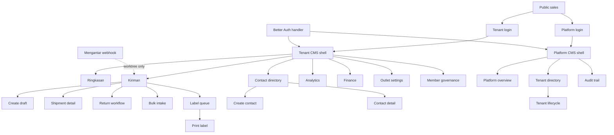

# AI Development Sitemap and Route Ownership Map

This is the implementation navigation index for GeraiCUAN. It helps an AI or
developer find the correct page, authorization boundary, data owner, mutation,
state file, test, and canonical specification before changing code.

It is not a product-requirement source and it is not an XML/SEO sitemap.
Requirements remain in 02-PRD.md, screen behavior in
17-UX-FLOWS-SCREEN-CONTRACTS.md, data ownership in 05-DATA-MODEL.md,
authorization in 07-IAM-RBAC-ABAC.md, security in 12-SECURITY-ARCHITECTURE.md,
and execution status in the root TASKS.md and STATUS.md. If this index conflicts
with those documents or the route files, the canonical document and repository
disk win.

## 1. Snapshot and maturity rules

- Audited: 2026-09-07.
- Framework: Next.js App Router 16.3.3, React 19.2.8.
- Inventory: 22 UI pages, three committed Route Handlers, and one new
  worktree-only webhook handler.
- Shared UI: Tailwind CSS and copied shadcn/ui components.
- Server model: Server Components by default; interactive forms are bounded
  client leaves; Server Actions and Route Handlers are remotely reachable trust
  boundaries.
- Tenant data: every read and mutation must use the server-derived user,
  tenant, and target outlet/object scope through withTenantContext.
- Platform data: every read and mutation must pass resolvePlatformAccess and
  use the restricted platform context.

Maturity labels used below:

| Label | Meaning |
|---|---|
| COMMITTED | Present at HEAD e3bebe9 and part of the previously reviewed route surface. |
| MODIFIED | Committed route whose supporting behavior currently has uncommitted worktree changes. Re-verify before claiming it works. |
| WORKTREE | New uncommitted route or handler. It is discoverable for development but is not release-reviewed or production-ready. |
| RELEASE-GATED | Code exists, but live Mengantar mutation remains disabled until separately approved and verified. |

Never infer maturity from a checked task alone. Confirm git status, STATUS.md,
the relevant delivery-ledger run, and executable evidence.

## 2. Route hierarchy



## 3. Shell, role, and navigation contract

| Scope | Layout and access owner | Navigation groups | Actor |
|---|---|---|---|
| Public | src/app/layout.tsx | Sales page links only | Unauthenticated visitor |
| Tenant CMS | src/app/app/layout.tsx and src/lib/cms-auth.ts | Utama; Operasional; Wawasan; Administrasi | Active Tenant Admin or Operator membership |
| Platform CMS | src/app/platform/layout.tsx and src/app/platform/platform-access.ts | Platform | Active Super Admin only |

Tenant navigation is owned by src/lib/cms-shell-navigation.ts:

- Utama: Ringkasan.
- Operasional: Kiriman, Retur (RTS), Kontak.
- Wawasan, Tenant Admin only: Analitik, Keuangan.
- Administrasi, Tenant Admin only: Outlet & koneksi, Anggota & akses.
- Impor and Label are contextual shipment destinations. They intentionally keep
  Kiriman selected instead of adding top-level navigation.
- Detail, create, and print pages inherit the nearest parent destination.
- Hiding a navigation item is not authorization. Every page, Server Action,
  Route Handler, and repository target must enforce authority again.

## 4. Public and authentication pages

| Route | Source | Actor and primary job | URL state and entry/exit | Server boundary and actions | Required states | Maturity |
|---|---|---|---|---|---|---|
| / | src/app/page.tsx | Visitor evaluates GeraiCUAN and chooses the correct login scope. | Entry from public URL; exits to /login/tenant or /login/super-admin. | No CMS read or mutation. Must never render shipment, provider, contact, finance, analytics, or tenant data. | Marketing content, keyboard-visible login links, responsive layout. | COMMITTED |
| /login/tenant | src/app/login/tenant/page.tsx | Tenant Admin or Operator authenticates into tenant scope. | Accepts only notice=session-required or notice=access-unavailable; success replaces navigation to /app. | Client POST to /api/auth/sign-in/email with x-geraicuan-login-scope=tenant. Better Auth and the session hook verify the active CMS principal before session persistence. | Empty form, pending, generic invalid credentials, access notice, local-only demo fill, successful redirect. | COMMITTED |
| /login/super-admin | src/app/login/super-admin/page.tsx | Super Admin authenticates into platform scope. | Same bounded notice values; success exits to /platform. | Same Better Auth endpoint with x-geraicuan-login-scope=platform; tenant membership cannot synthesize platform authority. | Same login states, with platform-specific destination and copy. | COMMITTED |

Shared login interaction owner:
src/app/login/_components/login-form.tsx. Authentication configuration owners:
src/lib/auth.ts, src/lib/auth-config.ts, and src/lib/cms-principal.ts. Primary
evidence: tests/public-auth-render.integration.test.ts,
tests/auth-session-boundary.integration.test.ts, and
tests/auth-config.integration.test.ts.

## 5. Tenant CMS pages

### 5.1 Command center and shipment operations

| Route | Source and navigation | Actor and primary job | Canonical URL state | Reads and mutation owners | State boundary and completion | Maturity |
|---|---|---|---|---|---|---|
| /app | src/app/app/page.tsx; Ringkasan | Both tenant roles choose the next permitted daily action from shallow period analytics, readiness, exceptions, and recent shipments. | rentang, dari, sampai, tz, outlet, support; draft redirects to /app/pengiriman/baru?draft=validated-id. Invalid scope is removed rather than broadened. | src/db/tenant-dashboard-repository.ts and outlet-readiness-repository.ts. Read-only; links to create, queue, analytics, finance, or settings according to role. | Parent loading/error; first-run readiness, healthy empty, filtered empty, partial/stale, actionable exceptions, populated. Must not present COD principal as revenue. | MODIFIED: shared draft/action and navigation support changed in worktree. |
| /app/pengiriman | src/app/app/pengiriman/page.tsx; Kiriman | Both roles triage lifecycle work and open the one valid next action. | status and page. Status accepts ALL, ACTION_REQUIRED, READY_TO_PROGRESS, ISSUED_TODAY, or a stored shipment status; page is positive integer. | loadShipmentQueuePage in shipment-queue-repository.ts; lifecycle links from src/lib/shipment-queue.ts. | Local loading/error; system empty, filtered empty, invalid filter adjustment, populated, stale, pagination. | MODIFIED: lifecycle/status definitions changed in worktree. |
| /app/pengiriman/baru | src/app/app/pengiriman/baru/page.tsx; contextual Kiriman | Both roles create or resume one tenant-scoped shipment draft, select destination authority, and load a provider estimate. | Optional draft UUID; invalid or foreign IDs do not become scope. | Common actions in src/app/app/actions.ts; destination actions in location-actions.ts; estimate action in estimate-actions.ts. Repositories: outlet readiness, contact, shipment draft, estimate. | Local loading/error; blocked outlet, pristine, contact search, destination loading/empty/error/selected, validation error, duplicate warning, saved, estimate pending/success/failure. | MODIFIED and RELEASE-GATED: duplicate/COGS work is uncommitted; live provider estimate remains gated. |
| /app/pengiriman/[shipmentId] | src/app/app/pengiriman/[shipmentId]/page.tsx; child of Kiriman | Both roles inspect immutable shipment context and perform only the action allowed by lifecycle and role. | Dynamic shipment UUID only; malformed or foreign/missing target returns not-found without cross-tenant disclosure. | loadShipmentDetail; confirmShipmentIssuance; checkStaleShipmentOperation; Tenant Admin-only reconcileShipmentUnknownSubmission and recoverShipmentUnpaidPayment. | Local loading/error/not-found; every lifecycle status, stale operation, pending/success/failure, estimate/provider result, label history. | COMMITTED and RELEASE-GATED for issuance/reconciliation/recovery transport. |
| /app/pengiriman/rts | src/app/app/pengiriman/rts/page.tsx; Retur (RTS) | Both tenant roles scan failed/returning shipments and open shipment detail for follow-up. | status accepts ALL, RTS_QUEUED, RTS_IN_TRANSIT, RTS_RECEIVED, PROBLEM; page is positive integer. | loadRtsShipmentsPage in src/db/rts-repository.ts. Current page is read-only and links to shipment detail. | Inherits /app/pengiriman loading/error; empty, filtered empty, populated, pagination. No dedicated mutation or browser test exists yet. | WORKTREE: new uncommitted page, repository, schema, and migrations 0030-0031; not release-reviewed. |
| /app/impor | src/app/app/impor/page.tsx; contextual Kiriman | Both roles upload a bounded CSV, review row-level decisions, and create only explicitly selected valid drafts. | Form state, not shareable query state. | uploadBulkIntake and createSelectedDrafts in app/impor/actions.ts; bulk contract, intake, and signed envelope in src/lib. | Local loading/error; invalid file, mixed rows, no valid rows, preview, pending confirmation, partial result, success. | MODIFIED: duplicate-detection behavior changed in worktree. |
| /app/label | src/app/app/label/page.tsx; contextual Kiriman | Both roles find issued or unpaid shipments eligible for label-related work. | q is a validated AWB suffix; status is the supported label queue view. | listPrintableShipments in label-print-repository.ts. Read-only index. | Local loading/error; invalid query, system empty, filtered empty, populated. | COMMITTED |
| /app/label/[shipmentId] | src/app/app/label/[shipmentId]/page.tsx; child of Label | Both roles verify provider-authoritative label data and print/reprint an issued shipment. | Dynamic shipment UUID only. | loadPrintableLabel, listPrintEvents, and recordLabelPrint. Provider cnote_no is the only AWB authority. | Local loading/error/not-found; label unavailable, printable, print pending/error/success, no history/history, print CSS at 100 by 150 mm. | COMMITTED |

Shipment lifecycle authority is src/db/schema.ts plus
src/lib/shipment-queue.ts. The committed lifecycle is documented in UX-4.
Worktree-only RTS, delivery, problem, and in-transit additions must not be
silently treated as reviewed lifecycle transitions.

### 5.2 Contacts

| Route | Source and navigation | Actor and primary job | Canonical URL state | Reads and mutation owners | State boundary and completion | Maturity |
|---|---|---|---|---|---|---|
| /app/kontak | src/app/app/kontak/page.tsx; Kontak | Both roles find active/archived reusable sender or recipient records. | status=active or archived; unknown values fall back visibly. Interactive text search uses searchContacts without changing tenant scope. | listContacts and searchContacts; Tenant Admin sees create/archive capabilities, Operator retains permitted contact use. | Local loading/error; active empty, archived empty, filtered empty, invalid status, populated. | COMMITTED |
| /app/kontak/baru | src/app/app/kontak/baru/page.tsx; child of Kontak | Both roles create one reusable contact and an optional provider-authoritative destination. | No URL state. | saveContact plus search/validate destination-area actions; listReadyShipmentOutlets supplies allowed lookup scope. | Local loading/error; blocked readiness, pristine, destination search states, validation error, success redirect. | COMMITTED |
| /app/kontak/[contactId] | src/app/app/kontak/[contactId]/page.tsx; child of Kontak | Both roles inspect/update contact and addresses; Tenant Admin may archive. | alamat selects an active address; arsipkan=1 opens authorized confirmation; diarsipkan=1 presents durable success. | getContact/listContactAddresses; updateContactAction, addContactAddressAction, updateContactAddressAction, archiveContactAction; shared location validation. | Local loading/error; safe not-found view, archived/read-only differences, address selection, validation, confirmation, mutation result. | COMMITTED |

Canonical data owners are src/db/contact-repository.ts,
src/lib/contact-directory.ts, and the Mengantar destination authority boundary
in src/app/app/location-actions.ts.

### 5.3 Reporting, finance, configuration, and governance

| Route | Source and navigation | Actor and primary job | Canonical URL state | Reads and mutation owners | State boundary and completion | Maturity |
|---|---|---|---|---|---|---|
| /app/analitik | src/app/app/analitik/page.tsx; Analitik | Tenant Admin compares lifecycle performance, finds causes, and drills into exact supporting shipments. Operator is redirected to /app before protected analytics reads. | rentang, dari, sampai, tz, outlet, kurir, status, basis, halaman. basis is created, issued, outcome, or exceptions. Unknown dimensions are rejected and a canonical URL is offered. | src/db/analytics-repository.ts and analytics filter/range helpers. Read-only; export uses the same canonical filters. | Local loading/error plus region-level partial errors; no data, filtered empty, adjusted filter, stale, KPI comparison, accessible trend/table, pagination. | MODIFIED: analytics repository/region includes uncommitted COGS/net-margin work. |
| /app/keuangan | src/app/app/keuangan/page.tsx; Keuangan | Tenant Admin reconciles signed money variances and inspects append-only ledger evidence. | Range parameters plus outlet, status, halaman, and rekonsiliasiId focus target. Invalid scope never widens results. | list/summarize ledger and reconciliation reads; runLedgerReconciliation and reverseLedgerEntry. | Local loading/error; matched, variance, invalid/adjusted filters, pending/error/success, reversal, pagination. COD principal remains liability, never revenue. | COMMITTED |
| /app/pengaturan | src/app/app/pengaturan/page.tsx; Outlet & koneksi | Tenant Admin restores one outlet's readiness, chooses provider-authoritative pickup/origin, and manages platform-default or private Mengantar credentials. | outlet selects only an outlet already returned inside the tenant. | listOutletReadiness; loadMengantarPickupOptions, saveOutletSettings, savePrivateMengantarCredential, switchMengantarToPlatformDefault. Credentials resolve server-side only. | Local loading/error; zero/one/many outlets, incomplete, pickup loading/empty/error/legacy, private saved-unverified/connected/rejected, replacement/switch confirmation. | COMMITTED |
| /app/anggota | src/app/app/anggota/page.tsx; Anggota & akses | Tenant Admin invites staff, changes role, or deactivates membership while preserving an active admin. Operator redirects to /app. | No shareable query state. | listTenantMembers; inviteMemberAction, changeMemberRoleAction, deactivateMemberAction. Every outcome is audited and replay-safe. | Local loading/error; empty, invited, active, deactivated, validation, pending, success, last-admin/conflict. | COMMITTED |

Analytics is not financial authority. Keuangan owns ledger and reconciliation;
Ringkasan owns shallow prioritization; Analitik owns historical exploration.
Outlet settings is the only Mengantar credential/configuration destination.

## 6. Platform CMS pages

All four platform pages are thin route owners over
src/app/platform/_components/monitoring-view.tsx. That component resolves
platform access again, parses route-specific filters, performs restricted
platform reads, records monitoring access, and renders partial-degradation
regions.

| Route | Source and navigation | Super Admin job | Canonical URL state | Reads and actions | State boundary and completion | Maturity |
|---|---|---|---|---|---|---|
| /platform | src/app/platform/page.tsx; Ringkasan | Triage cross-tenant provider, queue, failure, latency, volume, usage, and audit exceptions. | Range/timezone plus optional tenant, outlet, kurir, status, halaman. q and hasil are route-invalid. | Platform health/count/trend/usage/audit repositories; read-only plus monitoring-access audit. | Shared loading/error; healthy, warning, critical, degraded region, empty, stale, invalid query. | MODIFIED: shared monitoring view has uncommitted worktree changes. |
| /platform/tenant | src/app/platform/tenant/page.tsx; Tenant | Find tenant, compare usage, and provision a tenant with an explicit governed action. | Platform filters plus q of 2-80 characters; hasil is invalid here. | listTenantUsage and submitPlatformTenantLifecycle for provisioning. | Shared loading/error; empty, filtered, paginated, provision dialog pending/error/success. | MODIFIED through shared monitoring view. |
| /platform/tenant/[tenantId] | src/app/platform/tenant/[tenantId]/page.tsx; child of Tenant | Inspect one tenant's lifecycle, outlets, membership/configuration health, operations, finance summary, and suspend/reactivate it. | UUID path forces tenant scope; range/outlet/courier/status/page remain validated; tenant query cannot override the path. | readTenantDetail, health/count/trend/audit/finance reads; submitPlatformTenantLifecycle. | Shared loading/error plus local not-found; zero/one/many outlets, stale/degraded, lifecycle confirmation pending/error/success. | MODIFIED through shared monitoring view. |
| /platform/audit | src/app/platform/audit/page.tsx; Audit | Review redacted append-only platform actions and denied outcomes. | Range/timezone, tenant/outlet/courier/status, hasil=SUCCESS or DENIED, halaman. q is invalid here. | listAuditEvents plus monitoring-access audit; no audit mutation. | Shared loading/error; empty, filtered, paginated, stale/degraded, invalid query. | MODIFIED through shared monitoring view. |

Filter ownership: src/lib/platform-monitoring-filters.ts. Data ownership:
src/db/platform-monitoring-repository.ts and src/db/platform-context.ts.
Lifecycle mutation ownership: src/app/platform/tenant/actions.ts and
src/db/platform-tenant-repository.ts.

## 7. Canonical URL-state dictionary

| Parameter | Accepted values and owner | Used by |
|---|---|---|
| rentang | hari-ini, kemarin, minggu-ini, bulan-ini, 7-hari, 30-hari, or kustom; src/lib/analytics-range.ts | Ringkasan, Analitik, Keuangan, and Platform |
| dari, sampai | ISO calendar dates required for a valid custom range; maximum 366 days and no future end date | Range-aware pages |
| tz | Asia/Jakarta, Asia/Makassar, Asia/Jayapura, or UTC | Range-aware pages |
| outlet | An ID from the currently authorized tenant or forced platform-tenant options | Ringkasan, Analitik, Keuangan, Settings, and Platform |
| support | created, cod, non-cod, or issued | Ringkasan supporting-record disclosure |
| status | Route-specific allowlist; never reuse a status parser across pages without checking its domain | Shipment queue, RTS, Contacts, Label, Analitik, Keuangan, and Platform |
| page | Positive integer in shipment and RTS queues | Shipment and RTS queues |
| halaman | Positive integer in analytics, finance, and platform parsers | Analitik, Keuangan, and Platform |
| basis | created, issued, outcome, or exceptions | Analitik and analytics CSV |
| kurir | Case-normalized value from authorized filter options | Analitik and Platform |
| q | Label: 3-24 alphanumeric AWB suffix. Platform tenant list: 2-80 character tenant query. | Label and Platform tenant list |
| hasil | SUCCESS or DENIED, valid only on /platform/audit | Platform audit |
| draft | Tenant-owned shipment UUID | Ringkasan redirect and shipment create/resume |
| alamat | Active address ID belonging to the current contact | Contact detail |
| arsipkan, diarsipkan | Literal 1 for authorized archive confirmation/result state | Contact detail |
| rekonsiliasiId | Reconciliation row focus target inside the validated finance result | Keuangan |

Parsers canonicalize or reject invalid values; they must never broaden tenant
scope. Shareable GET filters live in the URL. Secret values, form drafts,
confirmation tokens, and provider credentials never do.

## 8. Route Handlers and non-page HTTP surfaces

Route Handlers do not inherit page layouts. Each must independently own method,
authentication/signature, validation, rate/replay behavior, response limits,
and observability.

| Endpoint | Source | Method and caller | Security/data contract | Maturity |
|---|---|---|---|---|
| /api/auth/[...all] | src/app/api/auth/[...all]/route.ts | Better Auth methods used by login and sign-out. | Better Auth configuration, trusted origins, scoped pre-session authorization, secure cookies, and generic failures. | COMMITTED |
| /app/impor/template.csv | src/app/app/impor/template.csv/route.ts | GET by authenticated tenant user. | Re-authorizes tenant scope before returning the bounded CSV template. | COMMITTED |
| /app/analitik/export.csv | src/app/app/analitik/export.csv/route.ts | GET by Tenant Admin. | Re-authorizes Tenant Admin, canonicalizes analytics scope/basis, exports the full filtered set up to the explicit limit, and returns safe HTTP errors. | COMMITTED |
| /api/webhooks/mengantar | src/app/api/webhooks/mengantar/route.ts | POST from Mengantar, not a browser page. | Intended contract is signed tracking ingestion, replay-safe transition validation, tenant/account resolution, append-only event/audit evidence, and sanitized logs. The current worktree implementation has no route test and must not be assumed to satisfy that contract. | WORKTREE and unreviewed. Do not expose or deploy until independent provider-contract and security review pass. |

## 9. Mutation ownership map

| Business mutation | UI entry | Server Action owner | Persistence/domain owner |
|---|---|---|---|
| Search/select shipment contacts | New shipment | src/app/app/actions.ts | contact repository and tenant context |
| Save draft | New shipment; selected bulk rows | src/app/app/actions.ts; app/impor/actions.ts | shipment-draft-repository.ts and shipment-draft.ts |
| Search/validate destination | Contact and shipment forms | src/app/app/location-actions.ts | mengantar-locations.ts, authority/rate boundaries |
| Load estimate | Saved draft | src/app/app/estimate-actions.ts | mengantar-estimate.ts and estimate-repository.ts |
| Issue AWB | Shipment detail | app/pengiriman/[shipmentId]/actions.ts | order batching, rate limit, provider snapshot, ledger |
| Reconcile unknown | Shipment detail, Tenant Admin | reconciliation-actions.ts | shipment-reconciliation repositories/domain |
| Recover unpaid | Shipment detail, Tenant Admin | unpaid-recovery-actions.ts | recovery repositories/domain |
| Upload/commit bulk rows | Import | src/app/app/impor/actions.ts | bulk intake, signed envelope, draft repository |
| Create/update/archive contact | Contact pages | app/kontak/actions.ts and [contactId]/actions.ts | contact-repository.ts |
| Record label print | Label detail | app/label/[shipmentId]/actions.ts | label-print-repository.ts |
| Reconcile/reverse finance | Finance, Tenant Admin | app/keuangan/actions.ts | ledger-repository.ts |
| Save pickup/credential mode | Outlet settings, Tenant Admin | app/pengaturan/actions.ts | outlet readiness, managed secret, Mengantar authority |
| Invite/change/deactivate member | Members, Tenant Admin | app/anggota/actions.ts | member governance repository and audit |
| Provision/suspend/reactivate tenant | Platform tenant pages | app/platform/tenant/actions.ts | platform tenant repository and audit |
| Apply provider tracking event | Webhook only | Route Handler, not a Server Action | Worktree RTS/event schema; contract not yet verified |

Every mutation must follow this order:
authenticate, derive actor scope, validate untrusted input, resolve the target
inside that scope, enforce lifecycle/idempotency/concurrency, commit the
authoritative write, append required audit/ledger evidence, then
revalidate/redirect or return a sanitized result.

## 10. Special-file and state ownership

- Root tenant loading and unexpected-error boundaries:
  src/app/app/loading.tsx and src/app/app/error.tsx.
- Tenant routes with dedicated loading/error:
  analitik, anggota, impor, keuangan, kontak, kontak/baru,
  kontak/[contactId], label, label/[shipmentId], pengaturan, pengiriman,
  pengiriman/baru, and pengiriman/[shipmentId].
- Dedicated not-found:
  label/[shipmentId], pengiriman/[shipmentId], and
  platform/tenant/[tenantId]. Contact detail renders its own safe missing state.
- RTS currently inherits the pengiriman loading/error boundary and has no
  dedicated route-state inventory.
- Platform loading/error are shared by all platform routes.
- Development-only scenario coverage is owned by
  src/lib/ui-audit-scenario.ts. A new visible route is incomplete until this
  registry and tests/cms-ui-audit-inventory.integration.test.ts both know it.

## 11. Page-to-evidence map

| Page or surface | Primary executable evidence |
|---|---|
| Public sales and both login pages | public-auth-render, auth-session-boundary, auth-config |
| Tenant shell and navigation | cms-shell, cms-ui-audit-inventory |
| /app | tenant-dashboard, dashboard-period-page, dashboard-audit-scenario, dashboard-error-loading |
| /app/pengiriman | shipment-queue, shipment-route-states, cms-ui-audit-inventory |
| /app/pengiriman/baru | shipment-draft, shipment-actions, shipment-destination-actions, shipment-estimate-authority-action |
| /app/pengiriman/[shipmentId] | shipment-actions, shipment-issuance, shipment-reconciliation, shipment-unpaid-recovery, shipment-route-states |
| /app/pengiriman/rts | No dedicated test yet; this is an explicit gap. |
| /app/impor | bulk-shipment-intake, bulk-import-envelope, bulk-import-actions |
| /app/kontak | contact-directory, contact-render, contact-actions |
| /app/kontak/baru | contact-actions, location-search-actions |
| /app/kontak/[contactId] | contact-actions, contact-render, mengantar-location-authority |
| /app/label | label-render, cms-ui-audit-inventory |
| /app/label/[shipmentId] | label-render, label-print-actions |
| /app/analitik and export | analytics-range, analytics-filters, analytics-repository, analytics-streaming, analytics-export-route |
| /app/keuangan | finance-page, finance-actions, finance-exception-filter, ledger-workspace |
| /app/pengaturan | outlet-settings-page, outlet-settings-actions, managed-secret-repository, mengantar-credentials |
| /app/anggota | member-governance-page, member-governance-actions |
| All platform pages | platform-layout, platform-monitoring-filters, platform-monitoring, platform-monitoring-page |
| Platform tenant lifecycle | platform-tenant-actions plus platform monitoring evidence |
| Better Auth handler | auth-config, auth-session-boundary, public-auth-render |
| CSV handlers | bulk-import actions/template assertions and analytics-export-route |
| Mengantar webhook | No route-contract, signature, replay, transition, or redaction test yet. |

Names above refer to matching files under tests with the
.integration.test.ts suffix. Repository and database tests remain required
where a page delegates to tenant-scoped persistence; a render test alone does
not prove authorization, RLS, lifecycle, or money correctness.

## 12. Where an AI should start

Use this sequence for any page change:

1. Locate the row in this file and identify its actor, job, maturity, query
   state, read owner, mutation owner, and state boundary.
2. Read the governing requirement in 02-PRD.md and screen contract in
   17-UX-FLOWS-SCREEN-CONTRACTS.md. Do not invent a workflow from the JSX.
3. Trace the route from page or handler to authorization, validation,
   repository transaction, schema/RLS, lifecycle, and audit/ledger side effect.
4. Reuse src/components/cms and src/components/ui. Do not introduce a second
   shell, navigation registry, filter parser, status vocabulary, or credential
   settings destination.
5. Add or update loading, empty, filtered-empty, error, stale, unauthorized,
   pending, conflict, success, and not-found behavior only where applicable.
6. Add the route/action to the deterministic UI audit registry and behavioral
   tests. Browser-visible changes require real-browser evidence at 390, 768,
   and 1280 pixels.
7. Update this route map only after disk behavior and canonical documents
   agree. Record verification in TASKS.md, STATUS.md, and BUILD-LOG.md through
   the repository delivery process.

## 13. Fast drift checks

Run these read-only checks before trusting this map:

```bash
rg --files src/app | rg '/page[.]tsx$' | sort
rg --files src/app | rg '/route[.]ts$' | sort
rg -n '^export async function' src/app --glob '*actions.ts' --glob 'route.ts'
rg -n 'href: "/(app|platform)' src/lib/cms-shell-navigation.ts
git status --short --branch
```

Expected page count for this snapshot: 22. Expected handler count: 4,
including the worktree-only Mengantar webhook. Any count or route change
requires a page-by-page review of navigation, authorization, URL state,
loading/error/not-found behavior, action reachability, tests, and this map.

Repository policy makes this synchronization mandatory in `AGENTS.md`. A change
that adds, renames, or removes a page, Route Handler, navigation destination,
Server Action, or route-owned state boundary is incomplete until this map's
inventory, maturity, ownership, URL state, and evidence are updated in the same
change.

## 14. Known gaps at this snapshot

- The RTS route, tracking webhook, duplicate warning, and COGS/net-margin work
  are uncommitted worktree changes after HEAD e3bebe9.
- RTS has no dedicated automated/browser route evidence in the current test
  inventory.
- The webhook has no route-contract test in the current test inventory; its
  stated signed/replay-safe security contract must be proven rather than
  inferred from TASKS.md.
- The current worktree changes the shipment lifecycle and financial semantics.
  These require canonical cross-document review, migration verification,
  tenant-isolation/security review, and fresh whole-system browser screening
  before release readiness can be restored.
