# GeraiCUAN System Map and AI Development Navigation Index

This is the canonical implementation navigation index for GeraiCUAN (UI v3, [ADR-0001](../adr/ADR-0001-ui-v3-rebuild.md); PR-82).
It helps an AI agent or full-stack developer locate the correct page, authorization boundary, data owner, mutation,
state file, executable test, and canonical specification before changing any code.

It is not a product-requirement source and it is not an XML/SEO sitemap.
Requirements remain in `02-PRD.md`, technical architecture in `03-TECHNICAL-DESIGN.md`,
system architecture in `04-SYSTEM-ARCHITECTURE.md`, data ownership in `05-DATA-MODEL.md`,
tenant isolation in `06-TENANT-ISOLATION.md`, authorization in `07-IAM-RBAC-ABAC.md`,
design system in `10-DESIGN-SYSTEM-WHITELABEL.md` (v3.2), security in `12-SECURITY-ARCHITECTURE.md`,
DevOps/Coolify in `15-DEVOPS-CICD-MIGRATIONS.md`, screen behavior in
`17-UX-FLOWS-SCREEN-CONTRACTS.md` §UX-v3, metrics and formulas in `19-METRICS-ANALYTICS-CONTRACT.md`,
and execution status in root `TASKS.md` and `STATUS.md`. If this index conflicts with those
canonical documents or repository disk truth, the canonical specification and repository disk win.

Every row below was derived from the code on disk (page guards, loaders, action imports, query parsers,
boundary files); nothing is listed that the tree does not contain.

---

## 0. Maintenance Contract (Read Before Changing Anything)

Every change touching routes, handlers, actions, data models, or navigation must update this document
**in the same change** — not afterwards and not in a separate follow-up task:

| If You Add, Rename, or Remove | This Map Must Gain / Update |
|---|---|
| A `page.tsx` (UI route) | Its route row: URL, file path, roles (from the page guard), job, reads (loaders), Server Actions, states (`loading`, `error`, `not-found`, `empty`), reference HTML (spec 17), maturity; and its row in Section 11. |
| A `route.ts` (Route Handler) | Its HTTP method, caller, authentication/signature boundary, request/response contract, and error behavior. |
| A Server Action (`"use server"`) | Its name, file path, consuming UI surface, database/domain mutations, and actor scope check. |
| A `layout.tsx`, `loading.tsx`, `error.tsx` or `not-found.tsx` | Its line in Section 10 and the counts below. |
| A repository or data owner in `src/db/` | The count below; the routes that read it. |
| A navigation destination or sidebar group | The menu tables in Section 3 (`src/lib/cms-shell-navigation.ts` order), roles, icon (`src/components/app/nav-icons.ts`), and the current-item rule. |
| A URL state key (query parameter) | Its row in Section 7: name, allowed values, fallback, owning routes. |
| A provider integration or webhook | Endpoint, credential resolution, retry/serialization policy, and contract fixture. |

### Current Repository Inventory (2026-09-26)

- **35 `page.tsx` files**:
  - 8 Public & Authentication pages (`/`, `/login/tenant`, `/login/super-admin`, `/daftar`, `/verifikasi-email`, `/verifikasi-email/konfirmasi`, `/lupa-password`, `/atur-ulang-password`).
  - 22 Authenticated Tenant CMS pages reached from 12 sidebar items in 6 sidebar groups (Utama, Pengiriman, Data, Cek, Laporan, Pengelolaan).
  - 5 Authenticated Platform CMS pages (Ringkasan, Tenant, Detail tenant, Pendaftaran, Audit).
- **3 `route.ts` Route Handlers**: Better Auth (`/api/auth/[...all]`), the report CSV export (`/app/laporan/pengiriman/export.csv`), and the closed provider webhook (`/api/webhooks/mengantar`, always 404).
- **24 files declaring Server Actions** (`"use server"`), exporting 42 Server Actions (`export async function`).
- **4 `layout.tsx` files**, **27 `loading.tsx`** (22 tenant, 5 platform), **20 `error.tsx`** (19 tenant, 1 platform), **5 `not-found.tsx`** (Section 10).
- **35 repository and data-layer modules** in `src/db/`.
- These counts are checked against the filesystem by `tests/system-map-inventory.integration.test.ts` (T-199, re-enabled by T-224); a drifted number fails the suite.
- **Apex landing site**: standalone Astro static site in `apps/landing` for `https://geraicuan.com` (not part of the Next.js route tree).

---

## 1. Snapshot and Maturity Rules

- **Current Snapshot**: 2026-09-26, UI v3 (Phase 18 T-209–T-218 and Phase 19 T-221–T-232 in the working tree on top of HEAD `5552d2b`). The v3 presentation layer (`src/app/**` pages, `src/components/app/*`) is not committed yet.
- **Runtime Stack**: Next.js App Router 16.3.3, React 19.2.8, Drizzle ORM, Better Auth, Tailwind CSS v4, shadcn/ui (`src/components/ui`), PostgreSQL 16+ with Row-Level Security (RLS).
- **Server Model**: Server Components by default; interactive leaves are bounded client components; Server Actions and Route Handlers are remotely reachable trust boundaries and re-check authorization themselves.
- **Tenant Scope Isolation**: every tenant read and mutation resolves the actor server-side (`requireCmsScope("tenant")` → `withTenantContext`). RLS is defense in depth; application code derives tenant/outlet scope unconditionally.
- **Approval gate (PR-60)**: `requireCmsScope("tenant")` sends a gerai still `PROVISIONING` to `/app?persetujuan=diperlukan` (`TENANT_APPROVAL_REQUIRED_HREF`) unless the page passes `allowPendingApproval` (Dasbor, Buat kiriman notice, Pengaturan pages).
- **Platform Scope Isolation**: Super Admin pages resolve access via `resolvePlatformAccess` (`src/app/platform/platform-access.ts`) and read inside `withPlatformContext`. Tenant membership cannot synthesize platform authority.

### Maturity Labels

| Label | Meaning |
|---|---|
| **COMMITTED** | The route's own files and the owners named in its row are unchanged since git HEAD (`5552d2b`). |
| **WORKTREE** | The route's own files or a named owner changed (or are new) in the working tree since HEAD; local tests pass, release integration and final review (T-219) are pending. A row changed since the last commit never claims COMMITTED. |
| **RELEASE-GATED** | Code exists, but live upstream mutation (live provider order creation or real payment collection) is gated behind explicit authorization and environment switches (T-153). No row carries it alone today: the gated pages are also WORKTREE, and their rows name the gate. |
| **CLOSED** | Endpoint exists on the router but refuses all incoming traffic (`/api/webhooks/mengantar` returns 404 until a verified provider push contract exists). |

---

## 2. Route Hierarchy

```mermaid
flowchart TD
    Apex[Apex geraicuan.com - Astro landing] --> Home[Public entry / - dev single-origin]
    Home --> TenantLogin[Masuk gerai /login/tenant]
    Home --> PlatformLogin[Masuk Super Admin /login/super-admin]
    Home --> Register[Daftar gerai /daftar]
    Register --> EmailResend[Kirim ulang verifikasi /verifikasi-email]
    Register --> EmailConfirm[Konfirmasi email /verifikasi-email/konfirmasi]
    TenantLogin --> ForgotPass[Lupa kata sandi /lupa-password]
    ForgotPass --> ResetPass[Atur ulang kata sandi /atur-ulang-password]

    TenantLogin --> TenantShell[Tenant shell /app]
    PlatformLogin --> PlatformShell[Platform shell /platform]

    subgraph TenantCMS [Tenant CMS - 6 sidebar groups]
        TenantShell --> Dashboard[Dasbor /app]
        TenantShell --> NewShipment[Buat kiriman /app/pengiriman/baru - focused layout]
        TenantShell --> History[Histori kiriman /app/pengiriman]
        History --> Detail[Detail kiriman /app/pengiriman/:n]
        TenantShell --> Rts[Retur RTS /app/pengiriman/rts]
        TenantShell --> LabelList[Cetak resi /app/label]
        LabelList --> LabelOne[Label /app/label/:n]
        LabelList --> LabelBatch[Pratinjau cetak /app/label/cetak]
        Detail --> LabelOne
        LabelOne --> Invoice[Invoice /app/invoice/:n]
        Detail --> Invoice
        TenantShell --> Senders[Pengirim /app/kontak/pengirim]
        TenantShell --> Recipients[Penerima /app/kontak/penerima]
        Senders --> NewContact[Kontak baru /app/kontak/baru]
        Recipients --> NewContact
        Senders --> ContactDetail[Detail kontak /app/kontak/:id]
        Recipients --> ContactDetail
        TenantShell --> TrackAwb[Cek resi /app/cek-resi]
        TenantShell --> QuickRate[Cek tarif /app/cek-tarif]
        TenantShell --> Report[Laporan pengiriman /app/laporan/pengiriman - admin]
        TenantShell --> PrintHistory[Riwayat cetak resi /app/laporan/cetak-resi - admin]
        TenantShell --> Settings[Pengaturan /app/pengaturan - admin]
        Settings --> Pickup[Titik pickup /app/pengaturan/pickup]
        Settings --> Outlet[Outlet /app/pengaturan/outlet]
        Settings --> Connection[Koneksi Mengantar /app/pengaturan/koneksi]
        Settings --> Members[Anggota dan akses /app/anggota]
    end

    subgraph PlatformCMS [Platform CMS - Super Admin]
        PlatformShell --> PlatformSummary[Ringkasan /platform]
        PlatformShell --> PlatformTenants[Tenant /platform/tenant]
        PlatformTenants --> PlatformTenantDetail[Detail tenant /platform/tenant/:id]
        PlatformShell --> Registrations[Pendaftaran /platform/pendaftaran]
        PlatformShell --> AuditLog[Audit /platform/audit]
    end

    subgraph Handlers [Route handlers]
        AuthRoute[Better Auth /api/auth/*] --> TenantShell
        AuthRoute --> PlatformShell
        Report --> CsvExport[CSV /app/laporan/pengiriman/export.csv]
        ClosedWebhook[Webhook /api/webhooks/mengantar] -. always 404 .-x History
    end
```



---

## 3. Shell, Role, and Navigation Contract

### Multi-Host Routing (T-180, `src/proxy.ts`)

| Surface | Host / Origin | Routing & Access Invariant |
|---|---|---|
| **Public landing** | `https://geraicuan.com` (`GERAICUAN_PUBLIC_ORIGIN`) | Astro site `apps/landing`; links to the tenant host's `/daftar` and `/login`. |
| **Tenant CMS** | `https://app.geraicuan.com` (`GERAICUAN_TENANT_ORIGIN`) | Serves `/app/**`, `/login` (→ `/login/tenant`), `/daftar`, `/verifikasi-email/**`, `/lupa-password`, `/atur-ulang-password`. `/platform/**` answers 404. |
| **Platform CMS** | `https://bos.geraicuan.com` (`GERAICUAN_PLATFORM_ORIGIN`) | Serves `/platform/**`, `/login` (→ `/login/super-admin`). `/app/**` answers 404. |
| **Single-origin dev** | `http://localhost:3000` or Tailscale | No host split; `/` serves `src/app/page.tsx`. |

### Shell Layouts (spec 10 v3.2 §3)

| Layout | Owner | Rule |
|---|---|---|
| Tenant frame | `src/app/app/layout.tsx` → `AppShell` (`src/components/app/app-shell.tsx`) | Guard `requireCmsScope("tenant", { allowPendingApproval: true })`; anyone else → `/login/tenant?notice=session-required\|access-unavailable`. 64px primary top bar (`SiteHeader`), sidebar on the canvas (full ≥ 1024px, icon rail 768–1023px, Sheet < 768px), 1120px content column. A `PROVISIONING` gerai gets the approval notice above every page. |
| **Focused layout** (D11) | `AppShell` `FOCUSED_ROUTES = {"/app/pengiriman/baru"}` | No sidebar; the top bar holds the brand, the 3-step stepper (`FlowStepper`: Isi data · Cek tarif · Terbitkan resi) and a close ✕ to `/app/pengiriman`; the content column is centred; the summary rail stays sticky (mobile: bottom bar). |
| Settings frame | `src/app/app/pengaturan/layout.tsx` → `SettingsFrame` | Guard `requireTenantAdmin()` (Operator → `/app`). Page header "Pengaturan" + settings sub-menu (`SETTINGS_NAV_ITEMS`, `src/app/app/pengaturan/_components/settings-nav.tsx`: Profil gerai, Titik pickup, Outlet, Koneksi Mengantar, Anggota & akses). `/app/anggota` is outside this directory and renders `SettingsFrame` itself. |
| Platform frame | `src/app/platform/layout.tsx` → `AppShell` scope `platform` | Guard `resolvePlatformAccess()`; anyone else → `/login/super-admin?notice=…`. |
| Root document | `src/app/layout.tsx` | Fonts, tokens (`globals.css`), `TooltipProvider`. Public pages render `AuthShell` (`src/app/login/_components/auth-shell.tsx`). |

The account menu in the sidebar footer (`AppSidebar`) holds "Anggota & akses" (Tenant Admin only) and "Keluar" (`POST /api/auth/sign-out`, then the scope's login page).

### Removed-Module Redirects (`next.config.ts`)

| Source | Destination | Kind |
|---|---|---|
| `/app/kontak?peran=penerima` | `/app/kontak/penerima` | 308 (T-188); listed as a route row in Section 5.2 |
| `/app/kontak` | `/app/kontak/pengirim` | 308 (T-188) |
| `/app/impor/:path*` | `/app/pengiriman/baru` | 307 (T-204, Impor CSV removed) |
| `/app/keuangan/:path*` | `/app/laporan/pengiriman` | 307 (T-204, Keuangan removed) |
| `/app/analitik/:path*` | `/app/laporan/pengiriman` | 307 (T-204, Analitik removed) |

### Tenant Navigation Registry (`src/lib/cms-shell-navigation.ts`)

The Tenant CMS sidebar lists **12 navigation items** in 6 groups, in the order of `navigationGroups` (`tenantCmsNavigation`), rendered by `src/components/app/app-sidebar.tsx`. Every item has its own icon (`NAV_ICONS` in `src/components/app/nav-icons.ts`, keyed by the item `key`) in a 40×40 box; Dasbor sits alone without its "Utama" label; the other groups show an uppercase label. Items with `roles` are hidden from an Operator (the page guards refuse them too).

**Active match rule.** The current item is the one whose `href` is the longest match of the path: `/app` matches only exactly, every other `href` matches itself or any sub-path (`routeMatches`). Before matching, `/app/anggota` resolves as `/app/pengaturan`, and a contact page outside the role lists resolves as `/app/kontak/<role>`: `/app/kontak/baru` takes the role from `peran`, `/app/kontak/[contactId]` from `dari`, each defaulting to `pengirim` (`contactNavigationPath`). A path matching no item marks nothing current (today: `/app/invoice/[shipmentNumber]`).

| Group | Icon | Navigation Item (in order) | Path | Accessible Roles | Also Current For |
|---|---|---|---|---|---|
| **Utama** | `LayoutDashboard` | Dasbor | `/app` | Admin, Operator | — (exact match only) |
| **Pengiriman** | `CirclePlus` | Buat kiriman | `/app/pengiriman/baru` | Admin, Operator | — (focused layout hides the sidebar) |
| | `FileText` | Histori kiriman | `/app/pengiriman` | Admin, Operator | `/app/pengiriman/[shipmentId]` |
| | `Undo2` | Retur (RTS) | `/app/pengiriman/rts` | Admin, Operator | — |
| | `Printer` | Cetak resi | `/app/label` | Admin, Operator | `/app/label/[shipmentId]`, `/app/label/cetak` |
| **Data** | `User` | Pengirim | `/app/kontak/pengirim` | Admin, Operator | `/app/kontak/baru?peran=pengirim` (or no `peran`), `/app/kontak/[contactId]?dari=pengirim` |
| | `Users` | Penerima | `/app/kontak/penerima` | Admin, Operator | `/app/kontak/baru?peran=penerima`, `/app/kontak/[contactId]?dari=penerima` |
| **Cek** | `Search` | Cek resi | `/app/cek-resi` | Admin, Operator | — |
| | `Calculator` | Cek tarif | `/app/cek-tarif` | Admin, Operator | — |
| **Laporan** | `FileChartColumn` | Laporan pengiriman | `/app/laporan/pengiriman` | **Admin only** | — |
| | `History` | Riwayat cetak resi | `/app/laporan/cetak-resi` | **Admin only** | — |
| **Pengelolaan** | `Settings` | Pengaturan | `/app/pengaturan` | **Admin only** | `/app/pengaturan/*`, `/app/anggota` |

### Platform Navigation Registry (`src/lib/cms-shell-navigation.ts`, `platformNavigationGroups`)

One group, "Platform". `platformCmsNavigation` matches `/platform` exactly and every other item as itself or a sub-path, falling back to Ringkasan. Icons from `NAV_ICONS` (`LayoutDashboard`, `Building2`, `UserPlus`, `ScrollText`). Access is enforced separately by `resolvePlatformAccess`, which owns no menu.

| Navigation Item (in order) | Path | Accessible Roles | Active Match Rule |
|---|---|---|---|
| **Ringkasan** | `/platform` | Super Admin only | Exact `/platform`; also the fallback |
| **Tenant** | `/platform/tenant` | Super Admin only | `/platform/tenant` and `/platform/tenant/[tenantId]` |
| **Pendaftaran** | `/platform/pendaftaran` | Super Admin only | `/platform/pendaftaran` and sub-paths |
| **Audit** | `/platform/audit` | Super Admin only | `/platform/audit` and sub-paths |

---

## 4. Public and Authentication Pages (8 Routes)

All render `AuthShell` (spec 17 UX-v3.10; polish is T-225). No route-level `loading`/`error`/`not-found` files; the root layout and framework defaults apply. Reference HTML: none (spec 17 UX-v3.7 "—").

| Route | Source File | Roles | Job | Reads | Actions | States | Ref | Maturity |
|---|---|---|---|---|---|---|---|---|
| `/` | `src/app/page.tsx` | Anyone | Single-origin entry: links to tenant login, sign-up, Super Admin login. | None | None | Static | — | WORKTREE |
| `/login/tenant` | `src/app/login/tenant/page.tsx` | Anonymous (tenant host) | Sign in to the gerai. | `resolveLoginNotice("tenant")`, `resolveHostRouting` | Client `POST /api/auth/sign-in/email` (`x-geraicuan-login-scope: tenant`, `LoginForm`); `resendVerificationEmail` from the unverified notice | Notice (`notice`, `error` verification codes), pending, invalid credentials, unverified email | — | WORKTREE |
| `/login/super-admin` | `src/app/login/super-admin/page.tsx` | Anonymous (platform host) | Sign in as Super Admin. | `resolveLoginNotice("platform")`, `resolveHostRouting` | Client `POST /api/auth/sign-in/email` (`x-geraicuan-login-scope: platform`) | Notice, pending, invalid credentials; dark ground, no sign-up link | — | WORKTREE |
| `/daftar` | `src/app/daftar/page.tsx` | Anonymous (tenant host) | Register a gerai self-service (PR-59). | `resolveHostRouting` | `registerStore` | Form, field errors, pending, submitted ("cek email"), rate-limited | — | WORKTREE |
| `/verifikasi-email` | `src/app/verifikasi-email/page.tsx` | Anonymous | Ask for a new verification link. | None | `resendVerificationEmail` | Form, pending, sent, rate-limited | — | WORKTREE |
| `/verifikasi-email/konfirmasi` | `src/app/verifikasi-email/konfirmasi/page.tsx` | Token holder | Confirm the sign-up email with the sign-up password (T-198); opening the page verifies nothing. `referrer: no-referrer`. | `token` checked against `VERIFICATION_TOKEN_PATTERN` | `confirmEmailVerification` | Password form, invalid link, mismatch, rate-limited, done | — | WORKTREE |
| `/lupa-password` | `src/app/lupa-password/page.tsx` | Anonymous (tenant host) | Request a password-reset link (PR-62). | None | `requestPasswordReset` | Form, pending, sent, rate-limited | — | WORKTREE |
| `/atur-ulang-password` | `src/app/atur-ulang-password/page.tsx` | Token holder | Set a new password from the emailed link. `referrer: no-referrer`. | `token` (16–128 URL-safe chars, no `error`) | `resetPassword` | Password form, invalid/expired link, success → login with `kata-sandi-diperbarui` | — | WORKTREE |

---

## 5. Tenant CMS Pages (22 Routes)

Guards (verified in code):

- **T** = `requireTenantPrincipal` (`src/app/app/pengiriman/_list/tenant-page.ts`; the detail page and the invoice action keep an identical local copy) or `requireContactPagePrincipal` (`src/app/app/kontak/contact-page-guard.ts`): Tenant Admin or Operator of an **active** gerai; no session → `/login/tenant`; pending gerai → `/app?persetujuan=diperlukan`.
- **T+P** = `requireCmsScope("tenant", { allowPendingApproval: true })` inline: Tenant Admin or Operator, pending gerai allowed.
- **A** = `requireReportAdmin` (`src/app/app/laporan/_components/report-access.ts`): Tenant Admin of an active gerai; Operator → `/app`.
- **A+P** = `requireTenantAdmin()` (`src/app/app/pengaturan/_components/settings-data.ts`, default `STORE_SETUP`): Tenant Admin, pending gerai allowed; Operator → `/app`. **A** on `/app/anggota` is `requireTenantAdmin({})` (active gerai only).

"Boundaries" names the nearest `loading.tsx` / `error.tsx` / `not-found.tsx` (Section 10). Every `notFound()` without a dedicated file falls through to the framework 404.

### 5.1 Dasbor (1 Route)

| Route | Source File | Roles | Job | Reads | Actions | States | Ref | Maturity |
|---|---|---|---|---|---|---|---|---|
| `/app` | `src/app/app/page.tsx` | T+P (Admin, Operator) | See today's situation and what needs action: KPI cards, Hasil pengiriman, Grafik kiriman, Kiriman terbaru, Rekap per kurir. | `listOutletReadinessSummary`, `loadTenantDashboardMetrics`, `loadTenantDashboardPeriodSummary`, `loadTenantDashboardOutcomeSummary`, `loadTenantDashboardCourierRecap`, `loadTenantDashboardPeriodTrend`, `loadTenantDashboardShipments` (`tenant-dashboard-repository.ts`); pending gerai: `listOutletReadiness` | None (links: Buat kiriman, Siapkan outlet, Laporan pengiriman) | Boundaries `app/loading`, `app/error`; pending gerai → setup steps (+ refused banner on `persetujuan=diperlukan`); no outlet ready alert; no shipments; filtered-empty; invalid outlet; per-region error (`settle`) | `dasbor.html` | WORKTREE |

### 5.2 Pengiriman (7 Routes)

| Route | Source File | Roles | Job | Reads | Actions | States | Ref | Maturity |
|---|---|---|---|---|---|---|---|---|
| `/app/pengiriman/baru` | `src/app/app/pengiriman/baru/page.tsx` | T+P (pending gerai sees a read-only notice) | Create a shipment and issue its resi in one focused page: Isi data → Cek tarif → Terbitkan resi. Issuance is RELEASE-GATED (sanctioned order fixture, T-153). | `listReadyShipmentOutlets`, `listOutletPickupPoints`, tenant name/WhatsApp, `loadShipmentFlowDraft`, `loadLatestEstimateSnapshot`, `shipmentCodFormulaRetired` | `saveShipmentDraft`, `searchSenderShipmentContacts`, `searchRecipientShipmentContacts`, `selectShipmentContact`, `searchMengantarDestinationAreas`, `loadShipmentEstimate` (auto once), `verifyShipmentDraftDestinationArea`, `confirmShipmentIssuance` (shared `IssuancePanel`) | Boundaries own `loading`/`error`; pending approval notice; no ready outlet (admin: link to settings); field errors + summary; estimate loading/failure + retry; issuance pending/outcomes; draft already processed → links to detail/label | `buat-kiriman.html` | WORKTREE |
| `/app/pengiriman` | `src/app/app/pengiriman/page.tsx` | T | Histori kiriman: find a shipment and act on it; Tenant Admin pulls statuses from Mengantar. | `loadShipmentQueuePage` (`shipment-queue-repository.ts`); admin: `loadProviderDeliveryStatusBasis`, `listTenantOutlets` | `pullMengantarStatus` (admin, `StatusPull`) | Boundaries own `loading`/`error`; adjusted-filter alert; empty; filtered-empty (status or `cari`); stale filters admin-only; freshness line; pull result | `histori-kiriman.html` | WORKTREE |
| `/app/pengiriman/[shipmentId]` | `src/app/app/pengiriman/[shipmentId]/page.tsx` | T | Detail kiriman: identity strip, route, tracking timeline, parcel and payment, parties; rail with one next action. Recovery/reconciliation are RELEASE-GATED fixtures. | `resolveShipmentRoute` (`resolveShipmentRouteKey`), `loadShipmentDetailView` (`detail-data.ts`: `loadShipmentDetail`, `loadShipmentFlowDraft`, `listOutletPickupPoints`, `shipmentCodFormulaRetired`, provider snapshots/observations) | `confirmShipmentIssuance` + `verifyShipmentDraftDestinationArea` (`IssuancePanel`), `recoverShipmentUnpaidPayment`, `reconcileShipmentUnknownSubmission`, `checkStaleShipmentOperation`; links to label, `?invoice=1`, draft | Boundaries own `loading`/`error`/`not-found`; UUID or `GC-…` → canonical number redirect; per-status rail (Diestimasi, Menunggu pembayaran, Perlu rekonsiliasi, Resi terbit, Bermasalah); retired COD formula refusal | `detail-kiriman.html` | WORKTREE |
| `/app/pengiriman/rts` | `src/app/app/pengiriman/rts/page.tsx` | T | Retur: follow returns and courier problems. | `loadRtsShipmentsPage` (`rts-repository.ts`); admin: `listTenantOutlets` | `pullMengantarStatus` (admin) | Boundaries own `loading`/`error`; adjusted-filter alert; empty; filtered-empty | `retur-rts.html` | WORKTREE |
| `/app/label` | `src/app/app/label/page.tsx` | T | Cetak resi: list issued shipments, print one, or select several for the print-format modal (PR-87). | `loadLabelIndexPage` (`label-print-repository.ts`) | None (row "Cetak" → `/app/label/[n]`; "Cetak terpilih (N)" → `/app/label/cetak`) | Boundaries own `loading`/`error`; invalid AWB suffix; empty; filtered-empty | `cetak-resi.html` | WORKTREE |
| `/app/label/[shipmentId]` | `src/app/app/label/[shipmentId]/page.tsx` | T | Print the masked thermal label (10×15 / 10×10); with `invoice=1` print label then invoice as two ordered steps. | `resolveShipmentRoute`, `loadPrintableLabel`, `listPrintEvents`, `loadShipmentInvoice` (with `invoice=1`) | `recordLabelPrint`, `issueShipmentInvoice` (`IssueInvoiceButton`) | Boundaries own `loading`/`error`/`not-found`; not issued / awaiting upstream payment (blocked alert); ready; print history | `label-detail.html` | WORKTREE |
| `/app/label/cetak` | `src/app/app/label/cetak/page.tsx` | T | Batch print view for selected shipments: labels, invoices or both. | `loadBatchPrint` (`batch-data.ts`: `resolveShipmentRouteKey`, `loadPrintableLabel`, repository `issueShipmentInvoice` — idempotent, issues a missing invoice on render) | `recordBatchLabelPrints` | Boundaries own `loading`/`error`; nothing printable (empty); invalid numbers dropped; per-shipment unavailable | — (no spec 17 row; PR-87 modal target) | WORKTREE |

### 5.3 Invoice (1 Route)

| Route | Source File | Roles | Job | Reads | Actions | States | Ref | Maturity |
|---|---|---|---|---|---|---|---|---|
| `/app/invoice/[shipmentNumber]` | `src/app/app/invoice/[shipmentNumber]/page.tsx` | T | Print or reprint the nota alone (80 mm / A4, UX-v3.9); issuing is never automatic here. | `parseShipmentRouteKey`, `resolveShipmentRouteKey`, `loadShipmentInvoice` (`shipment-invoice-repository.ts`), `loadPrintableLabel` | `issueShipmentInvoice` ("Terbitkan invoice") | Boundaries own `loading`/`error`/`not-found`; non-canonical key → redirect; not issued ("Invoice terbit setelah resi terbit"); invoice absent; issued | `label-detail.html` (layout) | WORKTREE |

### 5.4 Data kontak (4 Routes + 1 Redirect)

| Route | Source File | Roles | Job | Reads | Actions | States | Ref | Maturity |
|---|---|---|---|---|---|---|---|---|
| `/app/kontak/pengirim` | `src/app/app/kontak/pengirim/page.tsx` | T (via `ContactDirectory`) | Reuse sender contacts: tabs Aktif/Diarsipkan/Semua, live search, WhatsApp/salin. | `loadContactDirectoryPage` (role sender, `contact-repository.ts`) | `searchContacts` (live search; term never in the URL) | Boundaries own `loading`/`error`; empty; no results; archived-empty; page past the end → last page | `pengirim.html` | WORKTREE |
| `/app/kontak/penerima` | `src/app/app/kontak/penerima/page.tsx` | T (via `ContactDirectory`) | Same for recipient contacts. | `loadContactDirectoryPage` (role recipient) | `searchContacts` | As Pengirim | `penerima.html` | WORKTREE |
| `/app/kontak` | `next.config.ts` redirect | T (target pages) | Old bookmark: `peran=penerima` → Penerima, else → Pengirim (308, query kept). | — | — | Redirect | — | COMMITTED |
| `/app/kontak/baru` | `src/app/app/kontak/baru/page.tsx` | T | Create a sender/recipient contact. | `listReadyShipmentOutlets` (destination search account) | `saveContact`, `searchMengantarDestinationAreas` (`DestinationAreaPicker`) | Boundaries own `loading`/`error`; validation + summary; no ready outlet; success → detail `tersimpan=1` | `kontak-baru.html` | WORKTREE |
| `/app/kontak/[contactId]` | `src/app/app/kontak/[contactId]/page.tsx` | T (archive: Tenant Admin only, enforced in `archiveContact`) | Edit contact, roles and addresses; archive. | `getContact`, `listContactAddresses`, `listReadyShipmentOutlets` | `updateContactAction`, `addContactAddressAction`, `updateContactAddressAction`, `archiveContactAction`, `searchMengantarDestinationAreas` | Boundaries own `loading`/`error`/`not-found`; non-UUID/unknown → 404; missing `dari` → redirect; saved (`tersimpan=1`); archived read-only (`diarsipkan=1`); Operator view | `kontak-detail.html` | WORKTREE |

### 5.5 Cek (2 Routes)

| Route | Source File | Roles | Job | Reads | Actions | States | Ref | Maturity |
|---|---|---|---|---|---|---|---|---|
| `/app/cek-resi` | `src/app/app/cek-resi/page.tsx` | T | Track by shipment number or resi (posted, never in the URL). | None on render | `lookupShipmentTracking` | Boundaries own `loading`/`error`; not found; rate limited; result timeline | `cek-resi.html` | WORKTREE |
| `/app/cek-tarif` | `src/app/app/cek-tarif/page.tsx` | T | Compare courier rates before creating a shipment. | `listReadyShipmentOutlets` | `checkShippingRates`, `searchMengantarDestinationAreas` | Boundaries own `loading`/`error`; no ready outlet; unsupported route (empty); provider error | `cek-tarif.html` | WORKTREE |

### 5.6 Laporan (Tenant Admin Only — 2 Routes)

| Route | Source File | Roles | Job | Reads | Actions | States | Ref | Maturity |
|---|---|---|---|---|---|---|---|---|
| `/app/laporan/pengiriman` | `src/app/app/laporan/pengiriman/page.tsx` | A | Period report: totals per courier and status, Performa kurir, paginated list, CSV export. | `loadAnalyticsFilterOptions`, `loadShipmentReportPage` (`shipment-report-repository.ts`), `loadCourierPerformance` (own transaction) | None (link to `export.csv` carrying the filters) | Boundaries own `loading`/`error`; rejected filter reads nothing; empty; filtered-empty; chart card error only | `laporan-pengiriman.html` | WORKTREE |
| `/app/laporan/cetak-resi` | `src/app/app/laporan/cetak-resi/page.tsx` | A | Who printed what: print events with role, result, order, reprint. | `loadAnalyticsFilterOptions`, `loadPrintHistoryPage` (`label-print-repository.ts`, ≤ 200 rows) | None | Boundaries own `loading`/`error`; empty; filtered-empty | `riwayat-cetak-resi.html` | WORKTREE |

### 5.7 Pengelolaan (Tenant Admin Only — 5 Routes)

| Route | Source File | Roles | Job | Reads | Actions | States | Ref | Maturity |
|---|---|---|---|---|---|---|---|---|
| `/app/pengaturan` | `src/app/app/pengaturan/page.tsx` | A+P | Profil gerai and the one-time shipment prefix lock. | `loadTenantShipmentPrefix` | `saveShipmentPrefix` (confirm dialog) | Boundaries own `loading`, `pengaturan/error`; `?outlet=` → redirect to Outlet; locked prefix | `pengaturan.html` | WORKTREE |
| `/app/pengaturan/pickup` | `src/app/app/pengaturan/pickup/page.tsx` | A+P | Titik pickup per outlet: add from Mengantar, set default, remove. | `loadSettingsOutlets` (`listOutletReadiness`), `listOutletPickupPoints` | `loadMengantarPickupOptions`, `addOutletPickupPoint`, `setDefaultOutletPickupPoint`, `removeOutletPickupPoint` | Boundaries own `loading`, `pengaturan/error`; no outlet; no pickup point; provider error; delete confirm | `pengaturan.html` | WORKTREE |
| `/app/pengaturan/outlet` | `src/app/app/pengaturan/outlet/page.tsx` | A+P | Outlet readiness checklist (pickup point, Mengantar connection). | `loadSettingsOutlets` (`listOutletReadiness`) | None | Boundaries own `loading`, `pengaturan/error`; no outlet; missing configuration | `pengaturan.html` | WORKTREE |
| `/app/pengaturan/koneksi` | `src/app/app/pengaturan/koneksi/page.tsx` | A+P | Koneksi Mengantar: platform default or the gerai's own API key. | `loadSettingsOutlets` (`listOutletReadiness`) | `savePrivateMengantarCredential`, `switchMengantarToPlatformDefault` (confirm dialog) | Boundaries own `loading`, `pengaturan/error`; no outlet; `PRIVATE_ONLY` tenants cannot switch | `pengaturan.html` | WORKTREE |
| `/app/anggota` | `src/app/app/anggota/page.tsx` | A (`requireTenantAdmin({})`, active gerai) | Anggota & akses: invite, change role, deactivate. | `listTenantMembers` (`member-governance-repository.ts`) | `inviteMemberAction`, `changeMemberRoleAction`, `deactivateMemberAction` | Boundaries own `loading`/`error`; last admin protected; member not found; inactive members | `anggota.html` | WORKTREE |

---

## 6. Platform CMS Pages (Super Admin Only — 5 Routes)

Guard: the platform layout's `resolvePlatformAccess`, and again in the page through `loadPlatformView` / `requirePlatformPrincipal` (`src/app/platform/_components/platform-view.ts`). Monitoring pages read inside `withPlatformContext` and record a monitoring-access audit event (`recordPlatformMonitoringAccess`) on every view; each region degrades alone (`settle`).

| Route | Source File | Roles | Job | Reads | Actions | States | Ref | Maturity |
|---|---|---|---|---|---|---|---|---|
| `/platform` | `src/app/platform/page.tsx` | Super Admin | Ringkasan: health KPIs, Perlu perhatian, trend, tenant usage, latest audit. | `loadPlatformView("overview")`: `readPlatformHealth`, `readPlatformCounts`, `readTrend`, `listTenantUsage`, `listAuditEvents`, `readFilterOptions` | None | Boundaries `platform/loading`, `platform/error`; adjusted filters; per-region error | `platform-ringkasan.html` | WORKTREE |
| `/platform/tenant` | `src/app/platform/tenant/page.tsx` | Super Admin | Tenant list with search and usage; create a tenant. | `loadPlatformView("tenant-list")`: `listTenantUsage` | `submitPlatformTenantLifecycle` (create) | Boundaries own `loading`, `platform/error`; no tenant; no match | `platform-tenant.html` | WORKTREE |
| `/platform/tenant/[tenantId]` | `src/app/platform/tenant/[tenantId]/page.tsx` | Super Admin | Tenant detail: KPIs, outlets, submissions, finance read-only, audit, prefix, Zona berbahaya. | `loadPlatformView("tenant-detail")`: `readTenantDetail`, `readPlatformCounts`, `readPlatformTenantFinanceSummary`, `listAuditEvents`; `loadPlatformTenantShipmentPrefix` | `submitPlatformTenantLifecycle` (suspend/reactivate, typed name), `unlockShipmentPrefix` | Boundaries own `loading`/`not-found`, `platform/error`; non-UUID/unknown → 404; per-region error | `platform-tenant.html` | WORKTREE |
| `/platform/pendaftaran` | `src/app/platform/pendaftaran/page.tsx` | Super Admin (`requirePlatformPrincipal`) | Approve or reject self-service registrations. | `listRegistrationQueue` (`tenant-registration-repository.ts`), `listAuditEvents` (decision history, ≤ 500 scanned), `readPlatformClock` | `reviewRegistration` | Boundaries own `loading`, `platform/error`; empty queue; region error | `platform-pendaftaran.html` | WORKTREE |
| `/platform/audit` | `src/app/platform/audit/page.tsx` | Super Admin | Audit trail: time, action sentence, actor, tenant, result. | `loadPlatformView("audit")`: `listAuditEvents` | None | Boundaries own `loading`, `platform/error`; empty; no match; adjusted filters | `platform-audit.html` | WORKTREE |

---

## 7. Canonical URL-State Dictionary

All query parameters are validated by route-specific parsers that reject or canonicalize invalid input and **never broaden tenant scope**. No recipient name, phone or address ever rides in a URL (spec 10 §11).

| Parameter | Accepted Values and Validating Owner | Target Routes | Behavior on Invalid or Absent Input |
|---|---|---|---|
| `rentang` | `hari-ini`, `kemarin`, `minggu-ini`, `bulan-ini`, `bulan-lalu`, `7-hari`, `30-hari`, `kustom` (`parseAnalyticsRange`, `src/lib/analytics-range.ts`) | Dasbor, Histori, Retur, Cetak resi, both Laporan, all platform pages; detail back link keeps it (`queueBackHref`) | Default `7-hari` on Dasbor (`DASHBOARD_DEFAULT_PRESET`), `30-hari` elsewhere; unknown → default + adjusted-filter notice |
| `dari`, `sampai` | `YYYY-MM-DD`, only with `rentang=kustom`; span ≤ 366 days | Range-aware routes | Malformed or illogical → default period with notice |
| `tz` | `Asia/Jakarta` (default), `Asia/Makassar`, `Asia/Jayapura`, `UTC` | Range-aware routes | Unknown → `Asia/Jakarta` |
| `khusus` | Accepted range key on platform routes (`platform-monitoring-filters.ts` `ANALYTICS_KEYS`) | Platform pages | Parsed with the range |
| `outlet` | Tenant-owned outlet UUID | Dasbor, both Laporan, Pengaturan pickup/outlet/koneksi; `/app/pengaturan?outlet=` redirects to Outlet; platform (with `tenant`) | Foreign/unknown: Dasbor shows invalid-outlet state; Laporan rejects the filter and reads nothing; settings fall back to the first outlet |
| `cari` | Shipment number or resi fragment `^[A-Za-z0-9-]{3,40}$`, upper-cased (`parseShipmentQueueQuery`) | Histori kiriman | Invalid → dropped with notice; never a name or phone |
| `status` (Histori) | `ALL`, `ACTION_REQUIRED`, `NEEDS_ATTENTION`, `READY_TO_PROGRESS`, `ISSUED_TODAY`, `STALE_48H`, `STALE_4D` (Tenant Admin only, T-231), every `shipmentStatuses` value | `/app/pengiriman` | Unknown → `ALL` + notice; stale filter for an Operator → `ALL` + notice |
| `status` (Retur) | `ALL`, `RTS_QUEUED`, `RTS_IN_TRANSIT`, `RTS_RECEIVED`, `PROBLEM` (`parseRtsQuery`) | `/app/pengiriman/rts` | Unknown → `ALL` + notice |
| `status` (Kontak) | `active` (default, kept out of the URL), `archived`, `all` (`parseContactStatusFilter`) | Pengirim, Penerima | Unknown → Aktif |
| `status` (Laporan, platform) | Lifecycle status (`parseTenantAnalyticsQuery`, `parsePlatformFilters`) | Laporan pengiriman, platform pages | Unknown → dropped with notice |
| `page` | Positive integer | Histori, Retur, Cetak resi | Invalid → 1 + notice; past the end → last page |
| `halaman` | Positive integer | Pengirim, Penerima, both Laporan, platform pages | Invalid → 1 |
| `kurir` | Courier code the tenant has used (`loadAnalyticsFilterOptions`) | Laporan pengiriman, platform | Unknown → filter rejected (Laporan) / dropped (platform) |
| `basis` | Parsed by `parseTenantAnalyticsQuery` but never set by the v3 report; the export link deletes it (`report-logic.ts`) | Laporan pengiriman | Unknown → notice |
| `q` | AWB suffix `^[a-z0-9]{3,24}$`i (`parseLabelQuery`); tenant search 2–80 chars (platform) | `/app/label`, `/platform/tenant` | Label: invalid → error text and an empty list, never a guess |
| `cetak` | `semua` (default), `belum`, `sudah` | `/app/label` | Unknown → `semua` |
| `n` | Comma list of tenant shipment numbers (`^[1-9][0-9]{4,9}$`, ≤ 50, deduplicated) (`parseBatchPrintQuery`) | `/app/label/cetak` | Invalid entries dropped and listed, never guessed |
| `ukuran` | `10x15` (default), `10x10` | `/app/label/cetak` | Unknown → default |
| `isi` | `label` (default), `invoice`, `keduanya` | `/app/label/cetak` | Unknown → `label` |
| `invoice` | `1` | `/app/label/[shipmentId]` | Anything else → label only |
| `draft` | Shipment UUID | `/app/pengiriman/baru`; `/app?draft=<uuid>` redirects there | Non-UUID or foreign → fresh form |
| `peran` | `pengirim` (default), `penerima` | `/app/kontak/baru` (also the legacy `/app/kontak` redirect) | Unknown → `pengirim` |
| `dari` (Kontak) | `pengirim`, `penerima` | `/app/kontak/[contactId]` | Absent/unknown → redirect to the contact's first role |
| `tersimpan`, `diarsipkan` | `1` | `/app/kontak/[contactId]` | Success notice only |
| `persetujuan` | `diperlukan` | `/app` | Refused banner for a pending gerai |
| `tenant` | Known tenant UUID | Platform pages | Unknown → global scope + notice |
| `hasil` | `SUCCESS`, `DENIED` | `/platform/audit` | Unknown → dropped + notice |
| `notice` | Tenant: `session-required`, `access-unavailable`, `email-terverifikasi`, `kata-sandi-diperbarui`; platform: `session-required`, `access-unavailable` (`resolveLoginNotice`) | Login pages | Unknown → no notice |
| `error` | `INVALID_TOKEN`, `TOKEN_EXPIRED`, `USER_NOT_FOUND` (verification, tenant login); any value on `/atur-ulang-password` voids the token | Login (tenant), Atur ulang kata sandi | Tenant login shows "verifikasi gagal" |
| `token` | Reset: `^[A-Za-z0-9_-]{16,128}$`; verification: `VERIFICATION_TOKEN_PATTERN` | `/atur-ulang-password`, `/verifikasi-email/konfirmasi` | Invalid → invalid-link state |

Client-only state (not in the URL): the label size per operator in `localStorage` (`geraicuan.label-size.<userId>`, `src/lib/label-size.ts`); the contact directory live-search term.

---

## 8. Route Handlers and HTTP Surfaces (3 Endpoints)

| Endpoint | Source File | Method & Caller | Auth & Security Contract | Maturity |
|---|---|---|---|---|
| `/api/auth/[...all]` | `src/app/api/auth/[...all]/route.ts` | GET, POST, PATCH, PUT, DELETE via `toNextJsHandler(auth)`; auth forms, sign-out, email/reset links | Better Auth (`src/lib/auth.ts`): scope header `x-geraicuan-login-scope`, rate limits, `HttpOnly` session cookies; host routing refuses the other surface. | COMMITTED |
| `/app/laporan/pengiriman/export.csv` | `src/app/app/laporan/pengiriman/export.csv/route.ts` | GET from the Laporan "Ekspor CSV" link | `requireCmsScope("tenant")` (401 without session), Tenant Admin only (403); invalid or rejected filters → 400; streams the filtered report (recipient phone and street excluded). | COMMITTED |
| `/api/webhooks/mengantar` | `src/app/api/webhooks/mengantar/route.ts` | Intended POST from Mengantar | Refuses every request with 404 until a verified, signed, replay-safe push contract exists (`tests/provider-webhook-boundary.integration.test.ts`). | CLOSED |

---

## 9. Mutation Ownership Map (24 Server Action Files, 42 Actions)

Every mutation follows: `Authenticate -> Derive Scope -> Validate Input -> Enforce Invariants/Idempotency -> Write -> Record Audit/Ledger -> Revalidate/Redirect`. Every exported action is remotely callable, including those only called by other actions.

| Server Action Function | File Path | Consuming UI Route | Mutated Entities / Side Effects | Authorization & Security Gate |
|---|---|---|---|---|
| `saveShipmentDraft` | `src/app/app/actions.ts` | `/app/pengiriman/baru` | `shipments`/`shipment_drafts` (parties, handover, pickup vehicle, COD), redirect `?draft=` | Tenant Admin or Operator, active gerai; outlet scope; destination re-validated |
| `searchSenderShipmentContacts` | `src/app/app/actions.ts` | `/app/pengiriman/baru` | None (bounded contact search) | Tenant Admin or Operator; tenant-scoped |
| `searchRecipientShipmentContacts` | `src/app/app/actions.ts` | `/app/pengiriman/baru` | None (bounded contact search) | Tenant Admin or Operator; tenant-scoped |
| `selectShipmentContact` | `src/app/app/actions.ts` | `/app/pengiriman/baru` | None (reads one contact and address) | Tenant Admin or Operator; tenant-scoped |
| `verifyShipmentDraftDestinationArea` | `src/app/app/actions.ts` | `/app/pengiriman/baru`, `/app/pengiriman/[shipmentId]` (`IssuancePanel`) | Destination area verification on the draft | Tenant Admin or Operator; re-verifies against Mengantar, rate-limited |
| `searchMengantarDestinationAreas` | `src/app/app/location-actions.ts` | `/app/pengiriman/baru`, `/app/kontak/baru`, `/app/kontak/[contactId]`, `/app/cek-tarif` | None (Mengantar location search) | Tenant Admin or Operator; cached and rate-limited |
| `validateMengantarDestinationAreaSelection` | `src/app/app/location-actions.ts` | Server-side only: `saveShipmentDraft`, `verifyShipmentDraftDestinationArea`, contact actions, `checkShippingRates` | None (validates a district against Mengantar) | Tenant Admin or Operator; rate-limited |
| `loadShipmentEstimate` | `src/app/app/estimate-actions.ts` | `/app/pengiriman/baru` (`EstimateLoader`) | Estimate snapshot | Tenant Admin or Operator; validates pickup and destination |
| `confirmShipmentIssuance` | `src/app/app/pengiriman/[shipmentId]/actions.ts` | `/app/pengiriman/baru`, `/app/pengiriman/[shipmentId]` | `shipments`, provider batch/order snapshot, ledger, COD totals | Tenant Admin or Operator; approval, idempotency, sanctioned order fixture gate (RELEASE-GATED) |
| `reconcileShipmentUnknownSubmission` | `src/app/app/pengiriman/[shipmentId]/reconciliation-actions.ts` | `/app/pengiriman/[shipmentId]` | `shipments`, reconciliation record | **Tenant Admin only**; sanctioned fixture gate |
| `checkStaleShipmentOperation` | `src/app/app/pengiriman/[shipmentId]/stale-operation-actions.ts` | `/app/pengiriman/[shipmentId]` | Clears a stale operation lock | Tenant Admin or Operator |
| `recoverShipmentUnpaidPayment` | `src/app/app/pengiriman/[shipmentId]/unpaid-recovery-actions.ts` | `/app/pengiriman/[shipmentId]` | `shipments`, recovery record, ledger | **Tenant Admin only**; sanctioned fixture gate |
| `pullMengantarStatus` | `src/app/app/pengiriman/status-sync-actions.ts` | `/app/pengiriman`, `/app/pengiriman/rts` | `provider_settlement_pulls` (1/min per outlet account), settlement items, order observations, lifecycle transitions | **Tenant Admin only**; read-only on Mengantar; outlet account re-checked; period = page range, ≤ 62 days |
| `recordLabelPrint` | `src/app/app/label/[shipmentId]/actions.ts` | `/app/label/[shipmentId]` | Appends `label_print_events` | Tenant Admin or Operator; idempotent per request |
| `recordBatchLabelPrints` | `src/app/app/label/cetak/actions.ts` | `/app/label/cetak` | One `recordLabelPrint` per shipment (≤ 50) | Same guard as `recordLabelPrint` |
| `issueShipmentInvoice` | `src/app/app/invoice/actions.ts` | `/app/invoice/[shipmentNumber]`, `/app/label/[shipmentId]` | Inserts one `shipment_invoices` row per shipment (`ON CONFLICT DO NOTHING`, DATA-14) | Tenant Admin or Operator, active gerai; another tenant's number → `NOT_FOUND`; no resi → `NOT_ISSUED`; no provider call |
| `searchContacts` | `src/app/app/kontak/actions.ts` | `/app/kontak/pengirim`, `/app/kontak/penerima` | None (scoped text search) | Tenant Admin or Operator; tenant-scoped |
| `saveContact` | `src/app/app/kontak/actions.ts` | `/app/kontak/baru` | Inserts `contacts`, `contact_addresses` | Tenant Admin or Operator; phone and role normalized; destination validated |
| `updateContactAction` | `src/app/app/kontak/[contactId]/actions.ts` | `/app/kontak/[contactId]` | Updates `contacts` | Tenant Admin or Operator |
| `addContactAddressAction` | `src/app/app/kontak/[contactId]/actions.ts` | `/app/kontak/[contactId]` | Inserts `contact_addresses` | Tenant Admin or Operator; location authority |
| `updateContactAddressAction` | `src/app/app/kontak/[contactId]/actions.ts` | `/app/kontak/[contactId]` | Updates `contact_addresses` | Tenant Admin or Operator |
| `archiveContactAction` | `src/app/app/kontak/[contactId]/actions.ts` | `/app/kontak/[contactId]` | Sets `archived_at` on `contacts`; redirect `?diarsipkan=1` | **Tenant Admin only** (`archiveContact` refuses others) |
| `checkShippingRates` | `src/app/app/cek-tarif/actions.ts` | `/app/cek-tarif` | None (provider estimate) | Tenant Admin or Operator; ready outlet origin |
| `lookupShipmentTracking` | `src/app/app/cek-resi/actions.ts` | `/app/cek-resi` | None (reads tracking) | Tenant Admin or Operator; rate-limited |
| `loadMengantarPickupOptions` | `src/app/app/pengaturan/actions.ts` | `/app/pengaturan/pickup` | None (provider pickup addresses) | **Tenant Admin only**; outlet credential |
| `savePrivateMengantarCredential` | `src/app/app/pengaturan/actions.ts` | `/app/pengaturan/koneksi` | Encrypted key in `managed_secrets` | **Tenant Admin only** |
| `switchMengantarToPlatformDefault` | `src/app/app/pengaturan/actions.ts` | `/app/pengaturan/koneksi` | Deactivates the private credential | **Tenant Admin only**; blocked for `PRIVATE_ONLY` tenants |
| `addOutletPickupPoint` | `src/app/app/pengaturan/actions.ts` | `/app/pengaturan/pickup` | Inserts `outlet_pickup_points` | **Tenant Admin only** |
| `setDefaultOutletPickupPoint` | `src/app/app/pengaturan/actions.ts` | `/app/pengaturan/pickup` | Default point, mirrored to `outlets` | **Tenant Admin only** |
| `removeOutletPickupPoint` | `src/app/app/pengaturan/actions.ts` | `/app/pengaturan/pickup` | Deletes an `outlet_pickup_points` row | **Tenant Admin only**; not the sole default |
| `saveShipmentPrefix` | `src/app/app/pengaturan/actions.ts` | `/app/pengaturan` | Sets and locks `shipment_prefix` | **Tenant Admin only**; one-time lock |
| `inviteMemberAction` | `src/app/app/anggota/actions.ts` | `/app/anggota` | Invitation / membership | **Tenant Admin only** |
| `changeMemberRoleAction` | `src/app/app/anggota/actions.ts` | `/app/anggota` | `memberships.role` | **Tenant Admin only**; last admin protected |
| `deactivateMemberAction` | `src/app/app/anggota/actions.ts` | `/app/anggota` | Suspends a membership | **Tenant Admin only**; last admin protected |
| `submitPlatformTenantLifecycle` | `src/app/platform/tenant/actions.ts` | `/platform/tenant`, `/platform/tenant/[tenantId]` | Creates, suspends or reactivates a tenant; audit | **Super Admin only** |
| `unlockShipmentPrefix` | `src/app/platform/tenant/shipment-prefix-actions.ts` | `/platform/tenant/[tenantId]` | Unlocks the shipment prefix; audit | **Super Admin only** |
| `reviewRegistration` | `src/app/platform/pendaftaran/actions.ts` | `/platform/pendaftaran` | Tenant `PROVISIONING` → `ACTIVE` / `ARCHIVED`; audit | **Super Admin only**; verified owner email required |
| `registerStore` | `src/app/daftar/actions.ts` | `/daftar` | Tenant, user, membership, outlet (self-service) | Anonymous; rate-limited per IP and email |
| `resendVerificationEmail` | `src/app/verifikasi-email/actions.ts` | `/verifikasi-email`, `/login/tenant` | Verification token + email | Anonymous; rate-limited |
| `confirmEmailVerification` | `src/app/verifikasi-email/actions.ts` | `/verifikasi-email/konfirmasi` | Marks the sign-up email verified | Token + sign-up password; tenant host; rate-limited (T-198) |
| `requestPasswordReset` | `src/app/lupa-password/actions.ts` | `/lupa-password` | Reset token + email | Anonymous; rate-limited |
| `resetPassword` | `src/app/atur-ulang-password/actions.ts` | `/atur-ulang-password` | New password; revokes sessions | Token holder; rate-limited |

---

## 10. Special-File and State Ownership

### Core Runtime Boundaries

- **Proxy / Host Router**: `src/proxy.ts` (host split across `app.`, `bos.` and apex).
- **Instrumentation / Startup Validator**: `src/instrumentation.ts` (`validateStartupConfiguration`).

### Layouts, Loading, Error and Not-Found Boundaries

- **Layouts (4)**: `src/app/layout.tsx` (root document), `src/app/app/layout.tsx` (tenant frame, `requireCmsScope("tenant", { allowPendingApproval: true })`), `src/app/app/pengaturan/layout.tsx` (settings frame, `requireTenantAdmin`), `src/app/platform/layout.tsx` (platform frame, `resolvePlatformAccess`).
- **Tenant Loading Boundaries (22)**: `src/app/app/loading.tsx`, `anggota/loading.tsx`, `cek-resi/loading.tsx`, `cek-tarif/loading.tsx`, `invoice/[shipmentNumber]/loading.tsx`, `kontak/baru/loading.tsx`, `kontak/[contactId]/loading.tsx`, `kontak/pengirim/loading.tsx`, `kontak/penerima/loading.tsx`, `label/loading.tsx`, `label/[shipmentId]/loading.tsx`, `label/cetak/loading.tsx`, `laporan/cetak-resi/loading.tsx`, `laporan/pengiriman/loading.tsx`, `pengaturan/loading.tsx`, `pengaturan/pickup/loading.tsx`, `pengaturan/outlet/loading.tsx`, `pengaturan/koneksi/loading.tsx`, `pengiriman/loading.tsx`, `pengiriman/baru/loading.tsx`, `pengiriman/rts/loading.tsx`, `pengiriman/[shipmentId]/loading.tsx`.
- **Tenant Error Boundaries (19)**: `error.tsx` beside every tenant loading boundary above (`src/app/app/error.tsx` included) **except** the three settings sub-pages (`pengaturan/pickup`, `pengaturan/outlet`, `pengaturan/koneksi`), which share `src/app/app/pengaturan/error.tsx` so the settings sub-menu stays while a page fails.
- **Platform Boundaries (6)**: `src/app/platform/loading.tsx`, `src/app/platform/error.tsx`, `src/app/platform/tenant/loading.tsx`, `src/app/platform/tenant/[tenantId]/loading.tsx`, `src/app/platform/pendaftaran/loading.tsx`, `src/app/platform/audit/loading.tsx`; every platform page fails into `src/app/platform/error.tsx`.
- **Dedicated Not-Found Boundaries (5)**: `src/app/app/pengiriman/[shipmentId]/not-found.tsx`, `src/app/app/label/[shipmentId]/not-found.tsx`, `src/app/app/invoice/[shipmentNumber]/not-found.tsx`, `src/app/app/kontak/[contactId]/not-found.tsx`, `src/app/platform/tenant/[tenantId]/not-found.tsx`. Any other `notFound()` falls through to the framework 404.
- **Public pages** have no route-level `loading`, `error` or `not-found` file.

### Development-Only UI Audit Scenarios (`src/lib/ui-audit-scenario.ts`)

Header `x-geraicuan-ui-audit` selects a deterministic scenario (error, stream, empty, demo states) on Dasbor, Cek resi, Cek tarif, Kontak pages and Pengaturan pages, and on the location search; read only when `NODE_ENV === "development"`. The pre-v3 browser audit scripts (`scripts/ui-audit/`) were removed by T-209.

### Metric identifiers (v3 rule)

A rendered count keeps its metric ID in code (`metricId` / `SHIPMENT_QUEUE_SUMMARY_ENTRIES`, label tiles `LBL-*`) as the React key and data owner; v3 renders no `data-metric-id` attribute. The retired spelling `data-metric` must not reappear under `src/` or `tests/` (checked by `tests/system-map-inventory.integration.test.ts`).

---

## 11. Page-to-Evidence Map

| Route / Feature | Executable Integration Tests |
|---|---|
| Public & auth pages (`/`, login, `/daftar`, verification, password) | `tests/platform-public-render.integration.test.ts`, `tests/public-auth-production.integration.test.ts`, `tests/auth-session-boundary.integration.test.ts`, `tests/tenant-registration.integration.test.ts`, `tests/field-character-classes.integration.test.ts` |
| Host routing, shell, navigation | `tests/host-routing.integration.test.ts`, `tests/host-auth-boundary.integration.test.ts`, `tests/cms-shell.integration.test.ts`, `tests/cms-auth.integration.test.ts`, `tests/app-foundation-render.integration.test.ts` |
| Approval gate (pending gerai) | `tests/tenant-approval-gate.integration.test.ts`, `tests/tenant-approval-shipment-paths.integration.test.ts` |
| Dasbor (`/app`) | `tests/dashboard-v3.integration.test.ts`, `tests/tenant-dashboard.integration.test.ts`, `tests/dashboard-outcome-parity.integration.test.ts`, `tests/dashboard-audit-scenario.integration.test.ts` |
| Buat kiriman (`/app/pengiriman/baru`) | `tests/shipment-create-flow-t211.integration.test.ts`, `tests/shipment-draft.integration.test.ts`, `tests/shipment-draft-flow-t205.integration.test.ts`, `tests/shipment-destination-actions.integration.test.ts`, `tests/shipment-estimate-authority-action.integration.test.ts`, `tests/cod-amount-formula.integration.test.ts`, `tests/cod-ongkir.integration.test.ts` |
| Histori kiriman (`/app/pengiriman`) | `tests/shipment-lists-render.integration.test.ts`, `tests/shipment-queue.integration.test.ts`, `tests/state-summary-panel.integration.test.ts`, `tests/mengantar-status-pull-action.integration.test.ts`, `tests/provider-delivery-vocabulary.integration.test.ts` |
| Detail kiriman (`/app/pengiriman/[shipmentId]`) | `tests/shipment-detail-t213.integration.test.ts`, `tests/shipment-actions.integration.test.ts`, `tests/shipment-issuance.integration.test.ts`, `tests/shipment-reconciliation.integration.test.ts`, `tests/shipment-unpaid-recovery.integration.test.ts`, `tests/shipment-reference-repository.integration.test.ts` |
| Retur (`/app/pengiriman/rts`) | `tests/shipment-lists-render.integration.test.ts`, `tests/rts-repository.integration.test.ts`, `tests/shipment-status-copy.integration.test.ts`, `tests/mengantar-status-pull-action.integration.test.ts` |
| Cetak resi, Label, batch (`/app/label/**`) | `tests/shipment-lists-render.integration.test.ts`, `tests/label-render.integration.test.ts`, `tests/label-thermal.integration.test.ts`, `tests/label-print.integration.test.ts`, `tests/label-print-actions.integration.test.ts`, `tests/label-batch-print.integration.test.ts` |
| Invoice (`/app/invoice/[shipmentNumber]`, `invoice=1`) | `tests/shipment-invoice.integration.test.ts`, `tests/invoice-print.integration.test.ts` |
| Pengirim, Penerima, Kontak baru/detail (`/app/kontak/**`) | `tests/contact-lookup-screens.integration.test.ts`, `tests/contact-directory.integration.test.ts`, `tests/contact-actions.integration.test.ts`, `tests/location-search-actions.integration.test.ts` |
| Cek resi, Cek tarif | `tests/contact-lookup-screens.integration.test.ts`, `tests/tracking-lookup.integration.test.ts`, `tests/quick-rate-actions.integration.test.ts` |
| Laporan pengiriman (+ CSV), Riwayat cetak resi | `tests/report-pages-render.integration.test.ts`, `tests/shipment-report.integration.test.ts`, `tests/shipment-report-courier-performance.integration.test.ts`, `tests/print-history-report.integration.test.ts`, `tests/analytics-filters.integration.test.ts` |
| Pengaturan (profil, pickup, outlet, koneksi), Anggota | `tests/settings-screens-t217.integration.test.ts`, `tests/outlet-settings-actions.integration.test.ts`, `tests/outlet-pickup-points.integration.test.ts`, `tests/outlet-readiness.integration.test.ts`, `tests/member-governance.integration.test.ts`, `tests/member-governance-actions.integration.test.ts` |
| Platform pages | `tests/platform-public-render.integration.test.ts`, `tests/platform-monitoring.integration.test.ts`, `tests/platform-monitoring-filters.integration.test.ts`, `tests/platform-tenant-actions.integration.test.ts`, `tests/platform-tenant-lifecycle.integration.test.ts` |
| Route handlers | `tests/provider-webhook-boundary.integration.test.ts` (webhook), `tests/report-pages-render.integration.test.ts` (CSV link), `tests/auth-session-boundary.integration.test.ts` (auth) |
| Tenant isolation posture | `tests/tenant-isolation.integration.test.ts`, `tests/tenant-isolation-posture.integration.test.ts` |
| Deployment & environment docs | `tests/deploy-environment-documentation.integration.test.ts` |
| This map's inventory (Sections 0, 1, 3–6, 8–10) | `tests/system-map-inventory.integration.test.ts` |

Browser evidence for v3 screens is recorded per task in `TASKS.md` (T-210–T-232) and is repeated in the whole-product screening T-219.

---

## 12. Where an AI Developer Should Start

1. **Locate the surface in this map**: route row (roles, reads, actions, states, reference HTML), then its Section 11 tests.
2. **Read the canonical specifications**: `02-PRD.md` §v3/§v3.1, `17-UX-FLOWS-SCREEN-CONTRACTS.md` §UX-v3 (screen contract, UX-v3.9 invoice, UX-v3.10 auth), `10-DESIGN-SYSTEM-WHITELABEL.md` v3.2, `05-DATA-MODEL.md` (DATA-13 provider fields, DATA-14 invoices, DATA-15 pickup vehicle), `19-METRICS-ANALYTICS-CONTRACT.md`.
3. **Compare with the reference HTML** named in the row (`~/Documents/work/notes/geraicuan-html/<file>.html`) at 1440 and 390 (spec 10 §11).
4. **Trace the server pipeline**: page guard (Section 5 legend) → loader in `src/db/*` inside `withTenantContext` / `withPlatformContext` → Server Action → repository transaction → RLS and constraints → audit/ledger.
5. **Reuse the v3 components**: `src/components/app/*` (`AppShell`, `AppSidebar`, `SiteHeader`, `PageHeader`, `FilterBar`, `DataCard`, `RecordList`, `StatusTiles`, `StatusBadge`, `KpiCard`, `HelpHint`, `CourierLogo`, `EmptyState`, `Money`, `DateRangePicker`), shadcn primitives in `src/components/ui`, and route-shared pieces in `src/app/app/_shared`, `src/app/app/pengiriman/_list`, `src/app/app/pengiriman/_components`. Do not add a second navigation registry.
6. **Verify**: `pnpm test:integration tests/<target>.integration.test.ts`; browser evidence for anything visible.
7. **Update this map in the same change.**

---

## 13. Fast Drift Checks

Run these read-only commands before committing:

```bash
# 1. Verify Page Count (Must equal 35)
find src/app -name 'page.tsx' | wc -l

# 2. Verify Route Handler Count (Must equal 3)
find src/app -name 'route.ts' | wc -l

# 3. Verify Server Action Files Count (Must equal 24)
grep -rlE "^\s*[\"']use server[\"'];?\s*$" src | wc -l

# 4. Verify Exported Server Actions (Must equal 42)
grep -rlE "^\s*[\"']use server[\"'];?\s*$" src | xargs grep -h '^export async function' | wc -l

# 5. Verify boundaries (4 layouts, 27 loading, 20 error, 5 not-found)
for f in layout loading error not-found; do echo "$f $(find src/app -name "$f.tsx" | wc -l)"; done

# 6. This map's counts, lists and navigation against the filesystem (DB-free)
pnpm test:integration tests/system-map-inventory.integration.test.ts
```

If any command reports a mismatch against the inventory in Section 0, synchronize this document in the same change.

---

## 14. Key System Invariants and Non-Negotiables

1. **Masking-first product**: the label prints the gerai's identity (sender masking, PR-71); Mengantar's `cnote_no` is the only AWB. The tenant shipment number (`10013`, shown `GC-10013`) is an internal reference; `/app/pengiriman/10013`, `/app/label/10013` and `/app/invoice/10013` are canonical and a UUID or prefixed key redirects there (PR-44).
2. **Only issuance and the status pull move a shipment**: `confirmShipmentIssuance` and `pullMengantarStatus`; the UI never sets a status. The webhook stays closed.
3. **Live provider mutation is gated** (T-153): order creation, unpaid recovery and reconciliation run only behind the sanctioned fixtures until the request contract is verified; handover type, pickup date/slot and pickup vehicle are stored (migrations 0054, 0057; DATA-15) but not sent to Mengantar.
4. **Invoice is immutable** (DATA-14): one `shipment_invoices` row per issued shipment, insert-only grants, derived number `INV-<public reference>`; a reprint renders the stored snapshot; it is a charge document, not payment evidence.
5. **Exact COD arithmetic**: COD fee 3.33% grossed up (`ceil((goods + shipping) × 10000 / 9667)`, formula v2); COD Ongkir collects only the shipping; merchandise margin and omset stay withdrawn.
6. **Self-registration and approval** (T-181–T-184): a `PROVISIONING` gerai can sign in and set up (Dasbor setup steps, Pengaturan) but every shipment page and action refuses it (`/app?persetujuan=diperlukan`).
7. **Append-only ledger**: `ledger_entries` has no UPDATE/DELETE; reversals are compensating entries.
8. **No PII in URLs**: searches that could carry names or phones stay in component state (contacts) or accept only numbers/resi (`cari`, `q`).
