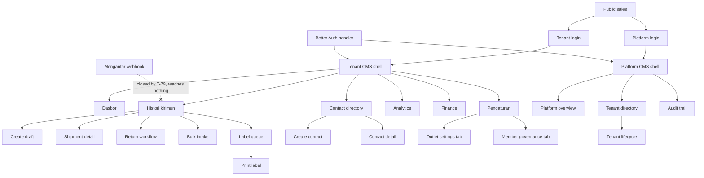

# System Map — Peta Sistem

**Renamed 2026-09-16** (was `18-AI-ROUTE-MAP.md`, "AI Development Sitemap and Route
Ownership Map"). A sitemap lists a website's pages; this lists the whole system a
change can touch — pages, Route Handlers, Server Actions, data owners, jobs and
provider integrations — so it is a *system* map, not a sitemap.

This is the implementation navigation index for GeraiCUAN. It helps an AI or
developer find the correct page, authorization boundary, data owner, mutation,
state file, test, and canonical specification before changing code.

## 0. Maintenance contract (read before adding anything)

A change that adds, renames or removes any of the following updates this document in
the same change — not afterwards, not in a follow-up task:

| You added | This map must gain |
| --- | --- |
| A `page.tsx` | Its route row: URL, file, title, who may open it, role checks, server reads, Server Actions, URL state, states (loading/error/empty), maturity, and the test or audit script that verifies it |
| A `route.ts` (Route Handler) | Its method, auth boundary, request/response contract and rate limit |
| A Server Action (`"use server"`) | Its name, file, consuming route, what it mutates, and its authorization and confirmation rules |
| A repository or data owner in `src/db/` | Which tables it reads or writes, its tenant scope, and which routes depend on it |
| A navigation destination or sidebar group | The destination list and the `aria-current` resolution rule |
| A URL state key (query parameter) | The key's meaning, allowed values and fallback |
| A provider integration or webhook | Its endpoint, credential resolution, retry/serialization rule and fixture |
| A UI audit scenario | Its id, route, mode and state |

Also update the inventory counts below, and never leave a route reachable only from a
button: if an operator can open it, it is listed here and in the navigation.

**Current inventory (2026-09-17):** 29 `page.tsx` (including the public sales page and
two login pages), 5 Route Handlers, 18 files declaring Server Actions — counted from
disk, `find src/app -name page.tsx | wc -l` and `-name route.ts`. T-165 and T-166 added
`/app/laporan/pengiriman`, `/app/laporan/pengiriman/export.csv` and
`/app/laporan/cetak-resi`. T-169, T-173, T-175, T-176, T-177 and T-178 added no page,
handler or Server Action file; their data owners, migrations 0047–0049 and provider
capture scripts are mapped in their own sections below. Sidebar groups for tenants:
Utama, Pengiriman, Data, Cek, Laporan, Pengelolaan.

It is not a product-requirement source and it is not an XML/SEO sitemap.
Requirements remain in 02-PRD.md, screen behavior in
17-UX-FLOWS-SCREEN-CONTRACTS.md, data ownership in 05-DATA-MODEL.md,
authorization in 07-IAM-RBAC-ABAC.md, security in 12-SECURITY-ARCHITECTURE.md,
and execution status in the root TASKS.md and STATUS.md. If this index conflicts
with those documents or the route files, the canonical document and repository
disk win.

## 1. Snapshot and maturity rules

Current refinement snapshot: 2026-09-15, base `199c3d9`, T-132 through T-144 working tree. The historical audit below records previous verification, not current branch cleanliness. T-143 adds `/app/cek-tarif`: inventory was 23 UI pages and four Route Handlers (T-161 later adds `/app/cek-resi`; see section 0 for the current counts). Sidebar navigation remains eight Tenant Admin, five Operator and three Platform destinations; both tenant roles also have the header/search-only Cek Tarif destination.


- Audited: 2026-09-11 against HEAD `69e6be6` (T-76 through T-77's round-2
  repairs, over `67beb92`) plus every Phase 10 task's uncommitted repairs
  since: T-77 (twenty-three independent review rounds; rounds 1-18 and
  20-22 each found and fixed a real defect, round 19's one claim was
  checked and found false, round 23 found nothing to reject), T-86 (119
  dead CSS selectors removed, geometry-verified), T-78 (three action/form
  defects fixed, independently review-clean), T-80 (provider concurrency
  and ambiguous-state handling verified already correct; one
  documentation-only fix), T-81 (a `netMarginIdr` cohort-mismatch bug
  fixed and independently reviewed, R3), and T-82 (this release preflight:
  migration `0037`, seed-fixture id collision fixed, navigation-doc drift
  corrected, `pnpm test:integration`/`tsc`/`lint`/`build`/`test:migration-upgrade`
  all clean). T-76 through T-82 — the entire Phase 10 queue — are complete.
  See STATUS.md and BUILD-LOG.md for the full history.
- Framework: Next.js App Router 16.3.3, React 19.2.8.
- Inventory: 23 UI pages and four Route Handlers. The Mengantar
  webhook is mounted but closed — it refuses every request; see its row in
  section 8.
- Shared UI: Tailwind CSS and copied shadcn/ui components.
- Server model: Server Components by default; interactive forms are bounded
  client leaves; Server Actions and Route Handlers are remotely reachable trust
  boundaries.
- Tenant data: every read and mutation must use the server-derived user,
  tenant, and target outlet/object scope through withTenantContext.
- Platform data: every read and mutation must pass resolvePlatformAccess and
  use the restricted platform context.

Maturity labels used below:

| Label | Meaning |
|---|---|
| COMMITTED | Present at HEAD `67beb92`. Committed is not the same as reviewed; the Phase 9 additions in `67beb92` are committed and NOT reviewed. |
| MODIFIED | Committed route whose supporting behavior has uncommitted worktree changes on top of HEAD. Re-verify before claiming it works. |
| WORKTREE | New uncommitted route or handler. It is discoverable for development but is not release-reviewed or production-ready. No route carries this label at this snapshot: every page and handler is committed, T-76 through T-77's round-2 repairs at `69e6be6` over `67beb92`. T-77's round-3 through round-23 repairs — the sticky-column fix, the token and page guard rewrites, the browser-audit script tree under scripts/ui-audit/, and the documents describing them — plus T-86's deletion of 119 dead selectors from `src/app/globals.css` (679 lines to 285) — are uncommitted on top of that; none of them add or remove a route. What `69e6be6` itself changed spans more than fifty paths, including `src/db/rts-repository.ts`, `src/app/app/pengiriman/rts/page.tsx`, `src/lib/ui-audit-scenario.ts`, `src/lib/pii-redaction.ts`, the closed webhook handler, the `server-only` guards through `src/db`, `scripts/seed-local-dev-users.mjs`, migrations `0032` through `0036`, the design tokens in `src/app/globals.css`, and their tests. Run `git status` rather than reading a maturity label as a statement about the whole tree. |
| RELEASE-GATED | Code exists, but live Mengantar mutation remains disabled until separately approved and verified. |

Never infer maturity from a checked task alone. Confirm git status, STATUS.md,
the relevant delivery-ledger run, and executable evidence.

## 2. Route hierarchy



## 3. Shell, role, and navigation contract

| Scope | Layout and access owner | Navigation groups | Actor |
|---|---|---|---|
| Public | src/app/layout.tsx | Sales page links only | Unauthenticated visitor |
| Tenant CMS | src/app/app/layout.tsx and src/lib/cms-auth.ts | Dasbor; Pengiriman; Pengelolaan | Active Tenant Admin or Operator membership |
| Platform CMS | src/app/platform/layout.tsx and src/app/platform/platform-access.ts | Platform | Active Super Admin only |

Tenant navigation is owned by src/lib/cms-shell-navigation.ts:

- Dasbor appears first without a redundant group heading.
- Pengiriman: Buat kiriman, Histori kiriman, Retur (RTS), Kontak.
- Pengelolaan, Tenant Admin only: Analitik, Keuangan, Pengaturan. Pengaturan is a menu of five pages (T-156/T-158), not internal tabs; `/app/anggota` is one of them and still maps to the Pengaturan current state in the shell sidebar.
- Impor and Label are contextual shipment destinations. They intentionally keep
  Histori kiriman selected instead of adding top-level navigation.
- Detail and print pages inherit the nearest parent destination; create has its own Buat kiriman entry.
- Hiding a navigation item is not authorization. Every page, Server Action,
  Route Handler, and repository target must enforce authority again.

## 4. Public and authentication pages

| Route | Source | Actor and primary job | URL state and entry/exit | Server boundary and actions | Required states | Maturity |
|---|---|---|---|---|---|---|
| / | src/app/page.tsx | Visitor evaluates GeraiCUAN and chooses the correct login scope. | Entry from public URL; exits to /login/tenant or /login/super-admin. | No CMS read or mutation. Must never render shipment, provider, contact, finance, analytics, or tenant data. | Marketing content, keyboard-visible login links, responsive layout. | COMMITTED |
| /login/tenant | src/app/login/tenant/page.tsx | Tenant Admin or Operator authenticates into tenant scope. | Accepts only notice=session-required or notice=access-unavailable; success replaces navigation to /app. | Client POST to /api/auth/sign-in/email with x-geraicuan-login-scope=tenant. Better Auth and the session hook verify the active CMS principal before session persistence. | Empty form, pending, generic invalid credentials, access notice, local-only demo fill, successful redirect. | COMMITTED |
| /login/super-admin | src/app/login/super-admin/page.tsx | Super Admin authenticates into platform scope. | Same bounded notice values; success exits to /platform. | Same Better Auth endpoint with x-geraicuan-login-scope=platform; tenant membership cannot synthesize platform authority. | Same login states, with platform-specific destination and copy. | COMMITTED |

Shared login interaction owner:
src/app/login/_components/login-form.tsx. Authentication configuration owners:
src/lib/auth.ts, src/lib/auth-config.ts, and src/lib/cms-principal.ts. Primary
evidence: tests/public-auth-render.integration.test.ts,
tests/auth-session-boundary.integration.test.ts, and
tests/auth-config.integration.test.ts.

## 5. Tenant CMS pages

### 5.1 Command center and shipment operations

| Route | Source and navigation | Actor and primary job | Canonical URL state | Reads and mutation owners | State boundary and completion | Maturity |
|---|---|---|---|---|---|---|
| /app | src/app/app/page.tsx; Dasbor | Both tenant roles choose the next permitted daily action from shallow period analytics, readiness, exceptions, and actionable recent shipments. | rentang, dari, sampai, tz, outlet, support; draft redirects to /app/pengiriman/baru?draft=validated-id. Invalid scope is removed rather than broadened. | src/db/tenant-dashboard-repository.ts and outlet-readiness-repository.ts. Read-only; links to create, queue, analytics, finance, or settings according to role. | Parent loading/error; first-run readiness, healthy empty, filtered empty, partial/stale, actionable exceptions, populated. Must not present COD principal as revenue; since T-177 (2026-09-17) the COD/non-COD cards carry no declared-goods value. | COMMITTED and UNREVIEWED: navigation and dashboard support changed in `67beb92`. |
| /app/pengiriman | src/app/app/pengiriman/page.tsx; Kiriman | Both roles triage lifecycle work and open the one valid next action. | status and page. Status accepts ALL, ACTION_REQUIRED, READY_TO_PROGRESS, ISSUED_TODAY, or a stored shipment status; page is positive integer. | loadShipmentQueuePage in shipment-queue-repository.ts; lifecycle links from src/lib/shipment-queue.ts. | Local loading/error; system empty, filtered empty, invalid filter adjustment, populated, stale, pagination. | COMMITTED at `69e6be6`. T-85 rewrote the guidance for the six lifecycle statuses it added and folded five label vocabularies into one shared source; that work passed independent review before this commit. The queue's own presentation was never re-reviewed as a whole. |
| /app/pengiriman/baru | src/app/app/pengiriman/baru/page.tsx; contextual Kiriman | Both roles create or resume one tenant-scoped shipment draft, select destination authority, and load a provider estimate. | Optional draft UUID; invalid or foreign IDs do not become scope. | Common actions in src/app/app/actions.ts; destination actions in location-actions.ts; estimate action in estimate-actions.ts. Repositories: outlet readiness, contact, shipment draft, estimate. | Local loading/error; blocked outlet, pristine, contact search, destination loading/empty/error/selected, validation error, duplicate warning, saved, estimate pending/success/failure. | COMMITTED, UNREVIEWED and RELEASE-GATED: the duplicate warning shipped in `67beb92`; the live provider estimate remains gated. The COGS field that shipped there is withdrawn (T-177, 2026-09-17): the form no longer offers it and `validateShipmentDraft` neither parses nor stores it. |
| /app/pengiriman/[shipmentId] | src/app/app/pengiriman/[shipmentId]/page.tsx; child of Kiriman | Both roles inspect immutable shipment context and perform only the action allowed by lifecycle and role. | Dynamic shipment UUID only; malformed or foreign/missing target returns not-found without cross-tenant disclosure. | loadShipmentDetail; confirmShipmentIssuance; checkStaleShipmentOperation; Tenant Admin-only reconcileShipmentUnknownSubmission and recoverShipmentUnpaidPayment. | Local loading/error/not-found; every lifecycle status, stale operation, pending/success/failure, estimate/provider result, label history. PR-45 detail pattern (T-151, 2026-09-17): the `Status kiriman` rail holds status, next actions, the stale-operation check, reconciliation and unpaid-recovery panels, and the resi/label entry; data cards stay in the main column; the warnings that explain a recovery stay at the top of the main column. | COMMITTED and RELEASE-GATED for issuance/reconciliation/recovery transport; rail placement UNCOMMITTED (T-151), verified by `shipment-route-states` and `scripts/ui-audit/shipment-detail-rail.mjs`. |
| /app/pengiriman/rts | src/app/app/pengiriman/rts/page.tsx; Retur (RTS) | Both tenant roles scan failed/returning shipments and open shipment detail for follow-up. | status accepts ALL, RTS_QUEUED, RTS_IN_TRANSIT, RTS_RECEIVED, PROBLEM; page is positive integer. An unrecognised status or page is reported as an adjusted filter rather than silently coerced. | loadRtsShipmentsPage in src/db/rts-repository.ts. Read-only; links to shipment detail. | Local loading/error; system empty, filtered empty, invalid query adjustment, populated, pagination. No mutation surface exists. | COMMITTED at `69e6be6` (T-76 through T-77) over `67beb92` (page, repository, schema, migrations 0030-0031); changed by T-76, which added the route boundaries, the audit-scenario hook, the repository test, the local RTS fixture, and migration 0032, and by T-77, which removed the KPI card row that restated the filter counts, replaced `role="tablist"` over links with a labelled `nav` carrying `aria-current="true"`, moved the wide table into the labelled focusable scroll region the sibling queue already used, and dropped the non-identifying `ID:` line, plus its uncommitted round-3 through round-23 repairs — an opaque sticky identifying column on the AWB cell, two review-broken guards rewritten to measure the rendered page and the parsed stylesheet rather than match spellings, and the browser-audit script tree ported from an ephemeral scratchpad into scripts/ui-audit/. T-77 has been through twenty-three rounds of independent review; every real finding is repaired (round 19's one claim was checked and found false; round 23 found nothing to reject). Independent review passed. |
| /app/impor | src/app/app/impor/page.tsx; contextual Kiriman | Both roles upload a bounded CSV, review row-level decisions, and create only explicitly selected valid drafts. | Form state, not shareable query state. | uploadBulkIntake and createSelectedDrafts in app/impor/actions.ts; bulk contract, intake, and signed envelope in src/lib. | Local loading/error; invalid file, mixed rows, no valid rows, preview, pending confirmation, partial result, success. | COMMITTED and UNREVIEWED: duplicate-detection behavior shipped in `67beb92`. |
| /app/label | src/app/app/label/page.tsx; contextual Kiriman | Both roles find issued or unpaid shipments eligible for label-related work. | q is an optional AWB suffix of 3–24 letters or digits; an invalid value shows an alert and skips the read. status=unpaid selects the unpaid view; an absent or any other value renders the default issued view without an adjustment notice. Both views are chosen through `DataTableFacetFilter` in `DataTableToolbar`, with `<noscript>` links to the same two URLs, and each keeps the current suffix. | listPrintableShipments in label-print-repository.ts. Read-only index. | Local loading/error; invalid query, system empty (separate issued and unpaid copy), filtered empty, populated. | COMMITTED; Phase 13 toolbar recomposition is uncommitted in the worktree. |
| /app/label/[shipmentId] | src/app/app/label/[shipmentId]/page.tsx; child of Label | Both roles verify provider-authoritative label data and print/reprint an issued shipment at 10 × 15 cm (default) or 10 × 10 cm. | Dynamic route key: a shipment number or prefixed reference resolved through `resolveShipmentRoute`; the print size is browser state, not URL state. | loadPrintableLabel (now also reads the shipment's outlet name for the stub), listPrintEvents, and recordLabelPrint (unchanged). Provider cnote_no is the only AWB authority. Route-owned client state: the label size (`10x15` default or `10x10`) in `localStorage` key `geraicuan.label-size.<userId>`, never in the URL. | Local loading/error/not-found; label unavailable, printable, AWB too long for a barcode, print pending/error/success, no history/history; print CSS `@page label-100x150` / `label-100x100` following the chosen size. | COMMITTED; T-176 thermal sizes and sender stub UNCOMMITTED (2026-09-17), verified by `label-thermal`, `label-render`, `label-print` and `scripts/ui-audit/thermal-label.mjs`. |

Shipment lifecycle authority is src/db/schema.ts plus
src/lib/shipment-queue.ts. The committed lifecycle is documented in UX-4.
The RTS, delivery, problem, and in-transit statuses are committed at
`67beb92` (`src/db/schema.ts` plus migration 0031) but were never independently
reviewed. Do not treat them as reviewed lifecycle transitions.

### 5.2 Contacts

| Route | Source and navigation | Actor and primary job | Canonical URL state | Reads and mutation owners | State boundary and completion | Maturity |
|---|---|---|---|---|---|---|
| /app/kontak | src/app/app/kontak/page.tsx; Kontak | Both roles find active/archived reusable sender or recipient records. | status=active or archived; unknown values fall back visibly. Interactive text search uses searchContacts without changing tenant scope. | listContacts and searchContacts; Tenant Admin sees create/archive capabilities, Operator retains permitted contact use. | Local loading/error; active empty, archived empty, filtered empty, invalid status, populated. | COMMITTED |
| /app/kontak/baru | src/app/app/kontak/baru/page.tsx; child of Kontak | Both roles create one reusable contact and an optional provider-authoritative destination. | No URL state. | saveContact plus search/validate destination-area actions; listReadyShipmentOutlets supplies allowed lookup scope. | Local loading/error; blocked readiness, pristine, destination search states, validation error, success redirect. | COMMITTED |
| /app/kontak/[contactId] | src/app/app/kontak/[contactId]/page.tsx; child of Kontak | Both roles inspect/update contact and addresses; Tenant Admin may archive. | alamat selects an active address; arsipkan=1 opens authorized confirmation; diarsipkan=1 presents durable success. | getContact/listContactAddresses; updateContactAction, addContactAddressAction, updateContactAddressAction, archiveContactAction; shared location validation. | Local loading/error; safe not-found view, archived/read-only differences, address selection, validation, confirmation, mutation result. | COMMITTED |

Canonical data owners are src/db/contact-repository.ts,
src/lib/contact-directory.ts, and the Mengantar destination authority boundary
in src/app/app/location-actions.ts.

### 5.3 Reporting, finance, configuration, and governance

| Route | Source and navigation | Actor and primary job | Canonical URL state | Reads and mutation owners | State boundary and completion | Maturity |
|---|---|---|---|---|---|---|
| /app/analitik | src/app/app/analitik/page.tsx; Analitik | Tenant Admin compares lifecycle performance, finds causes, and drills into exact supporting shipments. Operator is redirected to /app before protected analytics reads. | rentang, dari, sampai, tz, outlet, kurir, status, basis, halaman. basis is created, issued, outcome, or exceptions. Unknown dimensions are rejected and a canonical URL is offered. | src/db/analytics-repository.ts and analytics filter/range helpers. Read-only; export uses the same canonical filters. | Local loading/error plus region-level partial errors; no data, filtered empty, adjusted filter, stale, KPI comparison, accessible trend/table, pagination. | UNCOMMITTED (T-177, 2026-09-17): the COD principal, COGS and net-margin KPIs are withdrawn; the money region is Biaya kirim Mengantar, Biaya COD (fee + VAT) and Estimasi dana dicairkan Mengantar (`codDisbursementEstimateIdr`, issued COD shipments). Verified by `analytics-repository`, `analytics-progressive-disclosure`, `merchandise-figures-withdrawn`. |
| /app/laporan/pengiriman | src/app/app/laporan/pengiriman/page.tsx; Laporan → Laporan pengiriman | Tenant Admin keeps a record of kiriman per period, outlet, courier and lifecycle, and exports it. Operator is redirected to /app before any read; `loadShipmentReportPage`/`loadShipmentReportExport` refuse a non-admin context as well. | rentang, dari, sampai, tz, outlet, kurir, status, halaman — the PR-53 range contract plus the dimensions `parseTenantAnalyticsQuery` already validates against the tenant's own outlets and couriers. An unknown dimension rejects the filter and offers a safe URL; `basis` is not part of this route (the period basis is always shipment creation). | src/db/shipment-report-repository.ts (rows, per-courier and per-lifecycle totals, export), loadAnalyticsFilterOptions for the dimension lists. Read-only; no Server Action. | Local loading/error; empty period, filtered empty, populated, rejected filter, server pagination at 50 rows. Totals describe the filtered set, not the page. Money columns and per-courier totals are biaya kirim Mengantar, biaya COD and estimasi dana dicairkan Mengantar (T-177); no COD amount total, goods value or margin. | UNCOMMITTED (T-165, 2026-09-16; T-177, 2026-09-17); verified by `shipment-report`, `report-pages-render`, `merchandise-figures-withdrawn` and `scripts/ui-audit/laporan-reports.mjs`. |
| /app/laporan/cetak-resi | src/app/app/laporan/cetak-resi/page.tsx; Laporan → Riwayat cetak resi | Tenant Admin audits who asked to print which resi, when, with what outcome, and how many times it was reprinted. Operator is redirected to /app; `loadPrintHistoryPage` refuses a non-admin context as well. | rentang, dari, sampai, tz, outlet. The window is the printed-at basis; an outlet outside the tenant is ignored with a stated adjustment. | loadPrintHistoryPage in src/db/label-print-repository.ts, loadAnalyticsFilterOptions for the outlet list. Read-only; printing itself is unchanged and still owned by /app/label/[shipmentId]. | Local loading/error; empty period, filtered empty, populated, adjusted filter. Capped at 200 newest rows with the difference stated. Actor identity is never shown — only the recorded role. | UNCOMMITTED (T-166, 2026-09-16); verified by `print-history-report`, `report-pages-render` and `scripts/ui-audit/laporan-reports.mjs`. |
| /app/keuangan | src/app/app/keuangan/page.tsx; Keuangan | Tenant Admin reconciles signed money variances and inspects append-only ledger evidence. | Range parameters plus outlet, status, halaman, and rekonsiliasiId focus target. Invalid scope never widens results. | list/summarize ledger and reconciliation reads, listProviderSettlementReview; runLedgerReconciliation, reverseLedgerEntry and pullMengantarSettlement. | Local loading/error; matched, variance, invalid/adjusted filters, pending/error/success, reversal, pagination. COD principal remains liability, never revenue. | COMMITTED |
| /app/pengaturan | src/app/app/pengaturan/page.tsx; Pengaturan → Profil toko | Tenant Admin reads the store identity and locks the shipment-number prefix once. | None. A legacy `?outlet=` redirects to `/app/pengaturan/outlet?outlet=…` before any read. | loadTenantShipmentPrefix; saveShipmentPrefix (one-time lock behind its dialog confirmation). | Local loading/error; unlocked prefix, locked prefix, validation, pending, success. | COMMITTED |
| /app/pengaturan/pickup | src/app/app/pengaturan/pickup/page.tsx; Pengaturan → Titik pickup | Tenant Admin keeps the outlet's Mengantar pickup addresses as a list: add from the provider's own list, promote one as the outlet default, remove one. | outlet selects only an outlet already returned inside the tenant. | listOutletReadiness, listOutletPickupPoints; addOutletPickupPoint, setDefaultOutletPickupPoint, removeOutletPickupPoint, loadMengantarPickupOptions. Labels and the derived origin come from the provider, never from the form. | Local loading/error; no outlet, no pickup point, one/many points, provider list loading/empty/error, removal confirmation, pending/success. | COMMITTED |
| /app/pengaturan/outlet | src/app/app/pengaturan/outlet/page.tsx; Pengaturan → Outlet | Tenant Admin reads each outlet's readiness and the location pair its default pickup point produces, and moves on to the page that owns whatever is missing. | outlet selects only an outlet already returned inside the tenant. | listOutletReadiness. Read-only: no Server Action on this page. | Local loading/error; zero/one/many outlets, incomplete, legacy label, readiness summary. | COMMITTED |
| /app/pengaturan/koneksi | src/app/app/pengaturan/koneksi/page.tsx; Pengaturan → Koneksi Mengantar | Tenant Admin chooses platform-default or private Mengantar credentials per outlet and replaces a private API key. | outlet selects only an outlet already returned inside the tenant. | listOutletReadiness; savePrivateMengantarCredential, switchMengantarToPlatformDefault. Credentials resolve server-side only and are never echoed. | Local loading/error; zero/one/many outlets, platform default, private saved-unverified/rejected, replacement and switch confirmation. | COMMITTED |
| /app/anggota | src/app/app/anggota/page.tsx; Anggota & akses | Tenant Admin invites staff, changes role, or deactivates membership while preserving an active admin. Operator redirects to /app. | No shareable query state. | listTenantMembers; inviteMemberAction, changeMemberRoleAction, deactivateMemberAction. Every outcome is audited and replay-safe. | Local loading/error; no members (*Anggota tidak ditemukan*), active and deactivated (`SUSPENDED`) members — there is no separate invited status; single-active-admin alert; per-member *Kelola akses* disclosure with role-change and deactivate confirmation dialogs; validation, pending, success, last-admin/conflict. The header *Undang anggota* button scrolls to the always-visible invite section and moves focus to its email field. Rendered as three `SettingsCard`s inside the shared settings menu (T-159): Ringkasan akses, Daftar anggota, Undang anggota. | COMMITTED; the PR-46 `SettingsLayout` recomposition and its T-159 card anatomy are uncommitted in the worktree. |

Analytics is not financial authority. Keuangan owns ledger and reconciliation;
Ringkasan owns shallow prioritization; Analitik owns historical exploration.
Outlet settings is the only Mengantar credential/configuration destination.

## 6. Platform CMS pages

All four platform pages are thin route owners over
src/app/platform/_components/monitoring-view.tsx. That component resolves
platform access again, parses route-specific filters, performs restricted
platform reads, records monitoring access, and renders partial-degradation
regions.

| Route | Source and navigation | Super Admin job | Canonical URL state | Reads and actions | State boundary and completion | Maturity |
|---|---|---|---|---|---|---|
| /platform | src/app/platform/page.tsx; Ringkasan | Triage cross-tenant provider, queue, failure, latency, volume, usage, and audit exceptions. | Range/timezone plus optional tenant, outlet, kurir, status, halaman. q and hasil are route-invalid. | Platform health/count/trend/usage/audit repositories; read-only plus monitoring-access audit. | Shared loading/error; healthy, warning, critical, degraded region, empty, stale, invalid query. | COMMITTED and UNREVIEWED: the shared monitoring view changed in `67beb92`. |
| /platform/tenant | src/app/platform/tenant/page.tsx; Tenant | Find tenant, compare usage, and provision a tenant with an explicit governed action. | Platform filters plus q of 2-80 characters; hasil is invalid here. | listTenantUsage and submitPlatformTenantLifecycle for provisioning. | Shared loading/error; empty, filtered, paginated, provision dialog pending/error/success. | COMMITTED and UNREVIEWED through the shared monitoring view. |
| /platform/tenant/[tenantId] | src/app/platform/tenant/[tenantId]/page.tsx; child of Tenant | Inspect one tenant's lifecycle, outlets, membership/configuration health, operations, finance summary, and suspend/reactivate it. | UUID path forces tenant scope; range/outlet/courier/status/page remain validated; tenant query cannot override the path. | readTenantDetail, health/count/trend/audit/finance reads; submitPlatformTenantLifecycle. | Shared loading/error plus local not-found; zero/one/many outlets, stale/degraded, lifecycle confirmation pending/error/success. | COMMITTED and UNREVIEWED through the shared monitoring view. |
| /platform/audit | src/app/platform/audit/page.tsx; Audit | Review redacted append-only platform actions and denied outcomes. | Range/timezone, tenant/outlet/courier/status, hasil=SUCCESS or DENIED, halaman. q is invalid here. | listAuditEvents plus monitoring-access audit; no audit mutation. | Shared loading/error; empty, filtered, paginated, stale/degraded, invalid query. | COMMITTED and UNREVIEWED through the shared monitoring view. |

Filter ownership: src/lib/platform-monitoring-filters.ts. Data ownership:
src/db/platform-monitoring-repository.ts and src/db/platform-context.ts.
Lifecycle mutation ownership: src/app/platform/tenant/actions.ts and
src/db/platform-tenant-repository.ts.

## 7. Canonical URL-state dictionary

| Parameter | Accepted values and owner | Used by |
|---|---|---|
| rentang | hari-ini, kemarin, minggu-ini, bulan-ini, bulan-lalu, 7-hari, 30-hari, or kustom; src/lib/analytics-range.ts | Ringkasan, Analitik, Keuangan, Histori kiriman, Retur (RTS), Cetak resi, Laporan pengiriman, Riwayat cetak resi, and Platform |
| dari, sampai | ISO calendar dates required for a valid custom range; maximum 366 days and no future end date | Range-aware pages |
| khusus | Literal 1, retired as an emitted value by T-163 but still parsed, so a link saved before it forces a custom range exactly as it used to | Range-aware pages (inbound only) |
| tz | Asia/Jakarta, Asia/Makassar, Asia/Jayapura, or UTC | Range-aware pages |
| outlet | An ID from the currently authorized tenant or forced platform-tenant options | Ringkasan, Analitik, Keuangan, Laporan pengiriman, Riwayat cetak resi, Settings, and Platform |
| support | created, cod, non-cod, or issued | Ringkasan supporting-record disclosure |
| status | Route-specific allowlist; never reuse a status parser across pages without checking its domain. Shipment queue adds NEEDS_ATTENTION (spec 19 QUE-ATTENTION); Contacts adds all beside its existing active and archived; Laporan pengiriman uses the Analitik lifecycle domain | Shipment queue, RTS, Contacts, Label, Analitik, Laporan pengiriman, Keuangan, and Platform |
| page | Positive integer in shipment and RTS queues | Shipment and RTS queues |
| halaman | Positive integer in analytics, finance, and platform parsers | Analitik, Laporan pengiriman, Keuangan, and Platform |
| basis | created, issued, outcome, or exceptions | Analitik and analytics CSV. **Not** part of Laporan pengiriman: its period basis is always shipment creation, and an inbound `basis` is dropped from the canonical URL and the export link |
| kurir | Case-normalized value from authorized filter options | Analitik, Laporan pengiriman, and Platform |
| cetak | semua, belum, or sudah; PR-52 print-state entry, default semua | Cetak resi (/app/label) |
| q | Label: 3-24 alphanumeric AWB suffix. Platform tenant list: 2-80 character tenant query. | Label and Platform tenant list |
| hasil | SUCCESS or DENIED, valid only on /platform/audit | Platform audit |
| draft | Tenant-owned shipment UUID | Ringkasan redirect and shipment create/resume |
| alamat | Active address ID belonging to the current contact | Contact detail |
| arsipkan, diarsipkan | Literal 1 for authorized archive confirmation/result state | Contact detail |
| rekonsiliasiId | Reconciliation row focus target inside the validated finance result | Keuangan |

Parsers canonicalize or reject invalid values; they must never broaden tenant
scope. Shareable GET filters live in the URL. Secret values, form drafts,
confirmation tokens, and provider credentials never do.

## 8. Route Handlers and non-page HTTP surfaces

Route Handlers do not inherit page layouts. Each must independently own method,
authentication/signature, validation, rate/replay behavior, response limits,
and observability.

| Endpoint | Source | Method and caller | Security/data contract | Maturity |
|---|---|---|---|---|
| /api/auth/[...all] | src/app/api/auth/[...all]/route.ts | Better Auth methods used by login and sign-out. | Better Auth configuration, trusted origins, scoped pre-session authorization, secure cookies, and generic failures. | COMMITTED |
| /app/impor/template.csv | src/app/app/impor/template.csv/route.ts | GET by authenticated tenant user. | Re-authorizes tenant scope before returning the bounded CSV template. | COMMITTED |
| /app/analitik/export.csv | src/app/app/analitik/export.csv/route.ts | GET by Tenant Admin. | Re-authorizes Tenant Admin, canonicalizes analytics scope/basis, exports the full filtered set up to the explicit limit, and returns safe HTTP errors. | COMMITTED |
| /app/laporan/pengiriman/export.csv | src/app/app/laporan/pengiriman/export.csv/route.ts | GET by Tenant Admin. | PR-55. Re-authorizes Tenant Admin, parses the same canonical filters as the page, exports the whole filtered set with the `SHIPMENT_REPORT_COLUMNS` header, and refuses above the 10 000-row ceiling with `413` and the row count rather than truncating. Recipient name, phone and street address never reach the file; the area label does. | UNCOMMITTED (T-165, 2026-09-16) |
| /api/webhooks/mengantar | src/app/api/webhooks/mengantar/route.ts | Would be POST from Mengantar, not a browser page. Currently refuses every request with 404. | T-79 closed it: no provider push contract has been verified — the integration skill documents none, there is no sanitized capture, and `PR-30` is `Queued`. The handler committed in `67beb92` invented its headers, payload fields, and status vocabulary, and was inert anyway because RLS denies the application role a tenant-less read. | CLOSED by T-79. `tests/provider-webhook-boundary.integration.test.ts` pins the refusal and forbids the route reaching the database, provider, or secret modules. Reopening requires a verified contract and fixture, a tenant-scoped machine principal, constant-time comparison with a bounded body and replay window, and T-80's idempotent transition handling. |

## 9. Mutation ownership map

| Business mutation | UI entry | Server Action owner | Persistence/domain owner |
|---|---|---|---|
| Search/select shipment contacts | New shipment | src/app/app/actions.ts | contact repository and tenant context |
| Save draft | New shipment; selected bulk rows | src/app/app/actions.ts; app/impor/actions.ts | shipment-draft-repository.ts and shipment-draft.ts |
| Search/validate destination | Contact and shipment forms | src/app/app/location-actions.ts | mengantar-locations.ts, authority/rate boundaries |
| Load estimate | Saved draft | src/app/app/estimate-actions.ts | mengantar-estimate.ts and estimate-repository.ts |
| Issue AWB | Shipment detail | app/pengiriman/[shipmentId]/actions.ts | order batching, rate limit, provider snapshot, ledger |
| Reconcile unknown | Shipment detail, Tenant Admin | reconciliation-actions.ts | shipment-reconciliation repositories/domain |
| Recover unpaid | Shipment detail, Tenant Admin | unpaid-recovery-actions.ts | recovery repositories/domain |
| Upload/commit bulk rows | Import | src/app/app/impor/actions.ts | bulk intake, signed envelope, draft repository |
| Create/update/archive contact | Contact pages | app/kontak/actions.ts and [contactId]/actions.ts | contact-repository.ts |
| Record label print | Label detail | app/label/[shipmentId]/actions.ts | label-print-repository.ts |
| Reconcile/reverse finance | Finance, Tenant Admin | app/keuangan/actions.ts | ledger-repository.ts |
| Pull Mengantar settlement evidence | Finance "Tarik data Mengantar", Tenant Admin | app/keuangan/actions.ts `pullMengantarSettlement` | lib/mengantar-settlement.ts (read-only provider GET) + provider-settlement-repository.ts |
| Add/promote/remove a pickup point | Titik pickup, Tenant Admin | app/pengaturan/actions.ts | outlet pickup points, outlet default mirror, Mengantar authority |
| Save/switch Mengantar credentials | Koneksi Mengantar, Tenant Admin | app/pengaturan/actions.ts | managed secret, Mengantar authority |
| Invite/change/deactivate member | Members, Tenant Admin | app/anggota/actions.ts | member governance repository and audit |
| Provision/suspend/reactivate tenant | Platform tenant pages | app/platform/tenant/actions.ts | platform tenant repository and audit |
| Apply provider tracking event | None — the route is closed | Route Handler, not a Server Action | T-79 closed it: no verified provider push contract exists. Nothing applies tracking events today |

Every mutation must follow this order:
authenticate, derive actor scope, validate untrusted input, resolve the target
inside that scope, enforce lifecycle/idempotency/concurrency, commit the
authoritative write, append required audit/ledger evidence, then
revalidate/redirect or return a sanitized result.

## 10. Special-file and state ownership

- Root tenant loading and unexpected-error boundaries:
  src/app/app/loading.tsx and src/app/app/error.tsx.
- Tenant routes with dedicated loading/error:
  analitik, anggota, impor, keuangan, kontak, kontak/baru,
  kontak/[contactId], label, label/[shipmentId], pengaturan, pengiriman,
  pengiriman/baru, pengiriman/[shipmentId], and pengiriman/rts.
- Dedicated not-found:
  label/[shipmentId], pengiriman/[shipmentId], and
  platform/tenant/[tenantId]. Contact detail renders its own safe missing state.
- RTS owns its own loading/error boundary and is registered in the audit
  scenario inventory as `shipment-rts-empty`, `shipment-rts-error`,
  `shipment-rts-filtered-empty`, `shipment-rts-invalid-query`,
  `shipment-rts-paginated`, and `shipment-rts-stream`.
- Platform loading/error are shared by all platform routes.
- Development-only scenario coverage is owned by
  src/lib/ui-audit-scenario.ts. A new visible route is incomplete until this
  registry and tests/cms-ui-audit-inventory.integration.test.ts both know it.

## 11. Page-to-evidence map

| Page or surface | Primary executable evidence |
|---|---|
| Public sales and both login pages | public-auth-render, auth-session-boundary, auth-config |
| Tenant shell and navigation | cms-shell, cms-ui-audit-inventory |
| /app | tenant-dashboard, dashboard-period-page, dashboard-audit-scenario, dashboard-error-loading |
| /app/pengiriman | shipment-queue, shipment-route-states, cms-ui-audit-inventory |
| /app/pengiriman/baru | shipment-draft, shipment-actions, shipment-destination-actions, shipment-estimate-authority-action |
| /app/pengiriman/[shipmentId] | shipment-actions, shipment-issuance, shipment-reconciliation, shipment-unpaid-recovery, shipment-route-states |
| /app/pengiriman/rts | rts-repository, rts-presentation, cms-shell, cms-ui-audit-inventory. Browser evidence recorded under T-76's boundary and re-taken under T-77's sweep: 66 route pairs at 390/768/1280 plus 303 UI-audit scenario pairs covering the empty, filtered-empty, loading, error, invalid-query and paginated states. |
| /app/impor | bulk-shipment-intake, bulk-import-envelope, bulk-import-actions |
| /app/kontak | contact-directory, contact-render, contact-actions |
| /app/kontak/baru | contact-actions, location-search-actions |
| /app/kontak/[contactId] | contact-actions, contact-render, mengantar-location-authority |
| /app/label | label-render, cms-ui-audit-inventory |
| /app/label/[shipmentId] | label-render, label-thermal, label-print, label-print-actions; browser `scripts/ui-audit/thermal-label.mjs` |
| /app/analitik and export | analytics-range, analytics-filters, analytics-repository, analytics-streaming, analytics-export-route |
| /app/laporan/pengiriman and export | shipment-report, report-pages-render, cms-ui-audit-inventory, responsive-filter-forms; scripts/ui-audit/laporan-reports.mjs |
| /app/laporan/cetak-resi | print-history-report, report-pages-render, cms-ui-audit-inventory, responsive-filter-forms; scripts/ui-audit/laporan-reports.mjs |
| /app/keuangan | finance-page, finance-actions, finance-exception-filter, ledger-workspace, mengantar-settlement, provider-settlement-repository; scripts/ui-audit/provider-settlement.mjs |
| /app/pengaturan | tenant-profile-settings-page, shipment-number-repository |
| /app/pengaturan/pickup | pickup-settings-page, outlet-pickup-points, outlet-settings-actions |
| /app/pengaturan/outlet | outlet-settings-page, outlet-readiness |
| /app/pengaturan/koneksi | mengantar-connection-page, outlet-settings-actions, managed-secret-repository, mengantar-credentials |
| /app/anggota | member-governance-page, member-governance-actions |
| All platform pages | platform-layout, platform-monitoring-filters, platform-monitoring, platform-monitoring-page |
| Platform tenant lifecycle | platform-tenant-actions plus platform monitoring evidence |
| Better Auth handler | auth-config, auth-session-boundary, public-auth-render |
| CSV handlers | bulk-import actions/template assertions and analytics-export-route |
| Mengantar webhook | provider-webhook-boundary. The route is closed; the test pins the refusal and the modules it must not reach. |

Names above refer to matching files under tests with the
.integration.test.ts suffix. Repository and database tests remain required
where a page delegates to tenant-scoped persistence; a render test alone does
not prove authorization, RLS, lifecycle, or money correctness.

## 12. Where an AI should start

Use this sequence for any page change:

1. Locate the row in this file and identify its actor, job, maturity, query
   state, read owner, mutation owner, and state boundary.
2. Read the governing requirement in 02-PRD.md and screen contract in
   17-UX-FLOWS-SCREEN-CONTRACTS.md. Do not invent a workflow from the JSX.
3. Trace the route from page or handler to authorization, validation,
   repository transaction, schema/RLS, lifecycle, and audit/ledger side effect.
4. Reuse src/components/cms and src/components/ui. Do not introduce a second
   shell, navigation registry, filter parser, status vocabulary, or credential
   settings destination.
5. Add or update loading, empty, filtered-empty, error, stale, unauthorized,
   pending, conflict, success, and not-found behavior only where applicable.
6. Add the route/action to the deterministic UI audit registry and behavioral
   tests. Browser-visible changes require real-browser evidence at 390, 768,
   and 1280 pixels.
7. Update this route map only after disk behavior and canonical documents
   agree. Record verification in TASKS.md, STATUS.md, and BUILD-LOG.md through
   the repository delivery process.

## 13. Fast drift checks

Run these read-only checks before trusting this map:

```bash
rg --files src/app | rg '/page[.]tsx$' | sort
rg --files src/app | rg '/route[.]ts$' | sort
rg -n '^export async function' src/app --glob '*actions.ts' --glob 'route.ts'
rg -n 'href: "/(app|platform)' src/lib/cms-shell-navigation.ts
git status --short --branch
```

Expected page count for this snapshot: 22. Expected handler count: 4, all
committed at HEAD `67beb92`; the Mengantar webhook is mounted but closed by
T-79 and reaches nothing. Any count or route change
requires a page-by-page review of navigation, authorization, URL state,
loading/error/not-found behavior, action reachability, tests, and this map.

Repository policy makes this synchronization mandatory in `AGENTS.md`. A change
that adds, renames, or removes a page, Route Handler, navigation destination,
Server Action, or route-owned state boundary is incomplete until this map's
inventory, maturity, ownership, URL state, and evidence are updated in the same
change.

## 14. Known gaps at this snapshot

- The RTS route, tracking webhook, duplicate warning, and COGS/net-margin work
  were COMMITTED at HEAD `67beb92` without independent review and without a
  passing test suite. T-76 screened and repaired the RTS surface, T-83 the COGS
  path, and T-79 closed the tracking webhook; the duplicate warning is still
  unreviewed and is T-78's. Committed is not reviewed.
- Migration 0030 created `shipment_rts_events` with neither row-level security
  nor a grant to `geraicuan_app`, so the RTS page could not read its own event
  table under the application role. Migration 0032 adds the forced RLS,
  tenant-scoped select/insert policies, and the grant.
- T-83 repaired the COGS path: `validateShipmentDraft` parses and persists the
  value, the draft replay guard compares it, and the local seed records one so
  the KPI is exercisable. `netMarginIdr` still mixes the created and ledger
  cohorts, which is T-81.
- The webhook is closed by T-79 and has a boundary test. Its stated
  signed/replay-safe contract was never proven and the provider is not known to
  send one at all; it must be verified against provider documentation and a
  sanitized capture before the route may accept traffic again.
- `67beb92` changed the shipment lifecycle and financial semantics without
  independent review. Those changes still require canonical cross-document
  review, tenant-isolation/security review, and fresh whole-system browser
  screening before release readiness can be restored. The T-76 worktree adds
  migration 0032, the RTS route boundaries, and their evidence; it does not
  change lifecycle or financial semantics.


## T-110 — Blue UI presentation refinement (2026-09-13)

Worktree implementation on `feat/tokophi-blue-ui`; not committed or deployed.
Route, page, handler, action, navigation-destination, and scenario counts are unchanged.

- Shared owner: `src/app/globals.css`, `src/app/_components/cms-shell.tsx`, and `cms-navigation.tsx`; semantic blue tokens, light navigation/header, persistent mobile role, and active-item indicator. PageHeader/PageContainer retain their existing width tiers with a compact heading and spacing rhythm.
- `/app`: `page.tsx` keeps the period filter and summary first, current work next, and moves `DashboardPeriodTrendRegion` below the action region before recent shipments. The same trend promise, audit scenarios, support URLs, and retry focus ID remain; its standalone heading is now an `h2`. No new read or metric is introduced.
- `/app/analitik`: existing page and region owners retain query/basis/export behavior. Operational and financial grids use flat internal dividers; financial cells use at most three desktop columns for readable amounts. Financial definitions, including pending spec 19 M-5 D-3, are not resolved by this presentation pass.
- Verification owner: `scripts/ui-audit/blue-ui-check.mjs` plus the existing route sweep. T-110 evidence is recorded in BUILD-LOG; T-94/T-98/T-100 remain separate tasks with their original metric and feature requirements.

T-110 generated-route compatibility note: `/app/pengaturan` keeps its existing
route owner and behavior, but its default page function now requires the props
object supplied by Next.js. Its `searchParams` fallback remains unchanged; two
existing authorization-test callers pass an explicit empty object. No state,
route, or authorization boundary was added.


### T-111 refinement — 2026-09-14

T-111 keeps all 22 page routes, API/action inventories, navigation destinations, and ownership unchanged. `/app` now defaults `rentang` to `7-hari`; active-filter count and Reset use the same default. Explicit URL overrides, timezone, outlet, and support drill-downs retain their contracts. Dashboard rendering and loading now put the comparative line chart directly after the summary and before current work. Analytics preserves independent region freshness while reducing repeated presentation context.

The development-only `demo=grafik` query affects only chart samples and has a visible Data demo notice. It is ignored outside development. Dashboard trend reads both equal-length daily ranges with identical server-derived tenant/outlet scope; monthly ranges keep only current totals and explain the comparison limit. No new route or action was added.

The subsequent user-selected shadcn preset updates shared primitives and RootLayout typography to Inter without adding routes/actions. Table server rendering, named scroll props, semantic headings, mobile navigation focus return, and light-only rendering are preserved as integration adaptations.


### T-113 — Admin workspace composition

Route inventory remains 22 pages with unchanged destinations, role checks, server reads, Server Actions and URL parameter meanings. DashboardPeriodFilter, AnalyticsFilterFields and FinanceFilters now own small client disclosure behavior: period/outlet stay visible; choosing `kustom` opens the same form's advanced fields. Closed advanced fields remain successful GET controls; no second state store or duplicated form is introduced. Native disclosures are keyed by the existing canonical URL state when applicable.

AnalyticsSummaryRegion now renders the operational summary; AnalyticsFinancialRegion awaits the same `reads.summary` promise after AnalyticsTrendRegion. This adds a rendered Suspense region, not a DB read or metric formula. Home retains its scoped Analitik lengkap link, default seven-day comparison, developer-only demo and all supporting-record links. DashboardQuickAccess was removed because its destinations already remain in role-aware navigation; no destination was removed.

Presentation owners: CmsShell/CmsNavigation, PageHeader/PageContainer, Table, DetailSection/DefinitionGrid, the existing route pages/forms and globals' cms-form-section/cms-filter-bar classes (Phase 13 later removed the unused cms-form-section rules). Width tiers are now form/standard1024px, data1280px, wide1408px; public/login retain their existing widths. Boundary and browser evidence live in the T-113 BUILD-LOG entry.


### Phase 13 — shadcn-admin recomposition (T-118 to T-124, 2026-09-14)

Route inventory is unchanged: 22 pages, the same handlers, Server Actions, navigation destinations, role checks, and URL parameter meanings. These route-owned state boundaries and presentation owners changed:

- `/app`: `page.tsx` renders the header (with `DashboardHeaderActions`) → `OutletReadinessRegion` → the filter row → `DashboardPeriodSummaryRegion` (plus `DashboardPeriodSupportRegion` when `support` is set) → one grid holding `DashboardPeriodTrendRegion` and `DashboardRecentRegion` → `DashboardMetricsRegion`. Fix round 3 merged the former `DashboardActionRegion` into `DashboardRecentRegion`: one *Kiriman terbaru* card that awaits both the five-row `loadTenantDashboardShipments({ mode: "actionable" })` read and the eight-row `mode: "recent"` read, lists each shipment once (actionable rows first), and shows a partial-failure alert inside the card when only one read fails. The repository function is unchanged. `loading.tsx` follows the same skeleton order (`ReadinessSkeleton` → filter placeholders → `PeriodSummarySkeleton` → `PeriodTrendSkeleton` + `RecentSkeleton` → `MetricsSkeleton`). `DashboardPeriodFilter` takes no `rangeLabel` prop; a text line under the filter names the applied dates, zone, and outlet, and the header description line was removed.
- Shared primitives in `src/components/cms`: `DataTableToolbar`, `DataTableFacetFilter`, `DataTablePagination`, `DataTableShell`, `StatCard`, and `SettingsLayout`. Facet options are `role="option"` entries with `aria-checked` that navigate with `router.push` to the same URL each option linked to before; they are no longer `<a>` links. Queue URL parameters keep their meanings on `/app/pengiriman`, `/app/pengiriman/rts`, and `/app/label`, the routes that render the toolbar. `/app/kontak` keeps its own directory browser.
- Every settings page (`/app/pengaturan`, `/app/pengaturan/pickup`, `/app/pengaturan/outlet`, `/app/pengaturan/koneksi`, `/app/anggota`): page, loading, and error render inside `SettingsLayout` with `navLabel="Menu pengaturan"`, `indexHref="/app/pengaturan"` and their own `currentHref`. The shell sidebar keeps the only `aria-current="page"` (`routeMatches` already resolves every `/app/pengaturan/*` route to Pengaturan), and the settings menu marks its item with `aria-current="true"`.
- `/app/analitik`, `/app/keuangan`, and `/platform/*`: KPIs render through `StatCard`, and paginated tables use `DataTablePagination`. Platform lists and audit also use `DataTableToolbar`. Region Suspense boundaries, freshness controls, and export/basis state are unchanged.

Evidence status: T-126 records fresh655-test/82-file integration, production build and66route/viewport observations, plus independent review; T-118–T-125 are closed through that bounded gate. Current limitations and follow-up evidence belong to the latest TASKS/STATUS/BUILD-LOG entries, not this historical implementation checkpoint.

### T-134 — Shared Admin/Super Admin presentation parity

Inventory remains22pages (15tenant,4platform,3public); no handler, Server Action or navigation destination is added or removed. MonitoringView remains the server data/filter owner for all four platform pages. FilterPanel now renders one visible-primary `cms-filter-bar` GET form: period/outlet and the authorized tenant selector where the table facet does not own it; secondary dates/timezone/courier/status/search sit in a native advanced disclosure. Facet-owned dimensions remain single hidden inputs; tenant detail's route ID remains authoritative. Applying a preset or reset preserves existing parser/authorization rules and resets pagination as before.

`platform/_components/platform-period-select.tsx` is a new small client leaf owning only custom-preset disclosure opening. Native GET submission owns URL state; `rentang=kustom` selects custom dates through the existing parser. The form now uses one Terapkan submit like Admin; existing `khusus=1` URLs remain accepted. No DB/schema/provider module enters this leaf. Advanced applied values open server-side; no duplicate mobile form or client fetch is introduced.

Compact period/operational count summaries on `/app`, `/app/analitik` and platform health use two phone columns with matching skeletons; detailed current-work/full-IDR regions remain stacked. Platform Counts cards fit their own content and tenant scope uses three desktop columns. Shared table headers use the existing muted tint with opaque pinned equivalents. Analytics section prose is capped to the existing2xl measure. Platform shared loading uses visible generic controls and the same count-column choices; its two control placeholders do not exactly reproduce the overview's three fields. No Suspense/read boundary changes.

T-134 verification passes:18route/viewport observations,487actual focus probes, nine role observations, custom/preset/facet submission checks, full83-file integration suite, production build and independent source/visual review. BUILD-LOG retains native-key delivery, generic loading and control-height limits. No new route/read/action boundary is introduced.


### T-137 — Outlet and member settings presentation (2026-09-15)

Route inventory, handlers, Server Actions, authorization, URL state and data ownership are unchanged. `/app/pengaturan` retains the URL-selected outlet and independent location/credential actions. Its selected-outlet header is flat, the derived origin is a labelled native output with polite announcements, and a `Digunakan` badge follows the persisted connection source rather than the draft radio choice. Existing shadcn Field, RadioGroup, Popover/Command and confirmation dialogs own interaction. Page/loading/error header copy is aligned.

`/app/anggota` retains count summaries, the ordered semantic member list, per-peer Collapsible controls and the inline invite form, now as the three `SettingsCard`s T-159 composed them. The last-admin badge conveys protection with a lock and neutral outline, on the row and on the Daftar anggota card title; the last-admin Alert and authorization rules remain. Each access disclosure includes its member name in the accessible name. The invite form stacks email and native role selector inside shadcn FieldGroup, with associated role guidance and one submit, that submit sitting in the card footer and bound to the form by `form=`. Loading geometry follows the same three card frames.

This bounded polish preserves the already delivered Phase 13 composition. Older spec10 Pattern4 proposals for status tabs, member table, invite Dialog and other settings workflow changes are not implemented or declared complete here; their residual task ownership remains unchanged. No new settings workflow or credential capability is implied. Verification: `scripts/ui-audit/settings-ux.mjs`, nearest page/action regressions and T-137 BUILD-LOG/ledger evidence.

## Indonesian operational refinement (PR-34–PR-37)

- Shared header client state: `src/app/_components/cms-header-tools.tsx` owns local dialog/query focus and the live Asia/Jakarta clock; `cms-shell.tsx` owns responsive placement and anchor clearance. Search consumes the same role-filtered navigation as the sidebar, performs no global data query, and does not grant authorization.
- Navigation owner remains `src/lib/cms-shell-navigation.ts`; `/app/pengiriman/baru` and `/app/pengiriman` are explicit create/history destinations. Settings tabs retain their existing routes and server access checks.
- Date state owner remains `src/lib/analytics-range.ts`: legacy timezone URLs normalize to WIB, canonical serialization retains `tz=Asia/Jakarta`, and range UTC bounds derive from WIB dates. Dashboard, analytics, finance and platform filter leaves no longer offer conflicting timezone controls. Metrics formulas and event basis are unchanged; spec 19 owns bucket semantics.
- Full operational phone projections: contact actions/directory, shipment draft search, RTS repository/page, and label repository/queue. `shipmentReference` preserves the complete internal ID; platform batch formatting remains independently abbreviated. Tenant/outlet authorization and platform/log PII restrictions remain enforced.
- Verification owners: header browser runner `scripts/ui-audit/header-tools.mjs`; header/nav, analytics range/filter, finance, platform monitoring, operational phone, contact render, label and RTS integration suites. Final executed evidence is recorded in BUILD-LOG.md under T-139–T-141.

T-139–T-141 verification snapshot (2026-09-15):203 focused tests plus34 isolated repository tests,12 header and18 operations observations, and a focused DOM keyboard replay. TypeScript/lint/build and independent source/visual review pass. The new client leaf is WORKTREE; affected existing pages remain MODIFIED supporting behavior. No new Server Action or Route Handler was introduced. Ledger provenance and native-input limits remain in BUILD-LOG.

Implemented T-143 route: `/app/cek-tarif`, authenticated Tenant Admin/Operator, ready-outlet query + authoritative location lookup + ephemeral rate-check Server Action. Header/search entry only; no new sidebar group. TD-18 and PR-40 own its scoped read/no-order contract.


### T-143/T-144 route and data ownership (2026-09-15)

| Surface | Owner | State / contract |
| --- | --- | --- |
| `/app/cek-tarif` | `src/app/app/cek-tarif/page.tsx`, `quick-rate-form.tsx`, `actions.ts`, `loading.tsx`, `error.tsx` | Tenant Admin/Operator authentication; ready outlet; existing destination selector with fixed outlet; whole grams. Client form owns ephemeral pending/error/empty/quote and invalidates old results on input changes. No URL filters or persisted business quote. Header and search only; no sidebar entry. |
| `checkShippingRates` | `src/app/app/cek-tarif/actions.ts` | Server scope, committed attempt limit, authoritative area lookup, account/origin/pickup readiness recheck before and after provider estimate; minimal display DTO; no shipment/estimate/ledger persistence. |
| Shipment number display | DB migration0038 + `schema.ts`, `shipment-draft-repository.ts`, queue/dashboard/analytics/ledger/RTS/label read models | Persisted publicReference uses numeric creator, WIB date and daily serial. Existing unknown creators use00000. UI/CSV show this number; UUID remains route/action/PK/FK identity and cnote_no remains the sole AWB. |

Verification owners: `quick-rate-actions.integration.test.ts`, `quick-rate-render.integration.test.ts`, `cms-ui-audit-inventory.integration.test.ts`, `shipment-reference-repository.integration.test.ts`, migration upgrade script, and real-browser quick-rate/reference scripts. PR-41 supersedes the earlier T-141 full-UUID display decision; phone completeness remains unchanged.


### T-145 — Analytics hierarchy and supporting detail

Inventory remains23 pages and4 Route Handlers. No navigation destination, Server Action, read query or authorization boundary is added. `/app/analitik/page.tsx` places reconciliation immediately after summary, then trend, courier, financial and supporting shipment regions. `loading.tsx` mirrors this order; `error.tsx` uses the same page identity. Existing independent Suspense/error boundaries remain.

`analytics-regions.tsx` owns three initially closed native details: trend table, courier table and the COD fee split. DOM-local open state has no query parameter and no persisted preference. Charts, the three COD money cards (T-177: shipping, COD fee, disbursement estimate; principal/margin cards withdrawn), reconciliation and shipment pagination stay outside those disclosures. Existing filters, support basis, KPI anchors, full references, pagination and export retain their owners and meanings. Shared `src/components/ui/chart.tsx` owns SVG focus presentation for analytics, tenant dashboard and platform trend consumers.

Verification owner: `analytics-progressive-disclosure.integration.test.ts`, existing decision-context/streaming suites and `scripts/ui-audit/analytics-disclosure.mjs`. Executed viewport, disclosure, focus and recovery evidence belongs to the T-145 BUILD-LOG entry.

### T-146 — Mengantar settlement pull in Keuangan

Inventory remains 23 pages and 4 Route Handlers; no navigation destination is added. `/app/keuangan` gains one Server Action, `pullMengantarSettlement`, and one server read, `listProviderSettlementReview`, which follows the existing `outlet` URL parameter. Pull form state is local `useActionState`; its period comes from the workspace range hidden fields. Provider I/O is owned by `src/lib/mengantar-settlement.ts`, persistence and classification by `src/db/provider-settlement-repository.ts`, migration `0039_provider_settlement.sql`.

Verification owner: `mengantar-settlement.integration.test.ts`, `provider-settlement-repository.integration.test.ts`, `finance-page.integration.test.ts`, `tenant-isolation-posture.integration.test.ts` and `scripts/ui-audit/provider-settlement.mjs` (live read-only). Executed evidence belongs to the T-146 BUILD-LOG entry.

### T-147 — Per-tenant shipment numbers

Inventory remains 23 pages and 4 Route Handlers. `/app/pengiriman/[shipmentId]` and `/app/label/[shipmentId]` keep their folder names, but the segment is now a shipment key: canonical `10013`, or `GC-10013`/UUID that redirect to it (`src/app/app/shipment-route.ts`). Unknown or foreign keys are 404. New Server Actions: `saveShipmentPrefix` (`/app/pengaturan`, Tenant Admin, one-time lock) and `unlockShipmentPrefix` (`/platform/tenant/[tenantId]`, Super Admin, audited). Detail-page actions revalidate `/app/pengiriman/[shipmentId]` as a route pattern. PR-41's shipment reference row above is superseded: allocation, prefix and immutability are owned by migration `0040_tenant_shipment_numbers.sql`.

Verification owner: `shipment-reference-repository.integration.test.ts`, `shipment-number.integration.test.ts`, `shipment-route-states.integration.test.ts`, `outlet-settings-page.integration.test.ts`, `tenant-isolation-posture.integration.test.ts`, `scripts/verify-migration-upgrade.mjs` and `scripts/ui-audit/shipment-references.mjs`.

### T-148 — Compact shipment table cells

No route, Server Action, URL state or navigation change. Presentation only: shared cells in `src/components/cms/shipment-table-cells.tsx` (with `formatWibDateTimeParts`/`formatDistrictCity` in `src/lib/label-format.ts`) are used by `/app/pengiriman`, `/app/analitik`, `/app/label`, `/app/pengiriman/rts` and `/app/keuangan`; the queue read model adds `recipientPhone`. Verification owner: `shipment-route-states.integration.test.ts` and `scripts/ui-audit/table-compact.mjs`.

## Admin experience programme — T-149, T-152, T-160, T-161 (2026-09-16)

**Inventory.** `/app/cek-resi` is new (`src/app/app/cek-resi/` with `page.tsx`, `loading.tsx`, `error.tsx`, `actions.ts`), so the UI inventory is **24 pages** and four Route Handlers. `/app/cek-tarif` keeps its URL but is no longer a header-only destination.

**Navigation (T-161, PR-51).** The tenant sidebar gains a **Cek** group (`ScanSearch`) holding Cek resi (`PackageSearch`) and Cek tarif (`Calculator`), both visible to TENANT_ADMIN and OPERATOR. `CmsQuickRateLink` and the tenant-only second header row are removed, so both scopes share one header. The command palette now renders `tenantCmsNavigation` itself, and the `/app/cek-tarif` special case in `aria-current` resolution is deleted — every route resolves through the normal longest-href rule.

**New Server Action.** `lookupShipmentTracking` (`src/app/app/cek-resi/actions.ts`), consumer `/app/cek-resi`. **URL state: none** — the key is posted through the action so an AWB never reaches the URL, history or access logs. Read owner: `src/db/shipment-tracking-lookup-repository.ts` (`lookupShipmentByTrackingKey`), reading `shipments`, `shipment_drafts`, `provider_order_snapshots`, `provider_batches`, `provider_order_status_observations`. One tenant-scoped statement decides found/not-found, so an unknown key and a foreign tenant's key are indistinguishable; no provider endpoint is added. Dev-only audit scenarios: `resi-lookup-found|missing|limited|error`.

**Dashboard regions (T-160, PR-50).** `/app` gains no URL, page or action. Two server regions in `dashboard-regions.tsx` — `DashboardOutcomeRegion` and `DashboardCourierRecapRegion` — each with its own `Suspense`, skeleton and `RegionFailure`, bound to the existing `rentang`/`dari`/`sampai`/`tz`/`outlet` state. The courier recap's cost column is server-gated to TENANT_ADMIN. **Removed in the same change (owner decision, T-168):** the snapshot block `DashboardMetricsRegion` / `MetricsSkeleton` (`Saat ini · Pekerjaan yang perlu diperhatikan`); its counts move to the queue state panels planned in PR-52, and `ACT-NEEDED`'s `/app` tile surface in `docs/spec/19` is superseded by that panel.

**Frame and layout (T-149, PR-45).** Supersedes the Phase 13 width-tier statement above: the CMS ships **one** frame. `PageContainer` defaults to `wide` (88rem) and no `/app` or `/platform` page passes `width=`; `.cms-main` agrees at 88rem and publishes `--cms-header-h` (96px below `md`, 64px from `md`) for sticky rails. `src/components/cms/cms-layouts.tsx` owns the two content patterns (`FormLayout`, `DetailLayout`, `PageAside`) and the field-width scale, split on the frame's own container query (`@4xl/page`) rather than the viewport.

**Draft form (T-152, PR-47).** `/app/pengiriman/baru` gains an "Instruksi dan penanganan" section (`shippingInstruction`, `isHazardous`, `isDropshipper` + `dropshipperName`/`dropshipperPhone`) and `recipientAddressLandmark` under the recipient; `saveShipmentDraft` carries those plus `destinationAreaVerified`. Provider payload ownership stays in `src/lib/mengantar-order.ts`; phone and billable-weight normalization in `src/lib/shipment-draft.ts`.

**Freshness.** `DataFreshnessControl` no longer renders a refresh button on any of its twelve surfaces: it refreshes the route once per generated instant while the tab is visible, and still labels data that stayed stale.

**Verification owners.** `tests/tracking-lookup.integration.test.ts`, `tests/dashboard-outcome-parity.integration.test.ts`, `tests/mengantar-field-parity.integration.test.ts`, `tests/cms-presentation.integration.test.ts`, `tests/dashboard-period-page.integration.test.ts`, `tests/cms-shell.integration.test.ts`, `tests/cms-ui-audit-inventory.integration.test.ts`. Both new repositories additionally bind their own tenant predicate in the emitted SQL, so deleting the application filter fails a test instead of being masked by RLS. Browser evidence for the new surfaces is recorded in the T-149 BUILD-LOG entry.

### Destination re-verification recovery (T-152 follow-up, 2026-09-16)

New Server Action `verifyShipmentDraftDestinationArea` (`src/app/app/actions.ts`), triggered from `issuance-panel.tsx` on `/app/pengiriman/[shipmentId]` when a confirmation is refused with `ORDER_DESTINATION_AREA_UNVERIFIED`. It loads the stored area through `loadShipmentDraftDestinationForVerification` (tenant-scoped, still-open `DRAFT`/`ESTIMATED` only), re-runs it through `validateMengantarDestinationAreaSelection` under the existing location-search rate limit, and stamps `destination_area_verified_at` through `stampShipmentDraftDestinationVerified` only when the stored id **and** label still match the provider's answer. Migration `0042_destination_area_verification_recovery.sql` grants the column-scoped UPDATE that 0035 predates. Pre-existing drafts are never backfilled as verified.

### T-170 — dropshipper removed, handling and payment reworked

`/app/pengiriman/baru` loses the dropshipper toggle and its two fields; `saveShipmentDraft` and the provider payload lose `is_dropshipper`, `dropshipper_name` and `dropshipper_phone`; migration `0044_drop_dropshipper_fields.sql` drops both columns and the pair constraint. The hazardous checkbox becomes a stated declaration whose consequence is rendered when it is ticked, and the "Nilai dan pembayaran" section asks the payment method before the amounts it governs. Verification owner: `tests/mengantar-field-parity.integration.test.ts` (no `dropshipper` token may reappear in the rendered form, the declaration wording, the payment-before-amounts order) and `tests/shipment-draft.integration.test.ts`.

### T-167 — Kontak role views

`/app/kontak` adds one URL state key, `peran` (`pengirim|penerima|semua`, default `semua`, unrecognised values recovered with a notice). No new route or Server Action; `searchContacts` carries the role so a client-side search stays inside the active view. New read owner `listContactDirectory` in `src/db/contact-repository.ts` joins each contact's primary-or-newest active address and its address count; `listContacts` keeps serving the draft-form contact picker unchanged. Postal code and district are derived in `src/lib/label-format.ts`, not stored. Verification owner: `tests/contact-directory.integration.test.ts`, `tests/contact-render.integration.test.ts`, `tests/shipment-table-cells.integration.test.ts`.

### T-164 — complete navigation

Tenant groups: **Utama** (Dasbor); **Pengiriman** (Buat kiriman, Impor CSV, Histori kiriman, Retur (RTS), Cetak resi); **Data** (Kontak); **Cek** (Cek resi, Cek tarif); **Laporan** (Analitik, Laporan pengiriman, Riwayat cetak resi — all three Tenant Admin only, so an operator sees no Laporan group at all; T-165/T-166 added the last two); **Pengelolaan** (Keuangan, Pengaturan). `/app/impor` and `/app/label` are navigation destinations now, not button-only pages, so the contextual shipment-route rewrite they needed is gone and a label detail marks Cetak resi directly; `/app/anggota` still rewrites to Pengaturan. Groups are collapsible: a non-interactive heading plus a separate trigger button carrying `aria-expanded`/`aria-controls`, so no nav link ever carries `data-state`; open state is route-derived on the server, merged with `localStorage` (`geraicuan.cms-nav-groups`) in an effect, and the current route's group is always open. At the icon rail each group becomes a `DropdownMenu` flyout. Command palette counts: tenant 14 (12 before T-165/T-166), operator 9, platform 3.

### T-162 — state summary panels on operational list pages (PR-52)

One shared server component, `src/components/cms/state-summary-panel.tsx`, on Histori kiriman, Retur (RTS), Cetak resi and Kontak. No new route and no new Server Action: the panel is a native `method="get"` form whose entries are `<button type="submit" name="<the page's own parameter>">`, so choosing one writes the page's existing URL state and the result stays a shareable link. A `<button>` is what makes `aria-pressed` legal ARIA — a link cannot carry it — and it answers Enter and Space with no key handler of our own; the panel needs no JavaScript.

**URL-state boundaries changed.** `/app/pengiriman` accepts one more `status` value, `NEEDS_ATTENTION` (spec 19 QUE-ATTENTION), offered in the existing select as well so choosing it from the panel does not leave the select blank. `/app/label` gains `cetak=semua|belum|sudah`. `/app/kontak` accepts `status=all` beside `active` and `archived`. Every previously valid value resolves unchanged.

**Read owners.** `loadShipmentQueuePage` (`src/db/shipment-queue-repository.ts`) returns `summary` from a grouped count over the same joins as the list; `loadLabelIndexPage` (`src/db/label-print-repository.ts`) and `loadContactDirectoryPage` (`src/db/contact-repository.ts`) are new page loaders returning `{ rows, summary }`; `loadRtsShipmentsPage` already returned its summary and is unchanged. All counts are tenant-scoped by the table's own `tenant_id` column, in the same repository transaction as the rows.

**Retired.** The RTS page's own `nav[aria-label="Filter status retur"]` chip strip and the Kontak browser's own `nav[aria-label="Status kontak"]` chips are both replaced by the panel, so each page has one control for its status state instead of two vocabularies.

**Verification owners.** `tests/state-summary-panel.integration.test.ts` (count-to-filter parity, fixture-absolute cohorts, cross-tenant, emitted-SQL tenant predicate, and the panel markup contract), `tests/rts-presentation.integration.test.ts`, `tests/contact-render.integration.test.ts`, `tests/shipment-route-states.integration.test.ts`, `scripts/ui-audit/rts-a11y.mjs`, `scripts/ui-audit/state-panel.mjs`.

### T-163 — one date-range filter across the CMS (PR-53)

`src/components/cms/date-range-filter.tsx` is the one control; `src/components/cms/range-filter-form.tsx` wraps it in a filter bar for the pages that had none. No new route and no new Server Action.

**Where it goes.** It replaces the period `<select>` plus the "Tanggal khusus" disclosure on `/app`, `/app/analitik` and `/app/keuangan`, and is added to `/app/pengiriman` and `/app/pengiriman/rts` (created basis, `shipments.created_at`) and `/app/label` (issued basis, `coalesce(provider_order_snapshots.resolved_at, created_at)`). `/app` has no advanced disclosure left — the range absorbed everything that was in it. `/app/analitik` keeps kurir, status and basis there; `/app/keuangan` keeps the reconciliation status.

**URL-state boundaries changed.** The contract is unchanged in spelling — `rentang`, `dari`, `sampai`, canonical `tz=Asia/Jakarta` — so every bookmarked link resolves to the same window. `rentang` accepts one more value, `bulan-lalu`. The Keuangan "Terapkan rentang khusus" button (`khusus=1`) is gone from the UI; `khusus` is still parsed, so links that carry it behave as before. The three list pages now carry the range in every link they build (`shipmentQueueHref`, `rtsHref`, `labelIndexHref`, their paginations and their reset links), or following one would silently reset the period.

**Shape.** A native `<details>`/`<summary>`, not a Radix popover: the accepted anatomy asks the two `type="date"` inputs to be the typed and fallback path, which only holds if `rentang`, `dari` and `sampai` stay inside the page's single GET form whether the panel is open or shut. CSS makes it a popover panel from `md` and a bottom sheet below it. The two-month `react-day-picker` grid is mounted only while the panel is open, so a closed panel puts no table and no day numbers into the page's markup.

**Dependency.** `react-day-picker@10.0.1`, pinned, the one new dependency this programme adds. `src/components/ui/calendar.tsx` is the shadcn `Calendar` over it.

**Verification owners.** `tests/date-range-filter.integration.test.ts`, `tests/analytics-range.integration.test.ts`, `tests/responsive-filter-forms.integration.test.ts`, `tests/state-summary-panel.integration.test.ts` (rows and PR-52 counts under the same window), `tests/dashboard-period-page.integration.test.ts`, `tests/finance-page.integration.test.ts`, `tests/label-render.integration.test.ts`, `scripts/ui-audit/date-range.mjs`.


### T-156, T-157, T-158 — the settings menu, pickup points, and the outlet/connection split (PR-46, PR-47)

**Inventory.** Three new pages — `/app/pengaturan/pickup`, `/app/pengaturan/outlet` and `/app/pengaturan/koneksi`, each with `page.tsx`, `loading.tsx` and `error.tsx` — so the UI inventory is **27 pages** and four Route Handlers. `/app/pengaturan` keeps its URL and becomes **Profil toko**.

**Navigation.** `administrationNavigation` (`src/app/app/pengaturan/settings-nav.ts`) is the PR-46 menu in order: Profil toko, Titik pickup, Outlet, Koneksi Mengantar, Anggota & akses. Each entry carries an icon, a label and one line of description. `SettingsLayout` renders it as a left rail from `lg` (11rem, 14rem from `xl`, content capped at 47.5rem); below `lg` the **index** is the menu (tappable ≥44px rows with the description and a chevron) and every other settings page shows one `aria-label="Kembali ke Pengaturan"` back link instead. No client JavaScript. The sidebar needed no change: `routeMatches` already keeps Pengaturan current for every `/app/pengaturan/*` route, and `/app/anggota` still rewrites to it.

**URL state.** `?outlet=` is shared by Titik pickup, Outlet and Koneksi Mengantar, each selecting only an outlet the tenant already returned. `/app/pengaturan?outlet=…` redirects to `/app/pengaturan/outlet?outlet=…` before any tenant read, so old links and bookmarks land on the page that owns the setting. Setup CTAs on `/app` (`dashboard-regions.tsx`), `/app/pengiriman/baru`, `/app/impor` and `/app/cek-tarif` point at `/app/pengaturan/outlet`.

**New Server Actions** (`src/app/app/pengaturan/actions.ts`, consumer `/app/pengaturan/pickup`, Tenant Admin): `addOutletPickupPoint`, `setDefaultOutletPickupPoint`, `removeOutletPickupPoint`. Each revalidates `/app/pengaturan/outlet`, `/app/pengaturan/pickup`, `/app/pengaturan/koneksi`, `/app`, `/app/pengiriman/baru` and `/app/impor`. **Removed:** `saveOutletSettings` — the outlet's pickup pair is no longer edited on the outlet page; promoting a pickup point is what writes it.

**New data owner.** `src/db/outlet-pickup-point-repository.ts` over table `outlet_pickup_points` (migrations `0045_outlet_pickup_points.sql` and `0046_pickup_point_origin_policies.sql`, the second moving three estimate/COD/order INSERT policies onto the draft's own origin): one row per provider `pickup_address_id` with its derived origin area, at most one `is_default` per outlet (partial unique index), FORCE RLS with four policies, column-scoped UPDATE, and every read carrying `tenant_id` in SQL. `outlets.default_pickup_address_id`/`_label`/`default_origin_area_id`/`_label` stay as the denormalized mirror of the default row, so readiness, the estimate origin and the order payload keep reading one authoritative pair.

**Shipment creation.** `shipment_drafts` gains `pickup_address_id` and `origin_area_id`, snapshotted like the destination area and resolved server-side by `resolveShipmentPickupPoint` — a forged id fails the submission instead of reaching the provider, and a replay that changes the pickup point is a conflict, not the same submission. `/app/pengiriman/baru` offers the choice only when the outlet has more than one point, defaulting to its default. The estimate origin (`estimate-repository.ts`) and the order payload/recovery joins (`order-batch-repository.ts`) read `coalesce(draft.…, outlet.default_…)`, so a pre-T-157 draft behaves exactly as before.

**Audit scenarios.** `/app/pengaturan`: `settings-error`, `settings-stream`. `/app/pengaturan/pickup`: `settings-pickup-empty|list|provider-error|error|stream`. `/app/pengaturan/outlet`: `settings-empty|first-run|many|twenty|provider-error|outlet-error|outlet-stream`. `/app/pengaturan/koneksi`: `settings-connection-empty|connection-many|private-attention|private-auth-error|koneksi-error|koneksi-stream`. `/app/pengiriman/baru` adds `shipment-draft-pickup-choice`.

**Verification owners.** `tests/tenant-profile-settings-page.integration.test.ts`, `tests/pickup-settings-page.integration.test.ts`, `tests/outlet-settings-page.integration.test.ts`, `tests/mengantar-connection-page.integration.test.ts`, `tests/outlet-pickup-points.integration.test.ts` (repository, tenant isolation, emitted-SQL tenant predicate, draft binding), `tests/outlet-settings-actions.integration.test.ts`, `tests/cms-primitives-render.integration.test.ts`, `tests/cms-ui-audit-inventory.integration.test.ts`; `scripts/ui-audit/settings-ux.mjs`, `scripts/ui-audit/pickup-selector.mjs`, `scripts/ui-audit/shipment-numbers.mjs`.


### T-159 — Anggota & akses in the settings pattern, and the whole-admin screening pass (PR-45, PR-46, PR-49)

**Inventory unchanged.** No page, Route Handler, navigation destination, Server Action or URL-state key is added, renamed or removed. `/app/anggota` keeps its URL, its Tenant Admin gate, its three Server Actions, its audit trail and its last-admin protection; only its composition changes, from `ContentSection` stacks to three `SettingsCard`s (Ringkasan akses, Daftar anggota, Undang anggota). The invite form's submit moves into the card footer and reaches its form by `form="member-invite-form"`, so the control that submits sits outside the element it submits — the association is what makes it work and is what the test binds.

**Two accessibility defects fixed, both measured in the browser.** (1) The shadcn `destructive` button variant carried `focus-visible:ring-destructive/20`; on `/app/kontak/<id>` the "Arsipkan kontak" control measured a 2px ring at **1.41:1**, under WCAG 1.4.11's 3:1 and exactly the half-alpha ring the design contract forbids. The override is removed and the variant inherits the one full-alpha 2px `--ring`. (2) The compact Buat kiriman stepper put a `sr-only` span inside each tinted bar; clipped to a pixel it is still painted, so over `--primary` it measured **2.57:1** at 1024 and 390. The bars now carry no text and one `sr-only` line on the page ground states every step and its state.

**The screening sweep.** `scripts/ui-audit/admin-programme.mjs` grows from an eight-route frame check at three widths to the whole authenticated tenant inventory at **1920/1440/1024/390**: every static `/app` page plus the three detail routes, discovered from the list that owns them rather than pinned to a seed id. Per route and width it asserts document overflow ≤ 1px, exactly one visible `h1`, no skipped heading level, no card title outside the outline, no nested card, no scroll container that is neither announced nor reachable, zero focus indicators under 3:1, zero text pairs under AA, the 672px prose cap, and below `md` zero targets under the WCAG 2.5.8 rule; then it asserts one `h1` x per width across the whole inventory.

**Two measurement faults in that sweep, found by extending it.** The detail routes were discovered as "the first link under the prefix", which on `/app/kontak` is *Kontak baru* — three static routes were screened twice and the three detail pages not at all, and a deliberately broken focus ring on a detail page passed. And `Page.captureScreenshot` intermittently drops the CDP device-metrics override, so three pages were measured at the browser's real 2684px window and reported an h1 at x=798; the loop now re-applies the viewport per route and asserts `window.innerWidth`.

**Probe correction.** `scripts/ui-audit/probe.mjs` no longer counts Radix's form-value bubble `<input>` as a focusable with a weak indicator. It is `aria-hidden="true"`, `tabindex="-1"`, `opacity:0` and `pointer-events:none` all at once — unreachable by keyboard, absent from the accessibility tree, invisible — so an indicator on it is observable by nobody; three were counted on `/app/pengiriman/baru` and two more on the contact detail. All three conditions must hold: drop any one and the control is inspected again, which `scripts/ui-audit/focus-selftest.mjs` now proves with five added cases (48 total).

**Verification owners.** `tests/member-governance-page.integration.test.ts` (menu membership and the marked item, the card titles their content points at, the footer-to-form association), `tests/shipment-draft-step-indicator.integration.test.ts` (the tinted bars carry no text), `tests/cms-primitives-render.integration.test.ts`; `scripts/ui-audit/admin-programme.mjs`, `scripts/ui-audit/focus-selftest.mjs`.

### T-169 — Mengantar delivery states reach the shipment lifecycle (PR-57)

**Inventory unchanged.** No page, Route Handler, navigation destination, Server Action or URL-state key is added, renamed or removed. The closed webhook at `src/app/api/webhooks/mengantar/route.ts` stays closed and keeps returning 404: its own postmortem lists four conditions for reopening, and the first two — the provider's documentation of a push contract with a sanitized capture of a real delivery, and a bounded machine principal that can resolve a tenant — are still unmet.

**Trigger.** The existing manual settlement pull, `pullMengantarSettlement` (`src/app/app/keuangan/actions.ts`, Tenant Admin, `/app/keuangan`). It already reads `GET /order` through `src/lib/mengantar-settlement.ts` and already stores the provider's statuses, so the missing piece was the transition, not a second reader. A scheduled pull was rejected for the same reason the webhook stays closed: there is no machine principal with a tenant scope, and outlet credentials resolve only inside a tenant context. The pull's existing one-per-minute claim and 62-day period ceiling therefore bound the lag, and every surface that shows a delivery outcome says so.

**Changed data owners.**
- `src/db/provider-settlement-repository.ts` gains `applyProviderDeliveryTransitions` (private, inside `recordProviderSettlementPull`'s transaction) and `loadProviderDeliveryStatusBasis`. The transition locks the matched shipment rows `FOR UPDATE` with the tenant predicate in SQL, decides per row, and writes `shipments.status` in one UPDATE per target state carrying `tenant_id` in SQL. The scope is the tenant, not one outlet: the pull matches the provider's own orders for an account that spans the tenant's outlets, so a shipment the provider reported on is transitioned wherever it sits. An earlier version also filtered by `outlet_id` and was asserted by matching that predicate's SQL text — a tautology, since the id was read from the same shipment row the predicate then matched; the review that caught it is why the guard is now behavioural. The pull result gains `appliedTransitionCount`, `refusedTransitionCount` and `unrecognisedStatuses`.
- `src/db/tenant-dashboard-repository.ts` (`loadTenantDashboardOutcomeSummary`) and `src/db/rts-repository.ts` (`loadRtsShipmentsPage`) each return a `basis` field so `/app` and `/app/pengiriman/rts` can state the provider-reported basis and its lag. No cohort, predicate or count changes.
- `src/lib/provider-delivery-status.ts` is the single decision: the observed provider vocabulary, the allowed-transition graph, and the surface sentence. It has no database import, so a client surface may state the same vocabulary the server transitions on.

**Schema.** Migration `0047_provider_delivery_transitions.sql` adds three nullable columns to `provider_order_status_observations` — `from_status`, `mapped_status`, `transition_outcome` — plus one check constraint tying them together. No policy and no grant moves; the table keeps SELECT + INSERT and its Tenant Admin policies, and no transition rule is encoded in row-level security (DATA-11 records why).

**Surfaces.** `/app` outcome caption and `/app/pengiriman/rts` state that the outcome is Mengantar's report and, for a reader who may see the provider evidence, when it was last pulled. `/app/cek-resi` already named the provider status and its observation time. The Keuangan pull result names how many shipments moved and any provider status the vocabulary did not recognise.

**Verification owners.** `tests/provider-delivery-transitions.integration.test.ts` (mapping, each provider-reported state, idempotence, no backward transition, unrecognised status left un-transitioned, dashboard and RTS fed by observations, cross-tenant, the emitted-SQL tenant predicate on the write, a tenant's second outlet transitioning too, and the transition-outcome vocabulary matching 0047's CHECK literal), `tests/rts-presentation.integration.test.ts` (the rendered basis sentence), `tests/provider-settlement-repository.integration.test.ts`, `tests/tenant-isolation-posture.integration.test.ts`, `tests/dashboard-outcome-parity.integration.test.ts`.

### T-177, T-174, T-150, T-151 — reports without merchandise figures, label-aware target size, data and detail patterns (2026-09-17)

**Inventory unchanged.** No page, Route Handler, navigation destination, Server Action or URL-state key is added, renamed or removed.

**T-177 data owners.** `src/db/analytics-repository.ts` `ShipmentKpis` drops `codPrincipalIdr`, `cogsIdr` and `netMarginIdr` and gains `codDisbursementEstimateIdr`; `codDisbursementEstimateExpression` is the one per-shipment formula (COD amount − `coalesce(provider_charged_shipping_idr, shipping_amount_idr)` − service fee − VAT) read by the analytics total and by `src/db/shipment-report-repository.ts`, whose rows and per-courier totals now carry `shippingCostIdr`, `codFeeIdr` and `codDisbursementEstimateIdr` instead of the COD amount. `src/db/tenant-dashboard-repository.ts` drops the declared-goods-value sums. `validateShipmentDraft`, `createShipmentDraft` and the Buat kiriman form no longer accept or write COGS; the `cogs_amount_idr` columns stay in the schema with no application writer. Keuangan, reconciliation and the ledger are unchanged.

**T-174 probe.** `smallTargets` in `scripts/ui-audit/probe.mjs` measures a control's target as its own box united with each visible label in `el.labels` (the labels HTML associates with that control). `scripts/ui-audit/target-size-selftest.mjs` holds seven synthetic cases; `admin-programme.mjs` asserts `smallTargetCount === 0` at 1920/1440/1024/390.

**T-150 frame.** `admin-programme.mjs` asserts, on the seven data pages at 1920/1440/1024, that the first card or table scroll region starts at the page title's x.

**T-151 detail rail.** See the `/app/pengiriman/[shipmentId]` row. `scripts/ui-audit/shipment-detail-rail.mjs` screens the seeded shipment and the five `shipment-detail-*` audit scenarios at 1440/390.

### T-176 — thermal label sizes and the sender stub (2026-09-17)

**Inventory unchanged.** No page, Route Handler, navigation destination, Server Action or URL-state key is added, renamed or removed. `recordLabelPrint` and `appendPrintAttempt` are untouched; printing is recorded and authorized exactly as before.

**Code owners.** `src/app/app/label/[shipmentId]/label-print-panel.tsx` owns the size choice and provides `LabelPrintContext` (size, recorded print time) around the preview it now renders; the page passes the server-rendered `LabelSheet` in as `children`, so the label data is not serialized into a client component's props. `label-print-context.tsx` holds the context, `LabelSheetFrame` (renders the cut line and stub only at 10 × 15) and `HandoverTime`. `label-sheet.tsx` renders the package label and the stub; `label-barcode.tsx` draws Code 128 from `src/lib/code128.ts`. Sizes, the default, storage helpers and the thermal numbers live in `src/lib/label-size.ts`. `loadPrintableLabel` joins `outlets` on `(id, tenant_id)` for `outletName`. Print CSS is the T-176 block in `src/app/globals.css`; the shell's print rule now zeroes the inset margin so the sheet starts at the page origin.

**Verification owners.** `tests/label-thermal.integration.test.ts` (sizes, default, storage fallback, both layouts, stub content and exclusions, Code 128), `tests/label-render.integration.test.ts` (size choice before print, default preview, long-AWB warning), `tests/label-print.integration.test.ts` (outlet name). Browser: `scripts/ui-audit/thermal-label.mjs` at print emulation, both sizes, COD and non-COD; output in `scripts/ui-audit/.output/thermal-label/`.

### T-173 — the courier catalogue comes from the provider (PR-50)

**Inventory unchanged.** No page, Route Handler, navigation destination, Server Action or URL-state key moves.

**Data owners.** `src/lib/mengantar-couriers.ts` owns `MENGANTAR_COURIERS` (eleven couriers, `spx` / Shopee Express included), `courierDisplayName`, `courierRecapOrder` and `mengantarCourierOfService`, the one service-key → courier resolver. `providerCourierFromService` in `src/db/order-batch-repository.ts` now delegates to it instead of its own five-name prefix ladder, which let `iDexpressCargo` become a courier of its own; `requiresProviderAccountSerialization` behaves identically for every courier it saw before.

**Provider integration.** `scripts/capture-mengantar-couriers.mjs` (read-only, through `secrets-env`) records `GET /order/estimate?courier=all` over three real routes into `tests/fixtures/mengantar-couriers.catalogue.json` — service keys and route counts only.

**Verification owners.** `tests/mengantar-courier-catalogue.integration.test.ts` binds the catalogue to the list, to the estimate normalizer's key validation, to the issued-order grouping, and to a no-prefix-collision invariant.

### T-153 — provider contract capture (PR-47, owner-approved live calls 2026-09-16)

**Inventory unchanged.** These are evidence tools, not application routes.

**Provider integration.** Three scripts, all run only through `secrets-env`, none writing a credential, an identifier or a customer amount to disk:
- `scripts/capture-mengantar-order-contract.mjs` — read-only `GET /order`; the stored order record's shape and the observed delivery vocabulary, into `tests/fixtures/mengantar-order-contract.shape.json`. T-169's mapping is derived from it.
- `scripts/probe-mengantar-order-shape.mjs` — `POST /order` attempts that stop at the first acceptance and refuse to run without `MENGANTAR_CREATE_ORDER=yes-create-one-real-order`. Fourteen shapes were refused (HTTP 400) and nothing was created; the matrix is `tests/fixtures/mengantar-order-shape.probe.json`. `scripts/capture-mengantar-order-request.mjs` is its single-order predecessor, gated the same way.
- `scripts/capture-mengantar-cod-identities.mjs` — read-only `GET /order` and `GET /invoices`; COD construction and settlement identities as counts only, into `tests/fixtures/mengantar-cod-identities.json`. T-175 and T-178 are derived from it.

### T-175 — a COD amount that never under-collects Mengantar's fee (PR-9, PR-47)

**Inventory unchanged.** No page, Route Handler, navigation destination, Server Action or URL-state key moves.

**Data owners.** `src/lib/mengantar-cod-fee.ts` owns `MENGANTAR_COD_FEE_BASIS_POINTS` (333), `BASIS_POINTS` and `mengantarCodFeeIdr` — the single statement of the rate, used by the COD amount formula, the draft payout, Keuangan's expected settlement (T-178) and the analytics and report estimates. `calculateCodAmounts` in `src/db/cod-totals-repository.ts` grosses the amount up (`ceil((goods + shipping) × 10000 / 9667)`) and writes `cod_formula_version = 2`.

**Schema.** Migration `0048_cod_amount_gross_up.sql` adds `shipment_cod_totals.cod_formula_version` (default 1, so every existing row keeps the formula it was written with), keeps version 1's exact-formula CHECKs and adds version 2's. No policy or grant moves.

**Surfaces.** The draft preview on `/app/pengiriman/baru` and the issuance panel on `/app/pengiriman/[shipmentId]` read "Biaya COD" / "PPN biaya COD"; the thermal label uses the same words.

**Verification owners.** `tests/cod-amount-formula.integration.test.ts` (a 70,002-case property test including zero discount, the minimality of the amount, and a copy of the real table proving every application value is accepted and every one-rupiah deviation refused), `scripts/verify-migration-upgrade.mjs` (a pre-0048 row stays valid). Browser: `scripts/ui-audit/cod-draft-preview.mjs`.

### T-178 — COD settlement money that matches what Mengantar does (PR-43, PR-9)

**Inventory unchanged.** No page, Route Handler, navigation destination, Server Action or URL-state key moves; `pullMengantarSettlement` keeps its name, role and URL.

**Data owners.** `src/lib/mengantar-settlement.ts` reads `amount`, `estimatedSpecialPrice` and `COD_FEE` as exact ten-thousandths of a rupiah (it rejected any fraction before, and 202 of 600 real reconciliation invoices carry one). `src/db/provider-settlement-repository.ts` owns `expectedSettlementUnits`, which subtracts Mengantar's fee from the expected payout. `src/db/ledger-repository.ts` appends new issuances' COD fee as `MENGANTAR_COD_FEE_COST` (EXPENSE) instead of `GERAICUAN_COD_SERVICE_FEE_REVENUE`; historical entries are untouched. `src/db/analytics-repository.ts` owns `mengantarCodFeeExpression` and `codDisbursementEstimateExpression`, shared with `src/db/shipment-report-repository.ts` so a report row's money columns always add up to its COD amount.

**Schema.** Migration `0049_mengantar_settlement_money.sql` widens `provider_settlement_items.amount_idr`, `shipping_amount_idr` and `cod_fee_idr` to `numeric(18,4)` and re-creates the four ledger entry-type checks with the new type added and the old type still valid. No row is updated; the append-only trigger, the INSERT/SELECT-only grants and every policy are unchanged.

**Surfaces.** `/app/keuangan` shows settlement money to the sen and states the expected-payout formula; its revenue card holds only legacy entries and new fees land in provider cost. `/app/analitik` and `/app/laporan/pengiriman` show the fee Mengantar keeps and the estimated disbursement on the proven rate.

**Verification owners.** `tests/mengantar-settlement*.integration.test.ts`, `tests/provider-settlement-repository.integration.test.ts`, `tests/ledger-repository.integration.test.ts` (both fee types reconcile in one period; UPDATE and DELETE on a ledger row are still refused), `tests/analytics-repository.integration.test.ts` ("reports Mengantar's COD fee under both ledger classifications, once each"), `tests/shipment-report.integration.test.ts` (a row's columns add up), `scripts/verify-migration-upgrade.mjs` (settlement values and a revenue ledger row written before 0049 are byte-identical after it).
