# GeraiCUAN System Map and AI Development Navigation Index

This is the canonical implementation navigation index for GeraiCUAN. It helps an AI agent
or full-stack developer locate the correct page, authorization boundary, data owner, mutation,
state file, executable test, and canonical specification before changing any code.

It is not a product-requirement source and it is not an XML/SEO sitemap.
Requirements remain in `02-PRD.md`, technical architecture in `03-TECHNICAL-DESIGN.md`,
system architecture in `04-SYSTEM-ARCHITECTURE.md`, data ownership in `05-DATA-MODEL.md`,
tenant isolation in `06-TENANT-ISOLATION.md`, authorization in `07-IAM-RBAC-ABAC.md`,
design system in `10-DESIGN-SYSTEM-WHITELABEL.md`, security in `12-SECURITY-ARCHITECTURE.md`,
DevOps/Coolify in `15-DEVOPS-CICD-MIGRATIONS.md`, screen behavior in
`17-UX-FLOWS-SCREEN-CONTRACTS.md`, metrics and formulas in `19-METRICS-ANALYTICS-CONTRACT.md`,
and execution status in root `TASKS.md` and `STATUS.md`. If this index conflicts with those
canonical documents or repository disk truth, the canonical specification and repository disk win.

---

## 0. Maintenance Contract (Read Before Changing Anything)

Every change touching routes, handlers, actions, data models, or navigation must update this document
**in the same change** — not afterwards and not in a separate follow-up task:

| If You Add, Rename, or Remove | This Map Must Gain / Update |
|---|---|
| A `page.tsx` (UI route) | Its route row: URL, file path, primary job, actor & role gate, server reads, Server Actions, canonical URL state, state boundaries (`loading`, `error`, `empty`, `not-found`), maturity, and executable evidence. |
| A `route.ts` (Route Handler) | Its HTTP method, caller, authentication/signature boundary, rate/replay limits, request/response contract, and error behavior. |
| A Server Action (`"use server"`) | Its name, file path, consuming UI surface, database/domain mutations, actor scope check, and confirmation/audit rules. |
| A repository or data owner in `src/db/` | The tables read/written, tenant isolation scope, and dependent routes. |
| A navigation destination or sidebar group | The menu list, sidebar grouping, allowed roles, icon, and `aria-current` resolution rule. |
| A URL state key (query parameter) | The parameter name, allowed values, fallback behavior, and owning routes. |
| A provider integration or webhook | Endpoint, credential resolution, retry/serialization policy, and contract fixture. |
| A UI audit scenario | Scenario ID, route, state, and test runner mapping. |

### Current Repository Inventory (2026-09-17)

- **36 `page.tsx` files**:
  - 8 Public & Authentication pages (`/`, `/login/tenant`, `/login/super-admin`, `/daftar`, `/verifikasi-email`, `/verifikasi-email/konfirmasi`, `/lupa-password`, `/atur-ulang-password`).
  - 23 Authenticated Tenant CMS pages reached from 15 sidebar items in 6 sidebar groups (Utama, Pengiriman, Data, Cek, Laporan, Pengelolaan).
  - 5 Authenticated Platform CMS pages (Ringkasan, Tenant, Detail Tenant, Pendaftaran, Audit).
- **5 `route.ts` Route Handlers**:
  - Better Auth handler (`/api/auth/[...all]`).
  - 3 CSV export / template handlers (`/app/impor/template.csv`, `/app/analitik/export.csv`, `/app/laporan/pengiriman/export.csv`).
  - 1 closed provider webhook (`/api/webhooks/mengantar`, strictly returns 404).
- **23 files declaring Server Actions** (`"use server"`), exporting 44 Server Actions (`export async function`).
- **3 `layout.tsx` files**, **24 `loading.tsx`** (23 tenant, 1 platform), **24 `error.tsx`** (23 tenant, 1 platform), **3 `not-found.tsx`** (Section 10).
- **34 repository and data-layer modules** in `src/db/`.
- These counts are checked against the filesystem by `tests/system-map-inventory.integration.test.ts` (T-199); a drifted number fails the suite.
- **Apex landing site**: Standalone Astro 7 static site in `apps/landing` for `https://geraicuan.com` (zero JS, self-contained, builds to `apps/landing/dist/`).

---

## 1. Snapshot and Maturity Rules

- **Current Snapshot**: 2026-09-17 (Phase 14 completion; T-148 through T-178, T-180 host routing, T-181–T-184 self-registration & approval queue, T-185 Coolify deploy runbook, T-186/T-190 COD Ongkir, T-188 Pengirim/Penerima split, T-189 demo seed, T-191–T-198 review follow-ups (T-193 COD formula retirement, T-194 build container, T-196 field input rules, T-197 and T-198 in flight), T-199 input, announcement and map fixes).
- **Runtime Stack**: Next.js App Router 16.3.3, React 19.2.8, Drizzle ORM 0.45.2, Better Auth 1.7.2, Tailwind CSS v4, PostgreSQL 16+ with Row-Level Security (RLS).
- **Server Model**: Server Components by default; interactive form leaves are bounded client components; Server Actions and Route Handlers are remotely reachable trust boundaries.
- **Tenant Scope Isolation**: Every tenant-owned read and mutation strictly resolves actor scope server-side via `withTenantContext`. PostgreSQL RLS is defense in depth; application code derives tenant/outlet scope unconditionally.
- **Platform Scope Isolation**: Platform Super Admin actions resolve access via `resolvePlatformAccess` and `withPlatformContext`. Tenant membership cannot synthesize platform authority.

### Maturity Labels

| Label | Meaning |
|---|---|
| **COMMITTED** | The route's own files and the owners named in its row are unchanged since git HEAD (`f17fd1b`), which passed independent review and the regression suite. |
| **WORKTREE** | The route's own files or a named owner changed in the working tree since HEAD; local tests pass, release integration and final review are pending. A row changed since the last commit never claims COMMITTED. |
| **RELEASE-GATED** | Code exists, but live upstream mutation (e.g. live provider order creation or real payment collection) is gated behind explicit authorization and environment switches. |
| **CLOSED** | Endpoint exists on the router but refuses all incoming traffic (e.g., `/api/webhooks/mengantar` returns 404 until a verified provider push contract is established). |

---

## 2. Route Hierarchy

```mermaid
flowchart TD
    Apex[Apex geraicuan.com - Astro Static Landing] --> PublicSales[Public Sales Page - Dev Fallback]
    PublicSales --> TenantLogin[Tenant Login /login/tenant]
    PublicSales --> PlatformLogin[Platform Login /login/super-admin]
    PublicSales --> Register[Daftar Toko /daftar]
    
    Register --> EmailVerify[Verifikasi Email /verifikasi-email]
    Register --> EmailConfirm[Konfirmasi Email /verifikasi-email/konfirmasi]
    TenantLogin --> ForgotPass[Lupa Password /lupa-password]
    ForgotPass --> ResetPass[Atur Ulang Password /atur-ulang-password]

    TenantLogin --> TenantShell[Tenant CMS Shell /app]
    PlatformLogin --> PlatformShell[Platform CMS Shell /platform]

    subgraph TenantCMS [Tenant CMS - 6 Sidebar Groups]
        TenantShell --> GroupUtama[Utama]
        GroupUtama --> Dashboard[Dasbor /app]

        TenantShell --> GroupPengiriman[Pengiriman]
        GroupPengiriman --> NewShipment[Buat Kiriman /app/pengiriman/baru]
        GroupPengiriman --> BulkImport[Impor CSV /app/impor]
        GroupPengiriman --> ShipmentQueue[Histori Kiriman /app/pengiriman]
        ShipmentQueue --> ShipmentDetail[Detail Kiriman /app/pengiriman/:id]
        GroupPengiriman --> RtsQueue[Retur RTS /app/pengiriman/rts]
        GroupPengiriman --> LabelQueue[Antrean Cetak Resi /app/label]
        LabelQueue --> LabelPrint[Lembar Label Termal /app/label/:id]

        TenantShell --> GroupData[Data]
        GroupData --> Senders[Pengirim /app/kontak/pengirim]
        GroupData --> Recipients[Penerima /app/kontak/penerima]
        Senders --> NewContact[Kontak Baru /app/kontak/baru]
        Recipients --> NewContact
        Senders --> ContactDetail[Detail Kontak /app/kontak/:id]
        Recipients --> ContactDetail

        TenantShell --> GroupCek[Cek]
        GroupCek --> QuickRates[Cek Tarif Ongkir /app/cek-tarif]
        GroupCek --> TrackAwb[Cek Resi & Tracking /app/cek-resi]

        TenantShell --> GroupLaporan[Laporan - Admin Only]
        GroupLaporan --> Analytics[Analitik Performa /app/analitik]
        GroupLaporan --> ShipmentReport[Laporan Pengiriman /app/laporan/pengiriman]
        GroupLaporan --> PrintHistory[Riwayat Cetak Resi /app/laporan/cetak-resi]

        TenantShell --> GroupPengelolaan[Pengelolaan - Admin Only]
        GroupPengelolaan --> Finance[Keuangan & Rekonsiliasi /app/keuangan]
        GroupPengelolaan --> SettingsMenu[Pengaturan /app/pengaturan]
        SettingsMenu --> ProfileSettings[Profil Toko & Prefix /app/pengaturan]
        SettingsMenu --> PickupSettings[Titik Pickup /app/pengaturan/pickup]
        SettingsMenu --> OutletSettings[Outlet & Origin /app/pengaturan/outlet]
        SettingsMenu --> ConnectionSettings[Koneksi Mengantar /app/pengaturan/koneksi]
        SettingsMenu --> Members[Anggota & Akses /app/anggota]
    end

    subgraph PlatformCMS [Platform CMS - Super Admin Only]
        PlatformShell --> PlatformSummary[Ringkasan Monitoring /platform]
        PlatformShell --> PlatformTenants[Daftar Tenant /platform/tenant]
        PlatformTenants --> PlatformTenantDetail[Detail Tenant /platform/tenant/:id]
        PlatformShell --> RegistrationQueue[Pendaftaran Toko Mandiri /platform/pendaftaran]
        PlatformShell --> AuditLog[Log Audit Platform /platform/audit]
    end

    subgraph ExternalBoundaries [External & Auth Boundaries]
        AuthRoute[Better Auth Handler /api/auth/*] --> TenantShell
        AuthRoute --> PlatformShell
        ClosedWebhook[Webhook Mengantar /api/webhooks/mengantar] -. strictly 404 .-x ShipmentQueue
    end
```



---

## 3. Shell, Role, and Navigation Contract

### Multi-Host Routing Architecture (T-180)

In production, GeraiCUAN runs across distinct subdomains mediated by `src/proxy.ts` (Next.js Node.js runtime proxy):

| Surface | Host / Origin | Routing & Access Invariant |
|---|---|---|
| **Public Landing** | `https://geraicuan.com` (`GERAICUAN_PUBLIC_ORIGIN`) | Served by standalone Astro 7 site (`apps/landing`). Zero client JS, pure HTML/CSS. Links to `app./daftar` and `app./login`. |
| **Tenant CMS** | `https://app.geraicuan.com` (`GERAICUAN_TENANT_ORIGIN`) | Serves `/app/**`, `/login` (rewritten to `/login/tenant`), `/daftar`, `/verifikasi-email`, `/lupa-password`, `/atur-ulang-password`. Direct `/platform/**` returns 404. |
| **Platform CMS** | `https://bos.geraicuan.com` (`GERAICUAN_PLATFORM_ORIGIN`) | Serves `/platform/**`, `/login` (rewritten to `/login/super-admin`). Direct `/app/**` returns 404. |
| **Single-Origin Dev** | `http://localhost:3000` or Tailscale | Passes through all routes without host-split enforcement; `/` serves `src/app/page.tsx`. |

### Tenant Navigation Registry (`src/lib/cms-shell-navigation.ts`)

The Tenant CMS sidebar lists **15 navigation items** in 6 groups, in the order of `navigationGroups` (`tenantCmsNavigation`); the other 8 tenant pages (contact create and detail, shipment detail, label sheet, settings sub-pages, `/app/anggota`) resolve one of these items as current. Dasbor is the single top-level row; every other group is a collapsible header. Icons mark top-level rows only (`navigationIcons` and `navigationGroupIcons` in `src/app/_components/cms-navigation.tsx`); submenu items are text.

**Active match rule (all items).** The current item is the one whose `href` is the longest match of the path: `/app` matches only exactly, every other `href` matches itself or any sub-path (`routeMatches`). Before matching, `/app/anggota` resolves as `/app/pengaturan`, and a contact page outside the role lists resolves as `/app/kontak/<role>`: `/app/kontak/baru` takes the role from `peran`, `/app/kontak/[contactId]` from `dari`, each defaulting to `pengirim` (`contactNavigationPath`). A path matching no item marks nothing current.

| Group | Group Icon | Navigation Item (in order) | Path | Accessible Roles | Also Current For |
|---|---|---|---|---|---|
| **Utama** | `LayoutDashboard` (on the Dasbor row) | Dasbor | `/app` | Admin, Operator | — (exact match only) |
| **Pengiriman** | `Package` | Buat kiriman | `/app/pengiriman/baru` | Admin, Operator | — |
| | | Impor CSV | `/app/impor` | Admin, Operator | `/app/impor/*` |
| | | Histori kiriman | `/app/pengiriman` | Admin, Operator | `/app/pengiriman/[shipmentId]` (not `baru` or `rts`, which match longer items) |
| | | Retur (RTS) | `/app/pengiriman/rts` | Admin, Operator | — |
| | | Cetak resi | `/app/label` | Admin, Operator | `/app/label/[shipmentId]` |
| **Data** | `ContactRound` | Pengirim | `/app/kontak/pengirim` | Admin, Operator | `/app/kontak/baru?peran=pengirim` (or no `peran`), `/app/kontak/[contactId]?dari=pengirim` (or no `dari`) |
| | | Penerima | `/app/kontak/penerima` | Admin, Operator | `/app/kontak/baru?peran=penerima`, `/app/kontak/[contactId]?dari=penerima` |
| **Cek** | `ScanSearch` | Cek resi | `/app/cek-resi` | Admin, Operator | — |
| | | Cek tarif | `/app/cek-tarif` | Admin, Operator | — |
| **Laporan** | `BarChart3` | Analitik | `/app/analitik` | **Admin only** | — |
| | | Laporan pengiriman | `/app/laporan/pengiriman` | **Admin only** | — |
| | | Riwayat cetak resi | `/app/laporan/cetak-resi` | **Admin only** | — |
| **Pengelolaan** | `Settings2` | Keuangan | `/app/keuangan` | **Admin only** | — |
| | | Pengaturan | `/app/pengaturan` | **Admin only** | `/app/pengaturan/*`, `/app/anggota` |

*Note on Pengaturan Layout*: `/app/pengaturan` uses `SettingsLayout`. Desktop (`lg+`) renders a secondary internal rail with Profil toko, Titik pickup, Outlet, Koneksi Mengantar, and Anggota & akses (`/app/anggota`). Below `lg`, `/app/pengaturan` serves as the index hub with direct back-link navigation.

### Platform Navigation Registry (`src/lib/cms-shell-navigation.ts`, `platformNavigationGroups`)

One group, "Platform", with the group icon `ShieldCheck` (`navigationGroupIcons`); items carry no icon. `platformCmsNavigation` matches `/platform` exactly and every other item as itself or a sub-path, falling back to Ringkasan. Access is enforced separately by `resolvePlatformAccess` in `src/app/platform/platform-access.ts`, which owns no menu.

| Navigation Item (in order) | Path | Accessible Roles | Active Match Rule |
|---|---|---|---|
| **Ringkasan** | `/platform` | Super Admin only | Exact `/platform`; also the fallback |
| **Tenant** | `/platform/tenant` | Super Admin only | `/platform/tenant` and `/platform/tenant/[tenantId]` |
| **Pendaftaran** | `/platform/pendaftaran` | Super Admin only | `/platform/pendaftaran` and sub-paths |
| **Audit** | `/platform/audit` | Super Admin only | `/platform/audit` and sub-paths |

---

## 4. Public and Authentication Pages Table (8 Routes)

| Route | Source File | Actor & Primary Job | Canonical URL State | Server Boundary & Actions | Required UI States | Maturity |
|---|---|---|---|---|---|---|
| `/` | `src/app/page.tsx` | Visitor evaluates GeraiCUAN; entry to login/register. | None. In production, requests hit Astro landing on apex. | No CMS read/mutation. Never renders operational/tenant data. | Responsive marketing hero, feature grid, login links. | WORKTREE |
| `/login/tenant` | `src/app/login/tenant/page.tsx` | Tenant Admin / Operator authenticates into tenant scope. | `notice`: `session-required`, `access-unavailable`, `email-terverifikasi`, `kata-sandi-diperbarui`; `error`: Better Auth error codes. | Client POST to `/api/auth/sign-in/email` with header `x-geraicuan-login-scope: tenant`. | Empty form, pending, invalid credentials, unverified email notice, approval pending alert, success redirect to `/app`. | WORKTREE |
| `/login/super-admin` | `src/app/login/super-admin/page.tsx` | Super Admin authenticates into platform scope. | `notice`: same bounded notices. | Same Better Auth endpoint with header `x-geraicuan-login-scope: platform`. Tenant user denied. | Platform-specific branding, pending, invalid credentials, success redirect to `/platform`. | WORKTREE |
| `/daftar` | `src/app/daftar/page.tsx` | Prospective store owner signs up self-service. | None. Rate limited per IP/email. | `registerStore` in `src/app/daftar/actions.ts`. Calls `register_tenant_self_service` in PostgreSQL. | Initial form, validation error, pending (≥1.8s anti-timing), submitted success message, rate-limited alert. | WORKTREE |
| `/verifikasi-email` | `src/app/verifikasi-email/page.tsx` | User requests a new set-password verification email. | None. | `resendVerificationEmail` in `src/app/verifikasi-email/actions.ts`. Sends email via Resend API. | Input email form, pending, success sent notice, rate-limited notice. | WORKTREE |
| `/verifikasi-email/konfirmasi` | `src/app/verifikasi-email/konfirmasi/page.tsx` | Store owner confirms the sign-up email from the verification link by re-entering the sign-up password (T-198). | `token`: verification token matching `VERIFICATION_TOKEN_PATTERN`; opening the page verifies nothing. `referrer: no-referrer`. | `confirmEmailVerification` in `src/app/verifikasi-email/actions.ts`: token signature/expiry first, then password; rate-limited per client and per email. | Password form, invalid link, mismatch, rate-limited, done. | WORKTREE |
| `/lupa-password` | `src/app/lupa-password/page.tsx` | User requests a password reset link. | None. | `requestPasswordReset` in `src/app/lupa-password/actions.ts`. Verified against Better Auth verifications. | Input email, pending, sent notice, rate-limited notice. | WORKTREE |
| `/atur-ulang-password` | `src/app/atur-ulang-password/page.tsx` | User sets new password using token from email. | `token`: 16–128 character URL-safe verification token; `error`: `TOKEN_EXPIRED`, `INVALID_TOKEN`. | `resetPassword` in `src/app/atur-ulang-password/actions.ts`. Updates user credential & revokes sessions. | Password form, password strength meter, token expired state, invalid state, success state redirecting to login. | WORKTREE |

---

## 5. Tenant CMS Pages Tables (23 Routes)

### 5.1 Command Center & Pengiriman (8 Routes)

| Route | Source File | Actor & Primary Job | Canonical URL State | Reads & Mutation Owners | Required States | Maturity |
|---|---|---|---|---|---|---|
| `/app` | `src/app/app/page.tsx` | Dasbor: Daily overview, period delivery outcomes, per-courier recap, recent shipments. | `rentang`, `dari`, `sampai`, `tz`, `outlet`, `support` (`created`, `cod`, `non-cod`, `issued`), `persetujuan` (`diperlukan`). | `tenant-dashboard-repository.ts`, `outlet-readiness-repository.ts`. Read-only. | First-run setup checklist, pending approval banner, healthy empty, populated outcomes, courier recap table, partial/stale. | WORKTREE |
| `/app/pengiriman/baru` | `src/app/app/pengiriman/baru/page.tsx` | Buat kiriman: Create individual shipment draft, select sender/recipient, calculate COD. | `draft`: Optional UUID to resume. | `saveShipmentDraft`, `loadShipmentEstimate`, `searchSenderShipmentContacts`, `searchRecipientShipmentContacts`. | Pristine form, contact selector dialog, destination search, COD arithmetic preview, duplicate warning banner, saved draft. | WORKTREE |
| `/app/pengiriman` | `src/app/app/pengiriman/page.tsx` | Histori kiriman: Operational shipment queue, status grouping, bulk actions. | `rentang`, `dari`, `sampai`, `tz`, `outlet`, `status` (`ALL`, `NEEDS_ATTENTION`, lifecycle enums), `page`. | `loadShipmentQueuePage` in `shipment-queue-repository.ts`. | State summary count panel, empty queue, filtered empty, populated table with stacked cells, server pagination. | WORKTREE |
| `/app/pengiriman/[shipmentId]` | `src/app/app/pengiriman/[shipmentId]/page.tsx` | Detail kiriman: Complete shipment record, status timeline, issuance, recovery, reconciliation. | Route param: shipment UUID, canonical integer `10013`, or prefixed `GC-10013`. | `loadShipmentDetail`, `confirmShipmentIssuance`, `checkStaleShipmentOperation`, `reconcileShipmentUnknownSubmission`, `recoverShipmentUnpaidPayment`. | Populated status rail, timeline, package details, payment breakdown, stale operation alert, retired COD formula refusal (a never-submitted version 1 COD totals row: guidance up front, services and confirm disabled, `shipmentCodFormulaRetired`, T-199), safe not-found (404). | WORKTREE |
| `/app/pengiriman/rts` | `src/app/app/pengiriman/rts/page.tsx` | Retur (RTS): Triage returned / problem shipments with courier basis notes. | `rentang`, `dari`, `sampai`, `tz`, `outlet`, `status` (`ALL`, `RTS_QUEUED`, `RTS_IN_TRANSIT`, `RTS_RECEIVED`, `PROBLEM`), `page`. | `loadRtsShipmentsPage` in `rts-repository.ts`. Read-only. | State summary panel, provider observation basis caption, empty, filtered empty, populated table, sticky AWB column. | WORKTREE |
| `/app/impor` | `src/app/app/impor/page.tsx` | Impor CSV: Upload spreadsheet, validate rows, create batches of drafts. | Form state (ephemeral upload session). | `uploadBulkIntake`, `createSelectedDrafts` in `src/app/app/impor/actions.ts`. | File dropzone, parsing error, row-level validation table, preview with selectable valid rows, creation progress. | WORKTREE |
| `/app/label` | `src/app/app/label/page.tsx` | Antrean label: Find issued shipments ready for thermal printing. | `rentang`, `dari`, `sampai`, `tz`, `outlet`, `cetak` (`semua`, `belum`, `sudah`), `q` (AWB suffix 3–24 chars). | `loadLabelIndexPage` in `label-print-repository.ts`. | State summary panel, search input, print status tabs, populated table, print trigger links. | WORKTREE |
| `/app/label/[shipmentId]` | `src/app/app/label/[shipmentId]/page.tsx` | Cetak resi: Thermal print preview (10×15 cm with stub or 10×10 cm standard). | Route param: shipment ID. LocalStorage: `geraicuan.label-size.<userId>`. | `loadPrintableLabel`, `recordLabelPrint` in `label-print-repository.ts`. | Print sheet preview, size selector toggle, cut-line & sender stub (10×15), Code 128 barcode, print execution. | WORKTREE |

### 5.2 Data / Kontak (4 Routes + 1 Redirect)

| Route | Source File | Actor & Primary Job | Canonical URL State | Reads & Mutation Owners | Required States | Maturity |
|---|---|---|---|---|---|---|
| `/app/kontak/pengirim` | `src/app/app/kontak/pengirim/page.tsx` | Daftar Pengirim: Directory of sender contacts (`is_sender = true`). | `status`: `all`, `active`, `archived`; `q`: search query. | `loadContactDirectoryPage` (role `sender`), `searchContacts`. | Segmented count panel (Aktif, Diarsipkan, Semua), empty, populated table with phone/address, WhatsApp link, copy. | WORKTREE |
| `/app/kontak/penerima` | `src/app/app/kontak/penerima/page.tsx` | Daftar Penerima: Directory of recipient contacts (`is_recipient = true`). | `status`: `all`, `active`, `archived`; `q`: search query. | `loadContactDirectoryPage` (role `recipient`), `searchContacts`. | Same segmented panel, "Juga pengirim" badge on dual-role contacts, search tooltips. | WORKTREE |
| `/app/kontak` | `next.config.ts` redirect | Legacy bookmark redirection. | Query string passed through. | Server 308 redirect: `peran=penerima` → `/app/kontak/penerima`, else → `/app/kontak/pengirim`. | Instant redirect. | WORKTREE |
| `/app/kontak/baru` | `src/app/app/kontak/baru/page.tsx` | Tambah Kontak: Create reusable sender or recipient contact. | `peran`: `pengirim` or `penerima` (preselects default role). | `saveContact`, `searchMengantarDestinationAreas`. | Pristine form, role check buttons, destination area search dropdown, phone validation, success redirect. | WORKTREE |
| `/app/kontak/[contactId]` | `src/app/app/kontak/[contactId]/page.tsx` | Detail Kontak: Edit contact info, add/modify addresses, archive contact. | `dari`: `pengirim` or `penerima` (contextual back link); `alamat`: address ID; `arsipkan=1`. | `getContact`, `updateContactAction`, `addContactAddressAction`, `updateContactAddressAction`, `archiveContactAction`. | Populated contact card, Peran card (unticking Pengirim on a name that only fits the sender rule says "Ubah nama tanpa angka dulu di kartu Kontak" and links the name field, T-199), multiple address list, archive confirmation dialog, archived read-only view. | WORKTREE |

### 5.3 Cek (2 Routes)

| Route | Source File | Actor & Primary Job | Canonical URL State | Reads & Mutation Owners | Required States | Maturity |
|---|---|---|---|---|---|---|
| `/app/cek-tarif` | `src/app/app/cek-tarif/page.tsx` | Cek tarif ongkir: Ephemeral courier rate calculation without creating orders. | None (transient form state). | `checkShippingRates` in `src/app/app/cek-tarif/actions.ts`. Direct server read to Mengantar estimate API. | Origin ready outlet select, destination district search, weight input, courier quote comparison cards. | WORKTREE |
| `/app/cek-resi` | `src/app/app/cek-resi/page.tsx` | Cek resi: Track shipment status by AWB suffix, tracking key, or shipment number. | None (AWB posted via Server Action to prevent URL logging). | `lookupShipmentTracking` in `src/app/app/cek-resi/actions.ts`, `shipment-tracking-lookup-repository.ts`. | Tracking input form, pending spinner, tracking history timeline with courier observation events, not-found state. | WORKTREE |

### 5.4 Laporan (Tenant Admin Only - 3 Routes)

| Route | Source File | Actor & Primary Job | Canonical URL State | Reads & Mutation Owners | Required States | Maturity |
|---|---|---|---|---|---|---|
| `/app/laporan/pengiriman` | `src/app/app/laporan/pengiriman/page.tsx` | Laporan pengiriman: Detailed period shipment report with courier breakdown & CSV export. | `rentang`, `dari`, `sampai`, `tz`, `outlet`, `kurir`, `status`, `halaman`. | `shipment-report-repository.ts`. Operator redirected to `/app`. | Date range filter, summary cards (Ongkir, Biaya COD, Estimasi Pencairan), courier breakdown, paginated table (50/page). | WORKTREE |
| `/app/laporan/cetak-resi` | `src/app/app/laporan/cetak-resi/page.tsx` | Riwayat cetak: Audit log of print actions, reprint counts, and operator roles. | `rentang`, `dari`, `sampai`, `tz`, `outlet`. | `loadPrintHistoryPage` in `label-print-repository.ts`. Operator redirected to `/app`. | Filter bar, audit event table (AWB, printed timestamp, operator role, attempt status), max 200 rows notice. | WORKTREE |
| `/app/analitik` | `src/app/app/analitik/page.tsx` | Analitik: Historical performance, courier trends, delivery success cohorts. | `rentang`, `dari`, `sampai`, `tz`, `outlet`, `kurir`, `status`, `basis`, `halaman`. | `analytics-repository.ts`. Operator redirected to `/app`. | Comparative KPI cards, delivery volume chart, courier distribution chart, financial summary (net money, no omset). | WORKTREE |

### 5.5 Pengelolaan: Keuangan & Pengaturan (Tenant Admin Only - 6 Routes)

| Route | Source File | Actor & Primary Job | Canonical URL State | Reads & Mutation Owners | Required States | Maturity |
|---|---|---|---|---|---|---|
| `/app/keuangan` | `src/app/app/keuangan/page.tsx` | Keuangan: Reconcile provider settlements, review ledger variances, reverse entries. | `rentang`, `dari`, `sampai`, `tz`, `outlet`, `status`, `halaman`, `rekonsiliasiId`. | `runLedgerReconciliation`, `pullMengantarSettlement`, `reverseLedgerEntry`, `ledger-repository.ts`. | Discrepancy queue, provider settlement pull button, ledger entry table, reversal confirmation modal. | WORKTREE |
| `/app/pengaturan` | `src/app/app/pengaturan/page.tsx` | Profil toko: Store identity, lock shipment prefix (`GC-XXXXX`). | None (`?outlet=` redirected to `/app/pengaturan/outlet`). | `loadTenantShipmentPrefix`, `saveShipmentPrefix` in `pengaturan/actions.ts`. | Store name, shipment prefix setup, one-time irreversible lock dialog, locked badge. | WORKTREE |
| `/app/pengaturan/pickup` | `src/app/app/pengaturan/pickup/page.tsx` | Titik pickup: Manage Mengantar pickup addresses, set outlet default. | `outlet`: Tenant-scoped outlet ID. | `addOutletPickupPoint`, `setDefaultOutletPickupPoint`, `removeOutletPickupPoint`, `outlet-pickup-point-repository.ts`. | Active pickup points list, default badge, add pickup address dialog fetched from Mengantar, remove confirmation. | WORKTREE |
| `/app/pengaturan/outlet` | `src/app/app/pengaturan/outlet/page.tsx` | Outlet & origin: View outlet readiness checklist, origin area mapping. | `outlet`: Tenant-scoped outlet ID. | `listOutletReadiness` in `outlet-readiness-repository.ts`. Read-only. | Readiness badge, pickup address checklist item, Mengantar connection checklist item, edit triggers. | WORKTREE |
| `/app/pengaturan/koneksi` | `src/app/app/pengaturan/koneksi/page.tsx` | Koneksi Mengantar: Configure private API key or use platform default. | `outlet`: Tenant-scoped outlet ID. | `savePrivateMengantarCredential`, `switchMengantarToPlatformDefault`, `managed-secret-repository.ts`. | Connection mode radio (Platform Default vs Private API Key), masked key input, test connection button, switch warning. | WORKTREE |
| `/app/anggota` | `src/app/app/anggota/page.tsx` | Anggota & akses: Invite staff, change roles (Admin / Operator), suspend membership. | None. | `inviteMemberAction`, `changeMemberRoleAction`, `deactivateMemberAction`, `member-governance-repository.ts`. | Member list, last-admin lock protection, invite email form in card footer, suspend confirmation dialog. | COMMITTED |

---

## 6. Platform CMS Pages Table (Super Admin Only - 5 Routes)

All platform routes enforce `resolvePlatformAccess` and run within the platform context:

| Route | Source File | Super Admin Primary Job | Canonical URL State | Reads & Actions | Required UI States | Maturity |
|---|---|---|---|---|---|---|
| `/platform` | `src/app/platform/page.tsx` | Platform overview: Cross-tenant queue exceptions, latency, provider failures. | `rentang`, `dari`, `sampai`, `tz`, `tenant`, `outlet`, `kurir`, `status`, `halaman`. | `platform-monitoring-repository.ts`. Read-only. | Platform health KPI tiles, error exception feed, active queue count, degraded performance alerts. | WORKTREE |
| `/platform/tenant` | `src/app/platform/tenant/page.tsx` | Tenant directory: Search tenants, compare shipping volumes, manual provisioning. | Platform filter params + `q` (search tenant name/slug 2–80 chars). | `listTenantUsage`, `submitPlatformTenantLifecycle`. | Tenant list table, status pills (Active, Suspended, Provisioning), manual provision store dialog. | WORKTREE |
| `/platform/tenant/[tenantId]` | `src/app/platform/tenant/[tenantId]/page.tsx` | Tenant lifecycle: Inspect store outlets, secret configuration, unlock prefix, suspend store. | UUID path param (`tenantId`). | `readTenantDetail`, `unlockShipmentPrefix`, `submitPlatformTenantLifecycle`. | Store overview, outlets list, configuration status, unlock prefix dialog, danger zone suspend/reactivate. | WORKTREE |
| `/platform/pendaftaran` | `src/app/platform/pendaftaran/page.tsx` | Persetujuan pendaftaran: Review self-service store registrations and approve/reject. | None. | `listRegistrationQueue` (view `platform_registration_queue`), `reviewRegistration` in `pendaftaran/actions.ts`. | Pending registration queue, applicant details, store name, email verified check, approve dialog, reject with reason dialog. | WORKTREE |
| `/platform/audit` | `src/app/platform/audit/page.tsx` | Audit log: Review immutable log of Super Admin actions, tenant mutations, denied requests. | Platform filters + `hasil` (`SUCCESS`, `DENIED`), `halaman`. | `listAuditEvents` in `platform-monitoring-repository.ts`. Read-only. | Paginated audit trail, formatted Indonesian action sentences, actor identification, IP address, status badge. | WORKTREE |

---

## 7. Canonical URL-State Dictionary

All query parameters must be validated through route-specific parsers. Parsers must reject or canonicalize invalid inputs and **never broaden tenant scope**:

| Parameter | Accepted Values and Validating Owner | Target Routes | Behavior on Invalid or Absent Input |
|---|---|---|---|
| `rentang` | `hari-ini`, `kemarin`, `minggu-ini`, `bulan-ini`, `bulan-lalu`, `7-hari`, `30-hari`, `kustom`; validated by `src/lib/analytics-range.ts`. | Dasbor, Analitik, Keuangan, Kiriman, RTS, Label, Laporan, Platform. | Defaults to `7-hari` on Dasbor and `hari-ini` or `30-hari` on report routes. |
| `dari`, `sampai` | Calendar dates in `YYYY-MM-DD` format. Max span 366 days; future end dates forbidden. | Range-aware routes when `rentang=kustom`. | Reverts to default non-custom period if dates are malformed or illogical. |
| `tz` | `Asia/Jakarta` (WIB), `Asia/Makassar` (WITA), `Asia/Jayapura` (WIT), `UTC`. Canonical display is WIB. | Range-aware routes. | Normalizes unknown timezone to `Asia/Jakarta`. |
| `outlet` | Tenant-scoped outlet UUID. | Dasbor, Kiriman, Analitik, Keuangan, Laporan, Pengaturan, Platform. | Foreign or invalid ID is stripped from query; falls back to all tenant outlets. |
| `status` | Route-specific enums (Shipment queue: `ALL`, `NEEDS_ATTENTION`, lifecycle enums; RTS: `ALL`, `RTS_QUEUED`, `RTS_IN_TRANSIT`, `RTS_RECEIVED`, `PROBLEM`; Contacts: `all`, `active`, `archived`). | Kiriman, RTS, Kontak, Label, Laporan, Analitik, Keuangan, Platform. | Displays adjusted filter notification; falls back to default allowlist value (`ALL` or `active`). |
| `page` / `halaman` | Positive integers (`1, 2, 3...`). `page` used in queues; `halaman` in analytics, finance, reports, and platform. | Paginated list surfaces. | Falls back to page `1`. |
| `kurir` | Courier code from authorized catalogue (`jne`, `sicepat`, `jnt`, `sap`, `ninja`, `lion`, `spx`, etc.). | Analitik, Laporan pengiriman, Platform. | Silently dropped if not present in tenant courier catalogue. |
| `cetak` | `semua`, `belum`, `sudah`. | Cetak resi (`/app/label`). | Defaults to `semua`. |
| `support` | `created`, `cod`, `non-cod`, `issued`. | Dasbor (`/app`). | Opens drill-down supporting records panel. |
| `basis` | `created`, `issued`, `outcome`, `exceptions`. | Analitik (`/app/analitik`). | Defaults to `created`. Dropped on `/app/laporan/pengiriman`. |
| `q` | 3–24 alphanumeric AWB suffix (Label); 2–80 char text query (Kontak, Platform Tenant). | Label, Kontak, Platform Tenant. | Ignored if empty or violates length/character constraints. |
| `peran` | `pengirim`, `penerima`. | Kontak Baru (`/app/kontak/baru`). | Preselects initial contact role. Default `pengirim`. |
| `dari` | `pengirim`, `penerima`. | Detail Kontak (`/app/kontak/[contactId]`). | Sets breadcrumb & back link context. If absent, redirects to contact's first held role. |
| `persetujuan` | `diperlukan`. | Dasbor (`/app`). | Renders banner explaining shipment features are locked pending admin approval. |
| `notice` | `session-required`, `access-unavailable`, `email-terverifikasi`, `kata-sandi-diperbarui`. | Login pages. | Displays corresponding informative alert banner. |
| `error` | Better Auth error codes (`INVALID_TOKEN`, `TOKEN_EXPIRED`, etc.). | Login & Password Reset pages. | Displays localized error notice. |
| `token` | 16–128 character URL-safe string. | Atur Ulang Password (`/atur-ulang-password`). | Required to render new password form; if invalid/expired, displays error card. |

---

## 8. Route Handlers and HTTP Surfaces Table (5 Endpoints)

| Endpoint | Source File | Method & Caller | Auth & Security Contract | Maturity |
|---|---|---|---|---|
| `/api/auth/[...all]` | `src/app/api/auth/[...all]/route.ts` | GET, POST by client browser auth forms. | Handled by Better Auth. Rate-limited, validates `x-geraicuan-login-scope`, sets `HttpOnly`, `SameSite=Lax` session cookies. | WORKTREE |
| `/app/impor/template.csv` | `src/app/app/impor/template.csv/route.ts` | GET by authenticated tenant user. | Re-authorizes tenant session; streams static CSV template with standard column headers. | COMMITTED |
| `/app/analitik/export.csv` | `src/app/app/analitik/export.csv/route.ts` | GET by Tenant Admin. | Re-authorizes Tenant Admin; canonicalizes query range; streams filtered analytics CSV export up to hard ceiling. | WORKTREE |
| `/app/laporan/pengiriman/export.csv` | `src/app/app/laporan/pengiriman/export.csv/route.ts` | GET by Tenant Admin. | Re-authorizes Tenant Admin; parses report filters; streams filtered shipment CSV up to 10,000 rows. PII (recipient phone & street) excluded; area label included. | WORKTREE |
| `/api/webhooks/mengantar` | `src/app/api/webhooks/mengantar/route.ts` | Intended POST from Mengantar. | **CLOSED**. Refuses all requests with HTTP 404. Pins refusal via `tests/provider-webhook-boundary.integration.test.ts`. | CLOSED |

---

## 9. Mutation Ownership Map (23 Server Action Files, 44 Actions)

Every mutation follows the mandatory pipeline:
`Authenticate -> Derive Scope -> Validate Input -> Enforce Invariants/Idempotency -> Write to DB -> Record Audit/Ledger -> Revalidate/Redirect`.

| Server Action Function | File Path | Consuming UI Route | Mutated Entities / Side Effects | Authorization & Security Gate |
|---|---|---|---|---|
| `saveShipmentDraft` | `src/app/app/actions.ts` | `/app/pengiriman/baru` | `shipment_drafts`, snapshot location/pickup/COD | Tenant Admin or Operator. Enforces outlet scope. |
| `searchSenderShipmentContacts` | `src/app/app/actions.ts` | `/app/pengiriman/baru` | None (read with search limit) | Tenant Admin or Operator. Scoped by tenant. |
| `searchRecipientShipmentContacts` | `src/app/app/actions.ts` | `/app/pengiriman/baru` | None (read with search limit) | Tenant Admin or Operator. Scoped by tenant. |
| `selectShipmentContact` | `src/app/app/actions.ts` | `/app/pengiriman/baru` | None (reads full contact & address) | Tenant Admin or Operator. Scoped by tenant. |
| `verifyShipmentDraftDestinationArea` | `src/app/app/actions.ts` | `/app/pengiriman/[shipmentId]` | Updates `destination_area_verified_at` | Tenant Admin or Operator. Re-verifies against Mengantar. |
| `searchMengantarDestinationAreas` | `src/app/app/location-actions.ts` | Draft form & Contact form | None (calls Mengantar location API) | Tenant Admin or Operator. Cached & rate-limited. |
| `validateMengantarDestinationAreaSelection` | `src/app/app/location-actions.ts` | Draft form & Contact form | None (validates district ID against Mengantar) | Tenant Admin or Operator. Rate-limited. |
| `loadShipmentEstimate` | `src/app/app/estimate-actions.ts` | `/app/pengiriman/baru` | `shipment_estimates` snapshot | Tenant Admin or Operator. Validates pickup & destination. |
| `confirmShipmentIssuance` | `src/app/app/pengiriman/[shipmentId]/actions.ts` | `/app/pengiriman/[shipmentId]` | `shipments`, `provider_batches`, ledger, COD totals | Tenant Admin or Operator. Enforces approval & idempotency. |
| `reconcileShipmentUnknownSubmission` | `src/app/app/pengiriman/[shipmentId]/reconciliation-actions.ts` | `/app/pengiriman/[shipmentId]` | `shipments`, `shipment_reconciliations` | **Tenant Admin only**. Reconciles unknown submission. |
| `checkStaleShipmentOperation` | `src/app/app/pengiriman/[shipmentId]/stale-operation-actions.ts` | `/app/pengiriman/[shipmentId]` | Clears locked/stale operation flag | Tenant Admin or Operator. |
| `recoverShipmentUnpaidPayment` | `src/app/app/pengiriman/[shipmentId]/unpaid-recovery-actions.ts` | `/app/pengiriman/[shipmentId]` | `shipments`, ledger recovery entry | **Tenant Admin only**. Manually marks unpaid order resolved. |
| `uploadBulkIntake` | `src/app/app/impor/actions.ts` | `/app/impor` | Validates intake rows in memory | Tenant Admin or Operator. Validates CSV schema. |
| `createSelectedDrafts` | `src/app/app/impor/actions.ts` | `/app/impor` | Batch inserts `shipment_drafts` | Tenant Admin or Operator. Batch creation transaction. |
| `recordLabelPrint` | `src/app/app/label/[shipmentId]/actions.ts` | `/app/label/[shipmentId]` | Appends `label_print_events` | Tenant Admin or Operator. Records actor and print outcome. |
| `searchContacts` | `src/app/app/kontak/actions.ts` | `/app/kontak/pengirim`, `/penerima` | None (scoped contact text search) | Tenant Admin or Operator. Scoped to active tenant. |
| `saveContact` | `src/app/app/kontak/actions.ts` | `/app/kontak/baru` | Inserts `contacts`, `contact_addresses` | Tenant Admin or Operator. Normalizes phone & role. |
| `updateContactAction` | `src/app/app/kontak/[contactId]/actions.ts` | `/app/kontak/[contactId]` | Updates `contacts` | Tenant Admin or Operator. |
| `addContactAddressAction` | `src/app/app/kontak/[contactId]/actions.ts` | `/app/kontak/[contactId]` | Inserts `contact_addresses` | Tenant Admin or Operator. Validates location authority. |
| `updateContactAddressAction` | `src/app/app/kontak/[contactId]/actions.ts` | `/app/kontak/[contactId]` | Updates `contact_addresses` | Tenant Admin or Operator. |
| `archiveContactAction` | `src/app/app/kontak/[contactId]/actions.ts` | `/app/kontak/[contactId]` | Sets `archived_at` on `contacts` | **Tenant Admin only**. Operator denied. |
| `checkShippingRates` | `src/app/app/cek-tarif/actions.ts` | `/app/cek-tarif` | None (ephemeral provider estimate fetch) | Tenant Admin or Operator. Scoped to ready outlet origin. |
| `lookupShipmentTracking` | `src/app/app/cek-resi/actions.ts` | `/app/cek-resi` | None (reads tracking history & provider events) | Tenant Admin or Operator. Posts AWB via action. |
| `runLedgerReconciliation` | `src/app/app/keuangan/actions.ts` | `/app/keuangan` | Writes `ledger_reconciliations` | **Tenant Admin only**. |
| `pullMengantarSettlement` | `src/app/app/keuangan/actions.ts` | `/app/keuangan` | `provider_settlement_items`, lifecycle transitions | **Tenant Admin only**. Pulls provider settlement data. |
| `reverseLedgerEntry` | `src/app/app/keuangan/actions.ts` | `/app/keuangan` | Appends compensating ledger entry | **Tenant Admin only**. Append-only, never updates old row. |
| `loadMengantarPickupOptions` | `src/app/app/pengaturan/actions.ts` | `/app/pengaturan/pickup` | Fetches provider pickup addresses | **Tenant Admin only**. Resolves outlet credentials. |
| `savePrivateMengantarCredential` | `src/app/app/pengaturan/actions.ts` | `/app/pengaturan/koneksi` | Encrypts & stores API key in `managed_secrets` | **Tenant Admin only**. AES-256 encrypted at rest. |
| `switchMengantarToPlatformDefault` | `src/app/app/pengaturan/actions.ts` | `/app/pengaturan/koneksi` | Deactivates private credential record | **Tenant Admin only**. Blocked for `PRIVATE_ONLY` tenants. |
| `addOutletPickupPoint` | `src/app/app/pengaturan/actions.ts` | `/app/pengaturan/pickup` | Inserts `outlet_pickup_points` | **Tenant Admin only**. |
| `setDefaultOutletPickupPoint` | `src/app/app/pengaturan/actions.ts` | `/app/pengaturan/pickup` | Updates `is_default`, mirrors to `outlets` | **Tenant Admin only**. |
| `removeOutletPickupPoint` | `src/app/app/pengaturan/actions.ts` | `/app/pengaturan/pickup` | Deletes `outlet_pickup_points` row | **Tenant Admin only**. Cannot delete sole default point. |
| `saveShipmentPrefix` | `src/app/app/pengaturan/actions.ts` | `/app/pengaturan` | Sets `shipment_prefix` & locks it | **Tenant Admin only**. Irreversible one-time lock. |
| `inviteMemberAction` | `src/app/app/anggota/actions.ts` | `/app/anggota` | Inserts `invitations` / user membership | **Tenant Admin only**. |
| `changeMemberRoleAction` | `src/app/app/anggota/actions.ts` | `/app/anggota` | Updates `memberships.role` | **Tenant Admin only**. Last admin protected from demotion. |
| `deactivateMemberAction` | `src/app/app/anggota/actions.ts` | `/app/anggota` | Suspends `memberships` | **Tenant Admin only**. Last admin protected from suspension. |
| `submitPlatformTenantLifecycle` | `src/app/platform/tenant/actions.ts` | `/platform/tenant` | Creates, suspends, or reactivates tenant | **Super Admin only**. Logs to audit trail. |
| `unlockShipmentPrefix` | `src/app/platform/tenant/shipment-prefix-actions.ts` | `/platform/tenant/[tenantId]` | Unlocks store shipment prefix | **Super Admin only**. Audited exception action. |
| `reviewRegistration` | `src/app/platform/pendaftaran/actions.ts` | `/platform/pendaftaran` | Moves tenant `PROVISIONING` → `ACTIVE`/`ARCHIVED` | **Super Admin only**. Requires verified owner email. |
| `registerStore` | `src/app/daftar/actions.ts` | `/daftar` | Self-service tenant, user, membership, outlet | Public anonymous. Rate-limited (5/IP/hr, 3/email/hr). |
| `resendVerificationEmail` | `src/app/verifikasi-email/actions.ts` | `/verifikasi-email` | Generates verification email token & sends | Public anonymous. Rate-limited (10/IP/hr, 3/email/hr). |
| `confirmEmailVerification` | `src/app/verifikasi-email/actions.ts` | `/verifikasi-email/konfirmasi` | Marks the sign-up email verified when the token is valid and the password matches | Token holder who knows the sign-up password. Tenant host only; rate-limited per client and per email (T-198). |
| `requestPasswordReset` | `src/app/lupa-password/actions.ts` | `/lupa-password` | Generates password reset token & sends email | Public anonymous. Rate-limited (10/IP/hr, 3/email/hr). |
| `resetPassword` | `src/app/atur-ulang-password/actions.ts` | `/atur-ulang-password` | Updates password & revokes existing sessions | Token holder. Rate-limited (10/IP/hr). |

---

## 10. Special-File and State Ownership

### Core Runtime Boundaries

- **Proxy / Host Router**: `src/proxy.ts` (Next.js 16 Node runtime proxy). Routes requests across `app.`, `bos.`, and apex domains.
- **Instrumentation / Startup Validator**: `src/instrumentation.ts`. Verifies environment variables and database connectivity at server start via `validateStartupConfiguration`.

### Error, Loading, and Not-Found Layouts

- **Layouts (3)**: `src/app/layout.tsx` (root document, fonts, theme), `src/app/app/layout.tsx` (tenant CMS shell: `requireCmsScope("tenant")`, sidebar, header tools, approval banner), `src/app/platform/layout.tsx` (platform CMS shell behind `resolvePlatformAccess`).
- **Tenant Loading Boundaries (23)**: `src/app/app/loading.tsx`, `analitik/loading.tsx`, `anggota/loading.tsx`, `cek-resi/loading.tsx`, `cek-tarif/loading.tsx`, `impor/loading.tsx`, `keuangan/loading.tsx`, `kontak/baru/loading.tsx`, `kontak/[contactId]/loading.tsx`, `kontak/pengirim/loading.tsx`, `kontak/penerima/loading.tsx`, `label/loading.tsx`, `label/[shipmentId]/loading.tsx`, `laporan/cetak-resi/loading.tsx`, `laporan/pengiriman/loading.tsx`, `pengaturan/loading.tsx`, `pengaturan/pickup/loading.tsx`, `pengaturan/outlet/loading.tsx`, `pengaturan/koneksi/loading.tsx`, `pengiriman/loading.tsx`, `pengiriman/baru/loading.tsx`, `pengiriman/rts/loading.tsx`, `pengiriman/[shipmentId]/loading.tsx`.
- **Tenant Error Boundaries (23)**: `error.tsx` beside each of the 23 tenant loading boundaries above (the same directories, `src/app/app/error.tsx` included), providing localized retry and error feedback without unmounting the parent shell.
- **Platform Boundaries (2)**: `src/app/platform/loading.tsx`, `src/app/platform/error.tsx`; platform sub-routes (including `/platform/pendaftaran`) use these.
- **Dedicated Not-Found Boundaries (3)**: `src/app/app/label/[shipmentId]/not-found.tsx`, `src/app/app/pengiriman/[shipmentId]/not-found.tsx`, `src/app/platform/tenant/[tenantId]/not-found.tsx`. There is no tenant-wide not-found boundary directly under `src/app/app/`; other tenant paths fall through to the framework 404, and contact detail renders its own safe missing state.
- **Public pages** (`/`, login, sign-up, verification and password pages) have no route-level `loading.tsx`, `error.tsx` or `not-found.tsx`; they use the root layout and framework defaults.

### UI Audit Scenario Registry (`src/lib/ui-audit-scenario.ts`)

Defines deterministic development-only scenario mocks triggered via the header `x-geraicuan-ui-audit`:
- Scenarios cover `first-run`, `healthy-empty`, `filtered-empty`, `populated`, `route-error`, `partial-error`, `stale`, and `loading` states for all routes.
- Mechanically verified by `tests/cms-ui-audit-inventory.integration.test.ts`.
- T-199 adds `shipment-detail-cod-formula-retired` (`/app/pengiriman/[shipmentId]`, `partial-error`, owner T-199): an estimated COD shipment holding a never-submitted version 1 COD totals row, read by `scripts/ui-audit/shipment-detail-rail.mjs`.

---

## 11. Page-to-Evidence Map

| Route / Feature | Primary Executable Integration Tests | Real-Browser Audit Scripts (`scripts/ui-audit/`) |
|---|---|---|
| Public landing & login | `tests/public-auth-pages-render.integration.test.ts`, `tests/public-auth-production.integration.test.ts`, `tests/auth-session-boundary.integration.test.ts` | `scripts/ui-audit/host-surfaces.mjs`, `scripts/ui-audit/landing-page.mjs` |
| Self-registration & approval | `tests/tenant-registration.integration.test.ts`, `tests/tenant-approval-gate.integration.test.ts`, `tests/tenant-approval-shipment-paths.integration.test.ts`, `tests/field-character-classes.integration.test.ts`, `tests/public-auth-pages-render.integration.test.ts` | `scripts/ui-audit/sign-up-approval.mjs`, `scripts/ui-audit/field-character-classes.mjs` |
| Host routing & proxy | `tests/host-routing.integration.test.ts`, `tests/host-auth-boundary.integration.test.ts` | `scripts/ui-audit/host-surfaces.mjs` |
| Dasbor (`/app`) | `tests/tenant-dashboard.integration.test.ts`, `tests/dashboard-period-page.integration.test.ts`, `tests/dashboard-outcome-parity.integration.test.ts` | `scripts/ui-audit/admin-programme.mjs` |
| Histori Kiriman (`/app/pengiriman`) | `tests/shipment-queue.integration.test.ts`, `tests/shipment-route-states.integration.test.ts`, `tests/state-summary-panel.integration.test.ts` | `scripts/ui-audit/admin-programme.mjs`, `scripts/ui-audit/table-compact.mjs` |
| Buat Kiriman (`/app/pengiriman/baru`) | `tests/shipment-draft.integration.test.ts`, `tests/shipment-actions.integration.test.ts`, `tests/cod-amount-formula.integration.test.ts`, `tests/cod-ongkir.integration.test.ts`, `tests/bulk-shipment-intake.integration.test.ts`, `tests/field-character-classes.integration.test.ts` | `scripts/ui-audit/cod-draft-preview.mjs`, `scripts/ui-audit/payment-methods.mjs`, `scripts/ui-audit/field-character-classes.mjs` |
| Detail Kiriman (`/app/pengiriman/[shipmentId]`) | `tests/shipment-actions.integration.test.ts`, `tests/shipment-route-states.integration.test.ts`, `tests/shipment-reference-repository.integration.test.ts`, `tests/shipment-issuance.integration.test.ts` | `scripts/ui-audit/shipment-detail-rail.mjs`, `scripts/ui-audit/cod-ongkir-surfaces.mjs` |
| Retur RTS (`/app/pengiriman/rts`) | `tests/rts-repository.integration.test.ts`, `tests/rts-presentation.integration.test.ts`, `tests/state-summary-panel.integration.test.ts` | `scripts/ui-audit/rts-a11y.mjs` |
| Impor CSV (`/app/impor`) | `tests/bulk-import-actions.integration.test.ts`, `tests/bulk-import-envelope.integration.test.ts` | `scripts/ui-audit/admin-programme.mjs` |
| Antrean & Cetak Label (`/app/label/*`) | `tests/label-render.integration.test.ts`, `tests/label-thermal.integration.test.ts`, `tests/label-print.integration.test.ts` | `scripts/ui-audit/thermal-label.mjs` |
| Pengirim & Penerima (`/app/kontak/*`) | `tests/contact-directory.integration.test.ts`, `tests/contact-render.integration.test.ts`, `tests/contact-actions.integration.test.ts` | `scripts/ui-audit/kontak-check.mjs`, `scripts/ui-audit/t188-contact-menus.mjs`, `scripts/ui-audit/field-character-classes.mjs` |
| Cek Tarif (`/app/cek-tarif`) | `tests/quick-rate-render.integration.test.ts`, `tests/quick-rate-actions.integration.test.ts` | `scripts/ui-audit/header-tools.mjs`, `scripts/ui-audit/field-character-classes.mjs` |
| Cek Resi (`/app/cek-resi`) | `tests/tracking-lookup.integration.test.ts` | `scripts/ui-audit/admin-programme.mjs` |
| Laporan Pengiriman & Export | `tests/shipment-report.integration.test.ts`, `tests/report-pages-render.integration.test.ts` | `scripts/ui-audit/laporan-reports.mjs` |
| Riwayat Cetak Resi | `tests/print-history-report.integration.test.ts`, `tests/report-pages-render.integration.test.ts` | `scripts/ui-audit/laporan-reports.mjs` |
| Analitik (`/app/analitik`) | `tests/analytics-repository.integration.test.ts`, `tests/analytics-range.integration.test.ts`, `tests/merchandise-figures-withdrawn.integration.test.ts` | `scripts/ui-audit/analytics-disclosure.mjs` |
| Keuangan & Settlement (`/app/keuangan`) | `tests/finance-page.integration.test.ts`, `tests/ledger-repository.integration.test.ts`, `tests/mengantar-settlement.integration.test.ts` | `scripts/ui-audit/provider-settlement.mjs` |
| Pengaturan Toko, Pickup, Outlet, Koneksi | `tests/tenant-profile-settings-page.integration.test.ts`, `tests/pickup-settings-page.integration.test.ts`, `tests/outlet-pickup-points.integration.test.ts`, `tests/mengantar-connection-page.integration.test.ts` | `scripts/ui-audit/settings-ux.mjs`, `scripts/ui-audit/pickup-selector.mjs` |
| Anggota & Akses (`/app/anggota`) | `tests/member-governance-page.integration.test.ts`, `tests/member-governance-actions.integration.test.ts` | `scripts/ui-audit/admin-programme.mjs` |
| Platform Monitoring & Tenant | `tests/platform-monitoring.integration.test.ts`, `tests/platform-tenant-actions.integration.test.ts` | `scripts/ui-audit/admin-programme.mjs` |
| Deployment & Environment Docs | `tests/deploy-environment-documentation.integration.test.ts` | Scans DEP-4 table mechanically |
| This map's inventory (Sections 0, 3, 4–6, 8–10) | `tests/system-map-inventory.integration.test.ts` | Reads the filesystem and `cms-shell-navigation.ts` mechanically |

---

## 12. Where an AI Developer Should Start

Before modifying or implementing any page or server boundary:

1. **Locate the Surface in This Map**: Identify the exact page row, actor permissions, URL state parameters, server read owner, and Server Action files.
2. **Read Canonical Specifications First**:
   - Requirements: `docs/spec/02-PRD.md`.
   - Screen contract: `docs/spec/17-UX-FLOWS-SCREEN-CONTRACTS.md`.
   - Data models & constraints: `docs/spec/05-DATA-MODEL.md`.
   - Metrics and analytical formulas: `docs/spec/19-METRICS-ANALYTICS-CONTRACT.md`.
   - Deployment configuration: `docs/spec/15-DEVOPS-CICD-MIGRATIONS.md`.
3. **Trace the Server Pipeline**: Trace from `page.tsx` or Server Action through `requireCmsScope` / `resolvePlatformAccess` → input validation (Zod) → repository transaction → PostgreSQL RLS & constraints → audit/ledger append.
4. **Reuse CMS Component Primitives**: Always reuse components in `src/components/cms/` (`StateSummaryPanel`, `DateRangeFilter`, `DataTableShell`, `DataTableToolbar`, `DataTablePagination`, `SettingsLayout`, `StatCard`, etc.). Do not hand-roll custom tables, date pickers, or second navigation registries.
5. **Preserve Non-Negotiable Financial Invariants**:
   - COD principal is a liability, never revenue.
   - Mengantar COD fee is grossed up at exact 3.33% basis points (`ceil((goods + shipping) * 10000 / 9667)`).
   - Reports display shipping, COD fee, and estimated disbursement; merchandise value, omset, and net margin were explicitly withdrawn.
6. **Execute Automated & Real-Browser Verification**:
   - Run focused integration tests via `pnpm test:integration tests/<target>.integration.test.ts`.
   - Run UI audit scripts via `scripts/ui-audit/<target>.mjs` across viewports (1920, 1440, 1024, 390 px).
7. **Update This Map in the Same Change**: Never leave route counts or action mappings drifted.

---

## 13. Fast Drift Checks

Run these read-only verification commands before committing:

```bash
# 1. Verify Page Count (Must equal 36)
find src/app -name 'page.tsx' | wc -l

# 2. Verify Route Handler Count (Must equal 5)
find src/app -name 'route.ts' | wc -l

# 3. Verify Server Action Files Count (Must equal 23)
rg --files src/app | rg 'actions[.]ts$' | wc -l

# 4. Verify Exported Server Actions List
rg -n '^export async function' src/app --glob '*actions.ts'

# 5. Verify UI Audit Inventory Test Suite and this map's counts against the filesystem
pnpm test:integration tests/cms-ui-audit-inventory.integration.test.ts tests/system-map-inventory.integration.test.ts

# 6. Verify Deployment Environment Variables Alignment
pnpm test:integration tests/deploy-environment-documentation.integration.test.ts
```

If any command reports a mismatch against the inventory in Section 0, investigate the discrepancy and synchronize this document immediately.

---

## 14. Key System Invariants and Non-Negotiables

1. **Authoritative AWB**: Provider `cnote_no` is the sole AWB authority. Our database generates sequential, tenant-scoped shipment numbers (e.g. `10013` or `GC-10013`) for internal reference; this is not the tracking AWB.
2. **Exact COD Arithmetic (T-175 / Migration 0048)**:
   - On 100% of real orders, Mengantar deducts 3% + 11% VAT = 3.33% of the total COD collection.
   - Total COD amount is grossed up using formula version 2: `ceil((goods + shipping) * 10000 / 9667)`. This guarantees the seller never under-collects.
   - For `COD_ONGKIR` (T-186), only the shipping cost is collected via COD; goods value is prepaid.
3. **Withdrawal of Merchandise Margin & Omset (T-177)**:
   - Net margin, COGS, and total merchandise revenue were withdrawn from all dashboard, reporting, and export surfaces.
   - Operational reports strictly balance to the rupiah: `COD Amount - Shipping Cost - COD Fee = Estimated Disbursement`.
4. **Thermal Label Standard (T-176)**:
   - Default 10×15 cm format includes a 10×10 cm shipping label, a perforation cut-line at 10 cm, and a 10×5 cm sender handover stub.
   - Handover stub carries sender and shipment details but **deliberately excludes** recipient name, phone, and full address for privacy.
   - Code 128 barcode is rasterized at 203 DPI pure monochrome.
5. **Strict Closed Webhook (T-79)**:
   - `/api/webhooks/mengantar` refuses all requests with 404 until an authenticated, signed, replay-safe provider push contract with sanitized fixtures is verified.
   - Delivery status transitions are driven by manual settlement pulls via `pullMengantarSettlement` in Keuangan.
6. **Self-Service Registration & Admin Approval Gate (T-181–T-184)**:
   - Stores register self-service via `/daftar` in `PROVISIONING` status.
   - Owner must verify email. Once verified, store appears in Super Admin approval queue (`/platform/pendaftaran`).
   - Unapproved stores can access setup settings but are blocked from creating shipments (`/app?persetujuan=diperlukan`).
7. **Append-Only Financial Ledger**:
   - `ledger_entries` table is strictly append-only. `UPDATE` and `DELETE` queries are prohibited by database triggers and permissions. Compensating entries are created for reversals.

## T-194 — Build container, ops image and first Super Admin bootstrap (DEP-1, DEP-3, 2026-09-17)

No page, Route Handler, Server Action, navigation destination, URL-state key or repository in `src/db/` changed. `next.config.ts` gains `output: "standalone"` only.

| Question | Owner |
|---|---|
| How the CMS image is built and run (pinned Node 22, pnpm via Corepack, standalone `server.js`, user `node`, `HEALTHCHECK` with the tenant `Host`) | root `Dockerfile` (final stage `app`); build context filter `.dockerignore`; reference DEP-1 |
| Where migrations and the Super Admin bootstrap run | `Dockerfile` target `ops` (default command `pnpm db:migrate`); DEP-3 |
| Creating the first production Super Admin | `scripts/bootstrap-super-admin.mjs`, `pnpm ops:bootstrap-super-admin` (superuser `DATABASE_URL`; `--email`, `--name`; password from TTY without echo, stdin, or `BOOTSTRAP_PASSWORD_FILE`). Writes `users` (verified, `ACTIVE`), `accounts` (`credential`, Better Auth `hashPassword`), `platform_roles` (`SUPER_ADMIN`) in one transaction; refuses when a Super Admin exists or the email is taken; platform scope, no tenant |
| The landing image (Astro build, unprivileged nginx on 8080) | `apps/landing/Dockerfile`, `apps/landing/.dockerignore` |
| That the images still build | `.github/workflows/ci.yml` job `docker-build` (no push) |
| Order of operations and owner actions | root `RELEASE.md` § "Production deploy runbook" and § "Owner decisions" |

**Verification owner.** `tests/bootstrap-super-admin.integration.test.ts` (disposable database migrated to head; refusals; created account signs in through `src/lib/auth.ts` on the platform host only); `tests/deploy-environment-documentation.integration.test.ts` now scans `scripts/bootstrap-super-admin.mjs` as service `migrate`.
