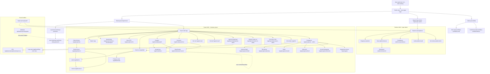

# GeraiCUAN System Map and AI Development Navigation Index

This is the canonical implementation navigation index for GeraiCUAN (UI v3, [ADR-0001](../adr/ADR-0001-ui-v3-rebuild.md); PR-82).
It helps an AI agent or full-stack developer locate the correct page, authorization boundary, data owner, mutation,
state file, executable test, and canonical specification before changing any code.

It is not a product-requirement source and it is not an XML/SEO sitemap.
Requirements remain in `02-PRD.md`, technical architecture in `03-TECHNICAL-DESIGN.md`,
system architecture in `04-SYSTEM-ARCHITECTURE.md`, data ownership in `05-DATA-MODEL.md`,
tenant isolation in `06-TENANT-ISOLATION.md`, authorization in `07-IAM-RBAC-ABAC.md`,
design system in `10-DESIGN-SYSTEM-WHITELABEL.md` (v3.2), security in `12-SECURITY-ARCHITECTURE.md`,
DevOps/Coolify in `15-DEVOPS-CICD-MIGRATIONS.md`, screen behavior in
`17-UX-FLOWS-SCREEN-CONTRACTS.md` §UX-v3, metrics and formulas in `19-METRICS-ANALYTICS-CONTRACT.md`,
and execution status in root `TASKS.md` and `STATUS.md`. If this index conflicts with those
canonical documents or repository disk truth, the canonical specification and repository disk win.

Every row below was derived from the code on disk (page guards, loaders, action imports, query parsers,
boundary files); nothing is listed that the tree does not contain.

---

## 0. Maintenance Contract (Read Before Changing Anything)

Every change touching routes, handlers, actions, data models, or navigation must update this document
**in the same change** — not afterwards and not in a separate follow-up task:

| If You Add, Rename, or Remove | This Map Must Gain / Update |
|---|---|
| A `page.tsx` (UI route) | Its route row: URL, file path, roles (from the page guard), job, reads (loaders), Server Actions, states (`loading`, `error`, `not-found`, `empty`), reference HTML (spec 17), maturity; and its row in Section 11. |
| A `route.ts` (Route Handler) | Its HTTP method, caller, authentication/signature boundary, request/response contract, and error behavior. |
| A Server Action (`"use server"`) | Its name, file path, consuming UI surface, database/domain mutations, and actor scope check. |
| A `layout.tsx`, `loading.tsx`, `error.tsx` or `not-found.tsx` | Its line in Section 10 and the counts below. |
| A repository or data owner in `src/db/` | The count below; the routes that read it. |
| A navigation destination or sidebar group | The menu tables in Section 3 (`src/lib/cms-shell-navigation.ts` order), roles, icon (`src/components/app/nav-icons.ts`), and the current-item rule. |
| A URL state key (query parameter) | Its row in Section 7: name, allowed values, fallback, owning routes. |
| A provider integration or webhook | Endpoint, credential resolution, retry/serialization policy, and contract fixture. |

### Current Repository Inventory (2026-09-26)

- **43 `page.tsx` files**:
  - 9 Public & Authentication pages (`/`, `/login/tenant`, `/login/super-admin`, `/verifikasi-dua-langkah`, `/daftar`, `/verifikasi-email`, `/verifikasi-email/konfirmasi`, `/lupa-password`, `/atur-ulang-password`).
  - 28 Authenticated Tenant CMS pages reached from 14 sidebar items in 6 sidebar groups (Utama, Pengiriman, Data, Cek, Laporan, Pengelolaan).
  - 6 Authenticated Platform CMS pages (Ringkasan, Tenant, Detail tenant, Pendaftaran, Audit, Info terbaru).
- **4 `route.ts` Route Handlers**: Better Auth (`/api/auth/[...all]`), the report CSV export (`/app/laporan/pengiriman/export.csv`), the gerai logo (`/app/brand/logo`, T-243), and the provider webhook (`/api/webhooks/mengantar`, 404 unless `MENGANTAR_WEBHOOK_ENABLED=1` and a secret are set — T-238, D-30).
- **29 files declaring Server Actions** (`"use server"`), exporting 64 Server Actions (`export async function`; T-270 added `scanForHandover`, T-272 `previewShipmentInvoice`, T-281 `cancelShipmentOnMengantar` in its own file).
- **6 `layout.tsx` files**, **33 `loading.tsx`** (28 tenant, 5 platform), **24 `error.tsx`** (23 tenant, 1 platform), **8 `not-found.tsx`** (Section 10).
- **44 repository and data-layer modules** in `src/db/` (T-275 added `owner-money-repository.ts`; T-238 added `mengantar-webhook-repository.ts` and `provider-tracking-repository.ts`; T-241 added `contact-shipment-repository.ts`; T-244 added `announcement-repository.ts`; T-245 added `wilayah-repository.ts`; T-267 added `shipment-handover-repository.ts`; T-281 added `shipment-cancellation-repository.ts`).
- These counts are checked against the filesystem by `tests/system-map-inventory.integration.test.ts` (T-199, re-enabled by T-224); a drifted number fails the suite.
- **Apex landing site**: standalone Astro static site in `apps/landing` for `https://geraicuan.com` (not part of the Next.js route tree).

---

## 1. Snapshot and Maturity Rules

- **Current Snapshot**: 2026-10-06, UI v3 committed through T-275 at HEAD `30a8eb0` (branch `feat/phase14-completion`, not merged to `main`). Every route row was re-labelled against that commit by T-276; a row whose files change after it reads WORKTREE until the change is committed.
- **Runtime Stack**: Next.js App Router 16.3.3, React 19.2.8, Drizzle ORM, Better Auth, Tailwind CSS v4, shadcn/ui (`src/components/ui`), PostgreSQL 16+ with Row-Level Security (RLS).
- **Server Model**: Server Components by default; interactive leaves are bounded client components; Server Actions and Route Handlers are remotely reachable trust boundaries and re-check authorization themselves.
- **Tenant Scope Isolation**: every tenant read and mutation resolves the actor server-side (`requireCmsScope("tenant")` → `withTenantContext`). RLS is defense in depth; application code derives tenant/outlet scope unconditionally.
- **Approval gate (PR-60)**: `requireCmsScope("tenant")` sends a gerai still `PROVISIONING` to `/app?persetujuan=diperlukan` (`TENANT_APPROVAL_REQUIRED_HREF`) unless the page passes `allowPendingApproval` (Dasbor, Buat kiriman notice, Pengaturan pages).
- **Platform Scope Isolation**: Super Admin pages resolve access via `resolvePlatformAccess` (`src/app/platform/platform-access.ts`) and read inside `withPlatformContext`. Tenant membership cannot synthesize platform authority.

### Maturity Labels

| Label | Meaning |
|---|---|
| **COMMITTED** | The route's own files and the owners named in its row are unchanged since the snapshot commit (`30a8eb0`). |
| **WORKTREE** | The route's own files or a named owner changed (or are new) in the working tree since HEAD; local tests pass, release integration and final review (T-219) are pending. A row changed since the last commit never claims COMMITTED. |
| **RELEASE-GATED** | Code exists, but live upstream mutation (live provider order creation or real payment collection) is gated behind explicit authorization and environment switches (T-153). No row carries it alone today: the gated pages are also WORKTREE, and their rows name the gate. |
| **CLOSED** | Endpoint exists on the router but refuses all incoming traffic by default (`/api/webhooks/mengantar` returns an empty 404 until the deployment sets `MENGANTAR_WEBHOOK_ENABLED=1` and `MENGANTAR_WEBHOOK_SECRET`; T-238 built the documented signed contract, D-30 keeps it off until the account's webhook is enabled). |

---

## 2. Route Hierarchy


```mermaid
flowchart TD
    Apex[Apex geraicuan.com - Astro landing] --> Home[Public entry / - dev single-origin]
    Home --> TenantLogin[Masuk gerai /login/tenant]
    Home --> PlatformLogin[Masuk Super Admin /login/super-admin]
    Home --> Register[Daftar gerai /daftar]
    Register --> EmailResend[Kirim ulang verifikasi /verifikasi-email]
    Register --> EmailConfirm[Konfirmasi email /verifikasi-email/konfirmasi]
    TenantLogin --> ForgotPass[Lupa kata sandi /lupa-password]
    ForgotPass --> ResetPass[Atur ulang kata sandi /atur-ulang-password]

    TenantLogin --> TenantShell[Tenant shell /app]
    PlatformLogin --> PlatformShell[Platform shell /platform]

    subgraph TenantCMS [Tenant CMS - 6 sidebar groups]
        TenantShell --> Dashboard[Dasbor /app]
        TenantShell --> NewShipment[Buat kiriman /app/pengiriman/baru - focused layout]
        TenantShell --> History[Histori kiriman /app/pengiriman]
        History --> Detail[Detail kiriman /app/pengiriman/:n]
        TenantShell --> Rts[Retur RTS /app/pengiriman/rts]
        TenantShell --> LabelList[Cetak resi /app/label]
        LabelList --> LabelOne[Label /app/label/:n]
        LabelList --> LabelBatch[Pratinjau cetak /app/label/cetak]
        Detail --> LabelOne
        LabelOne --> Invoice[Invoice /app/invoice/:n]
        Detail --> Invoice
        TenantShell --> Senders[Pengirim /app/kontak/pengirim]
        TenantShell --> Recipients[Penerima /app/kontak/penerima]
        Senders --> NewContact[Kontak baru /app/kontak/baru]
        Recipients --> NewContact
        Senders --> ContactDetail[Detail kontak /app/kontak/:peran/:nomor]
        Recipients --> ContactDetail
        TenantShell --> TrackAwb[Cek resi /app/cek-resi]
        TenantShell --> QuickRate[Cek tarif /app/cek-tarif]
        TenantShell --> Report[Laporan pengiriman /app/laporan/pengiriman - admin]
        TenantShell --> PrintHistory[Riwayat cetak resi /app/laporan/cetak-resi - admin]
        TenantShell --> Payouts[Pencairan COD /app/laporan/pencairan - admin]
        TenantShell --> TenantInfo[Info terbaru /app/info]
        LabelList -. scan / tandai diserahkan .-> LabelList
        TenantShell --> Settings[Pengaturan /app/pengaturan - admin]
        Settings --> LabelInfo[Informasi label /app/pengaturan/label]
        Settings --> Pickup[Titik pickup /app/pengaturan/pickup]
        Settings --> Outlet[Outlet /app/pengaturan/outlet]
        Settings --> Couriers[Mitra kurir /app/pengaturan/kurir]
        Settings --> Connection[Koneksi Mengantar /app/pengaturan/koneksi]
        Settings --> Members[Anggota dan akses /app/anggota]
    end

    subgraph PlatformCMS [Platform CMS - Super Admin]
        PlatformShell --> PlatformSummary[Ringkasan /platform]
        PlatformShell --> PlatformTenants[Gerai /platform/tenant]
        PlatformTenants --> PlatformTenantDetail[Detail gerai /platform/tenant/:id]
        PlatformShell --> Registrations[Pendaftaran /platform/pendaftaran]
        PlatformShell --> AuditLog[Audit /platform/audit]
        PlatformShell --> PlatformInfo[Info terbaru /platform/info]
    end

    subgraph Handlers [Route handlers]
        AuthRoute[Better Auth /api/auth/*] --> TenantShell
        AuthRoute --> PlatformShell
        Report --> CsvExport[CSV /app/laporan/pengiriman/export.csv]
        Settings --> LogoRoute[Logo gerai /app/brand/logo - both roles]
        ClosedWebhook[Webhook /api/webhooks/mengantar] -. 404 unless enabled .-x History
    end
```

---

## 3. Shell, Role, and Navigation Contract

### Multi-Host Routing (T-180, `src/proxy.ts`)

| Surface | Host / Origin | Routing & Access Invariant |
|---|---|---|
| **Public landing** | `https://geraicuan.com` (`GERAICUAN_PUBLIC_ORIGIN`) | Astro site `apps/landing`; links to the tenant host's `/daftar` and `/login`. |
| **Tenant CMS** | `https://app.geraicuan.com` (`GERAICUAN_TENANT_ORIGIN`) | Serves `/app/**`, `/login` (→ `/login/tenant`), `/daftar`, `/verifikasi-email/**`, `/lupa-password`, `/atur-ulang-password`. `/platform/**` answers 404. |
| **Platform CMS** | `https://bos.geraicuan.com` (`GERAICUAN_PLATFORM_ORIGIN`) | Serves `/platform/**`, `/verifikasi-dua-langkah` (T-286), `/login` (→ `/login/super-admin`). `/app/**` answers 404. |
| **Single-origin dev** | `http://localhost:3000` or Tailscale | No host split; `/` serves `src/app/page.tsx`. |

### Shell Layouts (spec 10 v3.2 §3)

| Layout | Owner | Rule |
|---|---|---|
| Tenant frame | `src/app/app/layout.tsx` → `AppShell` (`src/components/app/app-shell.tsx`) | Guard `requireCmsScope("tenant", { allowPendingApproval: true })`; anyone else → `/login/tenant?notice=session-required\|access-unavailable`. 64px primary top bar (`SiteHeader`), sidebar on the canvas (full ≥ 1024px, icon rail 768–1023px, Sheet < 768px), 1120px content column. A `PROVISIONING` gerai gets the approval notice above every page. |
| **Focused layout** (D11) | `AppShell` `FOCUSED_ROUTES = {"/app/pengiriman/baru"}` | No sidebar; the top bar holds the brand, the 3-step stepper (`FlowStepper`: Isi data · Cek tarif · Terbitkan resi) and a close ✕ to `/app/pengiriman`; the content column is centred; the summary rail stays sticky (mobile: bottom bar). |
| Settings frame | `src/app/app/pengaturan/layout.tsx` → `SettingsFrame` | Guard `requireTenantAdmin()` (Operator → `/app`). Page header "Pengaturan" + settings sub-menu (`SETTINGS_NAV_ITEMS`, `src/app/app/pengaturan/_components/settings-nav.tsx`: Profil gerai, Informasi label, Titik pickup, Outlet, Mitra kurir, Koneksi Mengantar, Anggota & akses). `/app/anggota` is outside this directory and renders `SettingsFrame` itself; its guard-only `anggota/layout.tsx` (T-236) redirects an Operator before that frame's skeleton renders. |
| Platform frame | `src/app/platform/layout.tsx` → `AppShell` scope `platform` | Guard `resolvePlatformAccess()` (T-286: Super Admin, platform host, session under 12 h, TOTP enrolled); a Super Admin without TOTP → `/verifikasi-dua-langkah`, anyone else → `/login/super-admin?notice=…` (`platformAccessRedirect`). |
| Root document | `src/app/layout.tsx` | Fonts, tokens (`globals.css`), `TooltipProvider`. Public pages render `AuthShell` (`src/app/login/_components/auth-shell.tsx`). |

The account menu in the sidebar footer (`AppSidebar`) holds "Anggota & akses" (Tenant Admin only) and "Keluar" (`POST /api/auth/sign-out`, then the scope's login page).

### Removed-Module Redirects (`next.config.ts`)

| Source | Destination | Kind |
|---|---|---|
| `/app/kontak?peran=penerima` | `/app/kontak/penerima` | 308 (T-188); listed as a route row in Section 5.2 |
| `/app/kontak` | `/app/kontak/pengirim` | 308 (T-188) |
| `/app/impor/:path*` | `/app/pengiriman/baru` | 307 (T-204, Impor CSV removed) |
| `/app/keuangan/:path*` | `/app/laporan/pengiriman` | 307 (T-204, Keuangan removed) |
| `/app/analitik/:path*` | `/app/laporan/pengiriman` | 307 (T-204, Analitik removed) |

### Tenant Navigation Registry (`src/lib/cms-shell-navigation.ts`)

The Tenant CMS sidebar lists **14 navigation items** in 6 groups, in the order of `navigationGroups` (`tenantCmsNavigation`), rendered by `src/components/app/app-sidebar.tsx`. Every item has its own icon (`NAV_ICONS` in `src/components/app/nav-icons.ts`, keyed by the item `key`) in a 40×40 box; Info terbaru and Dasbor sit at the top without their "Utama" label (T-244: Info terbaru above Dasbor, with an unread-count `SidebarMenuBadge` from the tenant layout and a dot on the icon rail; the owner's login still lands on `/app`); the other groups show an uppercase label. Items with `roles` are hidden from an Operator (the page guards refuse them too). T-263 (owner 2026-09-29): a tenant sign-in lands by role (`tenantLandingPath`, via `tenantLandingAction`) — Operator of an active gerai → `/app/label` (Cetak resi, opening on Belum dicetak), Tenant Admin and any pending gerai → `/app` (Dasbor). `/app` itself, the home link and the menu are unchanged, so Dasbor stays one item away for the Operator.

**Active match rule.** The current item is the one whose `href` is the longest match of the path: `/app` matches only exactly, every other `href` matches itself or any sub-path (`routeMatches`). Before matching, `/app/anggota` resolves as `/app/pengaturan`, and a contact page outside the role lists resolves as `/app/kontak/<role>`: `/app/kontak/baru` takes the role from `peran`, `/app/kontak/[contactId]` from `dari`, each defaulting to `pengirim` (`contactNavigationPath`). A path matching no item marks nothing current (today: `/app/invoice/[shipmentNumber]`).

| Group | Icon | Navigation Item (in order) | Path | Accessible Roles | Also Current For |
|---|---|---|---|---|---|
| **Utama** | `Megaphone` | Info terbaru | `/app/info` | Admin, Operator | — |
| | `LayoutDashboard` | Dasbor | `/app` | Admin, Operator | — (exact match only) |
| **Pengiriman** | `CirclePlus` | Buat kiriman | `/app/pengiriman/baru` | Admin, Operator | — (focused layout hides the sidebar) |
| | `FileText` | Histori kiriman | `/app/pengiriman` | Admin, Operator | `/app/pengiriman/[shipmentId]` |
| | `Undo2` | Retur (RTS) | `/app/pengiriman/rts` | Admin, Operator | — |
| | `Printer` | Cetak resi | `/app/label` | Admin, Operator | `/app/label/[shipmentId]`, `/app/label/cetak` |
| **Data** | `User` | Pengirim | `/app/kontak/pengirim` | Admin, Operator | `/app/kontak/baru?peran=pengirim` (or no `peran`), `/app/kontak/pengirim/[nomor]` |
| | `Users` | Penerima | `/app/kontak/penerima` | Admin, Operator | `/app/kontak/baru?peran=penerima`, `/app/kontak/penerima/[nomor]` |
| **Cek** | `Search` | Cek resi | `/app/cek-resi` | Admin, Operator | — |
| | `Calculator` | Cek tarif | `/app/cek-tarif` | Admin, Operator | — |
| **Laporan** | `FileChartColumn` | Laporan pengiriman | `/app/laporan/pengiriman` | **Admin only** | — |
| | `HandCoins` | Pencairan COD | `/app/laporan/pencairan` | **Admin only** | — |
| | `History` | Riwayat cetak resi | `/app/laporan/cetak-resi` | **Admin only** | — |
| **Pengelolaan** | `Settings` | Pengaturan | `/app/pengaturan` | **Admin only** | `/app/pengaturan/*`, `/app/anggota` |

### Platform Navigation Registry (`src/lib/cms-shell-navigation.ts`, `platformNavigationGroups`)

One group, "Platform". `platformCmsNavigation` matches `/platform` exactly and every other item as itself or a sub-path, falling back to Ringkasan. Icons from `NAV_ICONS` (`LayoutDashboard`, `Building2`, `UserPlus`, `ScrollText`, `Megaphone`). Access is enforced separately by `resolvePlatformAccess`, which owns no menu.

| Navigation Item (in order) | Path | Accessible Roles | Active Match Rule |
|---|---|---|---|
| **Ringkasan** | `/platform` | Super Admin only | Exact `/platform`; also the fallback |
| **Gerai** | `/platform/tenant` | Super Admin only | `/platform/tenant` and `/platform/tenant/[tenantId]` |
| **Pendaftaran** | `/platform/pendaftaran` | Super Admin only | `/platform/pendaftaran` and sub-paths |
| **Audit** | `/platform/audit` | Super Admin only | `/platform/audit` and sub-paths |
| **Info terbaru** | `/platform/info` | Super Admin only | `/platform/info` and sub-paths |

---

## 4. Public and Authentication Pages (9 Routes)

All render `AuthShell` (spec 17 UX-v3.10; polish is T-225). No route-level `loading`/`error`/`not-found` files; the root layout, the root `src/app/not-found.tsx` (M12) and framework defaults apply. Reference HTML: none (spec 17 UX-v3.7 "—").

| Route | Source File | Roles | Job | Reads | Actions | States | Ref | Maturity |
|---|---|---|---|---|---|---|---|---|
| `/` | `src/app/page.tsx` | Anyone | Single-origin entry: links to tenant login, sign-up, Super Admin login. | None | None | Static | — | COMMITTED |
| `/login/tenant` | `src/app/login/tenant/page.tsx` | Anonymous (tenant host) | Sign in to the gerai. A valid tenant session is sent to its role's landing (`signedInDestination`, L8). | `signedInDestination("tenant")`, `resolveLoginNotice("tenant")`, `resolveHostRouting` | Client `POST /api/auth/sign-in/email` (`x-geraicuan-login-scope: tenant`, `LoginForm`), then `tenantLandingAction` for the role's landing (T-263); `resendVerificationEmail` from the unverified notice | Notice (`notice`, `error` verification codes), pending, invalid credentials, unverified email; ≥ 1024 px split with the visual panel (T-225) | — | COMMITTED |
| `/login/super-admin` | `src/app/login/super-admin/page.tsx` | Anonymous (platform host) | Sign in as Super Admin: password, then the TOTP code when enrolled (T-286). An authorized Super Admin session is sent to `/platform` (L8). | `signedInDestination("platform")`, `resolveLoginNotice("platform")`, `resolveHostRouting` | Client `POST /api/auth/sign-in/email` (`x-geraicuan-login-scope: platform`); on `twoFactorRedirect`, `POST /api/auth/two-factor/verify-totp` (`TotpCodeForm`) | Notice, pending, invalid credentials, rate-limited (per IP and per email), code step (wrong code, challenge expired → back to password with notice); dark ground, no sign-up link; ≥ 1024 px split with the dark visual panel (T-225) | — | COMMITTED |
| `/verifikasi-dua-langkah` | `src/app/verifikasi-dua-langkah/page.tsx` | Super Admin without TOTP (platform host) | Enroll TOTP before any `/platform` page opens (T-286). | `resolvePlatformAccess` (`authorized` → `/platform`; anonymous/forbidden → login notice) | Client `POST /api/auth/two-factor/enable` (password), then `POST /api/auth/two-factor/verify-totp` (`TwoFactorSetup`) | Password step (wrong password, rate-limited), key step (setup key in groups of four, `otpauth://` link, code field, wrong code) → `/platform` | — | COMMITTED |
| `/daftar` | `src/app/daftar/page.tsx` | Anonymous (tenant host) | Register a gerai self-service (PR-59) in three client-side steps: Akun, Gerai, Awalan nomor (T-225). | `resolveHostRouting` | `registerStore` (one submission after step 3) | Step 1–3, per-step errors, server field error → step of the first error, pending, submitted ("periksa email"), rate-limited; ≥ 1024 px split | — | COMMITTED |
| `/verifikasi-email` | `src/app/verifikasi-email/page.tsx` | Anonymous | Ask for a new verification link. | None | `resendVerificationEmail` | Form, pending, sent, rate-limited | — | COMMITTED |
| `/verifikasi-email/konfirmasi` | `src/app/verifikasi-email/konfirmasi/page.tsx` | Token holder | Confirm the sign-up email with the sign-up password (T-198); opening the page verifies nothing. `referrer: no-referrer`. | `token` checked against `VERIFICATION_TOKEN_PATTERN` | `confirmEmailVerification` | Password form, invalid link, mismatch, rate-limited, done | — | COMMITTED |
| `/lupa-password` | `src/app/lupa-password/page.tsx` | Anonymous (tenant host) | Request a password-reset link (PR-62). | None | `requestPasswordReset` | Form, pending, sent, rate-limited | — | COMMITTED |
| `/atur-ulang-password` | `src/app/atur-ulang-password/page.tsx` | Token holder | Set a new password from the emailed link. `referrer: no-referrer`. | `token` (16–128 URL-safe chars, no `error`) | `resetPassword` | Password form, invalid/expired link, success → login with `kata-sandi-diperbarui` | — | COMMITTED |

---

## 5. Tenant CMS Pages (28 Routes)

Guards (verified in code):

- **T** = `requireTenantPrincipal` (`src/app/app/pengiriman/_list/tenant-page.ts`; the detail page and the invoice action keep an identical local copy) or `requireContactPagePrincipal` (`src/app/app/kontak/contact-page-guard.ts`): Tenant Admin or Operator of an **active** gerai; no session → `/login/tenant`; pending gerai → `/app?persetujuan=diperlukan`.
- **T+P** = `requireCmsScope("tenant", { allowPendingApproval: true })` inline: Tenant Admin or Operator, pending gerai allowed.
- **A** = `requireReportAdmin` (`src/app/app/laporan/_components/report-access.ts`): Tenant Admin of an active gerai; Operator → `/app`.
- **A+P** = `requireTenantAdmin()` (`src/app/app/pengaturan/_components/settings-data.ts`, default `STORE_SETUP`): Tenant Admin, pending gerai allowed; Operator → `/app`. **A** on `/app/anggota` is `requireTenantAdmin({})` (active gerai only).

"Boundaries" names the nearest `loading.tsx` / `error.tsx` / `not-found.tsx` (Section 10). Every `notFound()` without a dedicated file, and every unmatched URL, falls through to the root `src/app/not-found.tsx`.

### 5.1 Utama (2 Routes)

| Route | Source File | Roles | Job | Reads | Actions | States | Ref | Maturity |
|---|---|---|---|---|---|---|---|---|
| `/app/info` | `src/app/app/info/page.tsx` | T+P (Admin, Operator) | Info terbaru (T-244, PR-91, D-31; T-256): read the Admin platform's published announcements, pinned first then newest; category filter with counts (`?kategori=`), category chip, relative age with the WIB date in `title`, plain-text body with "Baca selengkapnya". Viewing marks the shown rows read for this member only; "Baru" = unread when the page loaded. | `listTenantAnnouncements` (`announcement-repository.ts`); layout badge `countUnreadAnnouncements` | `markAnnouncementsReadAction` (once per shown list, idempotent) | Boundaries `info/loading` (T-273: its own header, chips and cards), `info/error` (keeps the shell while the list fails); empty ("Belum ada info"); filtered-empty ("Belum ada info <kategori>" + "Lihat semua info"); unread cards "Baru" + dot + bold title; pinned "Disematkan" + primary edge; long body collapsed | — | COMMITTED |
| `/app` | `src/app/app/page.tsx` | T+P (Admin, Operator) | See today's situation and what needs action: KPI cards, Uang gerai (Tenant Admin only, T-275: COD belum cair, Sudah cair, Margin ongkir), Hasil pengiriman, Grafik kiriman, Kiriman terbaru, Rekap per kurir. T-284: a Tenant Admin's response schedules the automatic read-only status pull (`scheduleAutoStatusPull`, `src/lib/mengantar-status-pull.ts`; stalest ready outlet, ≥ 15 min since its last pull, last 14 days). | `loadOwnerMoney` + `summarizeOwnerMoney` (`owner-money-repository.ts`, Tenant Admin only, never called for an Operator), `listOutletReadinessSummary`, `loadTenantDashboardMetrics`, `loadTenantDashboardPeriodSummary`, `loadTenantDashboardOutcomeSummary`, `loadTenantDashboardCourierRecap`, `loadTenantDashboardPeriodTrend`, `loadTenantDashboardShipments` (`tenant-dashboard-repository.ts`); `countUnreadAnnouncements` (T-244 "N info baru" line, shown only when unread > 0); pending gerai: `listOutletReadiness` | None (links: Buat kiriman, Siapkan outlet, Laporan pengiriman, Pencairan COD, Info terbaru) | Boundaries `app/loading`, `app/error`; pending gerai → setup steps (+ refused banner on `persetujuan=diperlukan`); no outlet ready alert; no shipments; filtered-empty; invalid outlet; per-region error (`settle`) | `dasbor.html` | COMMITTED |

### 5.2 Pengiriman (7 Routes)

| Route | Source File | Roles | Job | Reads | Actions | States | Ref | Maturity |
|---|---|---|---|---|---|---|---|---|
| `/app/pengiriman/baru` | `src/app/app/pengiriman/baru/page.tsx` | T+P (pending gerai sees a read-only notice) | Create a shipment and issue its resi in one focused page: Isi data → Cek tarif → Terbitkan resi. Issuance is RELEASE-GATED (sanctioned order fixture, T-153). Below 768 px (T-263) a section complete when the form opens folds to one summary line with "Ubah" (`aria-expanded`, focus into the section); any complete section folds again with "Selesai"; a server error unfolds all. T-287: without `draft`, the Cek tarif prefill (`outlet`, `area`, `areaLabel`, `q`, `berat`; §7) starts the form on that outlet, area and weight. | `listReadyShipmentOutlets`, `listOutletPickupPoints`, tenant name/WhatsApp, `loadShipmentFlowDraft`, `loadLatestEstimateSnapshot`, `shipmentCodFormulaRetired`, `loadTenantDisabledCouriers` (Mitra kurir filter on the offered services, T-243) | `saveShipmentDraft`, `searchSenderShipmentContacts`, `searchRecipientShipmentContacts`, `selectShipmentContact`, `searchWilayahDestinationAreas`, `resolveWilayahDestinationArea`, `searchMengantarDestinationAreas` (shared `DestinationAreaPicker`, T-245), `loadShipmentEstimate` (auto once), `verifyShipmentDraftDestinationArea`, `confirmShipmentIssuance` (shared `IssuancePanel`) | Boundaries own `loading`/`error`; pending approval notice; no ready outlet (admin: link to settings); field errors + summary; estimate loading/failure + retry; issuance pending/outcomes; draft already processed → links to detail/label | `buat-kiriman.html` | COMMITTED |
| `/app/pengiriman` | `src/app/app/pengiriman/page.tsx` | T | Histori kiriman: find a shipment and act on it; Tenant Admin pulls statuses from Mengantar. Below 768 px (T-263): search first, period + status (tiles' groups, "Status lainnya") in one Filter sheet with the active count; whole record card is the link. T-284: a Tenant Admin's response schedules the automatic read-only status pull (`scheduleAutoStatusPull`, `src/lib/mengantar-status-pull.ts`; stalest ready outlet, ≥ 15 min since its last pull, last 14 days). | `loadShipmentQueuePage` (`shipment-queue-repository.ts`); admin: `loadProviderDeliveryStatusBasis`, `listTenantOutlets` | `pullMengantarStatus` (admin, `StatusPull`) | Boundaries own `loading`/`error`; adjusted-filter alert; empty; filtered-empty (status or `cari`); stale filters admin-only; freshness line; pull result | `histori-kiriman.html` | COMMITTED |
| `/app/pengiriman/[shipmentId]` | `src/app/app/pengiriman/[shipmentId]/page.tsx` | T | Detail kiriman: identity strip, route, tracking timeline, parcel and payment, parties; rail with one next action. Recovery/reconciliation run live under `MENGANTAR_LIVE_ORDERS_ENABLED` (T-282), else the development fixture; the rail action is locked when neither is on. T-287: with a resi and status ISSUED or IN_TRANSIT, the print rail adds "Kirim resi via WhatsApp" (`wa.me`, user-sent; `resiWhatsappHref`, `src/lib/whatsapp.ts`; null for any other status or a non-Indonesian number): recipient name, the label's sender name (the masked sender when masking is on; omitted when none), courier service and resi — no amount or address. | `resolveShipmentRoute` (`resolveShipmentRouteKey`), `loadShipmentDetailView` (`detail-data.ts`: `loadShipmentDetail`, `loadShipmentFlowDraft`, `listOutletPickupPoints`, `shipmentCodFormulaRetired`, provider snapshots/observations, `listProviderHistoryEvents` — T-238 courier history for both roles, return resi, admin-only "Catatan dari Mengantar", `loadShipmentHandover` — T-267 recorded handover for both roles), `loadTenantDisabledCouriers` (issuance step only: Mitra kurir filter, T-243) | `confirmShipmentIssuance` + `verifyShipmentDraftDestinationArea` (`IssuancePanel`), `recoverShipmentUnpaidPayment`, `reconcileShipmentUnknownSubmission`, `checkStaleShipmentOperation`, `undoShipmentHandoverAction` ("Batalkan penandaan", T-267, only while `ISSUED`), `cancelShipmentOnMengantar` ("Batalkan kiriman", T-281: Tenant Admin, live switch on, ISSUED or AWAITING_UPSTREAM_PAYMENT; AlertDialog with a required checkbox); links to label, `?invoice=1`, draft | Boundaries own `loading`/`error`/`not-found`; UUID or `GC-…` → canonical number redirect; per-status rail (Diestimasi, Menunggu pembayaran, Perlu rekonsiliasi, Resi terbit, Bermasalah); retired COD formula refusal; T-267 Penyerahan: recorded ("Diserahkan 30 Sep, 14.05 WIB oleh … · dijemput kurir|diantar ke outlet" + catatan + rencana) / not recorded ("Belum ditandai diserahkan ke kurir"); status-card signal "Diserahkan, belum discan kurir" (≥ 24 h, still `ISSUED`) | `detail-kiriman.html` | COMMITTED |
| `/app/pengiriman/rts` | `src/app/app/pengiriman/rts/page.tsx` | T | Retur: follow returns and courier problems; the return resi (`cnote_no_rts`, T-238) under the resi. Below 768 px (T-263): one Filter sheet (period + status, active count); Retur has no search. | `loadRtsShipmentsPage` (`rts-repository.ts`); admin: `listTenantOutlets` | `pullMengantarStatus` (admin) | Boundaries own `loading`/`error`; adjusted-filter alert; empty; filtered-empty | `retur-rts.html` | COMMITTED |
| `/app/label` | `src/app/app/label/page.tsx` | T | Cetak resi, the counter's queue and the Operator's landing (T-263): opens on Belum dicetak, then Siap diserahkan (printed, still Resi terbit, no handover recorded) and Diserahkan (T-267: handover recorded, waiting for Mengantar's pickup scan; row → Detail kiriman); list issued shipments, print one, or select several for the print-format modal (PR-87). Below 768 px: search + Filter sheet (period, print state, active count) instead of the filter row and tiles; whole record card is the link. T-266: dense rows (resi + print state, recipient · area, courier logo · payment · issued) with the selection as a 44 px full-height leading column; below 1024 px the "Cetak terpilih" toolbar element becomes a bottom selection bar while ≥ 1 resi is chosen (count, Batal pilih, Cetak terpilih; safe-area inset; never printed); "Pilih semua belum dicetak (N)" selects across pages (≤ 50 per batch). T-267: on Siap diserahkan the same bar element records the handover instead of printing ("Tandai sudah diserahkan (n)" → dialog: count, Cara penyerahan Dijemput kurir / Diantar ke outlet defaulting to the parcels' planned handover when they agree, Catatan ≤ 160 → "Tandai n paket"), "Pilih semua siap diserahkan (N)" when the queue is longer than the page, an outcome notice above the list (marked / already / refused per row), and the closing state "Semua paket hari ini sudah diserahkan" (only with no suffix filter and ≥ 1 handover today). T-270 (owner 2026-10-01): Belum dicetak, Siap diserahkan and Diserahkan are work queues — every parcel in that state whatever the period (a note says so); Semua resi and Dibatalkan keep the period. Siap diserahkan groups its rows into Hari ini / Tertunda (first print today vs before, WIB; Tertunda header in the warn tone) with each row's waiting age ("dicetak 3 hari lalu"), demotes per-row reprint to a named icon action, and carries the "Scan resi" field (keyboard-wedge scanner or typed nomor kiriman → `scanForHandover`; autofocus unless the pointer is coarse; outcome in an `aria-live` line; the field clears and keeps focus); the handover dialog lists the chosen resi (collapsible). T-274: below 768 px a segmented queue switch (Belum dicetak · Siap diserahkan · Diserahkan with counts, links with `aria-current`, same `cetak`/period/`q` keys) sits above the search; the period note is one line beside the period control; every width shows "Hari ini: n dicetak · n diserahkan · n tertunda". | `loadLabelIndexPage` (`label-print-repository.ts`), `loadLabelDaySummary` (`src/app/app/label/label-day-summary.ts`, T-274: LBL-PRINTED-TODAY, LBL-HANDED-OVER-TODAY — also the closing state's count — and LBL-DAY-PENDING (T-277; the tile keeps LBL-READY-PENDING), in the list's transaction), `loadTenantBrand` (default size preselected in the modal, T-243) | `selectUnprintedLabels` (read-only, T-266); `markShipmentsHandedOverAction`, `selectReadyForHandover` (T-267); `scanForHandover` (read-only, T-270); row "Cetak" → `/app/label/[n]`; "Cetak terpilih (N)" → `/app/label/cetak` | Boundaries own `loading`/`error`; invalid AWB suffix; empty; filtered-empty; handover closing state; handover outcome notice (success / partial / none) | `cetak-resi.html` | COMMITTED |
| `/app/label/[shipmentId]` | `src/app/app/label/[shipmentId]/page.tsx` | T | Print the masked thermal label (10×15 / 10×10); with `invoice=1` print label then invoice as two ordered steps. T-263: preview first in the DOM (phones: preview → print card → Rincian uang → history; ≥ 1024 px unchanged columns); one print button per job — the invoice is the in-card mode link "Sertakan invoice" / "Tanpa invoice", no header print actions; T-265: the stub carries no handover time (returns with the handover feature). | `resolveShipmentRoute`, `loadPrintableLabel`, `listPrintEvents`, `loadShipmentInvoice` (with `invoice=1`), `loadTenantLabelFields` (Informasi label, PR-86), `loadPrintBrand` (gerai logo, catatan resi, default size — `GeraiBrandProvider`, T-243) | `recordLabelPrint`, `previewShipmentInvoice` + `issueShipmentInvoice` (`IssueInvoiceButton` confirmation, T-272) | Boundaries own `loading`/`error`/`not-found`; not issued / awaiting upstream payment (blocked alert); ready; print history | `label-detail.html` | COMMITTED |
| `/app/label/cetak` | `src/app/app/label/cetak/page.tsx` | T | Batch print view for selected shipments: labels, invoices or both. | `loadBatchPrint` (`batch-data.ts`: `resolveShipmentRouteKey`, `loadPrintableLabel`, `loadShipmentInvoice` — read-only; missing invoices are issued only by the explicit button), `loadTenantLabelFields` (Informasi label, PR-86), `loadPrintBrand` (T-243) | `recordBatchLabelPrints`, `issueBatchInvoices` | Boundaries own `loading`/`error`; nothing printable (empty); invalid numbers dropped; per-shipment unavailable | — (no spec 17 row; PR-87 modal target) | COMMITTED |

### 5.3 Invoice (1 Route)

| Route | Source File | Roles | Job | Reads | Actions | States | Ref | Maturity |
|---|---|---|---|---|---|---|---|---|
| `/app/invoice/[shipmentNumber]` | `src/app/app/invoice/[shipmentNumber]/page.tsx` | T | Print or reprint the nota alone (80 mm / A4, UX-v3.9); issuing is never automatic here. | `parseShipmentRouteKey`, `resolveShipmentRouteKey`, `loadShipmentInvoice` (`shipment-invoice-repository.ts`), `loadPrintableLabel`; the nota's logo is the version recorded at issuance (`shipment_invoices.logo_sha256` → `/app/brand/logo?sha=`, T-247), not `loadPrintBrand` | `previewShipmentInvoice` then `issueShipmentInvoice` ("Terbitkan invoice?" confirmation with the nota, T-272) | Boundaries own `loading`/`error`/`not-found`; non-canonical key → redirect; not issued ("Invoice terbit setelah resi terbit"); invoice absent; issued | `label-detail.html` (layout) | COMMITTED |

### 5.4 Data kontak (6 Routes + 1 Redirect)

| Route | Source File | Roles | Job | Reads | Actions | States | Ref | Maturity |
|---|---|---|---|---|---|---|---|---|
| `/app/kontak/pengirim` | `src/app/app/kontak/pengirim/page.tsx` | T (via `ContactDirectory`) | Reuse sender contacts: tabs Aktif/Diarsipkan/Semua, live search; columns Nama + kategori · WhatsApp · Alamat utama · Kiriman (CON-SHP-COUNT, % terkirim) · Status · Aksi (T-241). | `loadContactDirectoryPage` (role sender, `contact-repository.ts`; `loadContactShipmentCounts`, `contact-shipment-repository.ts`) | `searchContacts` (live search; term never in the URL) | Boundaries own `loading`/`error`; empty; no results; archived-empty; page past the end → last page | `pengirim.html` | COMMITTED |
| `/app/kontak/penerima` | `src/app/app/kontak/penerima/page.tsx` | T (via `ContactDirectory`) | Same for recipient contacts. | `loadContactDirectoryPage` (role recipient) | `searchContacts` | As Pengirim | `penerima.html` | COMMITTED |
| `/app/kontak` | `next.config.ts` redirect | T (target pages) | Old bookmark: `peran=penerima` → Penerima, else → Pengirim (308, query kept). | — | — | Redirect | — | COMMITTED |
| `/app/kontak/baru` | `src/app/app/kontak/baru/page.tsx` | T | Create a sender/recipient contact. | `listReadyShipmentOutlets` (destination search account) | `saveContact`, `searchWilayahDestinationAreas`, `resolveWilayahDestinationArea`, `searchMengantarDestinationAreas` (`DestinationAreaPicker`) | Boundaries own `loading`/`error`; validation + summary; no ready outlet; success → detail `tersimpan=1` | `kontak-baru.html` | COMMITTED |
| `/app/kontak/pengirim/[nomor]` | `src/app/app/kontak/pengirim/[nomor]/page.tsx` | T (via `ContactDetail`, `contact-detail.tsx`; archive: Tenant Admin only, enforced in `archiveContact`) | T-241 sender detail by per-tenant contact number: header, 4 KPI (CON-SHP-*), then (T-250) two columns from a 896px content column: Riwayat kiriman and addresses (Jadikan utama) | one Data kontak form (kategori, Peran) and archive; one column below. | `getContactByNumber`, `listContactAddresses`, `loadContactShipmentSummary`, `loadContactShipmentHistory`, `listReadyShipmentOutlets` | `updateContactAction`, `addContactAddressAction`, `updateContactAddressAction`, `setPrimaryContactAddressAction`, `archiveContactAction`, `searchWilayahDestinationAreas`, `resolveWilayahDestinationArea`, `searchMengantarDestinationAreas` | Boundaries own `loading`/`error`/`not-found`; malformed/unknown/other-tenant number → 404; role not held → redirect to the held role; saved (`tersimpan=1`); archived read-only (`diarsipkan=1`); no shipments; Operator view | `pengirim-detail.html` | COMMITTED |
| `/app/kontak/penerima/[nomor]` | `src/app/app/kontak/penerima/[nomor]/page.tsx` | As above | Same for a recipient contact (party role RECIPIENT). | As above | As above | As above | `penerima-detail.html` | COMMITTED |
| `/app/kontak/[contactId]` | `src/app/app/kontak/[contactId]/page.tsx` | T | Legacy UUID detail URL: `permanentRedirect` (308 digest) to `/app/kontak/<peran>/<n>` (T-241; `dari` kept when still held). The `/app` loading boundary streams the response, so the redirect arrives as HTTP 200 with a meta refresh + client replace, not a raw 308 header. | `getContact` | — | non-UUID/unknown/other tenant → "Kontak tidak ditemukan" (`notFound()`, streamed); Redirect | — | COMMITTED |

### 5.5 Cek (2 Routes)

| Route | Source File | Roles | Job | Reads | Actions | States | Ref | Maturity |
|---|---|---|---|---|---|---|---|---|
| `/app/cek-resi` | `src/app/app/cek-resi/page.tsx` | T | Track by shipment number or resi (posted, never in the URL); timeline includes the courier history and the return resi (T-238). | None on render | `lookupShipmentTracking` | Boundaries own `loading`/`error`; idle placeholder; pending skeleton; not found; invalid; rate limited; unavailable; result facts + timeline (T-242) | `cek-resi.html` | COMMITTED |
| `/app/cek-tarif` | `src/app/app/cek-tarif/page.tsx` | T | Compare courier rates before creating a shipment; the gerai's switched-off couriers (Mitra kurir, T-243) are filtered in `checkShippingRates`. T-287: a result with services links "Buat kiriman ke tujuan ini" to `/app/pengiriman/baru` with the checked outlet, area and weight (URL state `outlet`/`area`/`areaLabel`/`q`/`berat`). | `listReadyShipmentOutlets` | `checkShippingRates`, `searchWilayahDestinationAreas`, `resolveWilayahDestinationArea`, `searchMengantarDestinationAreas` | Boundaries own `loading`/`error`; no ready outlet; idle placeholder; pending skeleton; stale re-check; unsupported route (empty); provider error + Coba lagi; result highlights + courier chips (T-242) | `cek-tarif.html` | COMMITTED |

### 5.6 Laporan (Tenant Admin Only — 2 Routes)

| Route | Source File | Roles | Job | Reads | Actions | States | Ref | Maturity |
|---|---|---|---|---|---|---|---|---|
| `/app/laporan/pengiriman` | `src/app/app/laporan/pengiriman/page.tsx` | A | Period report: Ringkasan panels (T-251), Tren harian beside Distribusi status grouped by outcome (T-254), totals per courier (with % terkirim / % retur), Tingkat penerbitan resi per kurir (T-273, was Performa kurir; HTML bars), Wilayah tujuan, Rute teratas, paginated list, CSV export (T-235). | `loadAnalyticsFilterOptions`, `loadShipmentReportPage`, `loadShipmentReportAnalytics` (own transaction) (`shipment-report-repository.ts`), `loadCourierPerformance` (own transaction) | None (link to `export.csv` carrying the filters) | Boundaries own `loading`/`error`; rejected filter reads nothing; empty; filtered-empty; chart card error only; analytics error alert only | `laporan-pengiriman.html` | COMMITTED |
| `/app/laporan/pencairan` | `src/app/app/laporan/pencairan/page.tsx` | A | Pencairan COD (T-275, D-41, PR-93): what COD is still outside, what Mengantar paid out per its cleared invoices, and the ongkir margin the gerai keeps, proven or estimated; margin per kurir; COD resi by Belum cair / Perlu dicek / Sudah cair / Retur with expected vs paid and the variance. | `listTenantOutlets`, `loadOwnerMoney` (`owner-money-repository.ts`, ≤ 5000 resi per period, Tenant Admin only), `summarizeOwnerMoney`, `ownerPayoutState`, `ownerMarginUnits` | `pullMengantarStatus` (the existing read-only Mengantar pull; now also revalidates this page and `/app`) | Layout guard `requireReportAdmin` (Operator → `/app`); own `loading`/`error`; never pulled; empty tab; filtered-empty; truncated period; unknown outlet ignored | — | COMMITTED |
| `/app/laporan/cetak-resi` | `src/app/app/laporan/cetak-resi/page.tsx` | A | Who printed what: print events with role, result, order, reprint. | `loadAnalyticsFilterOptions`, `loadPrintHistoryPage` (`label-print-repository.ts`, ≤ 200 rows) | None | Boundaries own `loading`/`error`; empty; filtered-empty | `riwayat-cetak-resi.html` | COMMITTED |

### 5.7 Pengelolaan (Tenant Admin Only — 6 Routes)

| Route | Source File | Roles | Job | Reads | Actions | States | Ref | Maturity |
|---|---|---|---|---|---|---|---|---|
| `/app/pengaturan` | `src/app/app/pengaturan/page.tsx` | A+P | Profil gerai: name (read-only), gerai WhatsApp (T-233), Logo gerai (upload/ganti/hapus, grayscale label preview) and Brand gerai (catatan resi, kategori usaha, email CS, website) (T-243), the one-time shipment prefix lock. | `loadTenantProfile`, `loadTenantBrand` (`tenant-settings-repository.ts`), `loadTenantShipmentPrefix` | `saveTenantContact`, `uploadGeraiLogo`, `removeGeraiLogo` (confirm dialog), `saveGeraiProfile`, `saveShipmentPrefix` (confirm dialog) | Boundaries own `loading`, `pengaturan/error`; `?outlet=` → redirect to Outlet; WhatsApp invalid/saved; no logo / logo / refused upload (SVG, type, size, dimensions); profile field errors; locked prefix | `pengaturan.html` | COMMITTED |
| `/app/pengaturan/label` | `src/app/app/pengaturan/label/page.tsx` | A+P | Informasi label (PR-86, T-229, T-243): size option cards, per-size switches (sender address/phone, recipient name/phone/address detail, return warning, Logo kurir, Logo gerai, Catatan resi), the gerai default label size, and a sticky live preview of the real `LabelSheet` (`LabelPreviewFrame`: Data contoh badge, paper size caption, Pas layar/100%/150%; phone: "Lihat pratinjau" jump link); one Simpan. | `loadTenantLabelFields`, `loadTenantProfile`, `loadPrintBrand` (`tenant-settings-repository.ts`) | `saveLabelSettings` | Boundaries own `loading`, `pengaturan/error`; saved / refused alert; no row = defaults; logo/catatan switch disabled until the gerai has one | `pengaturan.html`, Mengantar analysis §9.12 | COMMITTED |
| `/app/pengaturan/pickup` | `src/app/app/pengaturan/pickup/page.tsx` | A+P | Titik pickup per outlet: add from Mengantar, set default, remove; internal notes per point (PIC, WhatsApp PIC, jadwal rutin, instruksi akses driver — "Catatan internal, tidak dikirim ke Mengantar", T-243). | `loadSettingsOutlets` (`listOutletReadiness`), `listOutletPickupPoints` | `loadMengantarPickupOptions`, `addOutletPickupPoint`, `setDefaultOutletPickupPoint`, `removeOutletPickupPoint`, `savePickupPointNotes` (dialog) | Boundaries own `loading`, `pengaturan/error`; no outlet; no pickup point; provider error; delete confirm | `pengaturan.html` | COMMITTED |
| `/app/pengaturan/outlet` | `src/app/app/pengaturan/outlet/page.tsx` | A+P | Outlet readiness checklist (pickup point, Mengantar connection). | `loadSettingsOutlets` (`listOutletReadiness`) | None | Boundaries own `loading`, `pengaturan/error`; no outlet; missing configuration | `pengaturan.html` | COMMITTED |
| `/app/pengaturan/kurir` | `src/app/app/pengaturan/kurir/page.tsx` | A+P | Mitra kurir (T-243): one switch per Mengantar courier (logo + name; Ninja never listed, D-29); switched-off couriers are left out of Cek tarif and Buat kiriman. | `loadTenantDisabledCouriers` (`tenant-settings-repository.ts`) | `saveCourierPreferences` | Boundaries own `loading`, `pengaturan/error`; saved / refused alert; all-off refused | `pengaturan.html` (Mitra Kurir tab) | COMMITTED |
| `/app/pengaturan/koneksi` | `src/app/app/pengaturan/koneksi/page.tsx` | A+P | Koneksi Mengantar: platform default or the gerai's own API key. | `loadSettingsOutlets` (`listOutletReadiness`) | `savePrivateMengantarCredential`, `switchMengantarToPlatformDefault` (confirm dialog) | Boundaries own `loading`, `pengaturan/error`; no outlet; `PRIVATE_ONLY` tenants cannot switch | `pengaturan.html` | COMMITTED |
| `/app/anggota` | `src/app/app/anggota/page.tsx` | A (`requireTenantAdmin({})`, active gerai) | Anggota & akses: what the page is (one line), invite from the section header (dialog), stat strip (total · Pemilik gerai · Operator), member list with "Kelola akses" (change role, deactivate) (T-256). | `listTenantMembers` (`member-governance-repository.ts`) | `inviteMemberAction`, `changeMemberRoleAction`, `deactivateMemberAction` | Boundaries own `loading`/`error`; last admin protected; member not found; inactive members; invite refused (dialog stays open) / done (result under the header) | `anggota.html` | COMMITTED |

---

## 6. Platform CMS Pages (Super Admin Only — 6 Routes)

Guard: the platform layout's `resolvePlatformAccess`, and again in the page through `loadPlatformView` / `requirePlatformPrincipal` (`src/app/platform/_components/platform-view.ts`). Monitoring pages read inside `withPlatformContext` and record a monitoring-access audit event (`recordPlatformMonitoringAccess`) on every view; each region degrades alone (`settle`).

| Route | Source File | Roles | Job | Reads | Actions | States | Ref | Maturity |
|---|---|---|---|---|---|---|---|---|
| `/platform` | `src/app/platform/page.tsx` | Super Admin | Ringkasan (T-257): Kesehatan platform stat strip with "?" (T-278: caption from `PLATFORM_HEALTH_CAPTION`, failure share one decimal, "Diperbarui … WIB" from `health.generatedAt` with the shared stale "Muat ulang" `FreshnessLine`), Perlu perhatian, trend with period totals and a data-table disclosure, Volume platform, tenant usage, latest audit without monitoring views or per-parcel handover rows (`hideRoutineEvents`, T-268). | `loadPlatformView("overview")`: `readPlatformHealth`, `readPlatformCounts`, `readTrend`, `listTenantUsage`, `listAuditEvents`, `readFilterOptions` | None | Boundaries `platform/loading`, `platform/error`; adjusted filters; per-region error | `platform-ringkasan.html` | COMMITTED |
| `/platform/tenant` | `src/app/platform/tenant/page.tsx` | Super Admin | Tenant list with search, status strip (`status-gerai`, PLT-TEN-*) and usage; create a tenant. | `loadPlatformView("tenant-list")`: `listTenantUsage` | `submitPlatformTenantLifecycle` (create) | Boundaries own `loading`, `platform/error`; no tenant; no match | `platform-tenant.html` | COMMITTED |
| `/platform/tenant/[tenantId]` | `src/app/platform/tenant/[tenantId]/page.tsx` | Super Admin | Tenant detail (T-257): Ringkasan gerai stat strip (incl. member and outlet counts), Outlet + Awalan side by side, submissions, finance read-only, audit without monitoring views or per-parcel handover rows (T-268), Zona berbahaya, Arsipkan gerai (T-279; `TenantArchive`, `src/app/platform/tenant/_components/tenant-archive.tsx`; ACTIVE/SUSPENDED only, hidden once ARCHIVED). | `loadPlatformView("tenant-detail")`: `readTenantDetail`, `readPlatformCounts`, `readPlatformTenantFinanceSummary`, `listAuditEvents`; `loadPlatformTenantShipmentPrefix` | `submitPlatformTenantLifecycle` (suspend/reactivate, typed name; archive, typed name in the dialog), `unlockShipmentPrefix` | Boundaries own `loading`/`not-found`, `platform/error`; non-UUID/unknown → 404; per-region error | `platform-tenant.html` | COMMITTED |
| `/platform/pendaftaran` | `src/app/platform/pendaftaran/page.tsx` | Super Admin (`requirePlatformPrincipal`) | Approve or reject self-service registrations; each card says how long it has waited, "?" explains the flow (T-257). | `listRegistrationQueue` (`tenant-registration-repository.ts`), `listRegistrationDecisions` (decision history, filtered by action in SQL, T-268), `readPlatformClock` | `reviewRegistration` | Boundaries own `loading`, `platform/error`; empty queue; region error | `platform-pendaftaran.html` | COMMITTED |
| `/platform/audit` | `src/app/platform/audit/page.tsx` | Super Admin | Audit trail (T-257): time WIB + "n menit lalu", action, actor, gerai (tenantless: "Platform" for a platform target, else "Gerai tidak tercatat", T-259), result; filters period, gerai, `aksi`, `hasil`; T-273: actor name + role, Objek column, page views hidden unless `kunjungan=tampil`. | `loadPlatformView("audit")`: `listAuditEvents` | None | Boundaries own `loading`, `platform/error`; empty; no match; adjusted filters | `platform-audit.html` | COMMITTED |
| `/platform/info` | `src/app/platform/info/page.tsx` | Super Admin (`requirePlatformPrincipal`) | Info terbaru (T-244, D-31; T-256): write platform announcements every gerai reads — list with status Draf/Tayang/Disematkan, status filter with counts (`?status=`) and date order (`?urut=`), create/edit in a dialog with character counters and a tenant-card preview (judul, kategori, isi, sematkan; Tayangkan or Simpan draf), takedown with confirmation; one page-level result line. | `listPlatformAnnouncements` in `withPlatformContext` | `saveAnnouncement`, `unpublishAnnouncement` | Boundaries `platform/loading`, `platform/error`; empty; filtered-empty; field errors; denied; result line (success / takedown / error) | — | COMMITTED |

---

## 7. Canonical URL-State Dictionary

All query parameters are validated by route-specific parsers that reject or canonicalize invalid input and **never broaden tenant scope**. No recipient name, phone or address ever rides in a URL (spec 10 §11).

| Parameter | Accepted Values and Validating Owner | Target Routes | Behavior on Invalid or Absent Input |
|---|---|---|---|
| `rentang` | `hari-ini`, `kemarin`, `minggu-ini`, `bulan-ini`, `bulan-lalu`, `7-hari`, `30-hari`, `kustom` (`parseAnalyticsRange`, `src/lib/analytics-range.ts`) | Dasbor, Histori, Retur, Cetak resi, every Laporan page (incl. Pencairan COD), all platform pages; detail back link keeps it (`queueBackHref`) | Default `7-hari` on Dasbor (`DASHBOARD_DEFAULT_PRESET`), `30-hari` elsewhere; unknown → default + adjusted-filter notice |
| `dari`, `sampai` | `YYYY-MM-DD`, only with `rentang=kustom`; span ≤ 366 days | Range-aware routes | Malformed or illogical → default period with notice |
| `tz` | `Asia/Jakarta` (default), `Asia/Makassar`, `Asia/Jayapura`, `UTC` | Range-aware routes | Unknown → `Asia/Jakarta` |
| `khusus` | Accepted range key on platform routes (`platform-monitoring-filters.ts` `ANALYTICS_KEYS`) | Platform pages | Parsed with the range |
| `outlet` | Tenant-owned outlet UUID | Dasbor, Laporan pengiriman, Riwayat cetak resi, Pencairan COD, Pengaturan pickup/outlet/koneksi; `/app/pengaturan?outlet=` redirects to Outlet; platform (with `tenant`) | Foreign/unknown: Dasbor shows invalid-outlet state; Laporan rejects the filter and reads nothing; settings fall back to the first outlet |
| `cari` | Shipment number or resi fragment `^[A-Za-z0-9-]{3,40}$`, upper-cased (`parseShipmentQueueQuery`) | Histori kiriman | Invalid → dropped with notice; never a name or phone |
| `status` (Histori) | `ALL`, `ACTION_REQUIRED`, `NEEDS_ATTENTION`, `READY_TO_PROGRESS`, `ISSUED_TODAY`, `STALE_48H`, `STALE_4D` (Tenant Admin only, T-231), every `shipmentStatuses` value | `/app/pengiriman` | Unknown → `ALL` + notice; stale filter for an Operator → `ALL` + notice |
| `status` (Retur) | `ALL`, `RTS_QUEUED`, `RTS_IN_TRANSIT`, `RTS_RECEIVED`, `PROBLEM` (`parseRtsQuery`) | `/app/pengiriman/rts` | Unknown → `ALL` + notice |
| `status` (Pencairan COD) | `belum` (default, left out of the URL), `dicek`, `cair`, `retur` (`parsePayoutTab`, T-275) | `/app/laporan/pencairan` | Absent/unknown → Belum cair |
| `status` (Kontak) | `active` (default, kept out of the URL), `archived`, `all` (`parseContactStatusFilter`) | Pengirim, Penerima | Unknown → Aktif |
| `status` (Laporan, platform) | Lifecycle status (`parseTenantAnalyticsQuery`, `parsePlatformFilters`) | Laporan pengiriman, platform pages | Unknown → dropped with notice |
| `page` | Positive integer | Histori, Retur, Cetak resi | Invalid → 1 + notice; past the end → last page |
| `halaman` | Positive integer | Pengirim, Penerima, Laporan pengiriman, Riwayat cetak resi, Pencairan COD, platform pages | Invalid → 1 |
| `kurir` | Courier code the tenant has used (`loadAnalyticsFilterOptions`) | Laporan pengiriman, platform | Unknown → filter rejected (Laporan) / dropped (platform) |
| `basis` | Retired (T-278): the removed Analitik table's event basis. `parseTenantAnalyticsQuery` no longer reads it, so an old link's value is ignored and dropped from the canonical query and the export link | Laporan pengiriman | Any value → ignored, no notice |
| `q` | AWB suffix `^[a-z0-9]{3,24}$`i (`parseLabelQuery`); tenant search 2–80 chars (platform) | `/app/label`, `/platform/tenant` | Label: invalid → error text and an empty list, never a guess |
| `cetak` | `belum` (default since T-263, left out of the URL), `semua`, `sudah` (tile "Siap diserahkan"), `diserahkan` (T-267: handover recorded, waiting for the pickup scan), `batal` (T-238: cancelled resi). T-270: the period keys apply to `semua` and `batal` only; `belum`, `sudah` and `diserahkan` are state queues and ignore them | `/app/label` | Unknown → `belum` |
| `n` | Comma list of tenant shipment numbers (`^[1-9][0-9]{4,9}$`, ≤ 50, deduplicated) (`parseBatchPrintQuery`) | `/app/label/cetak` | Invalid entries dropped and listed, never guessed |
| `ukuran` | `10x15` (default), `10x10` | `/app/label/cetak` | Unknown → default |
| `isi` | `label` (default), `invoice`, `keduanya` | `/app/label/cetak` | Unknown → `label` |
| `invoice` | `1` | `/app/label/[shipmentId]` | Anything else → label only |
| `draft` | Shipment UUID | `/app/pengiriman/baru`; `/app?draft=<uuid>` redirects there | Non-UUID or foreign → fresh form |
| `outlet`, `area`, `areaLabel`, `q`, `berat` | T-287 prefill from Cek tarif (`shipmentPrefillHref` / `parseShipmentPrefill`, `src/lib/shipment-prefill.ts`): an outlet the page lists, a Mengantar area id `^[A-Za-z0-9][A-Za-z0-9._-]{0,159}$` with its label (≤ 320, no control characters) and search words (≤ 100), whole grams 1–100 000 | `/app/pengiriman/baru` (no `draft`) | Any invalid value → no prefill (a bad `berat` drops only the weight); the area is re-validated against the outlet's Mengantar account when the draft is saved |
| `peran` | `pengirim` (default), `penerima` | `/app/kontak/baru` (also the legacy `/app/kontak` redirect) | Unknown → `pengirim` |
| `dari` (Kontak) | `pengirim`, `penerima` | `/app/kontak/[contactId]` (legacy redirect only, T-241) | Absent/unknown/not held → the contact's first role |
| `tersimpan`, `diarsipkan` | `1` | `/app/kontak/pengirim/[nomor]`, `/app/kontak/penerima/[nomor]` | Success notice only |
| `riwayat` | `cod`, `non-cod` | `/app/kontak/pengirim/[nomor]`, `/app/kontak/penerima/[nomor]` | Absent/unknown → Semua (T-241) |
| `halaman` (Riwayat kiriman) | positive integer | `/app/kontak/pengirim/[nomor]`, `/app/kontak/penerima/[nomor]` | Invalid → 1; past the end → last page |
| `persetujuan` | `diperlukan` | `/app` | Refused banner for a pending gerai |
| `kategori` | `fitur-baru`, `info-kurir`, `jadwal`, `pemeliharaan`, `lainnya` (`parseAnnouncementCategoryParam`, `src/lib/announcements.ts`, T-256) | `/app/info` | Absent/unknown → Semua |
| `status` (Info terbaru, platform) | `tayang`, `draf` (`parsePlatformAnnouncementView`, T-256) | `/platform/info` | Absent/unknown → Semua |
| `urut` | `terlama` (default Terbaru: published date, or last change for a draft) (`parsePlatformAnnouncementView`, T-256) | `/platform/info` | Absent/unknown → Terbaru |
| `tenant` | Known tenant UUID | Platform pages | Unknown → global scope + notice |
| `hasil` | `SUCCESS`, `DENIED` | `/platform/audit` | Unknown → dropped + notice |
| `aksi` | One `auditEventActions` value, case-insensitive (`parsePlatformFilters`, T-257); the Aksi select lists `auditActionOptions()` | `/platform/audit` | Unknown → dropped + `aksi_tidak_dikenal`; on another route → `parameter_tidak_berlaku` |
| `kunjungan` | `tampil` (`parsePlatformFilters`, T-273) | `/platform/audit` | Absent/other value → page views hidden; on another route → `parameter_tidak_berlaku` |
| `status-gerai` | `ACTIVE`, `PROVISIONING`, `SUSPENDED`, `ARCHIVED` (`parsePlatformFilters`, T-257); written by the status strip, carried through Terapkan | `/platform/tenant` | Unknown → dropped + `status_gerai_tidak_dikenal`; on another route → `parameter_tidak_berlaku` |
| `notice` | Tenant: `session-required`, `access-unavailable`, `email-terverifikasi`, `kata-sandi-diperbarui`; platform: `session-required`, `access-unavailable` (`resolveLoginNotice`) | Login pages | Unknown → no notice |
| `error` | `INVALID_TOKEN`, `TOKEN_EXPIRED`, `USER_NOT_FOUND` (verification, tenant login); any value on `/atur-ulang-password` voids the token | Login (tenant), Atur ulang kata sandi | Tenant login shows "verifikasi gagal" |
| `token` | Reset: `^[A-Za-z0-9_-]{16,128}$`; verification: `VERIFICATION_TOKEN_PATTERN` | `/atur-ulang-password`, `/verifikasi-email/konfirmasi` | Invalid → invalid-link state |

Client-only state (not in the URL): the label size per operator in `localStorage` (`geraicuan.label-size.<userId>`, `src/lib/label-size.ts`); the contact directory live-search term.

---

## 8. Route Handlers and HTTP Surfaces (4 Endpoints)

| Endpoint | Source File | Method & Caller | Auth & Security Contract | Maturity |
|---|---|---|---|---|
| `/api/auth/[...all]` | `src/app/api/auth/[...all]/route.ts` | GET, POST, PATCH, PUT, DELETE via `toNextJsHandler(auth)`; auth forms, sign-out, email/reset links | Better Auth (`src/lib/auth.ts`): scope header `x-geraicuan-login-scope`, rate limits (per IP; `/sign-in/email` also per email, T-286), `HttpOnly` session cookies; `twoFactor` plugin serving only `/two-factor/enable` and `/two-factor/verify-totp`, platform scope only; every endpoint the app does not use is in `disabledPaths` and answers 404 (T-286); host routing refuses the other surface. | COMMITTED |
| `/app/laporan/pengiriman/export.csv` | `src/app/app/laporan/pengiriman/export.csv/route.ts` | GET from the Laporan "Ekspor CSV" link | `requireCmsScope("tenant")` (401 without session), Tenant Admin only (403); invalid or rejected filters → 400; streams the filtered report (recipient phone and street excluded). | COMMITTED |
| `/app/brand/logo` | `src/app/app/brand/logo/route.ts` | GET from `` on the label sheet, Informasi label preview and Profil gerai (`?v=` = first 16 hex of the SHA-256, cache busting only); T-247: the invoice asks for its issuance version with `?sha=<64 hex>` (`tenant_logo_versions`, `Cache-Control: private, max-age=31536000, immutable`; malformed/unknown/other tenant's sha → 404) | `requireCmsScope("tenant", { allowPendingApproval })` (401 without session); both roles; the tenant comes from the session, never the URL, so another tenant's logo is unreachable (404); 404 without a logo; bytes as stored (type sniffed at upload), `Cache-Control: private, no-cache`, `ETag` = SHA-256 (304 on `If-None-Match`), `X-Content-Type-Options: nosniff`, `Content-Security-Policy: default-src 'none'; sandbox` (`tests/gerai-brand-t243.integration.test.ts`). | COMMITTED |
| `/api/webhooks/mengantar` | `src/app/api/webhooks/mengantar/route.ts` | POST from Mengantar (documented contract: `x-timestamp`, `x-signature` = HMAC-SHA256 hex of `{x-timestamp}.{raw body}`) | Closed by default: empty 404 without `MENGANTAR_WEBHOOK_ENABLED=1` + `MENGANTAR_WEBHOOK_SECRET` (`tests/provider-webhook-boundary.integration.test.ts`). When enabled (T-238): 16 KB body bound, 5-minute window, constant-time compare → 401/400/413; `record_mengantar_webhook_event` (SECURITY DEFINER, 0063) resolves the AWB on the platform account, appends a WEBHOOK observation idempotently and applies the same transition rules; 204, or 500 so Mengantar retries (`tests/mengantar-webhook.integration.test.ts`, `tests/mengantar-tracking-t238.integration.test.ts`). | CLOSED |

---

## 9. Mutation Ownership Map (29 Server Action Files, 64 Actions)

Every mutation follows: `Authenticate -> Derive Scope -> Validate Input -> Enforce Invariants/Idempotency -> Write -> Record Audit/Ledger -> Revalidate/Redirect`. Every exported action is remotely callable, including those only called by other actions.

| Server Action Function | File Path | Consuming UI Route | Mutated Entities / Side Effects | Authorization & Security Gate |
|---|---|---|---|---|
| `saveShipmentDraft` | `src/app/app/actions.ts` | `/app/pengiriman/baru` | `shipments`/`shipment_drafts` (parties, handover, pickup vehicle, COD), redirect `?draft=` | Tenant Admin or Operator, active gerai; outlet scope; destination re-validated |
| `searchSenderShipmentContacts` | `src/app/app/actions.ts` | `/app/pengiriman/baru` | None (bounded contact search) | Tenant Admin or Operator; tenant-scoped |
| `searchRecipientShipmentContacts` | `src/app/app/actions.ts` | `/app/pengiriman/baru` | None (bounded contact search) | Tenant Admin or Operator; tenant-scoped |
| `selectShipmentContact` | `src/app/app/actions.ts` | `/app/pengiriman/baru` | None (reads one contact and address) | Tenant Admin or Operator; tenant-scoped |
| `tenantLandingAction` | `src/app/login/actions.ts` | `/login/tenant` (`LoginForm`, after sign-in) | None (returns `/app/label` or `/app`, T-263) | Reads the session just set (`requireCmsScope("tenant", { allowPendingApproval })`); no session → `/app`, whose guard returns to the login; every page keeps its own guard |
| `markAnnouncementsReadAction` | `src/app/app/info/actions.ts` | `/app/info` | Inserts the caller's own `platform_announcement_reads` rows (idempotent, `ON CONFLICT DO NOTHING`); revalidates the tenant layout so the badge clears | Tenant Admin or Operator (pending gerai allowed); ≤ 100 UUIDs; RLS: own `user_id`, published announcements only; no UPDATE/DELETE grant |
| `verifyShipmentDraftDestinationArea` | `src/app/app/actions.ts` | `/app/pengiriman/baru`, `/app/pengiriman/[shipmentId]` (`IssuancePanel`) | Destination area verification on the draft | Tenant Admin or Operator; re-verifies against Mengantar, rate-limited |
| `searchMengantarDestinationAreas` | `src/app/app/location-actions.ts` | `/app/pengiriman/baru`, `/app/kontak/baru`, `/app/kontak/pengirim/[nomor]`, `/app/kontak/penerima/[nomor]`, `/app/cek-tarif` | None (Mengantar location search) | Tenant Admin or Operator; cached and rate-limited |
| `validateMengantarDestinationAreaSelection` | `src/app/app/location-actions.ts` | Server-side only: `saveShipmentDraft`, `verifyShipmentDraftDestinationArea`, contact actions, `checkShippingRates` | None (validates a district against Mengantar) | Tenant Admin or Operator; rate-limited |
| `searchWilayahDestinationAreas` | `src/app/app/location-actions.ts` | `DestinationAreaPicker`: `/app/pengiriman/baru`, `/app/kontak/baru`, `/app/kontak/pengirim/[nomor]`, `/app/kontak/penerima/[nomor]`, `/app/cek-tarif` | None (reads the tenant-neutral `wilayah_areas` reference; no provider call, no durable rate-limit write; T-245, D-32) | Tenant Admin or Operator; in-memory 120/min per tenant+actor |
| `resolveWilayahDestinationArea` | `src/app/app/location-actions.ts` | `DestinationAreaPicker` (same routes) | None (≤ 3 guarded Mengantar area searches for one picked suggestion; returns provider options only; T-245, D-32) | Tenant Admin or Operator; each attempt spends the location-search rate limit and takes the per-actor lock |
| `loadShipmentEstimate` | `src/app/app/estimate-actions.ts` | `/app/pengiriman/baru` (`EstimateLoader`) | Estimate snapshot | Tenant Admin or Operator; validates pickup and destination |
| `confirmShipmentIssuance` | `src/app/app/pengiriman/[shipmentId]/actions.ts` | `/app/pengiriman/baru`, `/app/pengiriman/[shipmentId]` | `shipments`, provider batch/order snapshot, ledger, COD totals | Tenant Admin or Operator; approval, idempotency, sanctioned order fixture gate (RELEASE-GATED); a switched-off courier's service (Mitra kurir) is refused in the issuance transaction (`OrderCourierDisabledError`, T-247) |
| `reconcileShipmentUnknownSubmission` | `src/app/app/pengiriman/[shipmentId]/reconciliation-actions.ts` | `/app/pengiriman/[shipmentId]` | `shipments`, `provider_order_snapshots` (incl. `provider_batch_id`), `provider_batches`, ledger when ISSUED | **Tenant Admin only**; live `GET /order` matching when switched on (T-282, D-43), else the sanctioned fixture, else "Rekonsiliasi belum diaktifkan di GeraiCUAN"; a platform-default match, absence or ambiguity → "belum bisa dipastikan otomatis", state unchanged |
| `checkStaleShipmentOperation` | `src/app/app/pengiriman/[shipmentId]/stale-operation-actions.ts` | `/app/pengiriman/[shipmentId]` | Clears a stale operation lock | Tenant Admin or Operator |
| `recoverShipmentUnpaidPayment` | `src/app/app/pengiriman/[shipmentId]/unpaid-recovery-actions.ts` | `/app/pengiriman/[shipmentId]` | `shipments`, recovery record, ledger | **Tenant Admin only**; live `POST /order/pay-unpaid` when switched on (T-282), else the sanctioned fixture, else "Pemulihan pembayaran belum diaktifkan di GeraiCUAN"; a refusal → PAYMENT_QUEUED with the top-up message |
| `cancelShipmentOnMengantar` | `src/app/app/pengiriman/[shipmentId]/cancel-actions.ts` | `/app/pengiriman/[shipmentId]` ("Batalkan kiriman", T-281) | Live `DELETE /order {courier, ids:[_id]}` (`resolveLiveMengantarCancelTransport`, serialized per Mengantar account); only an answer whose `deletedOrderIds` names the order → `shipments.status` CANCELLED + one `SHIPMENT_CANCELLED` audit row (target `SHIPMENT`, metadata `courier`/`fromStatus`, no recipient data), one transaction with the shipment locked (`recordShipmentCancelled`, `src/db/shipment-cancellation-repository.ts`); skipped, refused (4xx, key-free provider message) or unknown (lost answer, 5xx) → unchanged; no ledger write | **Tenant Admin only** (re-checked in the action, the library, the repository and the 0074 audit guard); explicit confirmation; `MENGANTAR_LIVE_ORDERS_ENABLED` else "Pembatalan di Mengantar belum diaktifkan di GeraiCUAN"; rules (`shipmentCancelRefusal`, `src/lib/shipment-cancel-rules.ts`): status ISSUED or AWAITING_UPSTREAM_PAYMENT, a provider order id, no uncertain unpaid payment, a documented courier value, latest provider status in the docs' deletable list, Anteraja ≥ 5 min after acceptance; order-mutation rate limit (5 per 5 min per member) |
| `pullMengantarStatus` | `src/app/app/pengiriman/status-sync-actions.ts` | `/app/pengiriman`, `/app/pengiriman/rts` | `provider_settlement_pulls` (1/min per outlet account), settlement items, order observations, lifecycle transitions | **Tenant Admin only**; read-only on Mengantar; outlet account re-checked; period = page range, ≤ 62 days |
| `recordLabelPrint` | `src/app/app/label/[shipmentId]/actions.ts` | `/app/label/[shipmentId]` | Appends `label_print_events` | Tenant Admin or Operator; idempotent per request |
| `recordBatchLabelPrints` | `src/app/app/label/cetak/actions.ts` | `/app/label/cetak` | One `recordLabelPrint` per shipment (≤ 50) | Same guard as `recordLabelPrint` |
| `issueBatchInvoices` | `src/app/app/label/cetak/actions.ts` | `/app/label/cetak` | Explicit "Terbitkan N invoice": issues the missing invoices of the batch (idempotent, ≤ 50) | Tenant principal; numbers re-validated |
| `markShipmentsHandedOverAction` | `src/app/app/label/handover-actions.ts` | `/app/label?cetak=sudah` (T-267 handover dialog) | Appends `shipment_handover_events` (HANDED_OVER) + one `audit_events` row per marked parcel (`SHIPMENT_HANDOVER_RECORDED`, target `SHIPMENT`), one transaction, shipments locked in id order; already handed over → no-op; ineligible → per-row reason (DATA-24) | Tenant Admin or Operator; tenant from the session; ≤ 50 own shipment numbers; method `PICKUP`/`DROP_OFF`; note ≤ 160 |
| `undoShipmentHandoverAction` | `src/app/app/label/handover-actions.ts` | `/app/pengiriman/[shipmentId]` ("Batalkan penandaan", T-267) | Appends an UNDONE `shipment_handover_events` row + `SHIPMENT_HANDOVER_UNDONE` audit row; refused once Mengantar reported the pickup scan or cancelled (shipment no longer `ISSUED`) | Tenant Admin or Operator; shipment id validated; row lock |
| `selectReadyForHandover` | `src/app/app/label/handover-actions.ts` | `/app/label?cetak=sudah` ("Pilih semua siap diserahkan (N)", T-267) | None (read-only: newest-first-print ≤ 50 LBL-PRINTED shipment numbers + their resi (T-270) and planned handover type for the list's suffix filter, via `loadLabelIndexPage` with the print state forced to `sudah`; no period, T-270) | Tenant principal; tenant from the session; `q` re-parsed |
| `scanForHandover` | `src/app/app/label/handover-actions.ts` | `/app/label?cetak=sudah` ("Scan resi", T-270) | None (read-only: `findHandoverScanTarget` resolves one shipment of the session's tenant by resi (exact, case-insensitive; wins over a number), prefixed nomor kiriman or unprefixed number, and returns READY (+ number, resi, planned handover) or one refusal: INVALID, NOT_FOUND, NOT_ISSUED, NOT_PRINTED, HANDED_OVER, PICKED_UP, ORDER_CANCELLED, RATE_LIMITED, LOOKUP_FAILED). The scanned value is never logged, put in a URL or echoed back; duplicates and the 50 cap are decided by the client's selection (`handoverScanOutcome`) | Tenant Admin or Operator; tenant from the session; input normalized (`normalizeHandoverScan`, ≤ 64 of `A–Z 0–9 -`); 240 scans / minute per member (process-local window, `createProcessWindowLimiter`) |
| `selectUnprintedLabels` | `src/app/app/label/cetak/actions.ts` | `/app/label` ("Pilih semua belum dicetak (N)", T-266) | None (read-only: returns the newest ≤ 50 unprinted shipment numbers and LBL-UNPRINTED for the list's filter, via `loadLabelIndexPage`) | Tenant principal; tenant from the session, never an input; `withTenantContext` (membership refused otherwise); `q` re-parsed (T-270: Belum dicetak has no period), print state forced to `belum` |
| `issueShipmentInvoice` | `src/app/app/invoice/actions.ts` | `/app/invoice/[shipmentNumber]`, `/app/label/[shipmentId]` | Inserts one `shipment_invoices` row per shipment (`ON CONFLICT DO NOTHING`, DATA-14) | Tenant Admin or Operator, active gerai; another tenant's number → `NOT_FOUND`; no resi → `NOT_ISSUED`; Mengantar cancelled → `CANCELLED` (decided in the insert statement, T-247); records the logo version (`logo_sha256`); no provider call |
| `previewShipmentInvoice` | `src/app/app/invoice/actions.ts` | `/app/invoice/[shipmentNumber]`, `/app/label/[shipmentId]` | None kept: runs the issuance statement (`dryRunShipmentInvoice`, `invoice-preview.ts`, server-only) in a savepoint that is always rolled back and returns the invoice it would write, or the stored one | Same scope and refusals as `issueShipmentInvoice` (session tenant; `NOT_FOUND` / `NOT_ISSUED` / `CANCELLED`); no row, invoice number or audit event survives (T-272) |
| `searchContacts` | `src/app/app/kontak/actions.ts` | `/app/kontak/pengirim`, `/app/kontak/penerima` | None (scoped text search) | Tenant Admin or Operator; tenant-scoped |
| `saveContact` | `src/app/app/kontak/actions.ts` | `/app/kontak/baru` | Inserts `contacts`, `contact_addresses` | Tenant Admin or Operator; phone and role normalized; destination validated |
| `updateContactAction` | `src/app/app/kontak/[contactId]/actions.ts` | `/app/kontak/pengirim/[nomor]`, `/app/kontak/penerima/[nomor]` | Updates `contacts` | Tenant Admin or Operator |
| `addContactAddressAction` | `src/app/app/kontak/[contactId]/actions.ts` | `/app/kontak/pengirim/[nomor]`, `/app/kontak/penerima/[nomor]` | Inserts `contact_addresses` | Tenant Admin or Operator; location authority |
| `updateContactAddressAction` | `src/app/app/kontak/[contactId]/actions.ts` | `/app/kontak/pengirim/[nomor]`, `/app/kontak/penerima/[nomor]` | Updates `contact_addresses` | Tenant Admin or Operator |
| `setPrimaryContactAddressAction` | `src/app/app/kontak/[contactId]/actions.ts` | `/app/kontak/pengirim/[nomor]`, `/app/kontak/penerima/[nomor]` | Moves `contact_addresses.is_primary` to one active address (T-241) | Tenant Admin or Operator; tenant-scoped, active contact only |
| `archiveContactAction` | `src/app/app/kontak/[contactId]/actions.ts` | `/app/kontak/pengirim/[nomor]`, `/app/kontak/penerima/[nomor]` | Sets `archived_at` on `contacts`; redirect `/app/kontak/<peran>/<n>?diarsipkan=1` | **Tenant Admin only** (`archiveContact` refuses others) |
| `checkShippingRates` | `src/app/app/cek-tarif/actions.ts` | `/app/cek-tarif` | None (provider estimate) | Tenant Admin or Operator; ready outlet origin |
| `lookupShipmentTracking` | `src/app/app/cek-resi/actions.ts` | `/app/cek-resi` | None (reads tracking) | Tenant Admin or Operator; rate-limited |
| `loadMengantarPickupOptions` | `src/app/app/pengaturan/actions.ts` | `/app/pengaturan/pickup` | None (provider pickup addresses) | **Tenant Admin only**; outlet credential |
| `savePrivateMengantarCredential` | `src/app/app/pengaturan/actions.ts` | `/app/pengaturan/koneksi` | Encrypted key in `managed_secrets` | **Tenant Admin only** |
| `switchMengantarToPlatformDefault` | `src/app/app/pengaturan/actions.ts` | `/app/pengaturan/koneksi` | Deactivates the private credential | **Tenant Admin only**; blocked for `PRIVATE_ONLY` tenants |
| `addOutletPickupPoint` | `src/app/app/pengaturan/actions.ts` | `/app/pengaturan/pickup` | Inserts `outlet_pickup_points` | **Tenant Admin only** |
| `setDefaultOutletPickupPoint` | `src/app/app/pengaturan/actions.ts` | `/app/pengaturan/pickup` | Default point, mirrored to `outlets` | **Tenant Admin only** |
| `removeOutletPickupPoint` | `src/app/app/pengaturan/actions.ts` | `/app/pengaturan/pickup` | Deletes an `outlet_pickup_points` row | **Tenant Admin only**; not the sole default |
| `saveShipmentPrefix` | `src/app/app/pengaturan/actions.ts` | `/app/pengaturan` | Sets and locks `shipment_prefix` (2–3 characters since D-21) | **Tenant Admin only**; one-time lock |
| `saveTenantContact` | `src/app/app/pengaturan/actions.ts` | `/app/pengaturan` | `tenants.contact_whatsapp` through definer `set_tenant_contact_whatsapp` (0058), audit `TENANT_CONTACT_UPDATED` on change | **Tenant Admin only** (action + function); own tenant only; `normalizePartyPhone` |
| `saveLabelSettings` | `src/app/app/pengaturan/actions.ts` | `/app/pengaturan/label` | Upserts both `tenant_label_settings` rows (0059; brand switches 0065) and, when sent, `tenant_brand_settings.default_label_size` | **Tenant Admin only** (action, repository, RLS); complete form only |
| `saveGeraiProfile` | `src/app/app/pengaturan/actions.ts` | `/app/pengaturan` | Upserts `tenant_brand_settings` catatan resi, kategori, email CS, website (0065) | **Tenant Admin only** (action, repository, RLS); `parseGeraiProfile` (https only, ≤ 60-character catatan) |
| `uploadGeraiLogo` | `src/app/app/pengaturan/actions.ts` | `/app/pengaturan` | `tenant_brand_settings.logo_*` (bytes, sniffed mime, SHA-256, time) and a kept `tenant_logo_versions` row (T-247) | **Tenant Admin only**; PNG/JPEG/WebP by magic bytes, ≤ 200 KB, ≤ 1000 × 1000 px, SVG refused (action, repository, DB CHECK) |
| `removeGeraiLogo` | `src/app/app/pengaturan/actions.ts` | `/app/pengaturan` | Clears `tenant_brand_settings.logo_*`; kept `tenant_logo_versions` rows stay (issued invoices name them, T-247) | **Tenant Admin only**; confirmation required |
| `saveCourierPreferences` | `src/app/app/pengaturan/actions.ts` | `/app/pengaturan/kurir` | `tenant_brand_settings.disabled_couriers` | **Tenant Admin only**; complete form; at least one courier on |
| `savePickupPointNotes` | `src/app/app/pengaturan/actions.ts` | `/app/pengaturan/pickup` | `outlet_pickup_points` notes columns (0065) | **Tenant Admin only**; own tenant and outlet; phone normalised; never sent to Mengantar |
| `inviteMemberAction` | `src/app/app/anggota/actions.ts` | `/app/anggota` | Invitation / membership | **Tenant Admin only** |
| `changeMemberRoleAction` | `src/app/app/anggota/actions.ts` | `/app/anggota` | `memberships.role` | **Tenant Admin only**; last admin protected |
| `deactivateMemberAction` | `src/app/app/anggota/actions.ts` | `/app/anggota` | Suspends a membership | **Tenant Admin only**; last admin protected |
| `submitPlatformTenantLifecycle` | `src/app/platform/tenant/actions.ts` | `/platform/tenant`, `/platform/tenant/[tenantId]` | Creates, suspends, reactivates or archives a tenant (`executeTenantLifecycle`, `src/db/tenant-lifecycle.ts`; tenant row locked, attempt receipt); one `TENANT_CREATED`/`TENANT_SUSPENDED`/`TENANT_REACTIVATED`/`TENANT_ARCHIVED` audit row; suspend and archive delete every member's sessions in the same transaction (`revoke_suspended_tenant_sessions`, 0073/0075). Archive (T-279): ACTIVE or SUSPENDED → ARCHIVED, terminal (no unarchive); PROVISIONING or ARCHIVED refused with a named reason | **Super Admin only** (TOTP-complete platform access; 0075 restrictive audit guard for `TENANT_ARCHIVED`); typed name must equal the gerai name (trimmed), required for archive |
| `unlockShipmentPrefix` | `src/app/platform/tenant/shipment-prefix-actions.ts` | `/platform/tenant/[tenantId]` | Unlocks the shipment prefix; audit | **Super Admin only** |
| `reviewRegistration` | `src/app/platform/pendaftaran/actions.ts` | `/platform/pendaftaran` | Tenant `PROVISIONING` → `ACTIVE` / `ARCHIVED`; audit | **Super Admin only**; verified owner email required |
| `saveAnnouncement` | `src/app/platform/info/actions.ts` | `/platform/info` | Creates or edits `platform_announcements` (publish now or draft, pin) through definer `save_platform_announcement` (0066); audit `ANNOUNCEMENT_SAVED` / `ANNOUNCEMENT_PUBLISHED` / `ANNOUNCEMENT_UNPUBLISHED` in the same statement | **Super Admin only** (action `resolvePlatformAccess` + function re-check); runtime role has no INSERT/UPDATE grant; `parseAnnouncementForm` (title ≤ 120, body ≤ 2,000 plain text) |
| `unpublishAnnouncement` | `src/app/platform/info/actions.ts` | `/platform/info` | `published_at` → NULL through definer `unpublish_platform_announcement` (0066); audit `ANNOUNCEMENT_UNPUBLISHED` | **Super Admin only** (action + function) |
| `registerStore` | `src/app/daftar/actions.ts` | `/daftar` | Tenant, user, membership, outlet, unlocked shipment prefix (self-service, `register_tenant_self_service_with_prefix`) | Anonymous; rate-limited per IP and email |
| `resendVerificationEmail` | `src/app/verifikasi-email/actions.ts` | `/verifikasi-email`, `/login/tenant` | Verification token + email | Anonymous; rate-limited |
| `confirmEmailVerification` | `src/app/verifikasi-email/actions.ts` | `/verifikasi-email/konfirmasi` | Marks the sign-up email verified | Token + sign-up password; tenant host; rate-limited (T-198) |
| `requestPasswordReset` | `src/app/lupa-password/actions.ts` | `/lupa-password` | Reset token + email | Anonymous; rate-limited |
| `resetPassword` | `src/app/atur-ulang-password/actions.ts` | `/atur-ulang-password` | New password; revokes sessions | Token holder; rate-limited |

---

## 10. Special-File and State Ownership

### Core Runtime Boundaries

- **Proxy / Host Router**: `src/proxy.ts` (host split across `app.`, `bos.` and apex).
- **Instrumentation / Startup Validator**: `src/instrumentation.ts` (`validateStartupConfiguration`).

### Layouts, Loading, Error and Not-Found Boundaries

- **Layouts (6)**: `src/app/layout.tsx` (root document), `src/app/app/layout.tsx` (tenant frame, `requireCmsScope("tenant", { allowPendingApproval: true })`), `src/app/app/pengaturan/layout.tsx` (settings frame, `requireTenantAdmin`), `src/app/app/anggota/layout.tsx` and `src/app/app/laporan/layout.tsx` (guard only, T-236: `requireTenantAdmin({})` / `requireReportAdmin()` above the segment's `loading.tsx`, so an Operator is redirected to `/app` before an admin skeleton renders), `src/app/platform/layout.tsx` (platform frame, `resolvePlatformAccess`).
- **Tenant Loading Boundaries (28)**: `src/app/app/loading.tsx`, `anggota/loading.tsx`, `info/loading.tsx` (T-273), `cek-resi/loading.tsx`, `cek-tarif/loading.tsx`, `invoice/[shipmentNumber]/loading.tsx`, `kontak/baru/loading.tsx`, `kontak/[contactId]/loading.tsx`, `kontak/pengirim/loading.tsx`, `kontak/pengirim/[nomor]/loading.tsx`, `kontak/penerima/loading.tsx`, `kontak/penerima/[nomor]/loading.tsx`, `label/loading.tsx`, `label/[shipmentId]/loading.tsx`, `label/cetak/loading.tsx`, `laporan/cetak-resi/loading.tsx`, `laporan/pencairan/loading.tsx` (T-275), `laporan/pengiriman/loading.tsx`, `pengaturan/loading.tsx`, `pengaturan/label/loading.tsx`, `pengaturan/pickup/loading.tsx`, `pengaturan/outlet/loading.tsx`, `pengaturan/kurir/loading.tsx`, `pengaturan/koneksi/loading.tsx`, `pengiriman/loading.tsx`, `pengiriman/baru/loading.tsx`, `pengiriman/rts/loading.tsx`, `pengiriman/[shipmentId]/loading.tsx`.
- **Tenant Error Boundaries (23)**: `error.tsx` beside every tenant loading boundary above (`src/app/app/error.tsx` and `info/error.tsx` included) **except** the five settings sub-pages (`pengaturan/label`, `pengaturan/pickup`, `pengaturan/outlet`, `pengaturan/kurir`, `pengaturan/koneksi`), which share `src/app/app/pengaturan/error.tsx` so the settings sub-menu stays while a page fails.
- **Platform Boundaries (6)**: `src/app/platform/loading.tsx`, `src/app/platform/error.tsx`, `src/app/platform/tenant/loading.tsx`, `src/app/platform/tenant/[tenantId]/loading.tsx`, `src/app/platform/pendaftaran/loading.tsx`, `src/app/platform/audit/loading.tsx`; every platform page fails into `src/app/platform/error.tsx`.
- **Dedicated Not-Found Boundaries (8)**: `src/app/not-found.tsx` (root: unmatched URLs and any other `notFound()`; Indonesian, outside the CMS shell, one neutral "Kembali ke beranda" link to `/` — M12), `src/app/app/pengiriman/[shipmentId]/not-found.tsx`, `src/app/app/label/[shipmentId]/not-found.tsx`, `src/app/app/invoice/[shipmentNumber]/not-found.tsx`, `src/app/app/kontak/[contactId]/not-found.tsx`, `src/app/app/kontak/pengirim/[nomor]/not-found.tsx`, `src/app/app/kontak/penerima/[nomor]/not-found.tsx` (both re-export the legacy route's), `src/app/platform/tenant/[tenantId]/not-found.tsx`.
- **Public pages** have no route-level `loading`, `error` or `not-found` file.

### Development-Only UI Audit Scenarios (`src/lib/ui-audit-scenario.ts`)

Header `x-geraicuan-ui-audit` selects a deterministic scenario (error, stream, empty, demo states) on Dasbor, Cek resi, Cek tarif, Kontak pages and Pengaturan pages, and on the location search; read only when `NODE_ENV === "development"`. The pre-v3 browser audit scripts (`scripts/ui-audit/`) were removed by T-209.

### Metric identifiers (v3 rule)

A rendered count keeps its metric ID in code (`metricId` / `SHIPMENT_QUEUE_SUMMARY_ENTRIES`, label tiles `LBL-*`) as the React key and data owner; v3 renders no `data-metric-id` attribute. The retired spelling `data-metric` must not reappear under `src/` or `tests/` (checked by `tests/system-map-inventory.integration.test.ts`).

---

## 11. Page-to-Evidence Map

| Route / Feature | Executable Integration Tests |
|---|---|
| Public & auth pages (`/`, login, `/daftar`, verification, password) | `tests/platform-public-render.integration.test.ts`, `tests/public-auth-production.integration.test.ts`, `tests/auth-session-boundary.integration.test.ts`, `tests/tenant-registration.integration.test.ts`, `tests/field-character-classes.integration.test.ts` |
| Host routing, shell, navigation | `tests/host-routing.integration.test.ts`, `tests/host-auth-boundary.integration.test.ts`, `tests/cms-shell.integration.test.ts`, `tests/cms-auth.integration.test.ts`, `tests/app-foundation-render.integration.test.ts` |
| Approval gate (pending gerai) | `tests/tenant-approval-gate.integration.test.ts`, `tests/tenant-approval-shipment-paths.integration.test.ts` |
| Dasbor (`/app`) | `tests/dashboard-v3.integration.test.ts`, `tests/tenant-dashboard.integration.test.ts`, `tests/dashboard-outcome-parity.integration.test.ts`, `tests/dashboard-audit-scenario.integration.test.ts` |
| Buat kiriman (`/app/pengiriman/baru`) | `tests/shipment-create-flow-t211.integration.test.ts`, `tests/native-select-replacement-t234.integration.test.ts` (pickup Selects post `pickupDate`/`pickupSlot`; no native `<select>` in `src`), `tests/shipment-draft.integration.test.ts`, `tests/shipment-draft-flow-t205.integration.test.ts`, `tests/shipment-destination-actions.integration.test.ts`, `tests/shipment-estimate-authority-action.integration.test.ts`, `tests/cod-amount-formula.integration.test.ts`, `tests/cod-ongkir.integration.test.ts` |
| Histori kiriman (`/app/pengiriman`) | `tests/shipment-lists-render.integration.test.ts`, `tests/native-select-replacement-t234.integration.test.ts` (status facet, pull outlet), `tests/shipment-queue.integration.test.ts`, `tests/state-summary-panel.integration.test.ts`, `tests/mengantar-status-pull-action.integration.test.ts`, `tests/provider-delivery-vocabulary.integration.test.ts` |
| Detail kiriman (`/app/pengiriman/[shipmentId]`) | `tests/shipment-detail-t213.integration.test.ts`, `tests/shipment-actions.integration.test.ts`, `tests/shipment-issuance.integration.test.ts`, `tests/shipment-reconciliation.integration.test.ts`, `tests/shipment-unpaid-recovery.integration.test.ts`, `tests/shipment-reference-repository.integration.test.ts` |
| Retur (`/app/pengiriman/rts`) | `tests/shipment-lists-render.integration.test.ts`, `tests/rts-repository.integration.test.ts`, `tests/shipment-status-copy.integration.test.ts`, `tests/mengantar-status-pull-action.integration.test.ts` |
| Cetak resi, Label, batch (`/app/label/**`) | `tests/label-info-settings.integration.test.ts` (Informasi label on the sheet), `tests/shipment-lists-render.integration.test.ts`, `tests/label-render.integration.test.ts`, `tests/label-thermal.integration.test.ts`, `tests/label-print.integration.test.ts`, `tests/label-print-actions.integration.test.ts`, `tests/label-batch-print.integration.test.ts`, `tests/shipment-handover-t267.integration.test.ts` (handover record, RLS, eligibility, undo, attention; T-267), `tests/handover-render-t267.integration.test.ts` (handover queue, closing state, proof stub; T-267) |
| Invoice (`/app/invoice/[shipmentNumber]`, `invoice=1`) | `tests/shipment-invoice.integration.test.ts`, `tests/invoice-print.integration.test.ts` |
| Pengirim, Penerima, Kontak baru/detail (`/app/kontak/**`) | `tests/contact-numbers-t241.integration.test.ts` (numbers, legacy redirect, attribution, detail render), `tests/contact-lookup-screens.integration.test.ts`, `tests/contact-directory.integration.test.ts`, `tests/contact-actions.integration.test.ts`, `tests/location-search-actions.integration.test.ts` |
| Cek resi, Cek tarif | `tests/contact-lookup-screens.integration.test.ts`, `tests/tracking-lookup.integration.test.ts`, `tests/quick-rate-actions.integration.test.ts` |
| Laporan pengiriman (+ CSV), Riwayat cetak resi | `tests/report-pages-render.integration.test.ts`, `tests/shipment-report.integration.test.ts`, `tests/shipment-report-courier-performance.integration.test.ts`, `tests/print-history-report.integration.test.ts`, `tests/analytics-filters.integration.test.ts` |
| Pengaturan (profil, informasi label, pickup, outlet, mitra kurir, koneksi), Anggota | `tests/gerai-brand-t243.integration.test.ts` (logo, brand, Mitra kurir, pickup notes, label/invoice brand), `tests/settings-screens-t217.integration.test.ts`, `tests/native-select-replacement-t234.integration.test.ts` (role option cards), `tests/label-info-settings.integration.test.ts`, `tests/shipment-invoice.integration.test.ts` (gerai WhatsApp), `tests/outlet-settings-actions.integration.test.ts`, `tests/outlet-pickup-points.integration.test.ts`, `tests/outlet-readiness.integration.test.ts`, `tests/member-governance.integration.test.ts`, `tests/member-governance-actions.integration.test.ts` |
| Platform pages | `tests/platform-public-render.integration.test.ts`, `tests/platform-monitoring.integration.test.ts`, `tests/platform-monitoring-filters.integration.test.ts`, `tests/platform-tenant-actions.integration.test.ts`, `tests/platform-tenant-lifecycle.integration.test.ts` |
| Route handlers | `tests/gerai-brand-t243.integration.test.ts` (logo: auth, no cross-tenant, headers), `tests/provider-webhook-boundary.integration.test.ts`, `tests/mengantar-webhook.integration.test.ts` (webhook), `tests/report-pages-render.integration.test.ts` (CSV link), `tests/auth-session-boundary.integration.test.ts` (auth) |
| Tenant isolation posture | `tests/tenant-isolation.integration.test.ts`, `tests/tenant-isolation-posture.integration.test.ts` |
| Deployment & environment docs | `tests/deploy-environment-documentation.integration.test.ts` |
| This map's inventory (Sections 0, 1, 3–6, 8–10) | `tests/system-map-inventory.integration.test.ts` |

Browser evidence for v3 screens is recorded per task in `TASKS.md` (T-210–T-232) and is repeated in the whole-product screening T-219.

---

## 12. Where an AI Developer Should Start

1. **Locate the surface in this map**: route row (roles, reads, actions, states, reference HTML), then its Section 11 tests.
2. **Read the canonical specifications**: `02-PRD.md` §v3/§v3.1, `17-UX-FLOWS-SCREEN-CONTRACTS.md` §UX-v3 (screen contract, UX-v3.9 invoice, UX-v3.10 auth), `10-DESIGN-SYSTEM-WHITELABEL.md` v3.2, `05-DATA-MODEL.md` (DATA-13 provider fields, DATA-14 invoices, DATA-15 pickup vehicle), `19-METRICS-ANALYTICS-CONTRACT.md`.
3. **Compare with the reference HTML** named in the row (`~/Documents/work/notes/geraicuan-html/<file>.html`) at 1440 and 390 (spec 10 §11).
4. **Trace the server pipeline**: page guard (Section 5 legend) → loader in `src/db/*` inside `withTenantContext` / `withPlatformContext` → Server Action → repository transaction → RLS and constraints → audit/ledger.
5. **Reuse the v3 components**: `src/components/app/*` (`AppShell`, `AppSidebar`, `SiteHeader`, `PageHeader`, `FilterBar`, `DataCard`, `RecordList`, `StatusTiles`, `StatusBadge`, `KpiCard`, `HelpHint`, `CourierLogo`, `EmptyState`, `Money`, `DateRangePicker`, `OptionCard` — the radio option card used for handover, vehicle, payment and member role), shadcn primitives in `src/components/ui`, and route-shared pieces in `src/app/app/_shared`, `src/app/app/pengiriman/_list`, `src/app/app/pengiriman/_components`. Do not add a second navigation registry.
6. **Verify**: `pnpm test:integration tests/<target>.integration.test.ts`; browser evidence for anything visible.
7. **Update this map in the same change.**

---

## 13. Fast Drift Checks

Run these read-only commands before committing:

```bash
# 1. Verify Page Count (Must equal 43)
find src/app -name 'page.tsx' | wc -l

# 2. Verify Route Handler Count (Must equal 4)
find src/app -name 'route.ts' | wc -l

# 3. Verify Server Action Files Count (Must equal 29)
grep -rlE "^\s*[\"']use server[\"'];?\s*$" src | wc -l

# 4. Verify Exported Server Actions (Must equal 64)
grep -rlE "^\s*[\"']use server[\"'];?\s*$" src | xargs grep -h '^export async function' | wc -l

# 5. Verify boundaries (6 layouts, 33 loading, 24 error, 8 not-found)
for f in layout loading error not-found; do echo "$f $(find src/app -name "$f.tsx" | wc -l)"; done

# 6. This map's counts, lists and navigation against the filesystem (DB-free)
pnpm test:integration tests/system-map-inventory.integration.test.ts
```

If any command reports a mismatch against the inventory in Section 0, synchronize this document in the same change.

---

## 14. Key System Invariants and Non-Negotiables

1. **Masking-first product**: the label prints the gerai's identity (sender masking, PR-71); Mengantar's `cnote_no` is the only AWB. The tenant shipment number (`10013`, shown `GC-10013`) is an internal reference; `/app/pengiriman/10013`, `/app/label/10013` and `/app/invoice/10013` are canonical and a UUID or prefixed key redirects there (PR-44).
2. **Only issuance and the status pull move a shipment**: `confirmShipmentIssuance` and `pullMengantarStatus` (and the webhook, once enabled, through the same transition rules); the UI never sets a status. The webhook stays closed by default (D-30).
3. **Live provider mutation is switched** (T-280, D-42): order creation and scheduled pickup (`POST /order`, `POST /time`) use the live transport `resolveLiveMengantarOrderTransport` (`src/lib/mengantar-live-transport.ts` over `src/lib/mengantar-http.ts`) when `MENGANTAR_LIVE_ORDERS_ENABLED=1` (production also needs `MENGANTAR_LIVE_ORDERS_PRODUCTION_APPROVED=1`, D-5), else the sanctioned fixture in development; credentials resolve per outlet (private, then platform default); every submission is serialized per Mengantar account; a definite refusal returns the batch to the queue, a lost answer goes to reconciliation. Handover type, pickup date/slot and vehicle (migrations 0054, 0057; DATA-15) are sent as `pickup.type`/`time_id`/`volume`. Unpaid recovery and reconciliation use the same switch (T-282): `POST /order/pay-unpaid` through `resolveLiveMengantarPayUnpaidTransport` (claim re-proved inside the account lock; a 400/403 refusal returns the recovery to PAYMENT_QUEUED with a top-up message; a lost answer or 5xx stays PAYMENT_UNKNOWN), and SUBMISSION_UNKNOWN is reconciled read-only from `GET /order` (+ `GET /batch` for the batch `_id`) by `createLiveMengantarReconciliationLookup` (`src/lib/mengantar-live-reconciliation.ts`, D-43 as amended: one exact match on the gerai's private account with a complete listing (`total` = rows read) → ISSUED or AWAITING_UPSTREAM_PAYMENT with `provider_batch_id`, the order id locked so it is booked once; a platform-default match, an absence or anything ambiguous → unchanged; no automatic FAILED until T-285). Cancellation (T-281) uses the same switch: `DELETE /order` through `resolveLiveMengantarCancelTransport`, serialized per account; only a confirmed deletion (`deletedOrderIds` names the order) writes CANCELLED; a skip, a refusal or a lost answer changes nothing.
4. **Invoice is immutable** (DATA-14): one `shipment_invoices` row per issued shipment, insert-only grants, derived number `INV-<public reference>`; a reprint renders the stored snapshot; it is a charge document, not payment evidence.
5. **Exact COD arithmetic**: COD fee 3.33% grossed up (`ceil((goods + shipping) × 10000 / 9667)`, formula v2); COD Ongkir collects only the shipping; merchandise margin and omset stay withdrawn.
6. **Self-registration and approval** (T-181–T-184): a `PROVISIONING` gerai can sign in and set up (Dasbor setup steps, Pengaturan) but every shipment page and action refuses it (`/app?persetujuan=diperlukan`).
7. **Append-only ledger**: `ledger_entries` has no UPDATE/DELETE; reversals are compensating entries.
8. **No PII in URLs**: searches that could carry names or phones stay in component state (contacts) or accept only numbers/resi (`cari`, `q`).
