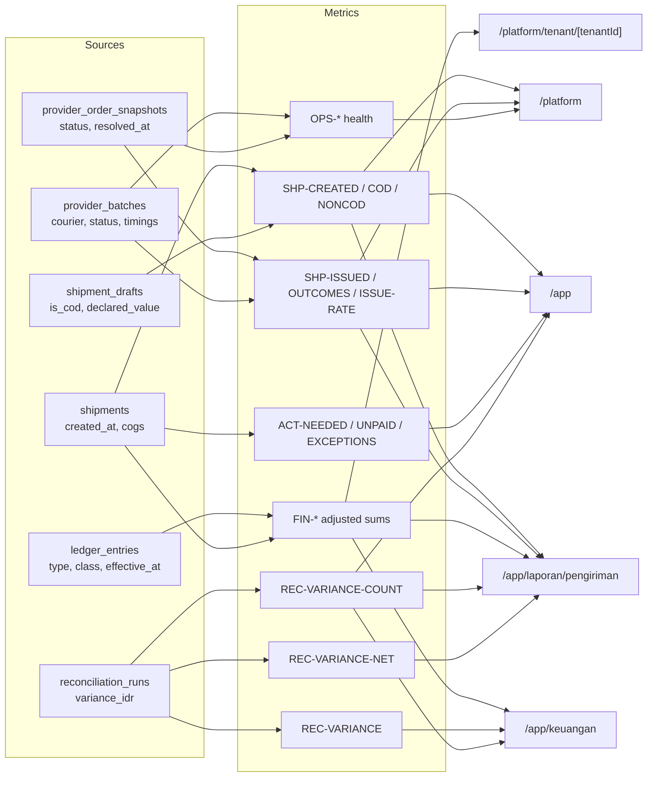
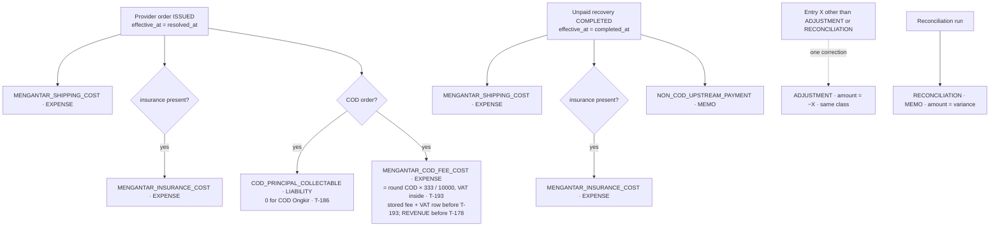
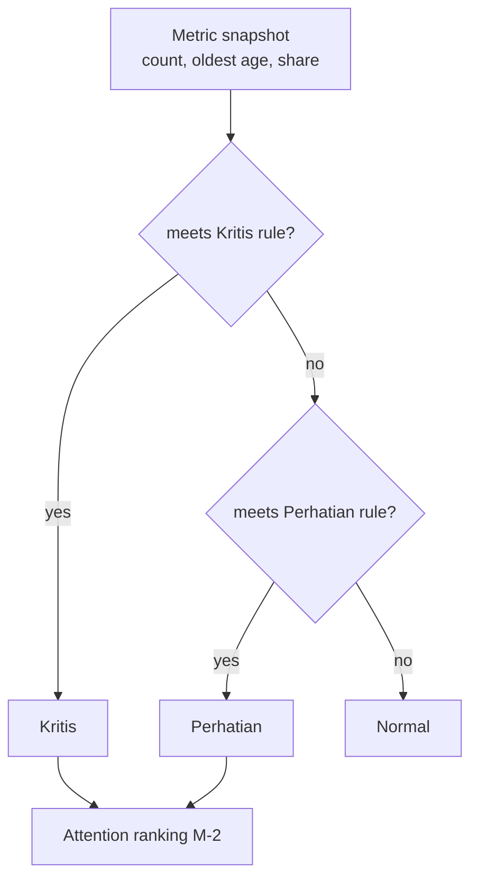

# Metrics, Analytics, and Dashboard Contract: GeraiCUAN

- Status: Accepted 2026-09-13 for conventions, canonical definitions, chart rules, and the drift register. Provenance: Paduka Ongki instructed the work to proceed following the presented recommendations; rules were not selected one by one. D-1, D-2, and D-4 are recorded in M-5; D-3 was decided 2026-09-17 as a withdrawal, amending PR-33.
- Owner: Paduka Ongki
- Requirements served: PR-9, PR-11, PR-15, PR-16, PR-20, PR-25, PR-26, PR-33.
- Related: `05-DATA-MODEL.md` (DATA-3, DATA-4), `10-DESIGN-SYSTEM-WHITELABEL.md` § CMS page patterns, `17-UX-FLOWS-SCREEN-CONTRACTS.md` (UX-8, UX-9).

This document is the single definition of every number the CMS computes or displays. A metric shown on two surfaces uses the same ID, formula, time basis, and rounding on both; a surface-specific variant gets its own ID and label. The inventory below was taken from repository code on 2026-09-13; each `Drift` row names the owning Phase 12 task in `TASKS.md`.

## M-0 — Conventions

### Money

- Whole IDR only (`integer`/`bigint`). No floating-point money anywhere in the path from SQL to display.
- Display: `Intl.NumberFormat("id-ID", { style: "currency", currency: "IDR", maximumFractionDigits: 0 })`. Signed money (variance, adjustment) uses `signDisplay: "exceptZero"` so `+` and `−` are always explicit.
- Rounding of derived money is half-up to a whole rupiah per component, performed once at the owning calculation (PR-9), never re-rounded at display.
- Money columns are right-aligned with tabular numerals.
- Adjustment rows are always included: an amount of type `X` is the sum of type `X` plus every `ADJUSTMENT` whose original entry is type `X`. No surface may sum plain entry types alone.

### Counts, rates, and comparisons

- Counts: integers formatted with `Intl.NumberFormat("id-ID")`.
- Rates: `numerator / denominator × 100`, displayed with exactly one decimal (`66,7%`) and always accompanied by the denominator in context text. A rate whose denominator is 0 displays `—` and has no comparison.
- Low-volume guard: a rate whose denominator is below 10 carries the caption `Volume rendah (n = N)` and is never ranked above a higher-volume row by rate alone.
- Period comparison of a **count or money** value: relative percentage change, `round(|cur − prev| / |prev| × 100)`, with a non-colour direction cue.
- Period comparison of a **rate**: difference in percentage points, one decimal (`+4,2 poin`).
- `prev = 0` and `cur ≠ 0`: text `Belum ada pada periode sebelumnya`, neutral cue `•`, no arrow. `prev = cur`: `→ Tidak berubah`.
- The colour of a change follows operational desirability defined per metric (for example, more failures is unfavourable), never numeric sign.

### Period and timezone

- Periods are half-open `[start, end)` on `timestamptz`, computed by `src/lib/analytics-range.ts`.
- All operational periods, date/month/year inputs, buckets and rendered timestamps use WIB (`Asia/Jakarta`, GMT+7). Database instants remain UTC. `analytics-range.ts` normalizes former WITA/WIT/UTC URL options to WIB and serializes canonical `tz=Asia/Jakarta`; timezone is no longer a user-selectable filter. Calendar date text in an old link is retained and resolved at WIB midnight. This PR35 lock changes no metric formula or event basis.
- Buckets are computed in SQL with `date_trunc(…, col AT TIME ZONE tz)`; ranges of 31 days or fewer bucket daily, longer ranges monthly.
- Previous period: the equal-length span immediately before `start`. For presets that end in the future (`hari-ini`, `minggu-ini`, `bulan-ini`) the comparison uses the **same elapsed span** of the previous period (to-date comparison), so a partial day is not compared with a full day. The comparison caption names the compared span.
- Snapshot values ("Saat ini") ignore the period and say so.

### Freshness

- Each region carries exactly one generated-at value read from the database by the read that produced it and rendered in WIB. Tenant repositories currently read `statement_timestamp()`, platform `transaction_timestamp()`, and Keuangan uses JavaScript `new Date()`; T-92 settles one database source per region and removes the JavaScript clock.
- A region is stale when `now − generatedAt ≥ 5 minutes` (`src/lib/data-freshness.ts`); stale regions show the notice and a refresh action on every surface, including `/platform` and `/app/keuangan`.

## M-1 — Canonical metric dictionary

Status legend: **Aligned** = code matches this definition; **Drift** = code differs, repair owned by the named task; **Pending D-n** = definition waits for a decision.

### Shipment volume and outcomes

| ID | Label | Definition | Time basis | Surfaces | Status |
|---|---|---|---|---|---|
| SHP-CREATED | Kiriman dibuat | `count(shipments)` in scope | `shipments.created_at` | /app, /platform | Aligned |
| SHP-COD | Kiriman COD | SHP-CREATED where the shipment draft `is_cod` — **COD Ongkir included** (its draft is `is_cod`; T-190 names this on the dashboard: "COD mencakup COD Ongkir", drill-down "kiriman COD dan COD Ongkir dibuat", rows labelled per method) | `shipments.created_at` | /app | Drift: analytics table/export read `provider_order_snapshots.is_cod`, so a COD draft without an order reads as non-COD — T-90 |
| SHP-NONCOD | Kiriman non-COD | SHP-CREATED − SHP-COD | `shipments.created_at` | /app | Drift with SHP-COD — T-90 |
| SHP-DECLARED-COD | — | **Withdrawn 2026-09-17 (T-177, owner: "Laporan saja").** The dashboard COD / non-COD cards count shipments only; no goods-value sum is shown. | — | none | Withdrawn |
| SHP-ISSUED | Resi terbit | `count(provider_order_snapshots)` with `status = 'ISSUED'` | `provider_order_snapshots.resolved_at` | /app, /platform | Drift: `/platform` counts `status = 'ISSUED'` by `created_at` — T-88 |
| SHP-OUTCOMES | Outcome terselesaikan | `count(provider_order_snapshots)` with `status <> 'SUBMISSION_QUEUED'` | `resolved_at` | /app/laporan/pengiriman | Aligned |
| SHP-ISSUE-RATE | Tingkat penerbitan resi | SHP-ISSUED / SHP-OUTCOMES × 100, one decimal, denominator shown, pp comparison | `resolved_at` | /app/laporan/pengiriman (KPI, courier table) | Drift: variable precision, relative-% comparison, denominator 0 feeds a 0 comparison — T-89 |
| SHP-UNPAID-OUTCOME | Belum dibayar | orders whose current status is `AWAITING_UPSTREAM_PAYMENT` and whose `resolved_at` is in range (a recovered order leaves this count because only current status is stored) | `resolved_at` | /platform | Drift: platform uses `created_at` — T-88 |
| SHP-UNKNOWN-OUTCOME | Status tidak diketahui | batch, order, and recovery records in their `*_UNKNOWN` state | volume table: record `created_at`; health-tile oldest age: `coalesce(submission_attempted_at \| resolved_at \| attempted_at, created_at)` per source | /platform | Aligned |

### Work needing action (snapshots)

| ID | Label | Definition | Scope | Surfaces | Status |
|---|---|---|---|---|---|
| ACT-NEEDED | Perlu tindakan | `SUBMISSION_UNKNOWN + FAILED` for both tenant roles (UX-8 Operational status). The Kiriman `ACTION_REQUIRED` queue uses the same predicate so the count always equals the list it links to. Snapshot, ignores period. | tenant | /app tile, Kiriman nav count, Kiriman "Perlu tindakan" tab | Drift: the tile is correct, but the `ACTION_REQUIRED` queue and the tested `summary.actionRequired` also include `AWAITING_UPSTREAM_PAYMENT`, and the Tenant Admin "Menunggu pembayaran" tile links to that mixed queue — T-88 |
| ACT-UNPAID | Menunggu pembayaran | `AWAITING_UPSTREAM_PAYMENT`; Tenant Admin only (PR-25, UX-8); links to the queue filtered to that status | Tenant Admin | /app tile, Tenant Admin attention list | Drift: links to the mixed `ACTION_REQUIRED` queue — T-88 |
| ACT-DRAFT | Draf perlu dilanjutkan | `status = 'DRAFT'` | tenant | folded into QUE-NEEDS-AWB on the /app/pengiriman panel since T-168 removed the /app snapshot block | Aligned |
| ACT-ESTIMATED | Estimasi perlu dikonfirmasi | `status = 'ESTIMATED'` | tenant | folded into QUE-NEEDS-AWB on the /app/pengiriman panel since T-168 removed the /app snapshot block | Aligned |
| ACT-EXCEPTIONS | Pengecualian belum selesai | ACT-NEEDED + ACT-UNPAID (Tenant Admin-only page); honours outlet, courier, and lifecycle filters because UX-9 requires the `exceptions` drill-down basis to preserve every authorized dimension, and the KPI must equal its drill-down | tenant | /app/laporan/pengiriman | Aligned |
| REC-VARIANCE-COUNT | Selisih rekonsiliasi | count of latest reconciliation run per (outlet, cadence, type, period) whose status is `VARIANCE`; tenant-wide snapshot | Tenant Admin | /app, /app/keuangan | Aligned |

### Operational list-page state panels (PR-52)

One shared panel component (`src/components/cms/state-summary-panel.tsx`) on every operational list page. Each entry is a filter that writes the page's own URL state; its count is read in the same tenant-scoped repository pass as the list it filters, over the same joins, so **an entry's number always equals the number of rows choosing it returns**. All of these are current snapshots and ignore any period the page carries. None restates COD principal as revenue.

| ID | Label | Definition | Scope | Surfaces | Status |
|---|---|---|---|---|---|
| QUE-ALL | Semua kiriman | `count(shipments)` joined to its draft and recipient party | tenant | /app/pengiriman panel (`?status=ALL`) | Aligned |
| QUE-NEEDS-AWB | Siap dilanjutkan | QUE-ALL where `status IN ('DRAFT','ESTIMATED')`; the same predicate the `READY_TO_PROGRESS` queue uses. Supersedes ACT-DRAFT + ACT-ESTIMATED as the operator-facing surface after T-168 removed the dashboard snapshot block | tenant | /app/pengiriman panel (`?status=READY_TO_PROGRESS`) | Aligned |
| QUE-AWAITING-PICKUP | Resi terbit | QUE-ALL where `status = 'ISSUED'` — the AWB exists and nothing has reported movement | tenant | /app/pengiriman panel (`?status=ISSUED`) | Aligned |
| QUE-IN-TRANSIT | Dalam perjalanan | QUE-ALL where `status = 'IN_TRANSIT'` | tenant | /app/pengiriman panel (`?status=IN_TRANSIT`) | Aligned |
| QUE-DELIVERED | Terkirim | QUE-ALL where `status = 'DELIVERED'`; the same predicate SHP-OUTCOME-DELIVERED uses, without that metric's period basis | tenant | /app/pengiriman panel (`?status=DELIVERED`) | Aligned |
| QUE-ATTENTION | Perlu perhatian | QUE-ALL where `status IN ('SUBMISSION_UNKNOWN','PROBLEM','FAILED','AWAITING_UPSTREAM_PAYMENT')`. **Wider than ACT-NEEDED on purpose** (PR-52): it also gathers the provider-reported problem and the non-COD shipment waiting on upstream payment, so ACT-NEEDED ⊂ QUE-ATTENTION and ACT-UNPAID ⊂ QUE-ATTENTION. The `NEEDS_ATTENTION` queue filter uses the same predicate, read off the same constant | tenant | /app/pengiriman panel (`?status=NEEDS_ATTENTION`) | Aligned |
| RTS-ALL | Semua retur | `count(shipments)` where `status IN ('RTS_QUEUED','RTS_IN_TRANSIT','RTS_RECEIVED','PROBLEM')`. Provider-reported basis and lag: see SHP-OUTCOME-* | tenant | /app/pengiriman/rts panel | Aligned |
| RTS-QUEUED | Antre retur | RTS cohort where `status = 'RTS_QUEUED'` | tenant | /app/pengiriman/rts panel | Aligned |
| RTS-IN-TRANSIT | Retur dalam perjalanan | RTS cohort where `status = 'RTS_IN_TRANSIT'` | tenant | /app/pengiriman/rts panel | Aligned |
| RTS-RECEIVED | Retur diterima | RTS cohort where `status = 'RTS_RECEIVED'` | tenant | /app/pengiriman/rts panel | Aligned |
| RTS-PROBLEM | Bermasalah | RTS cohort where `status = 'PROBLEM'`. PR-52 names four RTS entries; this fifth one stays because the repository already returns those rows inside RTS-ALL and dropping it would leave that cohort visible but unfilterable | tenant | /app/pengiriman/rts panel | Aligned |
| LBL-ALL | Semua resi | printable shipments in the page's current status facet and AWB-suffix scope | tenant | /app/label panel (`?cetak=semua`) | Aligned |
| LBL-UNPRINTED | Belum dicetak | LBL-ALL with no `print_events` row for that shipment whose `outcome = 'PRINTED'` | tenant | /app/label panel (`?cetak=belum`) | Aligned |
| LBL-PRINTED | Sudah dicetak | LBL-ALL with at least one `PRINTED` print event; a shipment printed N times counts once | tenant | /app/label panel (`?cetak=sudah`) | Aligned |
| CON-SENDER-ALL | Semua pengirim | `count(contacts)` where `is_sender = true`; a dual-role contact is also counted in CON-RECIPIENT-ALL (T-188, replaces CON-ALL) | tenant | /app/kontak/pengirim panel (`?status=all`) | Aligned |
| CON-SENDER-ACTIVE | Aktif | CON-SENDER-ALL where `archived_at IS NULL` (replaces CON-ACTIVE) | tenant | /app/kontak/pengirim panel (`?status=active`) | Aligned |
| CON-SENDER-ARCHIVED | Diarsipkan | CON-SENDER-ALL where `archived_at IS NOT NULL` (replaces CON-ARCHIVED) | tenant | /app/kontak/pengirim panel (`?status=archived`) | Aligned |
| CON-RECIPIENT-ALL | Semua penerima | `count(contacts)` where `is_recipient = true`; a dual-role contact is also counted in CON-SENDER-ALL (T-188) | tenant | /app/kontak/penerima panel (`?status=all`) | Aligned |
| CON-RECIPIENT-ACTIVE | Aktif | CON-RECIPIENT-ALL where `archived_at IS NULL` | tenant | /app/kontak/penerima panel (`?status=active`) | Aligned |
| CON-RECIPIENT-ARCHIVED | Diarsipkan | CON-RECIPIENT-ALL where `archived_at IS NOT NULL` | tenant | /app/kontak/penerima panel (`?status=archived`) | Aligned |
| CON-SENDER-LISTED | "N pengirim" result line | rows currently listed on /app/kontak/pengirim: equals the selected status entry (CON-SENDER-ACTIVE, -ARCHIVED or -ALL) until a search runs, then the `searchContacts` matches within that role and status | tenant | /app/kontak/pengirim result line | Aligned |
| CON-RECIPIENT-LISTED | "N penerima" result line | as CON-SENDER-LISTED for /app/kontak/penerima | tenant | /app/kontak/penerima result line | Aligned |

**Contact counts by role (T-188).** The single Kontak directory became the Pengirim and Penerima menus, so the role-agnostic CON-ALL, CON-ACTIVE and CON-ARCHIVED are retired; no displayed number reads them. One query (`loadContactDirectoryPage` in `src/db/contact-repository.ts`) serves both lists with the list's role and the tenant column as predicates, returning `{ all, active, archived }`; the page assigns the role's metric IDs (`contactStatusEntries` in `src/lib/contact-role-filter.ts`). The panel is the compact segmented variant of `StateSummaryPanel` (Aktif, Diarsipkan, Semua); each segment keeps its `data-metric-id`. CON-SENDER-ALL + CON-RECIPIENT-ALL exceeds the tenant's contact count by the number of dual-role contacts; never add them. Verified by `tests/state-summary-panel.integration.test.ts` (each count equals the rows its entry returns, per role) and `tests/contact-render.integration.test.ts` (each list renders only its own role's IDs).

**Period basis (T-163).** PR-52 made these counts current snapshots. T-163 gave `/app/pengiriman`, `/app/pengiriman/rts` and `/app/label` the PR-53 range control, so on those three pages the QUE-*, RTS-* and LBL-* counts follow the page's period exactly as the list does — created basis for the two queues, issued basis (`coalesce(provider_order_snapshots.resolved_at, created_at)`) for Cetak resi. CON-SENDER-* and CON-RECIPIENT-* stay pure snapshots: contacts have no time basis and PR-53 does not give it one. The default window on all three is the shared `30-hari`, so a shipment older than the window is outside the page until the operator widens the range; the page states the resolved range in text.

**Ceiling.** `/app/label` lists at most 100 rows and has no pagination, so LBL-* can legitimately exceed the rows shown. The page states the difference in text rather than letting the two numbers disagree silently.

**Verification.** `tests/state-summary-panel.integration.test.ts` binds every count above to the filter it applies, to fixture-absolute values, and to the emitted SQL carrying the table's own `tenant_id` predicate rather than relying on row-level security.

### Report pages (PR-55)

Two read-only Tenant Admin records. Both are tenant- and outlet-scoped in SQL (the table's own `tenant_id`, not row-level security alone), both carry the PR-53 range control with its `rentang` / `dari` / `sampai` / `tz` contract, and neither restates COD principal as revenue or shows recipient PII beyond the destination area PR-36 already authorizes.

**Laporan pengiriman** (`/app/laporan/pengiriman`, `src/db/shipment-report-repository.ts`). Cohort: tenant-owned shipments **created** inside the window, holding a draft and a recipient party — the same cohort Histori kiriman lists for the same scope and range, which `tests/shipment-report.integration.test.ts` asserts row for row. Dimensions: outlet, courier and lifecycle, validated against the tenant's own outlets and couriers by `parseTenantAnalyticsQuery`. Column order is `SHIPMENT_REPORT_COLUMNS` in `src/lib/shipment-report.ts`; the page header, the CSV header and this table read that one list.

| ID | Column | Definition (raw field unless stated) |
|---|---|---|
| RPT-SHP-REFERENCE | Nomor kiriman | `shipments.public_reference`, with `outlets.name` below it |
| RPT-SHP-CREATED-AT | Dibuat | `shipments.created_at`; the report's own period basis |
| RPT-SHP-ISSUED-AT | Resi terbit | `provider_order_snapshots.resolved_at`; empty until the provider settles the order |
| RPT-SHP-DESTINATION-AREA | Area penerima | `shipment_drafts.destination_area_label` — area only; no recipient name, phone or street address reaches the page or the export |
| RPT-SHP-COURIER | Kurir | `provider_batches.courier`; "—" for a shipment that never reached a batch |
| RPT-SHP-SERVICE | Layanan | `provider_order_snapshots.provider_service` |
| RPT-SHP-LIFECYCLE | Lifecycle | `shipments.status`, rendered through `SHIPMENT_STATUS_PRESENTATION` |
| RPT-SHP-PAYMENT-MODE | Pembayaran | The draft's payment method (T-186, PR-64): `NON_COD` when `shipment_drafts.is_cod` is false, `COD_ONGKIR` when `shipment_drafts.cod_shipping_only` is true, else `COD`; the page shows Non-COD / COD / COD Ongkir and the CSV the code. The analytics table and export (`loadShipmentPage`, `loadShipmentExport`, CSV column `payment_method`) use the same three values, deciding COD at all from `provider_order_snapshots.is_cod` as that table always has (SHP-COD drift note) and splitting COD from COD Ongkir by the draft. For COD Ongkir, RPT-SHP-COD-FEE-IDR is 3.33% of the shipping charge and RPT-SHP-COD-DISBURSEMENT-EST-IDR equals COD-ONGKIR-SELLER-DIFFERENCE-IDR |
| RPT-SHP-SHIPPING-COST-IDR | Biaya kirim Mengantar (IDR) | `coalesce(provider_order_snapshots.provider_charged_shipping_idr, shipping_amount_idr)` — the shipping Mengantar deducts, the ledger's `MENGANTAR_SHIPPING_COST` basis; empty before a provider order |
| RPT-SHP-COD-FEE-IDR | Biaya COD (IDR) | **The fee Mengantar keeps**, `round(provider_cod_amount_idr × 333 / 10000)` half-up (`mengantarCodFeeExpression`, the rate proven on 2,866 real settlement lines), for an order issued as COD; empty otherwise. Deliberately *not* the stored `service_fee_idr + vat_amount_idr`: a row written under the pre-T-175 additive formula stored 3.33% of goods plus shipping, which is smaller than what Mengantar takes. **T-193 (D-13):** this is the one "Biaya COD" — Analitik's FIN-COD-FEE-TOTAL is its sum, the thermal label, issuance panel and draft preview show it per shipment (COD-CHARGE-BREAKDOWN), and a COD issuance books it as `MENGANTAR_COD_FEE_COST`. |
| RPT-SHP-COD-DISBURSEMENT-EST-IDR | Estimasi dana dicairkan Mengantar (IDR) | `provider_cod_amount_idr − RPT-SHP-SHIPPING-COST-IDR − RPT-SHP-COD-FEE-IDR` (`codDisbursementEstimateExpression`), COD orders only. Built from the fee column rather than rounded separately, so **COD − Biaya kirim − Biaya COD = Estimasi dana dicairkan on every row, to the rupiah**. An estimate, never money received; the actual payout is SETTLE-PAYOUT-IDR in Keuangan, which compares at sen precision with the same rate. |
| RPT-SHP-PRINT-STATE | Status cetak | "Sudah dicetak (N×)" where N is `count(print_events WHERE outcome = 'PRINTED')` for that shipment, else "Belum dicetak"; the same predicate LBL-PRINTED uses. The CSV carries the same N (`SUDAH_DICETAK_3X` / `BELUM_DICETAK`) — it printed only `SUDAH_DICETAK` at first, so the file and the page disagreed about the one thing this column is for |
| RPT-SHP-ROWS | (total) | `count(*)` over the filtered cohort — rows the filters match, never rows on the page |
| RPT-SHP-COURIER-COUNT | Total per kurir · Kiriman | RPT-SHP-ROWS grouped by `provider_batches.courier`; the unbatched group is labelled "Belum ada kurir" |
| RPT-SHP-COURIER-SHIPPING-COST-IDR | Total per kurir · Biaya kirim Mengantar | `sum(RPT-SHP-SHIPPING-COST-IDR)` in that group |
| RPT-SHP-COURIER-COD-FEE-IDR | Total per kurir · Biaya COD | `sum(RPT-SHP-COD-FEE-IDR)` in that group |
| RPT-SHP-COURIER-COD-DISBURSEMENT-EST-IDR | Total per kurir · Estimasi dana dicairkan Mengantar | `sum(RPT-SHP-COD-DISBURSEMENT-EST-IDR)` in that group |
| RPT-SHP-LIFECYCLE-COUNT | Total per lifecycle · Kiriman | RPT-SHP-ROWS grouped by `shipments.status` |

**Export.** `/app/laporan/pengiriman/export.csv` reuses the analytics export contract unchanged: the same Tenant Admin gate, the same filter parser, the same cell escaping and formula-injection guard, and the same refusal above the ceiling — `AnalyticsExportLimitError` at more than 10 000 rows, answered `413` with the row count, never a silent truncation. The file covers the whole filtered set, not the current page, and carries exactly the columns above.

**Riwayat cetak resi** (`/app/laporan/cetak-resi`, `loadPrintHistoryPage` in `src/db/label-print-repository.ts`). Cohort: `print_events` rows whose `printed_at` falls in the window, joined to their shipment for the outlet dimension (`print_events` has no outlet of its own). Listed newest first, capped at 200 rows with the difference stated in text.

| ID | Column | Definition |
|---|---|---|
| RPT-PRN-EVENTS | (total) | `count(print_events)` matching the window and outlet scope |
| RPT-PRN-REPRINTS | Cetak ulang | `greatest(max(print_events.sequence WHERE outcome = 'PRINTED') − 1, 0)` for that shipment, over its **whole** print record rather than the filtered window: a reprint is an audit fact about the shipment, and a narrower window would report a second print as a first one. A first print is not a reprint; a shipment whose attempts were all blocked reports 0 |
| — | Waktu cetak | `print_events.printed_at`, WIB |
| — | Peran pelaku | `print_events.actor_role`. The role only — PR-55 keeps actor identity out of this surface |
| — | Hasil | `print_events.outcome` in words ("Berhasil dicetak" / "Ditolak sistem") |
| — | Alasan | `print_events.reason_code` in words. `AWAITING_UPSTREAM_PAYMENT` reuses the shared lifecycle label so the operator never meets two names for one state |
| — | Urutan cetak | `print_events.sequence`; empty for a blocked attempt, which is never given one |

**Verification.** `tests/shipment-report.integration.test.ts`, `tests/print-history-report.integration.test.ts` (repository, scope and export behaviour, each read's SQL predicate asserted), `tests/report-pages-render.integration.test.ts` (rendered columns, totals, export link, vocabulary, empty states, role refusal) and `scripts/ui-audit/laporan-reports.mjs` (1440/390, populated, empty and filtered-empty, pinned-column opacity).

### Money

| ID | Label | Definition | Time basis | Surfaces | Status |
|---|---|---|---|---|---|
| FIN-COD-PRINCIPAL | Pokok COD (liabilitas) | adjusted sum `COD_PRINCIPAL_COLLECTABLE`; always labelled liability, never revenue. The goods money a courier collects for the seller: a COD Ongkir issuance (formula version 3, T-186) books it at **0**, because no goods are collected (DATA-4) | `ledger_entries.effective_at` | /app/keuangan, platform tenant detail (withdrawn from /app/laporan/pengiriman 2026-09-17, T-177) | Drift: platform tenant detail sums plain types without adjustments — T-90 |
| FIN-PROVIDER-COST | Biaya provider | adjusted sum of `financial_class = 'EXPENSE'` (`MENGANTAR_SHIPPING_COST` + `MENGANTAR_INSURANCE_COST` + `MENGANTAR_COD_FEE_COST`; the last only on issuances ledgered after T-178, see FIN-FEE-REVENUE) | `effective_at` | /app/keuangan, platform tenant detail | Drift: analytics shows shipping only as "Ongkir provider" — T-90; `MENGANTAR_SHIPPING_COST`'s basis changed 2026-09-16 (see SETTLE-EXPECTED-IDR's money-semantics correction note) — a period straddling that date mixes both bases |
| FIN-FEE-REVENUE | Pendapatan jasa COD (entri lama) | adjusted sum `GERAICUAN_COD_SERVICE_FEE_REVENUE` — **legacy only** | `effective_at` | /app/keuangan, platform tenant detail | **Reclassified by T-178 (migration 0049, 2026-09-17).** The fee this entry recorded is Mengantar's (it deducts it at settlement; GeraiCUAN never receives it). Going forward only: every issuance ledgered by the release carrying 0049 appends the same `shipment_cod_totals.service_fee_idr` as `MENGANTAR_COD_FEE_COST` (`EXPENSE`), so it lands in FIN-PROVIDER-COST and in FIN-COD-FEE below; entries posted before keep this type and are never rewritten (append-only). The effective point is per issuance (DATA-4, `docs/spec/05`). A period straddling the change shows the old fees here and the new ones as cost — neither lost nor counted twice (`tests/ledger-repository.integration.test.ts`, "leaves a pre-change revenue entry untouched…"). Aligned (T-177, 2026-09-17): `loadShipmentKpis(...).codServiceFeeIdr` sums this type together with `MENGANTAR_COD_FEE_COST` in one adjustment-aware expression, so a period spanning the reclassification counts each fee once; see FIN-COD-FEE |
| FIN-COD-FEE | — (booked fee) | adjusted sum over `MENGANTAR_COD_FEE_COST` and `GERAICUAN_COD_SERVICE_FEE_REVENUE` together, each entry of either type plus every `ADJUSTMENT` reversing one, counted once — the fee as it was **booked**, which differs by issuance era (revenue before T-178; the stored service fee, VAT excluded, T-178 until T-193; Mengantar's fee from T-193) | `effective_at` | none (withdrawn from /app/laporan/pengiriman by T-193); the booked amounts stay inside FIN-PROVIDER-COST and FIN-FEE-REVENUE | **Withdrawn as a displayed figure 2026-09-17 (T-193).** A booked figure mixed three definitions across a straddling period; Analitik shows FIN-COD-FEE-TOTAL, one definition, instead |
| FIN-PROVIDER-SHIPPING | Biaya kirim Mengantar | adjusted sum `MENGANTAR_SHIPPING_COST` (insurance excluded), COD and non-COD | `effective_at` | /app/laporan/pengiriman | Aligned (`ShipmentKpis.providerShippingIdr`) |
| FIN-COD-FEE-TOTAL | Biaya COD | Σ RPT-SHP-COD-FEE-IDR (`mengantarCodFeeExpression`, `round(provider_cod_amount_idr × 333 / 10000)`) over `provider_order_snapshots` with `status = 'ISSUED'`, `is_cod = true`, `resolved_at` in range, joined to `shipment_cod_totals`; filters as SHP-ISSUED (`loadShipmentKpis(...).codFeeIdr`) | `provider_order_snapshots.resolved_at` | /app/laporan/pengiriman | **Redefined 2026-09-17 (T-193, D-13)** from FIN-COD-FEE + FIN-VAT (ledger, `effective_at`). Now the same fee, on the same rows and basis, as FIN-COD-DISBURSEMENT-EST, so `COD − Biaya kirim − Biaya COD = Estimasi` holds per shipment. Bound by `tests/analytics-repository` "reports one Biaya COD from the issued order, whatever the ledger booked (T-193)" and the disbursement test |
| FIN-COD-FEE-VAT-INCLUDED | Termasuk PPN | Σ `round(RPT-SHP-COD-FEE-IDR × 11 / 111)` per shipment (`mengantarCodFeeVatIncludedExpression`; `vatIncludedInMengantarCodFeeIdr` in TypeScript), same rows as FIN-COD-FEE-TOTAL (`codFeeVatIncludedIdr`) | `provider_order_snapshots.resolved_at` | /app/laporan/pengiriman (inside the closed "Lihat rincian biaya COD" disclosure) | New 2026-09-17 (T-193). Informational: the VAT already inside Biaya COD, never added to it and never a liability; `tests/cod-amount-formula` proves the rounding over fees 0–200 000 |
| FIN-COD-DISBURSEMENT-EST | Estimasi dana dicairkan Mengantar | Σ `codDisbursementEstimateExpression` (RPT-SHP-COD-DISBURSEMENT-EST-IDR) over `provider_order_snapshots` with `status = 'ISSUED'`, `is_cod = true`, `resolved_at` in range, joined to `shipment_cod_totals`; filters as SHP-ISSUED | `provider_order_snapshots.resolved_at` | /app/laporan/pengiriman | Aligned. An estimate, never money received; not adjustment-aware. Same rate as SETTLE-EXPECTED-IDR (T-178), rounded per shipment to the rupiah |
| FIN-VAT | PPN dalam biaya COD (dipotong Mengantar) | adjusted sum `COD_SERVICE_FEE_VAT_PAYABLE` — **historical rows only** (`summarizeLedger(...).legacyCodFeeVatIdr`; platform `legacyCodFeeVatIdr`) | `effective_at` | /app/keuangan, platform tenant detail (withdrawn from T-193) | **Reclassified in presentation 2026-09-17 (T-193, D-13).** Was "PPN terutang", a GeraiCUAN liability. The VAT is inside Mengantar's 3.33% and Mengantar keeps it; no issuance books the type from T-193 on, existing rows are never updated or deleted, and each card states it is part of the fee, not an obligation, and outside any payable. Keuangan's class column shows these rows and their reversals as "Bagian biaya COD, bukan kewajiban". Drift on platform tenant detail (adjustments) — T-90 |
| FIN-UPSTREAM | Pemulihan non-COD | adjusted sum `NON_COD_UPSTREAM_PAYMENT` (memo) | `effective_at` | /app/keuangan | Drift on platform tenant detail (adjustments) — T-90 |
| FIN-COGS | — | **Withdrawn 2026-09-17 (T-177, owner: "Laporan saja").** No surface, type or export; the draft no longer asks for a goods cost and `shipments.cogs_amount_idr` has no writer. | — | none | Withdrawn |
| FIN-NET-MARGIN | — | **Withdrawn 2026-09-17 (T-177).** D-3b is withdrawn: GeraiCUAN reports no merchandise margin, profit, omset or goods value. | — | none | Withdrawn |
| REC-VARIANCE | Selisih | `sourceTotalIdr − ledgerTotalIdr` per run; positive means source exceeds ledger; signed display | reconciliation period | /app/keuangan | Aligned |
| REC-FEE-SOURCE | (reconciliation source, per type) | Per COD issuance in the period, by the `PROVIDER_ORDER_ISSUED` entries it already carries (T-193): a `GERAICUAN_COD_SERVICE_FEE_REVENUE` entry → its `service_fee_idr` to that type and `vat_amount_idr` to `COD_SERVICE_FEE_VAT_PAYABLE`; a VAT entry but no revenue entry → `service_fee_idr` to `MENGANTAR_COD_FEE_COST` and `vat_amount_idr` to VAT; neither → `(provider_cod_amount_idr × 333 + 5000) / 10000` to `MENGANTAR_COD_FEE_COST` and nothing to VAT. A missing fee entry therefore still surfaces as variance on the current type | `provider_order_snapshots.resolved_at` | /app/keuangan | Aligned (`captureLedgerReconciliationTotals`; the seed mirrors it). Bound by `tests/ledger-repository` "leaves pre-T-178 and pre-T-193 fee entries untouched and reconciles all three fee bookings exactly" and `tests/cod-ongkir` (COD and COD Ongkir, every run MATCHED) |
| REC-VARIANCE-NET | Total selisih (+/−) | `sum(variance_idr)` over the latest run per (outlet, cadence, type, period) whose status is `VARIANCE`; tenant-wide snapshot; signed display | snapshot | /app/laporan/pengiriman | Drift: rendered without explicit sign — T-90 |

### COD amount at shipment creation (PR-9)

**Formula version 2 (T-175, 2026-09-17).** The buyer pays goods plus shipping; Mengantar keeps `specialShipping + 0.0333 × COD` of it (evidence below), so COD is grossed up to the smallest whole rupiah whose net of Mengantar's fee still covers goods plus shipping, and the markup is split into the two stored components.

| ID | Definition | Status |
|---|---|---|
| COD-TOTAL | `ceil((goods + shipping) × 10000 / 9667)` in integer arithmetic — the smallest whole rupiah with `COD − 0.0333 × COD ≥ goods + shipping`; labelled "Total ditagih ke pelanggan"; insurance excluded while the estimate returns none | Aligned (`calculateCodAmounts`, DB check `shipment_cod_totals_provider_cod_amount_gross_up_v2`) |
| COD-FEE | `round_half_up((COD-TOTAL − goods − shipping) × 100 / 111)`, stored as `service_fee_idr`. **Not displayed since T-193:** the label "Biaya COD" belongs to COD-MENGANTAR-FEE. `× 100 / 111` never lands on exactly `.5` (200·markup is even, an odd multiple of 111 is odd), so there is no tie to break | Aligned (DB check `shipment_cod_totals_service_fee_split_v2`) |
| COD-VAT | `COD-TOTAL − goods − shipping − COD-FEE`, stored as `vat_amount_idr`; within 0.55 rupiah of 11% of COD-FEE. **Not displayed since T-193** (no "PPN biaya COD" line) | Aligned (DB check `shipment_cod_totals_provider_cod_amount_exact`, shared by both versions) |
| COD-MENGANTAR-FEE | `round_half_up(COD-TOTAL × 333 / 10000)` — what Mengantar keeps as its COD fee, labelled "Biaya COD" (T-193); used by COD-SELLER-PAYOUT-IDR. `COD-TOTAL − COD-MENGANTAR-FEE ≥ goods + shipping` holds for every amount, rounding included | Aligned (`mengantarCodFeeIdr`, `src/lib/mengantar-cod-fee.ts`) |
| COD-CHARGE-BREAKDOWN | "Nilai barang" + "Ongkir" + "Biaya COD (termasuk PPN …)" + "Pembulatan" (only when non-zero) = COD-TOTAL: `codChargeBreakdown` gives `codFee = COD-MENGANTAR-FEE`, `codFeeVatIncluded = round_half_up(codFee × 11 / 111)`, `rounding = COD-TOTAL − goods − shipping − codFee`; `null` when rounding is negative (a version 1 amount), so that label prints the COD total without lines that cannot add up. Surfaces: thermal label (`loadPrintableLabel`), issuance panel, draft preview | Aligned (T-193). `tests/cod-amount-formula` proves rounding ∈ {0, 1} for every version 2 amount in the property set; `tests/label-print`, `tests/label-thermal`, `tests/mengantar-field-parity` bind the surfaces |
| COD-TEST | Property test over goods, shipping and discount (zero included): `9667 × COD − 10000 × specialShipping ≥ 10000 × goods` and COD minimal; the application formula bound to the database checks by one-rupiah deviations | Aligned (`tests/cod-amount-formula.integration.test.ts`) |

**Evidence.** `tests/fixtures/mengantar-cod-identities.json` (`scripts/capture-mengantar-cod-identities.mjs`, read-only, counts only) over 100 real COD orders on the owner's account: `COD_FEE = COD_AMOUNT × 0.0333` exactly and unrounded (100/100), and the stored order's `estimatedPrice = price + COD_FEE` (100/100). With the settlement identity `subItem.amount = COD_AMOUNT − estimatedSpecialPrice` (554/554, T-146) that places the fee inside the price Mengantar deducts. `GET /order/estimate` returns `codFee: 0` at every COD value tried, so the quote never shows it. What the fixture does **not** count is `estimatedSpecialPrice = specialPrice + COD_FEE` on a stored order; the formula is safe either way — if the special price carried no fee the seller would receive more, never less.

**Why it changed.** Version 1 (additive: fee `round_half_up((goods + shipping) × 3 / 100)`, VAT `round_half_up(fee × 11 / 100)`, COD their sum) is about `1.0333 × (goods + shipping)`. Mengantar's fee is 3.33% of that grossed amount, so the seller netted `≈ 0.99889 × (goods + shipping) − specialShipping`: with no courier discount, 0.111% of (goods + shipping) short of the goods value on every COD shipment (goods 100 000 + shipping 10 000: COD 113 663, seller 99 878). Version 2 gives COD 113 790, fee 3 414, VAT 376, and the seller 100 000.79 before rounding.

**Canonical COD fee basis (T-199).** Two columns hold the COD amount: `shipment_cod_totals.provider_cod_amount_idr`, written once per shipment at confirmation and never updated (INSERT/SELECT grants only), and `provider_order_snapshots.provider_cod_amount_idr`, the copy submitted to Mengantar as `cod_amount`. **`shipment_cod_totals.provider_cod_amount_idr` is canonical**: every COD fee, disbursement estimate and settlement expectation (COD-MENGANTAR-FEE, RPT-SHP-COD-FEE-IDR via `mengantarCodFeeExpression`, RPT-SHP-COD-DISBURSEMENT-EST-IDR, FIN-COD-FEE-TOTAL, SETTLE-EXPECTED-IDR) is defined on it, and new code reads it. The order copy may be read where only the order row is joined (the ledger posting and REC-FEE-SOURCE) because the two are equal by construction: the INSERT policy `provider_order_snapshots_active_tenant_insert` (drizzle 0046) admits a COD order only when `provider_order_snapshots.provider_cod_amount_idr = shipment_cod_totals.provider_cod_amount_idr`, and the ledger posting throws `LedgerUnavailableError` if they ever differ. Bound by `tests/shipment-issuance.integration.test.ts` "keeps the COD fee basis equal in shipment_cod_totals and provider_order_snapshots (T-199, spec 19)": every COD order issued through the application role matches its totals row, the parity query detects a one-rupiah drift, and the live policy still carries the equality.

### COD Ongkir at shipment confirmation (PR-64, D-12, T-186)

**Formula version 3 (migration `0050_cod_ongkir_payment_method`, 2026-09-17).** The goods were paid for outside GeraiCUAN; the courier collects a shipping charge `C` chosen by the operator when the service is confirmed. Mengantar keeps the shipping it deducts `S` plus exactly `0.0333 × C` (the same evidence as PR-9 above), so the seller nets `C − S − 0.0333·C`. The COD Ongkir charge is **computed as a floor, typed only upward**.

| ID | Label | Definition | Status |
|---|---|---|---|
| COD-ONGKIR-SHIPPING-DEDUCTED-IDR | Ongkir dipotong Mengantar | `S = coalesce(special_price_idr, normal_price_idr, shipping_amount_idr)` of the selected estimate service — the basis `provider_order_snapshots.provider_charged_shipping_idr` records (`shippingMengantarDeductsIdr`) | Aligned; stored as `shipment_cod_totals.cod_shipping_basis_idr` and bound to the service by the INSERT policy |
| COD-ONGKIR-BREAK-EVEN-IDR | Titik impas (ongkir minimal) | the smallest whole rupiah `C ≥ 1` with `C × 9667 ≥ S × 10000`, i.e. `ceil(S × 10000 / 9667)` (`codOngkirBreakEvenIdr`; `9667 = BASIS_POINTS − MENGANTAR_COD_FEE_BASIS_POINTS`) | Aligned (DB check `shipment_cod_totals_cod_ongkir_break_even_v3`) |
| COD-ONGKIR-CHARGE-IDR | Ongkir ditagih kurir ke penerima | `provider_cod_amount_idr` of a version 3 row; default COD-ONGKIR-BREAK-EVEN-IDR; refused below it inline, by `calculateCodOngkirAmounts` and by the database | Aligned |
| COD-ONGKIR-MENGANTAR-FEE-IDR | Biaya COD Mengantar (3,33% dari ongkir ditagih) | `round_half_up(C × 333 / 10000)` = `service_fee_idr + vat_amount_idr` on the row, split `service_fee = round_half_up(fee × 100 / 111)` like version 2; the live row carries `data-metric-id="COD-ONGKIR-MENGANTAR-FEE-IDR"` (`COD_ONGKIR_METRIC_IDS.mengantarFee`, T-199) | Aligned (DB checks `_cod_ongkir_fee_v3`, `_cod_ongkir_fee_split_v3`) |
| COD-ONGKIR-SELLER-DIFFERENCE-IDR | Selisih diterima penjual | `C − S − COD-ONGKIR-MENGANTAR-FEE-IDR`, live as the operator types (`codOngkirSellerDifferenceIdr`); ≥ 0 for every accepted charge, rounding included | Aligned |
| COD-ONGKIR-TEST | — | Property test over every `S` 0–60 000 plus 22 001 random values up to the column limit: break-even minimal, exact net `9667·C − 10000·S ≥ 0` at and above it, rounded difference ≥ 0; one rupiah below refused by the form, the server and the database; TS break-even bound to the live CHECK over 612 shipping amounts | Aligned (`tests/cod-ongkir.integration.test.ts`) |

Worked example: JNE REG with no special price, `S = 14 000` → break-even 14 483 (9667 × 14 483 = 140 004 661 ≥ 140 000 000 > 9667 × 14 482), difference Rp 1; raised to 20 000 → fee 666, difference 5 334. A discounted SAP REG at price 12 000 / special 9 800 → break-even 10 138 on 9 800, not on 12 000.

**Payment cell on shipment surfaces (T-190).** One mapping, `presentShipmentPayment` (`src/lib/payment-method.ts`), rendered by `PaymentStack` (`src/components/cms/shipment-table-cells.tsx`), gives every surface that names how a shipment is paid its label (RPT-SHP-PAYMENT-MODE vocabulary: Non-COD / COD / COD Ongkir) and at most one figure. No new metric ID; each figure is an existing one:

| Method | Label | Figure label | Figure | Metric |
|---|---|---|---|---|
| `NON_COD` | Non-COD | Nilai asuransi | `shipment_drafts.declared_value_idr` (the value the draft form collects for insurance) | — (stored input, not derived) |
| `COD` | COD | Total COD | `provider_order_snapshots.provider_cod_amount_idr` | COD-TOTAL |
| `COD_ONGKIR` | COD Ongkir | Ongkir ditagih | `provider_order_snapshots.provider_cod_amount_idr` of a version 3 order — never `goods_value_idr` or the declared value | COD-ONGKIR-CHARGE-IDR |

The figure is omitted while unknown (no order yet) and where the surface does not show money. Surfaces: Histori kiriman `/app/pengiriman` (label + figure), RTS `/app/pengiriman/rts` (label + figure; replaces the declared value it used to show for every method), Cetak resi `/app/label` (COD figures only), Cek resi `/app/cek-resi` (label + figure), shipment detail `/app/pengiriman/[shipmentId]` (figure label only), dashboard COD drill-down `/app` and bulk-import preview `/app/impor` (label only: the dashboard shows no COD money, "COD split" under SHP-OUTCOME-*; an import row has no order). Method from `paymentMethodOf(is_cod, cod_shipping_only)` in each tenant-scoped repository. No list surface has a payment-method filter; SHP-COD / SHP-NONCOD stay two counts. Bound by `tests/cod-ongkir-surfaces.integration.test.ts` and `tests/bulk-import-actions.integration.test.ts`.

**No goods in a version 3 amount.** `shipment_cod_totals_provider_cod_amount_exact` (goods + shipping + fee + VAT) is scoped to versions 1 and 2; no version 3 check reads `goods_value_idr`, which is still recorded (the declared goods value sent as `goods_value`) and never collected. A charge far above break-even is valid: the owner allows any upward amount.

**Formula version on the row.** `shipment_cod_totals.cod_formula_version` (migration `0048_cod_amount_gross_up`). Every row before 0048 is version 1 and keeps version 1's checks with their expressions unchanged, scoped to version 1 rows; it records the COD amount actually submitted and is never recomputed. The column defaults to 1 so an instance of the previous release writing during a deploy stays valid for what it submits; the application names version 2. ~~A surface that reads stored COD totals shows the stored components as they are, whichever version wrote them.~~ **T-193:** no surface shows the stored components; they are the database's per-version arithmetic. A version 1 row not yet sent to Mengantar is refused at confirmation (`CodTotalsFormulaRetiredError`, `tests/shipment-issuance` "never submits a version 1 COD amount recorded before the deploy…").

### Platform operations

| ID | Label | Definition | Status |
|---|---|---|---|
| OPS-QUEUE-STUCK | Batch tertahan di antrean | batches in `SUBMISSION_QUEUED`/`SUBMITTING` whose `coalesce(submission_attempted_at, created_at)` is older than 15 minutes | Aligned |
| OPS-UNPAID | Pesanan menunggu pembayaran upstream | orders currently `AWAITING_UPSTREAM_PAYMENT`, with oldest age | Aligned (count); severity drift — T-93 |
| OPS-UNKNOWN | Status pengiriman tidak diketahui | batch + order + recovery unknown states, with oldest age | Aligned |
| OPS-FAILURE-SHARE | Kegagalan provider | FAILED batches / batches created in range; one decimal | Drift: whole-percent display — T-89 |
| OPS-BATCH-DURATION | Durasi penyelesaian batch p50 / p95 | `percentile_cont` of `completed_at − submission_attempted_at` for batches completed in range; shows seconds below one minute | Drift: sub-minute values render "0 menit" — T-92 |
| OPS-TENANT-AFFECTED | tenant terdampak | `count(distinct tenant_id)` of the tile's records | Aligned |

## M-2 — Severity rules

A severity is computed on the server from the thresholds below and rendered with the shared severity badge. Thresholds live in one exported constant per scope and every rule has a test at each boundary.

### Platform (`PLATFORM_HEALTH_THRESHOLDS`)

| Metric | Perhatian | Kritis | Status |
|---|---|---|---|
| OPS-QUEUE-STUCK | count > 0 | count ≥ 20 or oldest > 60 min | Aligned; only the critical-by-age case is tested — boundary tests in T-93 |
| OPS-UNPAID | count > 0 or oldest > 2 h | oldest > 24 h | Drift: a non-zero count younger than 2 h is "Normal" — T-93 |
| OPS-UNKNOWN | count > 0 | oldest > 30 min | Aligned; untested — T-93 |
| OPS-FAILURE-SHARE | share > 2% | share > 10%, or ≥ 5 same-code failures in the last 60 minutes, or any `AUTH`/`CREDENTIAL`/`SCHEMA` code in range | Aligned; the rolling-hour clause must be captioned "60 menit terakhir"; untested — T-93 |

### Tenant (`TENANT_ATTENTION_THRESHOLDS`, new)

These reuse the platform ages so one incident reads the same in both scopes.

| Item | Perhatian | Kritis |
|---|---|---|
| Status belum pasti (`SUBMISSION_UNKNOWN`) | count > 0 | oldest > 30 min |
| Menunggu pembayaran (ACT-UNPAID, Tenant Admin only) | count > 0 | oldest > 24 h |
| Gagal (`FAILED`) | count > 0 | — |
| Selisih rekonsiliasi (Tenant Admin) | REC-VARIANCE-COUNT > 0 | — |
| Outlet belum siap | at least one outlet not ready | no outlet ready |
| Draf / estimasi menunggu | never raised above Normal; listed as work, not risk | — |

### Attention ranking

*Perlu perhatian* lists sort by severity (Kritis → Perhatian), then by failure cost, then by oldest age:

1. Unknown submission or recovery state (duplicate-issuance and money risk).
2. Provider credential or schema failure (platform) / outlet not ready (tenant).
3. Awaiting upstream payment.
4. Failed shipment or batch.
5. Reconciliation variance.
6. Stuck queue.
7. Drafts and estimates waiting.

## M-3 — Charts and dashboard views

### Library and tokens

- `recharts` 3.8.0 through `src/components/ui/chart.tsx`; no second chart library.
- Series colours come only from `--chart-1` … `--chart-5` (Okabe-Ito). A series is distinguishable without colour through dash pattern or marker shape. Violet scope and semantic status colours are never series colours.
- Every chart has: a title naming the question it answers, the period and zone, named axes with units, a direct label on the latest point or largest bar, keyboard-reachable text summary, and the complete semantic data table. The table may start collapsed on command-center routes (`/app`, `/platform`) and under PR-42 on `/app/laporan/pengiriman`. It remains complete, semantic and keyboard-reachable from a labelled disclosure below the chart. `/app/keuangan` retains its existing visible tables.
- Bars start at zero. No pie, donut, gauge, 3D, dual-axis, or area-stacked money charts. At most three series per chart.

### Chart catalogue

| View | Question | Chart | Data | Owner task |
|---|---|---|---|---|
| /app | Is input and issuance moving today/this period? | Line: SHP-CREATED vs SHP-ISSUED (dashed), daily buckets; sparkline-height strip | M-1 | T-98 |
| /app | How does shipment input compare with the previous period? | Line: SHP-CREATED (= SHP-COD + SHP-NONCOD), selected versus previous equal-length daily range; solid/dashed strokes, dated supporting table | M-1 | T-111 |
| /app/laporan/pengiriman | Created versus issued over time | Line (existing), plus previous-period ghost series (dotted, `--chart-3`) | M-1 | T-100 |
| /app/laporan/pengiriman | Which courier issues reliably? | Horizontal bar SHP-ISSUE-RATE per courier, sorted by rate with low-volume rows marked, denominator in label | M-1 | T-100 |
| /app/laporan/pengiriman | Where is work stuck? | Horizontal bar of current lifecycle distribution (counts per status, lifecycle order, not a funnel) | ACT-* | T-100 |
| /app/laporan/pengiriman | Where does money go? | Grouped horizontal bars of FIN-COD-PRINCIPAL, FIN-FEE-REVENUE, FIN-VAT, FIN-PROVIDER-COST, each labelled with its class (liabilitas, pendapatan, bagian biaya COD — not "kewajiban pajak" since T-193, biaya); never stacked into one total | M-1 | T-100 |
| /app/keuangan | Is reconciliation converging? | Column chart of REC-VARIANCE per run date, signed around zero, MATCHED runs as neutral markers; placed after the variance queue and before the ledger table, captioned as a view of the reconciliation history table it links to | REC-VARIANCE | T-101 |
| /platform | Is the platform healthy over the period? | Line: SHP-CREATED, SHP-ISSUED, failed batches (three series, distinct dashes) replacing the 30-row trend table as the primary view | M-1 | T-99 |
| /platform | How fast do batches finish? | p50 / p95 values with a small daily p95 line | OPS-BATCH-DURATION | T-99 |

### Dashboard view composition

Command-center routes follow spec 10 Pattern 1. `/app/laporan/pengiriman` and `/app/keuangan` follow spec 10 Pattern 6, which keeps their UX-9 and PR-20 order, and add the charts above in place of any decorative tile. A chart never replaces the authoritative table on Keuangan.

## M-4 — Diagrams

### Metric lineage

### Ledger entries on issuance and recovery

### Severity evaluation

## M-5 — Decisions

Recorded 2026-09-13 under T-87. Provenance: Paduka Ongki instructed the work to proceed "sesuai dengan rekomendasimu" and then "lanjut dan sempurnakan" without choosing individual options, so D-1, D-2, and D-4 adopt the recommendation that was presented; each only aligns existing surfaces with an already-accepted definition. D-3 is not recorded from that instruction because its recommendation would withdraw a deliverable that PR-33 requires; it needs an explicit decision (and a PR-33 amendment if the KPI is withdrawn). Any decision can be reopened by the product owner.

| ID | Question | Decision | Consequence | Owning task |
|---|---|---|---|---|
| D-1 | Does SHP-ISSUE-RATE count `AWAITING_UPSTREAM_PAYMENT` and `SUBMISSION_UNKNOWN` outcomes in its denominator? | Yes: every resolved outcome (`status <> 'SUBMISSION_QUEUED'`), captioned "dari outcome terselesaikan". | Unresolved risk lowers the rate instead of being hidden. The current denominator stays. | T-89 |
| D-2 | Which time basis do `/platform` issued and unpaid outcomes use? | `provider_order_snapshots.resolved_at`, matching `/app` and `/app/laporan/pengiriman`. | One incident has one count across scopes. | T-88 |
| D-3 | What does "Margin bersih (estimasi)" mean? | **Decided 2026-09-17 by Paduka Ongki ("Laporan saja"): option (c), withdraw.** GeraiCUAN creates orders with its thermal label and reports shipments; COD reporting carries shipping cost, the COD fee and the estimated Mengantar disbursement. FIN-NET-MARGIN and FIN-COGS are withdrawn and PR-33 is amended in `02-PRD.md`. The interim D-3b definition (2026-09-16) is withdrawn with it. | Analytics shows FIN-PROVIDER-SHIPPING, FIN-COD-FEE-TOTAL and FIN-COD-DISBURSEMENT-EST instead. | T-91, resolved as a withdrawal by T-177 |
| D-4 | Does FIN-PROVIDER-COST include insurance on analytics? | Yes: adjusted sum of every `EXPENSE` entry, identical to Keuangan, labelled "Biaya provider". | Analytics and Keuangan report the same provider cost. | T-90 |

## M-6 — Verification rule

- Every metric ID has one integration test asserting its formula on a deterministic fixture, including boundaries: denominator 0, previous 0, `.5` rounding, adjustment reversal, and each severity threshold edge.
- A surface test asserts that two surfaces showing the same metric ID render the same value for the same scope and period.
- Changing a formula updates this document, its test, and the drift status in the same change.
- v3 (2026-09-26): metric IDs are keys in code, not rendered attributes; pages render no `data-metric-id`. `tests/system-map-inventory.integration.test.ts` fails if the retired spelling `data-metric=` reappears under `src/` or `tests/` (spec 18 §10).

### T-111 refinement — 2026-09-14

Ringkasan route default is `7-hari` (seven calendar days including today, WIB) following the 2026-09-14 user instruction. Summary and chart retain the same selected range/outlet and original created/issued event bases. Reset returns to that route default. Explicit single-day selection still omits the multi-day trend. A successful empty trend read produces zero-filled date buckets, not a missing section. No metric formula changed.

Daily comparison supports ranges up to 31 days, aligned by day ordinal with both dates disclosed. Longer custom ranges retain current monthly totals only; they do not zip unequal calendar-month buckets or drop prior-month records. Failed comparison reads render an error, never zero. Sample chart values under development `demo=grafik` are explicitly non-authoritative and do not replace period KPIs, money, or source records.

### QUOTE-SHIPPING-IDR — Informational quick-rate amount (PR-40)

Owner: the existing Mengantar estimate normalizer's `SupportedEstimateService.shippingAmountIdr`, directly validated from the provider `price` field with currency IDR. Display is per returned provider service and the submitted authorized origin/destination/gram weight. No local discount, COD fee, VAT, insurance or margin is added; it is not a final receivable/payment total. The quote timestamp is retrieval time formatted in WIB. This surface adds no aggregate metric or ledger event. Verification belongs to the quick-rate action and presentation tests, plus existing estimate-normalization tests.

PR-42 presentation revision (2026-09-15): complete analytics trend/courier tables remain in semantic HTML but start inside native disclosures. Charts, contextual summaries, low-volume cues and error states remain available. COD principal and estimated margin stay visible; four unchanged cost components expand on request. The reconciliation count and signed IDR total move into a compact alert with an explicit finance drill-down link; a nonzero count remains highlighted even when the signed amounts cancel. No metric formula, cohort, denominator, data query or export meaning changes. Earlier uncollapsed-table layout guidance is superseded for this screen.

### SETTLE-PAYOUT-IDR / SETTLE-VARIANCE-IDR / SETTLE-CLASS — Mengantar settlement (PR-43)

| Metric ID | Label | Formula | Scope | Surface |
|---|---|---|---|---|
| SETTLE-PAYOUT-IDR | Dana cair | Σ latest observation per (invoice, type, AWB) of `amount_idr` where `item_type = 'SETTLEMENT'` and `invoice_status = 'statusCleared'`, per shipment (CHARGE and REFUND use the same latest-and-cleared rule) | Tenant Admin; matched tenant AWBs only | /app/keuangan |
| SETTLE-EXPECTED-IDR | Ekspektasi ledger | `shipment_cod_totals.provider_cod_amount_idr` − Σ ledger `MENGANTAR_SHIPPING_COST` (adjustment-aware) − `provider_cod_amount_idr × 333 / 10000` **unrounded** (Mengantar's COD fee, `MENGANTAR_COD_FEE_BASIS_POINTS`), per COD shipment, computed exactly in ten-thousandths of a rupiah (`expectedSettlementUnits`); insurance is excluded until an insured settlement is captured | same | /app/keuangan |
| SETTLE-VARIANCE-IDR | Selisih | SETTLE-PAYOUT-IDR − SETTLE-EXPECTED-IDR when both exist, exact to the ten-thousandth; signed; displayed to the sen | same | /app/keuangan |
| SETTLE-CLASS | Kategori | settled and \|variance\| > 0.005 (half a sen) or no expectation → AMOUNT_MISMATCH; else refund ≠ 0 → REFUND; else charge ≠ 0 → RETURN_CHARGE; else settled → MATCHED; else status `RTS` → RETURN_CHARGE; else COD and status category `DELIVERED` (not `UNDELIVERED`) → DELIVERED_UNPAID; else IN_PROGRESS. A settled AWB with a later claim or return charge is never MATCHED; distinct settlement invoices for one AWB are summed and surface as a mismatch | same | /app/keuangan |

Known ceilings: a settled row without a COD expectation has a null variance and is classed AMOUNT_MISMATCH (fails toward attention); an invoice line whose amount returns to an earlier value (A→B→A) keeps B as latest because observations dedupe on status and amount. Provider evidence is not revenue and does not modify ledger metrics. Verification: `provider-settlement-repository.integration.test.ts`.

**Precision of the evidence (T-178 review, 2026-09-17).** The COD identities in `tests/fixtures/mengantar-cod-identities.json` were counted as holding when the two sides differed by less than Rp 0.005 — half a sen. "Exactly 3.33%" is therefore proven to half a sen, not to the last digit. The settlement parser's four-decimal precision and its exact invoice-total check rest on that plus the arithmetic of `COD × 0.0333` on a whole-rupiah COD, which has at most four decimals; the parser tolerates binary noise within 0.05 ten-thousandths of a rupiah and refuses anything further.

**Money-semantics correction, 2026-09-16 (T-146 / owner decision).** `MENGANTAR_SHIPPING_COST` used to be written from `price` — the buyer's normal rate, not what Mengantar pays out. Owner-confirmed against 554 real invoice subItems: Mengantar settles COD shipments against `estimatedSpecialPrice` (falling back to `estimatedPrice`, then `price`), so the old basis overstated the provider's cost by the discount spread and made `classifyProviderSettlement` report `AMOUNT_MISMATCH` for every discounted COD shipment. `appendLedgerForIssuedProviderOrder` and `appendLedgerForCompletedUnpaidRecovery` (`src/db/ledger-repository.ts`) now source `MENGANTAR_SHIPPING_COST` from `provider_order_snapshots.provider_charged_shipping_idr` (migration `0043_mengantar_settlement_basis`), populated at issuance from `COALESCE(special_price_idr, normal_price_idr, price)` — the same fallback chain as COD-SELLER-PAYOUT-IDR below. **The buyer-facing figure did not move**: `price` stays the basis of `shipment_cod_totals` (COD amount, service fee, VAT) unchanged. (T-175 later changed the COD formula itself — see PR-9 above — but not its `price` basis.)

**Resolved 2026-09-17 (T-178).** T-175 recorded that SETTLE-EXPECTED-IDR had no fee term and over-expected every COD settlement by about 3.33% of COD, classing a correctly paid shipment `AMOUNT_MISMATCH`. Evidence (`tests/fixtures/mengantar-cod-identities.json` → `settlement`, 600 real reconciliation invoices / 2,866 COD subItems, counts only): `amount = COD_AMOUNT − estimatedSpecialPrice` 2,866/2,866; `amount = COD_AMOUNT − estimatedSpecialPrice − COD_FEE` 0/2,866 (never deducted twice); `COD_FEE = COD_AMOUNT × 0.0333` 2,866/2,866; joined to their orders by `cnote_no`, `estimatedSpecialPrice − COD_FEE` lies in `[0, normal price]` on 1,642/1,643. So the price Mengantar deducts is the discounted shipping **plus** the unrounded fee, and the ledger's quote-basis shipping carries no fee. SETTLE-EXPECTED-IDR now subtracts it exactly. **Match tolerance:** the capture proved each identity to within half a sen (0.005), so a variance of at most half a sen is MATCHED — a provider paying the fee unrounded lands at 0, one rounding it to the sen lands within it — and anything larger, one sen included, is AMOUNT_MISMATCH (`SETTLEMENT_MATCH_TOLERANCE_IDR`). **Fractional amounts:** 1,016 of those subItems and 202 of the 600 invoices carry a fraction; the pull used to refuse every one (`wholeIdr`), so it now reads provider money at 15 significant digits to at most four decimals (333 bp of a whole rupiah is exact at four), checks each invoice total against its subItems exactly in BigInt, and stores `amount_idr`, `shipping_amount_idr` and `cod_fee_idr` as `numeric(18,4)` (migration 0049). A fifth decimal, a non-finite value, or a line of Rp 10 miliar or more fails the pull closed. Verification: `tests/mengantar-settlement.integration.test.ts` ("T-178 fractional settlement invoices", 600 real-shaped invoices in decimal and double JSON), `tests/mengantar-settlement-basis.integration.test.ts` (real-shaped matched, rounded-to-the-sen matched, one-sen short, 1 500 short), `tests/provider-settlement-repository.integration.test.ts`.
**Old-entries caveat.** The ledger is append-only — `MENGANTAR_SHIPPING_COST` entries posted before 2026-09-16 keep the old (`price`-basis, overstated) cost and are not rewritten. A report or reconciliation spanning this date reads two different bases for the same entry type; SETTLE-EXPECTED-IDR, FIN-PROVIDER-COST, and CRR-SHIPPING-IDR for a period straddling the boundary mix pre- and post-correction shipping cost. `provider_order_snapshots.provider_charged_shipping_idr` is `NULL` on every snapshot issued before the migration, which is how to tell which basis an entry used.

### SHP-OUTCOME-* / CRR-* — Dashboard shipping outcome and per-courier recap (PR-50)

Added 2026-09-16 under T-160. Surface: `/app`, two regions below the period KPI row. Both reuse the dashboard's existing period, outlet selection and WIB basis; neither adds a filter, a column or a migration.

**Cohort.** `SHP-OUTCOME-*` and `CRR-SHIPMENTS` / `CRR-DELIVERED` / `CRR-RETURNED` read the SHP-CREATED cohort exactly: tenant-scoped shipments, optionally one outlet, `shipments.created_at` inside the half-open WIB period, inner-joined to `shipment_drafts`. No lifecycle transition timestamp exists, so the outcome is the shipment's **current** `shipments.status` — the regions read "of the shipments created in this period, where they stand now", and every caption says so. This is a cohort statement, not a period-event count; a delivery that happens after the period still moves its shipment's row.

**Lifecycle mapping.** Reused as-is, not redefined: delivered is `status = 'DELIVERED'` (the terminal lifecycle state `SHIPMENT_STATUS_PRESENTATION.DELIVERED` labels "Terkirim"); returned is `status IN RTS_STATUSES` (`RTS_QUEUED`, `RTS_IN_TRANSIT`, `RTS_RECEIVED` — the same constant `/app/pengiriman/rts` counts, which excludes `PROBLEM`); failed is `status = 'FAILED'`, the same predicate ACT-NEEDED uses.

| ID | Label | Definition | Time basis | Surfaces | Status |
|---|---|---|---|---|---|
| SHP-OUTCOME-DELIVERED | Terkirim | count of the cohort with `status = 'DELIVERED'` | `shipments.created_at` (cohort), status current | /app | Aligned |
| SHP-OUTCOME-RETURNED | Retur | count of the cohort with `status IN ('RTS_QUEUED','RTS_IN_TRANSIT','RTS_RECEIVED')` | as above | /app | Aligned |
| SHP-OUTCOME-FAILED | Gagal | count of the cohort with `status = 'FAILED'` | as above | /app | Aligned |
| CRR-SHIPMENTS | Kiriman per kurir | cohort count grouped by `provider_batches.courier` through the shipment's `provider_order_snapshots.batch_id` | as above | /app | Aligned |
| CRR-DELIVERED | Terkirim per kurir | SHP-OUTCOME-DELIVERED grouped by that courier | as above | /app | Aligned |
| CRR-RETURNED | Retur per kurir | SHP-OUTCOME-RETURNED grouped by that courier | as above | /app | Aligned |
| CRR-SHIPPING-IDR | Biaya kirim per kurir | adjusted sum of `MENGANTAR_SHIPPING_COST` (M-0: the type plus every `ADJUSTMENT` reversing an entry of that type), grouped by the courier of the entry's provider batch | `ledger_entries.effective_at` | /app (Tenant Admin only) | Aligned |

**COD split.** Each `SHP-OUTCOME-*` ID reports three cells — COD, non-COD, and their total. COD is the same predicate as SHP-COD (`shipment_drafts.is_cod`), never the `provider_order_snapshots.is_cod` flag that SHP-COD's drift note names, so the dashboard's outcome split and its COD KPI always agree. No COD money appears in either region: COD principal is a liability (FIN-COD-PRINCIPAL) and is never rendered as an outcome or as revenue.

**Two bases in one recap row, deliberately.** CRR-SHIPPING-IDR stays on the ledger's own `effective_at` basis so it equals the Analitik provider-cost KPI for the same period, outlet and courier; the counts beside it stay on the created cohort so they equal the Analitik shipment table for the same filters. The table caption names both bases. Consequence, and it is intended: a courier can hold a cost row with zero shipments when a shipment created earlier has its cost recognized inside this period.

**Margin.** Withdrawn with D-3b on 2026-09-17 (T-177, owner: "Laporan saja"). No margin, COGS, goods-value or merchandise-revenue figure is defined, reserved or captioned on the dashboard, analytics or reports.

**Courier vocabulary (T-173).** The recap names every courier Mengantar quotes, taken from the provider rather than kept by hand: `tests/fixtures/mengantar-couriers.catalogue.json` records 16 service keys over 11 couriers captured from `GET /order/estimate?courier=all` across three real routes, and `tests/mengantar-courier-catalogue.integration.test.ts` fails when the catalogue names one the list does not. A service key collapses onto its courier — `JNECargo`, `SiCepatCargo`, `SapCargo`, `SAPLite` and `iDexpressCargo` are services, not carriers — so one courier is never counted as two. Being offered and serving a given route are different questions: `paxel` is quoted on every sampled route and serves none of them.

**Known ceilings.** A shipment with no provider batch yet (draft or estimate) has no courier and appears only in the outcome cohort, so the courier table's shipment column sums to at most SHP-CREATED; the caption says so. `CRR-SHIPPING-IDR` excludes insurance, matching the analytics `providerShippingIdr` field rather than D-4's wider FIN-PROVIDER-COST; when T-90 widens that field, this ID widens with it in the same change. The adjustment-aware sum is a third copy of the M-0 clause (the others are private to `analytics-repository.ts` and `ledger-repository.ts`); the parity test below, not the source, is what holds the three equal.

**Provider-reported basis and its lag (T-169 / PR-57, 2026-09-16).** The delivery states these IDs count — `DELIVERED`, the three `RTS_*` values and `PROBLEM` — are **not** observed by GeraiCUAN. Until T-169 no code path wrote any of them: the inbound webhook is closed and nothing polls, so in development they came from the demo seed and a production tenant's would have stayed empty forever. They are now written by one path only: the **manual Mengantar settlement pull** on `/app/keuangan`, which maps the newest authoritative `provider_order_status_observations` row per shipment onto a lifecycle transition (`src/lib/provider-delivery-status.ts`, applied by `recordProviderSettlementPull`).

Consequences every surface using these IDs must state, and does:

- **Basis.** The outcome is the provider's own report of the order, not a GeraiCUAN event and not a courier tracking feed.
- **Lag.** It moves only when a Tenant Admin runs the pull, which is manual, rate-limited to one per minute per actor, and bounded to a 62-day period. Between pulls the number is as old as the last pull. `/app` and `/app/pengiriman/rts` print the last observation time (`max(provider_order_status_observations.observed_at)` for the tenant, narrowed to the selected outlet on `/app`); an OPERATOR, who may not read the provider evidence tables under T-146, is told the mechanism rather than a time.
- **Vocabulary ceiling.** `DELIVERED` → `DELIVERED`, `DELIVERY PROBLEM` → `PROBLEM`, `RTS` → `RTS_QUEUED`, `PENDING PICKUP` → no transition. **No provider value maps to `IN_TRANSIT`**, because the 2026-09-16 capture contained none (96 of 100 sampled orders were RTS and the list endpoint would not page further). SHP-OUTCOME-RETURNED therefore counts almost entirely `RTS_QUEUED`: the provider's single `RTS` value does not distinguish queued, moving and received, and nothing advances a return automatically. An unrecognised provider status is recorded on the observation, named back to the operator who ran the pull, and transitions nothing.
- **Unchanged.** No formula, cohort, denominator or COD split above changes, and no ledger or COD-principal derivation changes. Only the source of the status these IDs read changes, from seed data to provider evidence.

The same basis and lag apply verbatim to **RTS-ALL / RTS-QUEUED / RTS-IN-TRANSIT / RTS-RECEIVED / RTS-PROBLEM** and to **QUE-DELIVERED**, which read the same `shipments.status` column.

**Verification.** `tests/dashboard-outcome-parity.integration.test.ts` binds every ID above to its Analitik equivalent for the same tenant, outlet, courier and period: each `SHP-OUTCOME-*` and `CRR-*` count against `loadShipmentPage` on the `created` basis with the matching lifecycle and courier filters, and `CRR-SHIPPING-IDR` per courier and in total against `loadShipmentKpis(...).providerShippingIdr`. It also covers the adjustment reversal, the outlet and tenant scopes, the operator role (money withheld server-side), and the empty period. `tests/provider-delivery-transitions.integration.test.ts` binds the source of the status itself: it drives a shipment through each provider-reported value and asserts the dashboard outcome and the RTS summary move with the pull rather than with seed data.

### QUOTE-NORMAL-IDR / QUOTE-SPECIAL-IDR / COD-SELLER-PAYOUT-IDR — Draft-time seller payout (PR-47, revised 2026-09-16 for review blockers B1/B2)

Surface: `/app/pengiriman/baru` (`DraftEstimatePanel`, `DraftCodBreakdown`) via `deriveDraftProviderMoneyLines` in `src/app/app/shipment-draft-experience.tsx`. Formula source and provider-field meaning, with citations:

- **`price`** (`src/lib/mengantar-estimate.ts:98,140-141`) — the shipping figure the provider estimate call returns per courier; it is what `shipmentEstimateServices.shippingAmountIdr` persists (`shippingSourceField: "price"`) and the only shipping figure `calculateCodAmounts` (`cod-totals-repository.ts`) adds to `goodsValueIdr` before grossing the sum up for Mengantar's COD fee (PR-9, formula version 2). Its sum, `providerCodAmountIdr`, is what `mengantar-order.ts:239` submits to Mengantar as `cod_amount` — i.e. `price` is the basis of the actual COD_AMOUNT collected from the buyer.
- **`estimatedPrice`** and **`estimatedSpecialPrice`** (`mengantar-estimate.ts:114-115`, persisted as `normalPriceIdr`/`specialPriceIdr`) — a second, independent price pair the same provider service entry carries. BUILD-LOG T-146 (2026-09-15) recorded, from a read-only capture of 150 real reconciliation invoices / 554 subItems, the verified identity `subItem.amount == COD_AMOUNT − estimatedSpecialPrice` (554/554) — this is the shipping basis Mengantar actually deducts at settlement, not `price`. T-175 (2026-09-17) closed the question T-146 left open: on a **stored order** the deducted price already contains `COD_FEE = 0.0333 × COD_AMOUNT` (`estimatedPrice = price + COD_FEE`, 100/100, `tests/fixtures/mengantar-cod-identities.json`). The quote's pair does not — it is priced before any COD amount exists — so a payout computed from the quote subtracts the fee once, as COD-MENGANTAR-FEE.
- **`codFee`** (persisted as `codFeeIdr`) — the estimate's own COD-fee figure. It is `0` at every COD value tried (2026-09-16), so it is neither subtracted nor shown.

| Metric ID | Label | Formula | Basis | Surface |
|---|---|---|---|---|
| QUOTE-NORMAL-IDR | Normal | `service.normalPriceIdr ?? service.shippingAmountIdr` (provider `estimatedPrice`, falling back to `price` when the provider omits it) | draft estimate, per courier | `/app/pengiriman/baru` |
| QUOTE-SPECIAL-IDR | Spesial | provider `estimatedSpecialPrice`; omitted when the account has none for this courier | draft estimate, per courier | `/app/pengiriman/baru` |
| COD-SELLER-PAYOUT-IDR | Estimasi diterima penjual | COD-TOTAL (`calculateCodAmounts(...).providerCodAmountIdr`, `price`-basis) − (QUOTE-SPECIAL-IDR ?? QUOTE-NORMAL-IDR) − COD-MENGANTAR-FEE | draft estimate, per courier, COD only | `/app/pengiriman/baru` |

**Payout identity (T-175).** Seller payout = what the buyer pays − what Mengantar keeps = `COD − specialShipping − 0.0333 × COD`, with the fee rounded half-up once (M-0). Under formula version 2 this is never below `goods + (shipping − specialShipping)`, so with no courier discount it is never below the goods value (goods 100 000, shipping 10 000, no discount: 113 790 − 10 000 − 3 789 = 100 001). `DraftCodBreakdown` shows the deduction as its own line, "Biaya COD Mengantar (3,33% dari total COD)".

**Mirrored in Keuangan (T-178).** Both this figure and SETTLE-EXPECTED-IDR now subtract Mengantar's COD fee. This one rounds it half-up to the rupiah for display (COD-MENGANTAR-FEE); SETTLE-EXPECTED-IDR uses it unrounded, as Mengantar deducts it, so the two differ by that rounding only (at most half a rupiah). `tests/mengantar-settlement-basis.integration.test.ts` binds them through the real issuance path to exactly `(COD-SELLER-PAYOUT-IDR + COD-MENGANTAR-FEE) × 10000 − COD × 333` ten-thousandths. Analitik's `codDisbursementEstimateIdr` subtracted stored fee + VAT when this was written; since the T-178 integration and T-193 it subtracts COD-MENGANTAR-FEE, the same fee.

**B1 fix.** The previous formula (`codAmountIdr − (specialPriceIdr ?? normalPriceIdr) − (codFeeIdr ?? 0)`) already used the right fields for the deduction but had no defense against a service whose `price` and `estimatedPrice`/`estimatedSpecialPrice` describe two different quotes — observed in `tests/fixtures/mengantar-estimate.sandbox.json`'s `SiCepatCargo` entry (`price: 30000`, a cargo-tier rate, against `estimatedPrice: 6000` / `estimatedSpecialPrice: 4200`, its non-cargo rate) — and rendered a payout above the whole COD amount collected. `deriveDraftProviderMoneyLines` then dropped the COD-fee term (at that time unevidenced; T-175 restored it from order evidence, as COD-MENGANTAR-FEE rather than the quote's `codFee`) and added a scale-mismatch guard: when `price` and the settlement basis differ by more than 2× (the highest legitimate ratio observed in the fixture, SAPLite's `price:estimatedPrice` at 1.43×), or the resulting payout is negative, COD-SELLER-PAYOUT-IDR is `null` and the row is hidden rather than showing a guessed number. This ratio is a documented `// lazy:` ceiling in `shipment-draft-experience.tsx`, not derived from further provider evidence — raising it needs new evidence of a legitimate wider discount.

**Disclosure.** The COD fee, VAT inside it, is charged to the buyer ("Biaya COD Mengantar 3,33% (termasuk PPN …)", plus "Pembulatan ke rupiah" when the round-up leaves one, T-193) and deducted by Mengantar ("Biaya COD Mengantar (3,33% dari total COD)"), so COD-SELLER-PAYOUT-IDR is net of them. What stays inside it is the normal-vs-special shipping spread (`price − settlement basis`), which `DraftCodBreakdown` names ("selisih ongkir normal-spesial"). The earlier labels "Biaya layanan COD GeraiCUAN" / "PPN biaya layanan" described the fee as GeraiCUAN's; it is Mengantar's, and those labels are gone from the draft and the shipment detail. The thermal label shows the same single fee ("Biaya COD (termasuk PPN)", COD-CHARGE-BREAKDOWN) since T-193.

**Known ceiling, resolved (T-175).** The earlier note that a "payout never below the goods value" floor was unreachable assumed GeraiCUAN kept a fee inside the figure. It does not: with the fee net out and COD grossed up, the floor holds whenever the settlement basis does not exceed `price`, and the property test proves it at zero discount. The payout still exceeds the goods value by the courier's discount spread, by design.

Verification: `tests/mengantar-field-parity.integration.test.ts` (`describe("PR-47 seller payout")`), `tests/mengantar-estimate.integration.test.ts`, `tests/cod-amount-formula.integration.test.ts` (payout floor at zero discount), `tests/mengantar-settlement-basis.integration.test.ts` (the Keuangan difference).

### Courier catalogue (T-171, 2026-09-16)

`CRR-*` is rendered per courier for every courier in `src/lib/mengantar-couriers.ts`, not only the couriers with data. That list is evidence from one captured estimate response (15 service keys collapsed to their couriers), **not** a published Mengantar catalogue: a tenant account may see fewer and Mengantar may add more, so any courier present in the tenant's own shipments is appended even when the list does not name it. T-153 replaces the list with the provider's own once a live contract check is authorised. A courier with no shipment in the period renders zeros and says "Belum dipakai" — an explicit answer, not a gap.

### Bulan lalu and its comparison period (PR-53, T-163)

`ANALYTICS_PRESETS` gains `bulan-lalu` — the complete previous calendar month, ending exactly where `bulan-ini` begins. It changes no metric formula; it is another window every metric above can be measured in.

`previousAnalyticsRange` keeps its default rule — an equal-length window ending where the current one begins — for every preset that is still running, which is what makes a to-date period comparable (an 8-day month-to-date is compared with the 8 days before it, not with a whole previous month it has not lived through). `bulan-lalu` is the one exception: it is already a complete month, so it is compared with the complete calendar month before it. A span shift would have compared a 31-day January with the 31 days ending 1 December — two-thirds of November and a slice of October.

Verification: `tests/analytics-range.integration.test.ts` covers every preset's window and every preset's comparison period, including the year boundary; `tests/date-range-filter.integration.test.ts` binds the URL contract.

> T-204 (2026-09-25): `/app/analitik` and `/app/keuangan` were removed from the product; metric consumers above now read Dasbor and Laporan pengiriman. Tables and repository functions are unchanged.
