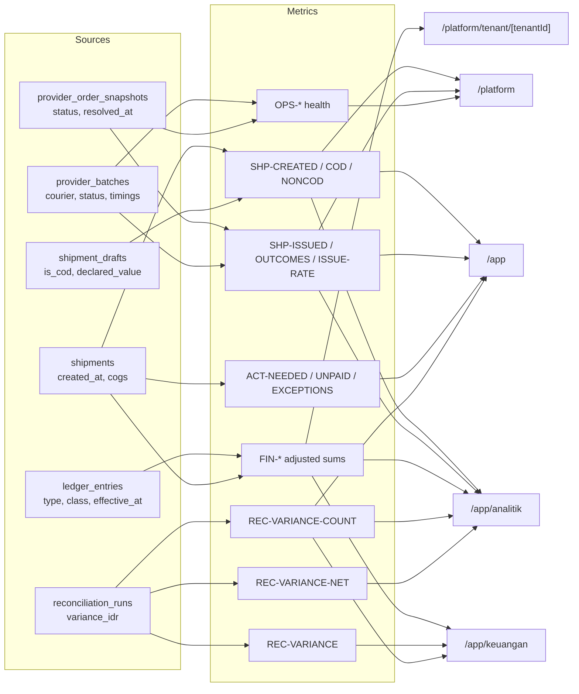
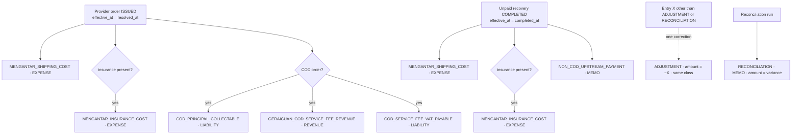
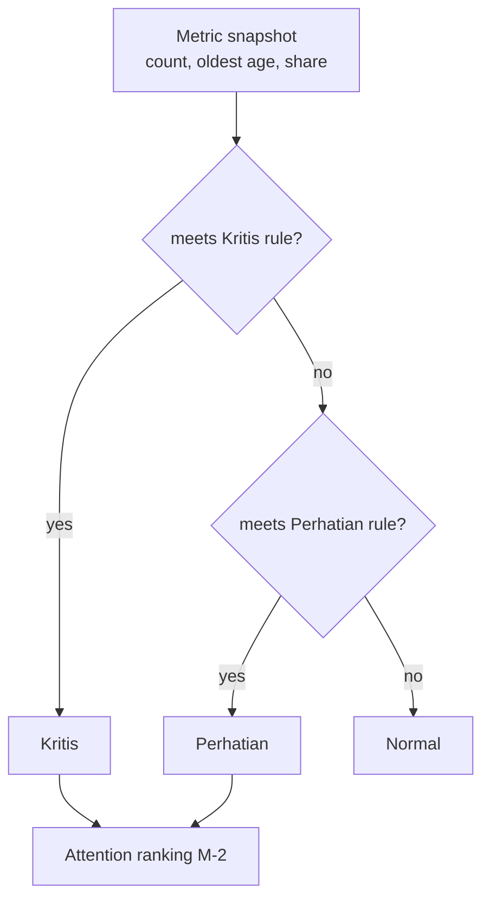

# Metrics, Analytics, and Dashboard Contract: GeraiCUAN

- Status: Accepted 2026-09-13 for conventions, canonical definitions, chart rules, and the drift register. Provenance: Paduka Ongki instructed the work to proceed following the presented recommendations; rules were not selected one by one. D-1, D-2, and D-4 are recorded in M-5; D-3 awaits an explicit product-owner decision because it would change PR-33.
- Owner: Paduka Ongki
- Requirements served: PR-9, PR-11, PR-15, PR-16, PR-20, PR-25, PR-26, PR-33.
- Related: `05-DATA-MODEL.md` (DATA-3, DATA-4), `10-DESIGN-SYSTEM-WHITELABEL.md` § CMS page patterns, `17-UX-FLOWS-SCREEN-CONTRACTS.md` (UX-8, UX-9).

This document is the single definition of every number the CMS computes or displays. A metric shown on two surfaces uses the same ID, formula, time basis, and rounding on both; a surface-specific variant gets its own ID and label. The inventory below was taken from repository code on 2026-09-13; each `Drift` row names the owning Phase 12 task in `TASKS.md`.

## M-0 — Conventions

### Money

- Whole IDR only (`integer`/`bigint`). No floating-point money anywhere in the path from SQL to display.
- Display: `Intl.NumberFormat("id-ID", { style: "currency", currency: "IDR", maximumFractionDigits: 0 })`. Signed money (variance, adjustment, margin) uses `signDisplay: "exceptZero"` so `+` and `−` are always explicit.
- Rounding of derived money is half-up to a whole rupiah per component, performed once at the owning calculation (PR-9), never re-rounded at display.
- Money columns are right-aligned with tabular numerals.
- Adjustment rows are always included: an amount of type `X` is the sum of type `X` plus every `ADJUSTMENT` whose original entry is type `X`. No surface may sum plain entry types alone.

### Counts, rates, and comparisons

- Counts: integers formatted with `Intl.NumberFormat("id-ID")`.
- Rates: `numerator / denominator × 100`, displayed with exactly one decimal (`66,7%`) and always accompanied by the denominator in context text. A rate whose denominator is 0 displays `—` and has no comparison.
- Low-volume guard: a rate whose denominator is below 10 carries the caption `Volume rendah (n = N)` and is never ranked above a higher-volume row by rate alone.
- Period comparison of a **count or money** value: relative percentage change, `round(|cur − prev| / |prev| × 100)`, with a non-colour direction cue.
- Period comparison of a **rate**: difference in percentage points, one decimal (`+4,2 poin`).
- `prev = 0` and `cur ≠ 0`: text `Belum ada pada periode sebelumnya`, neutral cue `•`, no arrow. `prev = cur`: `→ Tidak berubah`.
- The colour of a change follows operational desirability defined per metric (for example, more failures is unfavourable), never numeric sign.

### Period and timezone

- Periods are half-open `[start, end)` on `timestamptz`, computed by `src/lib/analytics-range.ts`.
- All operational periods, date/month/year inputs, buckets and rendered timestamps use WIB (`Asia/Jakarta`, GMT+7). Database instants remain UTC. `analytics-range.ts` normalizes former WITA/WIT/UTC URL options to WIB and serializes canonical `tz=Asia/Jakarta`; timezone is no longer a user-selectable filter. Calendar date text in an old link is retained and resolved at WIB midnight. This PR35 lock changes no metric formula or event basis.
- Buckets are computed in SQL with `date_trunc(…, col AT TIME ZONE tz)`; ranges of 31 days or fewer bucket daily, longer ranges monthly.
- Previous period: the equal-length span immediately before `start`. For presets that end in the future (`hari-ini`, `minggu-ini`, `bulan-ini`) the comparison uses the **same elapsed span** of the previous period (to-date comparison), so a partial day is not compared with a full day. The comparison caption names the compared span.
- Snapshot values ("Saat ini") ignore the period and say so.

### Freshness

- Each region carries exactly one generated-at value read from the database by the read that produced it and rendered in WIB. Tenant repositories currently read `statement_timestamp()`, platform `transaction_timestamp()`, and Keuangan uses JavaScript `new Date()`; T-92 settles one database source per region and removes the JavaScript clock.
- A region is stale when `now − generatedAt ≥ 5 minutes` (`src/lib/data-freshness.ts`); stale regions show the notice and a refresh action on every surface, including `/platform` and `/app/keuangan`.

## M-1 — Canonical metric dictionary

Status legend: **Aligned** = code matches this definition; **Drift** = code differs, repair owned by the named task; **Pending D-n** = definition waits for a decision.

### Shipment volume and outcomes

| ID | Label | Definition | Time basis | Surfaces | Status |
|---|---|---|---|---|---|
| SHP-CREATED | Kiriman dibuat | `count(shipments)` in scope | `shipments.created_at` | /app, /app/analitik, /platform | Aligned |
| SHP-COD | Kiriman COD | SHP-CREATED where the shipment draft `is_cod` | `shipments.created_at` | /app, /app/analitik | Drift: analytics table/export read `provider_order_snapshots.is_cod`, so a COD draft without an order reads as non-COD — T-90 |
| SHP-NONCOD | Kiriman non-COD | SHP-CREATED − SHP-COD | `shipments.created_at` | /app, /app/analitik | Drift with SHP-COD — T-90 |
| SHP-DECLARED-COD | Nilai barang COD | `sum(declared_value_idr)` of SHP-COD; labelled "bukan dana diterima atau pendapatan" | `shipments.created_at` | /app | Aligned |
| SHP-ISSUED | Resi terbit | `count(provider_order_snapshots)` with `status = 'ISSUED'` | `provider_order_snapshots.resolved_at` | /app, /app/analitik, /platform | Drift: `/platform` counts `status = 'ISSUED'` by `created_at` — T-88 |
| SHP-OUTCOMES | Outcome terselesaikan | `count(provider_order_snapshots)` with `status <> 'SUBMISSION_QUEUED'` | `resolved_at` | /app/analitik | Aligned |
| SHP-ISSUE-RATE | Tingkat penerbitan resi | SHP-ISSUED / SHP-OUTCOMES × 100, one decimal, denominator shown, pp comparison | `resolved_at` | /app/analitik (KPI, courier table) | Drift: variable precision, relative-% comparison, denominator 0 feeds a 0 comparison — T-89 |
| SHP-UNPAID-OUTCOME | Belum dibayar | orders whose current status is `AWAITING_UPSTREAM_PAYMENT` and whose `resolved_at` is in range (a recovered order leaves this count because only current status is stored) | `resolved_at` | /platform | Drift: platform uses `created_at` — T-88 |
| SHP-UNKNOWN-OUTCOME | Status tidak diketahui | batch, order, and recovery records in their `*_UNKNOWN` state | volume table: record `created_at`; health-tile oldest age: `coalesce(submission_attempted_at \| resolved_at \| attempted_at, created_at)` per source | /platform | Aligned |

### Work needing action (snapshots)

| ID | Label | Definition | Scope | Surfaces | Status |
|---|---|---|---|---|---|
| ACT-NEEDED | Perlu tindakan | `SUBMISSION_UNKNOWN + FAILED` for both tenant roles (UX-8 Operational status). The Kiriman `ACTION_REQUIRED` queue uses the same predicate so the count always equals the list it links to. Snapshot, ignores period. | tenant | /app tile, Kiriman nav count, Kiriman "Perlu tindakan" tab | Drift: the tile is correct, but the `ACTION_REQUIRED` queue and the tested `summary.actionRequired` also include `AWAITING_UPSTREAM_PAYMENT`, and the Tenant Admin "Menunggu pembayaran" tile links to that mixed queue — T-88 |
| ACT-UNPAID | Menunggu pembayaran | `AWAITING_UPSTREAM_PAYMENT`; Tenant Admin only (PR-25, UX-8); links to the queue filtered to that status | Tenant Admin | /app tile, Tenant Admin attention list | Drift: links to the mixed `ACTION_REQUIRED` queue — T-88 |
| ACT-DRAFT | Draf perlu dilanjutkan | `status = 'DRAFT'` | tenant | /app | Aligned |
| ACT-ESTIMATED | Estimasi perlu dikonfirmasi | `status = 'ESTIMATED'` | tenant | /app | Aligned |
| ACT-EXCEPTIONS | Pengecualian belum selesai | ACT-NEEDED + ACT-UNPAID (Tenant Admin-only page); honours outlet, courier, and lifecycle filters because UX-9 requires the `exceptions` drill-down basis to preserve every authorized dimension, and the KPI must equal its drill-down | tenant | /app/analitik | Aligned |
| REC-VARIANCE-COUNT | Selisih rekonsiliasi | count of latest reconciliation run per (outlet, cadence, type, period) whose status is `VARIANCE`; tenant-wide snapshot | Tenant Admin | /app, /app/analitik, /app/keuangan | Aligned |

### Money

| ID | Label | Definition | Time basis | Surfaces | Status |
|---|---|---|---|---|---|
| FIN-COD-PRINCIPAL | Pokok COD (liabilitas) | adjusted sum `COD_PRINCIPAL_COLLECTABLE`; always labelled liability, never revenue | `ledger_entries.effective_at` | /app/analitik, /app/keuangan, platform tenant detail | Drift: platform tenant detail sums plain types without adjustments — T-90 |
| FIN-PROVIDER-COST | Biaya provider | adjusted sum of `financial_class = 'EXPENSE'` (`MENGANTAR_SHIPPING_COST` + `MENGANTAR_INSURANCE_COST`) | `effective_at` | /app/analitik, /app/keuangan, platform tenant detail | Drift: analytics shows shipping only as "Ongkir provider" — T-90 |
| FIN-FEE-REVENUE | Pendapatan jasa COD | adjusted sum `GERAICUAN_COD_SERVICE_FEE_REVENUE` | `effective_at` | /app/analitik, /app/keuangan | Aligned |
| FIN-VAT | PPN terutang | adjusted sum `COD_SERVICE_FEE_VAT_PAYABLE` | `effective_at` | /app/analitik, /app/keuangan | Drift on platform tenant detail (adjustments) — T-90 |
| FIN-UPSTREAM | Pemulihan non-COD | adjusted sum `NON_COD_UPSTREAM_PAYMENT` (memo) | `effective_at` | /app/keuangan | Drift on platform tenant detail (adjustments) — T-90 |
| FIN-COGS | Modal HPP (COGS) | `sum(shipments.cogs_amount_idr)` over shipments in the ledger cohort, with coverage `N dari M kiriman memiliki COGS` | ledger cohort | /app/analitik | Drift: null COGS silently counts as 0 with no coverage — T-90 |
| FIN-NET-MARGIN | Margin bersih (estimasi) | **Pending D-3.** Current code: `codPrincipal − providerShipping − codServiceFee − codVat − cogs`, treating a liability as income and a null COGS as 0 | ledger cohort | /app/analitik | Pending D-3 — T-91 |
| REC-VARIANCE | Selisih | `sourceTotalIdr − ledgerTotalIdr` per run; positive means source exceeds ledger; signed display | reconciliation period | /app/keuangan | Aligned |
| REC-VARIANCE-NET | Total selisih (+/−) | `sum(variance_idr)` over the latest run per (outlet, cadence, type, period) whose status is `VARIANCE`; tenant-wide snapshot; signed display | snapshot | /app/analitik | Drift: rendered without explicit sign — T-90 |

### COD amount at shipment creation (PR-9)

| ID | Definition | Status |
|---|---|---|
| COD-FEE | `round_half_up((goods + shipping) × 3 / 100)` | Aligned (`calculateCodAmounts`, DB check) |
| COD-VAT | `round_half_up(COD-FEE × 11 / 100)` | Aligned |
| COD-TOTAL | `goods + shipping + COD-FEE + COD-VAT`, labelled "Total ditagih ke penerima"; insurance excluded while the estimate returns none | Aligned |
| COD-TEST | A `.5` rounding boundary for both COD-FEE and COD-VAT is asserted by test | Drift: no boundary test — T-90 |

### Platform operations

| ID | Label | Definition | Status |
|---|---|---|---|
| OPS-QUEUE-STUCK | Batch tertahan di antrean | batches in `SUBMISSION_QUEUED`/`SUBMITTING` whose `coalesce(submission_attempted_at, created_at)` is older than 15 minutes | Aligned |
| OPS-UNPAID | Pesanan menunggu pembayaran upstream | orders currently `AWAITING_UPSTREAM_PAYMENT`, with oldest age | Aligned (count); severity drift — T-93 |
| OPS-UNKNOWN | Status pengiriman tidak diketahui | batch + order + recovery unknown states, with oldest age | Aligned |
| OPS-FAILURE-SHARE | Kegagalan provider | FAILED batches / batches created in range; one decimal | Drift: whole-percent display — T-89 |
| OPS-BATCH-DURATION | Durasi penyelesaian batch p50 / p95 | `percentile_cont` of `completed_at − submission_attempted_at` for batches completed in range; shows seconds below one minute | Drift: sub-minute values render "0 menit" — T-92 |
| OPS-TENANT-AFFECTED | tenant terdampak | `count(distinct tenant_id)` of the tile's records | Aligned |

## M-2 — Severity rules

A severity is computed on the server from the thresholds below and rendered with the shared severity badge. Thresholds live in one exported constant per scope and every rule has a test at each boundary.

### Platform (`PLATFORM_HEALTH_THRESHOLDS`)

| Metric | Perhatian | Kritis | Status |
|---|---|---|---|
| OPS-QUEUE-STUCK | count > 0 | count ≥ 20 or oldest > 60 min | Aligned; only the critical-by-age case is tested — boundary tests in T-93 |
| OPS-UNPAID | count > 0 or oldest > 2 h | oldest > 24 h | Drift: a non-zero count younger than 2 h is "Normal" — T-93 |
| OPS-UNKNOWN | count > 0 | oldest > 30 min | Aligned; untested — T-93 |
| OPS-FAILURE-SHARE | share > 2% | share > 10%, or ≥ 5 same-code failures in the last 60 minutes, or any `AUTH`/`CREDENTIAL`/`SCHEMA` code in range | Aligned; the rolling-hour clause must be captioned "60 menit terakhir"; untested — T-93 |

### Tenant (`TENANT_ATTENTION_THRESHOLDS`, new)

These reuse the platform ages so one incident reads the same in both scopes.

| Item | Perhatian | Kritis |
|---|---|---|
| Status belum pasti (`SUBMISSION_UNKNOWN`) | count > 0 | oldest > 30 min |
| Menunggu pembayaran (ACT-UNPAID, Tenant Admin only) | count > 0 | oldest > 24 h |
| Gagal (`FAILED`) | count > 0 | — |
| Selisih rekonsiliasi (Tenant Admin) | REC-VARIANCE-COUNT > 0 | — |
| Outlet belum siap | at least one outlet not ready | no outlet ready |
| Draf / estimasi menunggu | never raised above Normal; listed as work, not risk | — |

### Attention ranking

*Perlu perhatian* lists sort by severity (Kritis → Perhatian), then by failure cost, then by oldest age:

1. Unknown submission or recovery state (duplicate-issuance and money risk).
2. Provider credential or schema failure (platform) / outlet not ready (tenant).
3. Awaiting upstream payment.
4. Failed shipment or batch.
5. Reconciliation variance.
6. Stuck queue.
7. Drafts and estimates waiting.

## M-3 — Charts and dashboard views

### Library and tokens

- `recharts` 3.8.0 through `src/components/ui/chart.tsx`; no second chart library.
- Series colours come only from `--chart-1` … `--chart-5` (Okabe-Ito). A series is distinguishable without colour through dash pattern or marker shape. Violet scope and semantic status colours are never series colours.
- Every chart has: a title naming the question it answers, the period and zone, named axes with units, a direct label on the latest point or largest bar, keyboard-reachable text summary, and the complete semantic data table. The table may start collapsed on command-center routes (`/app`, `/platform`) and under PR-42 on `/app/analitik`. It remains complete, semantic and keyboard-reachable from a labelled disclosure below the chart. `/app/keuangan` retains its existing visible tables.
- Bars start at zero. No pie, donut, gauge, 3D, dual-axis, or area-stacked money charts. At most three series per chart.

### Chart catalogue

| View | Question | Chart | Data | Owner task |
|---|---|---|---|---|
| /app | Is input and issuance moving today/this period? | Line: SHP-CREATED vs SHP-ISSUED (dashed), daily buckets; sparkline-height strip | M-1 | T-98 |
| /app | How does shipment input compare with the previous period? | Line: SHP-CREATED (= SHP-COD + SHP-NONCOD), selected versus previous equal-length daily range; solid/dashed strokes, dated supporting table | M-1 | T-111 |
| /app/analitik | Created versus issued over time | Line (existing), plus previous-period ghost series (dotted, `--chart-3`) | M-1 | T-100 |
| /app/analitik | Which courier issues reliably? | Horizontal bar SHP-ISSUE-RATE per courier, sorted by rate with low-volume rows marked, denominator in label | M-1 | T-100 |
| /app/analitik | Where is work stuck? | Horizontal bar of current lifecycle distribution (counts per status, lifecycle order, not a funnel) | ACT-* | T-100 |
| /app/analitik | Where does money go? | Grouped horizontal bars of FIN-COD-PRINCIPAL, FIN-FEE-REVENUE, FIN-VAT, FIN-PROVIDER-COST, each labelled with its class (liabilitas, pendapatan, kewajiban pajak, biaya); never stacked into one total | M-1 | T-100 |
| /app/keuangan | Is reconciliation converging? | Column chart of REC-VARIANCE per run date, signed around zero, MATCHED runs as neutral markers; placed after the variance queue and before the ledger table, captioned as a view of the reconciliation history table it links to | REC-VARIANCE | T-101 |
| /platform | Is the platform healthy over the period? | Line: SHP-CREATED, SHP-ISSUED, failed batches (three series, distinct dashes) replacing the 30-row trend table as the primary view | M-1 | T-99 |
| /platform | How fast do batches finish? | p50 / p95 values with a small daily p95 line | OPS-BATCH-DURATION | T-99 |

### Dashboard view composition

Command-center routes follow spec 10 Pattern 1. `/app/analitik` and `/app/keuangan` follow spec 10 Pattern 6, which keeps their UX-9 and PR-20 order, and add the charts above in place of any decorative tile. A chart never replaces the authoritative table on Keuangan.

## M-4 — Diagrams

### Metric lineage

### Ledger entries on issuance and recovery

### Severity evaluation

## M-5 — Decisions

Recorded 2026-09-13 under T-87. Provenance: Paduka Ongki instructed the work to proceed "sesuai dengan rekomendasimu" and then "lanjut dan sempurnakan" without choosing individual options, so D-1, D-2, and D-4 adopt the recommendation that was presented; each only aligns existing surfaces with an already-accepted definition. D-3 is not recorded from that instruction because its recommendation would withdraw a deliverable that PR-33 requires; it needs an explicit decision (and a PR-33 amendment if the KPI is withdrawn). Any decision can be reopened by the product owner.

| ID | Question | Decision | Consequence | Owning task |
|---|---|---|---|---|
| D-1 | Does SHP-ISSUE-RATE count `AWAITING_UPSTREAM_PAYMENT` and `SUBMISSION_UNKNOWN` outcomes in its denominator? | Yes: every resolved outcome (`status <> 'SUBMISSION_QUEUED'`), captioned "dari outcome terselesaikan". | Unresolved risk lowers the rate instead of being hidden. The current denominator stays. | T-89 |
| D-2 | Which time basis do `/platform` issued and unpaid outcomes use? | `provider_order_snapshots.resolved_at`, matching `/app` and `/app/analitik`. | One incident has one count across scopes. | T-88 |
| D-3 | What does "Margin bersih (estimasi)" mean? | **Pending explicit product-owner decision.** Options: (a) keep the current formula with the caption "Estimasi; belum memperhitungkan remitansi COD" and COGS coverage; (b) merchant view: goods value received − COGS − merchant-borne costs, with COD fee and VAT as recipient-paid pass-through; (c) withdraw the KPI until COD remittance is recorded, amending PR-33. Recommendation: (c). | Until decided, the current KPI stays unchanged. | T-91 (blocked) |
| D-4 | Does FIN-PROVIDER-COST include insurance on analytics? | Yes: adjusted sum of every `EXPENSE` entry, identical to Keuangan, labelled "Biaya provider". | Analytics and Keuangan report the same provider cost. | T-90 |

## M-6 — Verification rule

- Every metric ID has one integration test asserting its formula on a deterministic fixture, including boundaries: denominator 0, previous 0, `.5` rounding, adjustment reversal, and each severity threshold edge.
- A surface test asserts that two surfaces showing the same metric ID render the same value for the same scope and period.
- Changing a formula updates this document, its test, and the drift status in the same change.

### T-111 refinement — 2026-09-14

Ringkasan route default is `7-hari` (seven calendar days including today, WIB) following the 2026-09-14 user instruction. Summary and chart retain the same selected range/outlet and original created/issued event bases. Reset returns to that route default. Explicit single-day selection still omits the multi-day trend. A successful empty trend read produces zero-filled date buckets, not a missing section. No metric formula changed.

Daily comparison supports ranges up to 31 days, aligned by day ordinal with both dates disclosed. Longer custom ranges retain current monthly totals only; they do not zip unequal calendar-month buckets or drop prior-month records. Failed comparison reads render an error, never zero. Sample chart values under development `demo=grafik` are explicitly non-authoritative and do not replace period KPIs, money, or source records.

### QUOTE-SHIPPING-IDR — Informational quick-rate amount (PR-40)

Owner: the existing Mengantar estimate normalizer's `SupportedEstimateService.shippingAmountIdr`, directly validated from the provider `price` field with currency IDR. Display is per returned provider service and the submitted authorized origin/destination/gram weight. No local discount, COD fee, VAT, insurance or margin is added; it is not a final receivable/payment total. The quote timestamp is retrieval time formatted in WIB. This surface adds no aggregate metric or ledger event. Verification belongs to the quick-rate action and presentation tests, plus existing estimate-normalization tests.

PR-42 presentation revision (2026-09-15): complete analytics trend/courier tables remain in semantic HTML but start inside native disclosures. Charts, contextual summaries, low-volume cues and error states remain available. COD principal and estimated margin stay visible; four unchanged cost components expand on request. The reconciliation count and signed IDR total move into a compact alert with an explicit finance drill-down link; a nonzero count remains highlighted even when the signed amounts cancel. No metric formula, cohort, denominator, data query or export meaning changes. Earlier uncollapsed-table layout guidance is superseded for this screen.
